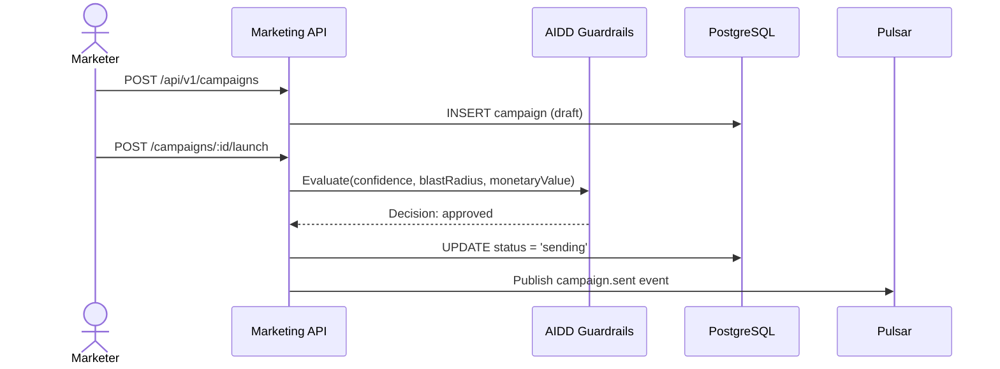
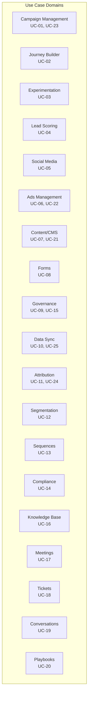

# ERP-Marketing -- Use Cases

## Overview

This document describes 25 use cases spanning all marketing domains covered by ERP-Marketing. Each use case follows a standardized format with actors, preconditions, flow, and postconditions.

---

## UC-01: Launch Multi-Channel Email Campaign

**Actor:** Marketing Operations Manager
**Domain:** Campaign Management

**Precondition:** Email template exists; audience segment is defined; AIDD guardrails are configured.

**Main Flow:**
1. Marketer creates a new campaign with channel = Email
2. Marketer selects target audience segment
3. Marketer assigns email template and sets subject line
4. Marketer sets budget and objective
5. Marketer clicks Launch
6. AIDD guardrail evaluates confidence, blast radius, and monetary value
7. If approved, campaign transitions to Sending status
8. System dispatches emails via SMTP/SES provider
9. System tracks deliveries, opens, clicks, bounces, unsubscribes

**Postcondition:** Campaign is in Sent status with real-time metrics. Domain event `erp.marketing.campaign.created` and `erp.marketing.campaign.updated` are published.

---

## UC-02: Create and Activate Customer Journey

**Actor:** Campaign Manager
**Domain:** Journey Builder

**Precondition:** Entry segment exists; email templates exist.

**Main Flow:**
1. Manager creates a journey with name, goal, and entry segment
2. Manager adds steps: send_message, wait, branch, escalation
3. Manager configures channel for each step
4. Manager clicks Activate
5. AIDD guardrail evaluates blast radius based on segment size
6. If approved, journey status transitions to Active
7. Contacts entering the segment are automatically enrolled
8. System executes steps sequentially per contact

**Postcondition:** Journey is active and enrolling contacts. Events published to Pulsar.

---

## UC-03: A/B Test Subject Lines

**Actor:** Marketer
**Domain:** Experimentation

**Precondition:** Campaign exists in Draft status.

**Main Flow:**
1. Marketer creates experiment with hypothesis
2. Marketer defines variants (e.g., Control vs. Persona-Based)
3. Marketer links experiment to campaign
4. System splits audience traffic across variants
5. System tracks open rates per variant
6. When statistical significance is reached, winner is declared

**Postcondition:** Experiment has results and winner_variant is set.

---

## UC-04: Score and Route High-Intent Lead

**Actor:** System (automated) + Sales Rep
**Domain:** Lead Scoring

**Precondition:** Scoring model is configured; contact has behavioral data.

**Main Flow:**
1. Contact visits pricing page (+12 points)
2. Contact requests demo form (+30 points)
3. Industry fit adds +15 points
4. Total score exceeds SQL threshold (75)
5. AIDD guardrail evaluates score change (confidence 0.88)
6. Contact lifecycle stage updated to SQL
7. Task created for sales rep to follow up
8. Journey branch routes contact to high-intent stream

**Postcondition:** Contact is SQL with owner task created.

---

## UC-05: Publish Social Media Post with Scheduling

**Actor:** Social Media Manager
**Domain:** Social Media Management

**Precondition:** Social platform OAuth credentials are configured.

**Main Flow:**
1. Manager creates social post with channel selection (LinkedIn, X, etc.)
2. Manager writes content and optionally links to campaign
3. Manager sets scheduled publication time
4. At scheduled time, AIDD guardrail evaluates publishing action
5. Post is published to the selected platform via API
6. Engagement metrics (likes, comments, shares) are tracked

**Postcondition:** Post is published with engagement tracking active.

---

## UC-06: Create and Manage Google Ads Campaign

**Actor:** Demand Generation Manager
**Domain:** Ads Management

**Precondition:** Google Ads API credentials configured; audience segment defined.

**Main Flow:**
1. Manager creates ad campaign with network = google_ads
2. Manager sets budget, objective, and audience sync from segment
3. Manager clicks Launch
4. AIDD guardrail evaluates projected spend and reach
5. Ad campaign is synced to Google Ads via API
6. System tracks impressions, clicks, conversions

**Postcondition:** Ad campaign is active with ROI metrics tracked.

---

## UC-07: Build and Publish Landing Page

**Actor:** Content Marketer
**Domain:** Content Management

**Precondition:** CMS module is available.

**Main Flow:**
1. Content creator selects asset type = landing_page
2. Creator writes body content with rich text
3. Creator configures SEO keywords and meta tags
4. Creator adds CTA with label and URL
5. Creator sets slug for URL addressing
6. Creator publishes the landing page

**Postcondition:** Landing page is publicly accessible at configured slug.

---

## UC-08: Capture Lead via Form Submission

**Actor:** Website Visitor
**Domain:** Forms / Lead Capture

**Precondition:** Form exists and is embedded on landing page.

**Main Flow:**
1. Visitor navigates to landing page
2. Visitor fills in form fields (email, company, use_case)
3. Visitor submits the form
4. System captures submission with UTM parameters
5. If email matches existing contact, record is updated
6. If new email, contact is created with lifecycle_stage = subscriber
7. Success message is displayed

**Postcondition:** Form submission recorded; contact created/updated.

---

## UC-09: Configure AIDD Guardrail Policies

**Actor:** Marketing Administrator
**Domain:** Governance

**Precondition:** Admin has system configuration access.

**Main Flow:**
1. Admin navigates to Settings > AIDD Guardrails
2. Admin sets minimum confidence threshold (e.g., 0.64)
3. Admin sets medium confidence threshold (e.g., 0.78)
4. Admin sets max blast radius (e.g., 15,000)
5. Admin sets high value amount (e.g., $250,000)
6. Configuration is saved and takes effect immediately

**Postcondition:** All future AIDD-governed actions use the new thresholds.

---

## UC-10: Synchronize Data from Salesforce

**Actor:** Marketing Administrator
**Domain:** Data Sync / Integration

**Precondition:** Salesforce API credentials configured.

**Main Flow:**
1. Admin creates data sync job: source = salesforce, target = opensase_marketing
2. Admin sets schedule cron expression (e.g., every 30 minutes)
3. Admin triggers initial manual run
4. System fetches opportunity records from Salesforce
5. Records are mapped and upserted into marketing_opportunities table
6. Sync job updates last_run_at, records_processed, error_rate

**Postcondition:** Salesforce data is synchronized with configurable frequency.

---

## UC-11: Multi-Touch Attribution Analysis

**Actor:** Marketing Operations Manager
**Domain:** Attribution

**Main Flow:**
1. Manager navigates to Analytics > Attribution
2. System aggregates touchpoints across all channels
3. Manager selects attribution model (first, last, linear, time-decay, position)
4. System calculates weighted attribution per channel
5. Manager reviews channel effectiveness ranking
6. Manager adjusts budget allocation based on attribution insights

**Postcondition:** Attribution report generated with channel-level breakdown.

---

## UC-12: Create Dynamic Behavioral Segment

**Actor:** Campaign Manager
**Domain:** Segmentation

**Main Flow:**
1. Manager creates segment with descriptive name
2. Manager adds filter conditions (e.g., lead_score >= 75, intent in [high, medium])
3. Manager selects logic operator (AND/OR)
4. System estimates segment size based on current data
5. Segment is saved and available for campaigns and journeys

**Postcondition:** Dynamic segment is active and re-evaluated as contact data changes.

---

## UC-13: Execute Outbound Sales Sequence

**Actor:** Sales Development Representative
**Domain:** Sequences

**Main Flow:**
1. SDR creates sequence with steps: email_1, call_1, email_2
2. SDR sets trigger type (manual or segment entry)
3. SDR enrolls contacts into the sequence
4. System executes steps with configurable delays
5. Enrollment status tracked (active, completed, paused)

**Postcondition:** Contacts progress through sequence steps.

---

## UC-14: Handle Consent Opt-Out Request

**Actor:** System / Contact
**Domain:** Compliance

**Main Flow:**
1. Contact clicks unsubscribe link in email
2. System records consent_status = opt_out
3. All active journey enrollments for the contact are paused
4. Contact is excluded from future campaign sends
5. Audit event is logged

**Postcondition:** Contact consent is honored; no further marketing communications sent.

---

## UC-15: Review AIDD Guardrail Audit Trail

**Actor:** Compliance Officer
**Domain:** Audit / Governance

**Main Flow:**
1. Officer navigates to Audit > Guardrails
2. Officer filters by date range, decision type, risk level
3. Officer reviews each guardrail event: entity, action, confidence, decision, approver
4. Officer exports audit log for compliance evidence

**Postcondition:** Compliance evidence is documented and exportable.

---

## UC-16: Create Knowledge Base Article

**Actor:** Support Enablement Team
**Domain:** Knowledge Management

**Main Flow:**
1. Author creates article with title, category, and body content
2. Author sets slug for URL addressing
3. Article is published
4. Users can vote on helpfulness
5. Helpful votes are tracked for article ranking

**Postcondition:** Knowledge article is published and accessible.

---

## UC-17: Schedule and Track Executive Meeting

**Actor:** Account Executive
**Domain:** Meetings

**Main Flow:**
1. AE creates meeting linked to contact and opportunity
2. AE sets meeting type (discovery, executive review), time, and duration
3. Meeting appears in upcoming meetings dashboard
4. After meeting, AE logs outcome and updates opportunity stage

**Postcondition:** Meeting recorded with outcome linked to opportunity pipeline.

---

## UC-18: Escalate High-Priority Support Ticket

**Actor:** Service Operations
**Domain:** Tickets / Service

**Main Flow:**
1. Customer submits support request via email/chat
2. System creates ticket with priority assessment
3. P1 Ticket Escalation playbook is triggered
4. Steps: triage, owner_assign, root_cause, update_customer
5. SLA timer tracks response deadline

**Postcondition:** Ticket is resolved within SLA.

---

## UC-19: Analyze Conversation Sentiment

**Actor:** System (automated)
**Domain:** Conversations

**Main Flow:**
1. Customer sends message via email or chat
2. System captures conversation with channel and direction
3. Sentiment analysis classifies message (positive, neutral, negative)
4. Negative sentiment triggers alert for account owner
5. Conversation history is linked to ticket and contact

**Postcondition:** Sentiment data enriches contact profile and ticket context.

---

## UC-20: Execute Stalled Deal Recovery Playbook

**Actor:** Revenue Enablement Team
**Domain:** Playbooks / Pipeline

**Main Flow:**
1. System identifies opportunity with no activity for 7+ days
2. AI recommendation generated with confidence score
3. Stalled Deal Recovery playbook is suggested
4. Steps: review_risk, exec_outreach, roi_recap
5. AE follows playbook steps
6. Opportunity stage progresses or is marked at risk

**Postcondition:** Stalled deal is re-engaged or properly triaged.

---

## UC-21: Build Blog Content with SEO Optimization

**Actor:** Content Marketer
**Domain:** Content Management

**Main Flow:**
1. Creator writes blog post with title and body
2. Creator adds SEO keywords array
3. System suggests slug based on title
4. Creator configures CTA (label + URL)
5. Creator publishes; post is indexed for search

**Postcondition:** Blog post is published with SEO metadata.

---

## UC-22: Manage Ad Budget Across Networks

**Actor:** Paid Growth Team
**Domain:** Ads Management

**Main Flow:**
1. Manager creates ads on Google, LinkedIn, Meta, and TikTok
2. Manager allocates budget per network
3. System tracks spend vs. budget per ad
4. Manager reviews ROI: CPC, cost per conversion, ROAS
5. Manager reallocates budget from underperforming to outperforming networks

**Postcondition:** Ad spend is optimized across networks based on performance data.

---

## UC-23: Manage WhatsApp Campaign

**Actor:** Campaign Manager
**Domain:** Campaign Management (Future)

**Main Flow:**
1. Manager creates campaign with channel = WhatsApp
2. Manager selects message template (pre-approved by WhatsApp)
3. Manager targets audience segment
4. Campaign is launched with AIDD guardrail review
5. Messages delivered via WhatsApp Business API
6. Read receipts and responses tracked

**Postcondition:** WhatsApp campaign delivered with engagement metrics.

---

## UC-24: Generate Revenue Attribution Report

**Actor:** CMO / VP Marketing
**Domain:** Attribution / Analytics

**Main Flow:**
1. Executive navigates to Analytics > Revenue Attribution
2. System calculates marketing-attributed pipeline and revenue
3. Report shows attribution by channel, campaign, and journey
4. Executive compares marketing spend to attributed revenue
5. ROI calculated per channel and per campaign

**Postcondition:** Revenue attribution report available for board presentation.

---

## UC-25: Migrate from HubSpot to ERP-Marketing

**Actor:** Marketing Administrator
**Domain:** Data Migration

**Main Flow:**
1. Admin exports contacts, campaigns, and templates from HubSpot
2. Admin maps HubSpot fields to ERP-Marketing schema
3. Admin runs data sync job with source = hubspot
4. System imports contacts with lifecycle stages and lead scores
5. Admin verifies data integrity
6. Admin recreates active campaigns and journeys in ERP-Marketing
7. Admin decommissions HubSpot subscription

**Postcondition:** Complete migration from HubSpot with data verified.

