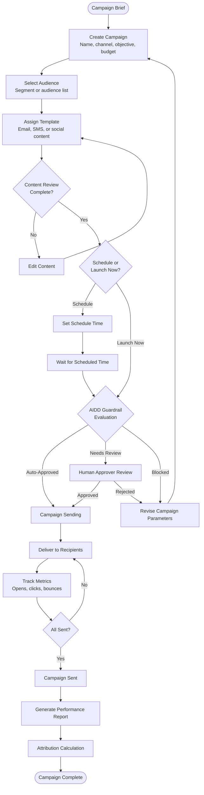
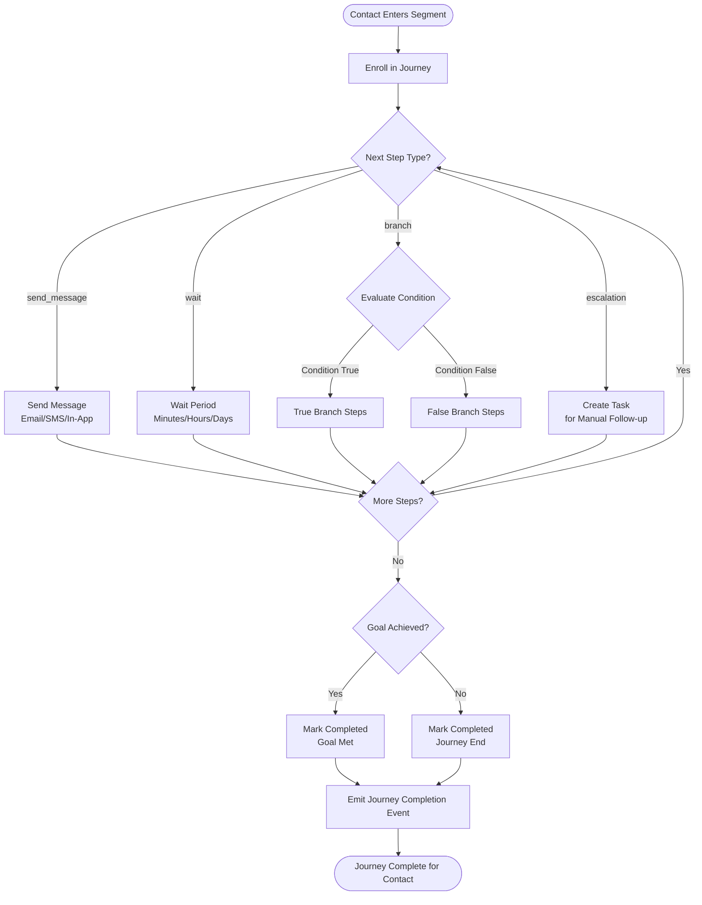
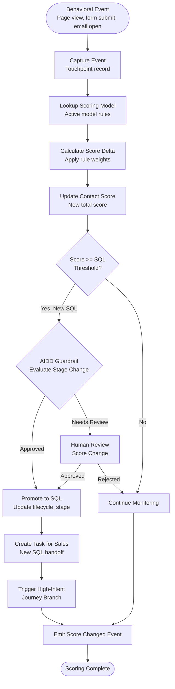
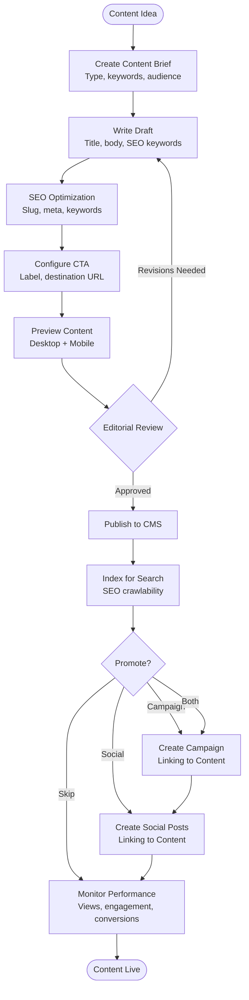
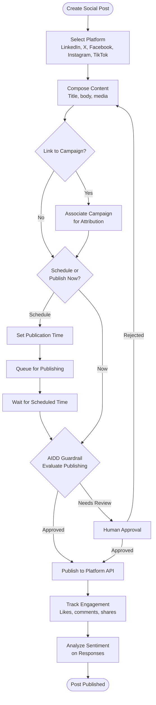
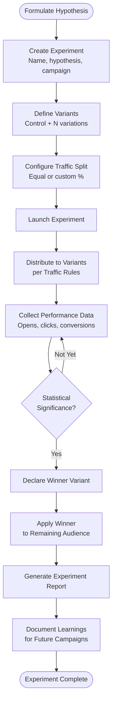
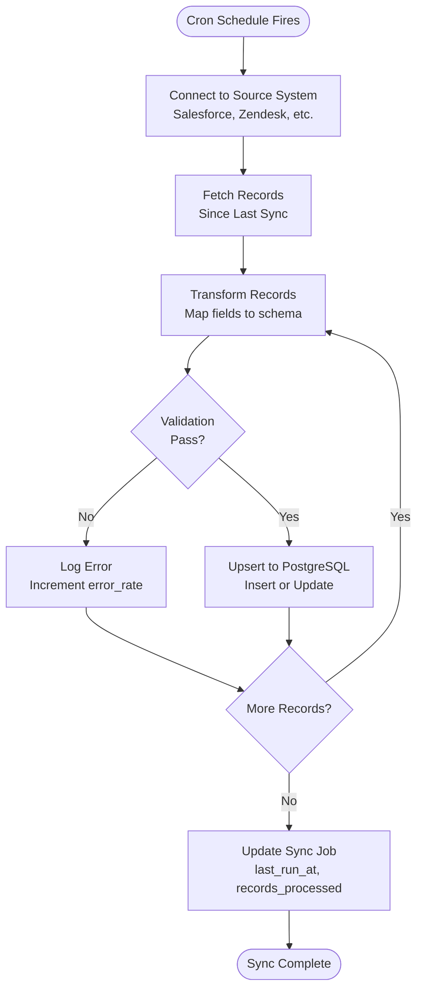
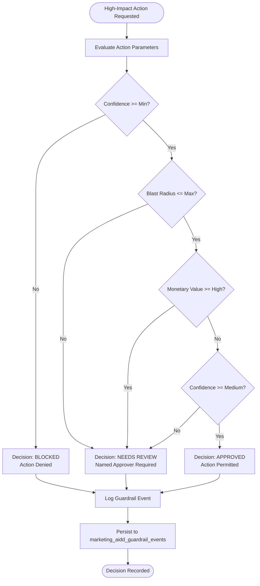
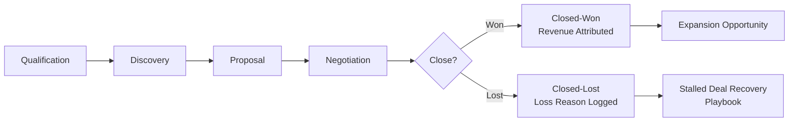
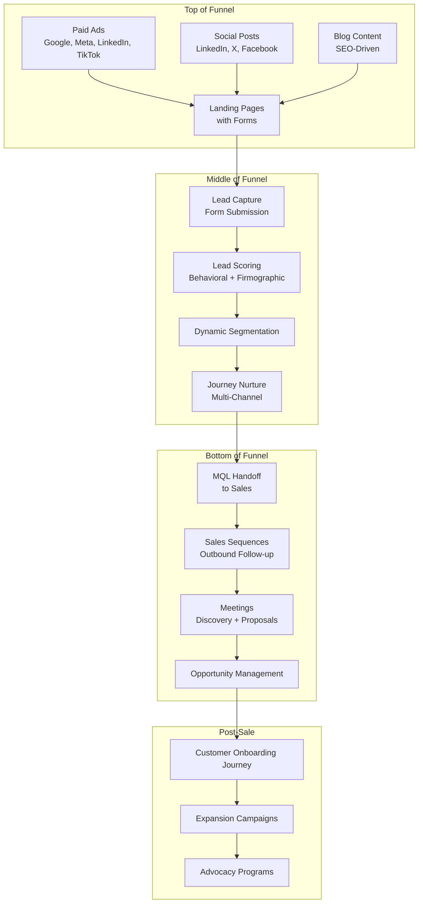

# ERP-Marketing -- Workflow Diagrams

## 1. Campaign Lifecycle Workflow

## 2. Journey Execution Workflow

## 3. Lead Scoring Workflow

## 4. Content Publishing Workflow

## 5. Social Media Publishing Workflow

## 6. A/B Testing Workflow

## 7. Data Sync Workflow

## 8. Guardrail Decision Workflow

## 9. Opportunity Pipeline Workflow

## 10. End-to-End Marketing Funnel

