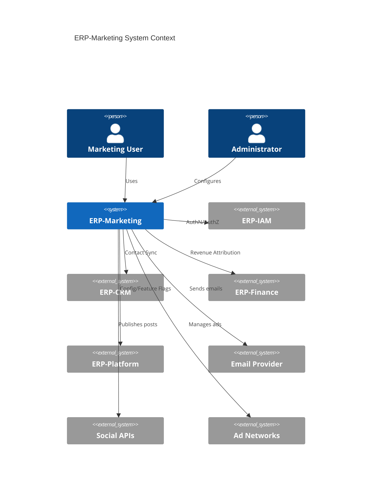
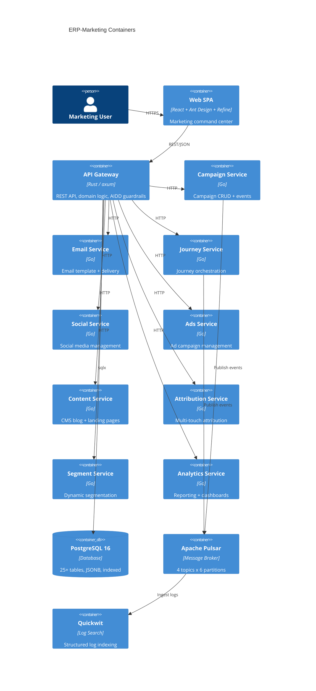
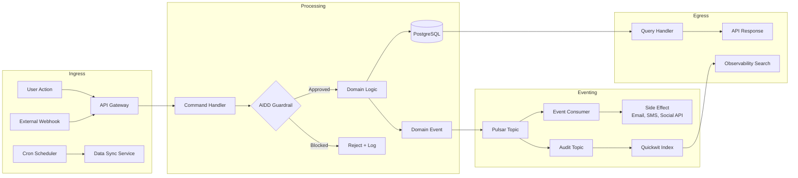
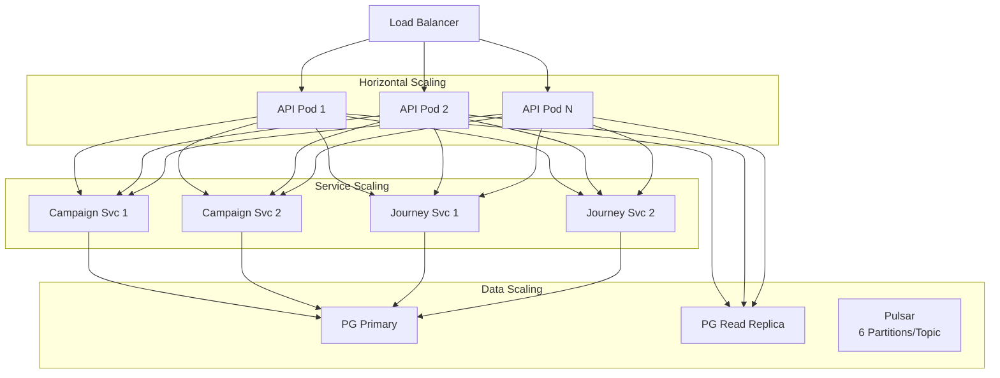
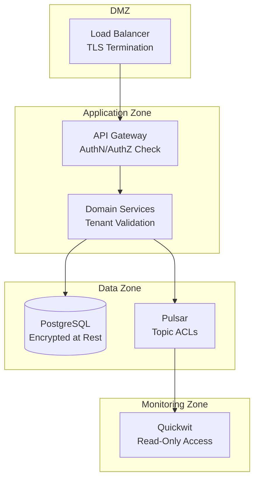

# ERP-Marketing -- High-Level Design

## 1. System Overview

ERP-Marketing is decomposed into a Rust API gateway, nine Go domain microservices, a React SPA command center, and shared infrastructure services (PostgreSQL, Apache Pulsar, Quickwit). The system supports multi-tenant operation with tenant isolation enforced at every layer.

## 2. System Context Diagram

## 3. Container Diagram

## 4. Component Responsibilities

| Component | Technology | Responsibility | Port |
|---|---|---|---|
| API Gateway | Rust (axum) | HTTP routing, DB access, AIDD evaluation, CORS, tracing | 8086 |
| Campaign Service | Go | Campaign CRUD, lifecycle events | 8080 |
| Email Marketing Service | Go | Template management, send orchestration | 8080 |
| Journey Service | Go | Journey CRUD, step execution, enrollment | 8080 |
| Social Service | Go | Social post CRUD, platform publishing | 8080 |
| Ads Service | Go | Ad CRUD, network sync, spend tracking | 8080 |
| Content Service | Go | CMS CRUD, slug management, SEO | 8080 |
| Attribution Service | Go | Touchpoint aggregation, model calculation | 8080 |
| Segment Service | Go | Segment evaluation, contact matching | 8080 |
| Analytics Service | Go | KPI aggregation, report generation | 8080 |
| PostgreSQL | PostgreSQL 16 | Relational data storage | 5432 |
| Apache Pulsar | Pulsar 3.x | Async event messaging | 6650 |
| Quickwit | Quickwit 0.8+ | Log search and indexing | 7280 |
| Web SPA | React 18 | User interface | 3000 (dev) |

## 5. Data Flow Architecture

## 6. Scalability Model

## 7. Security Boundaries

## 8. Technology Decisions Summary

| Decision | Choice | Alternative Considered | Rationale |
|---|---|---|---|
| API Language | Rust | Go, Node.js | Memory safety, zero-cost abstractions, sub-ms latency |
| Service Language | Go | Rust, Java | Fast compilation, simple deployment, team velocity |
| Frontend | React + Ant Design + Refine | Vue + Vuetify, Angular | Enterprise component library, data-provider abstraction |
| Database | PostgreSQL 16 | MySQL, MongoDB | JSONB support, ACID, mature ecosystem |
| Event Broker | Apache Pulsar | Kafka, RabbitMQ | Multi-tenant, persistent, exactly-once semantics |
| Log Search | Quickwit | Elasticsearch, Loki | Sub-second search, Rust-native, lower resource usage |
| Storage | Mayastor/Vitastor | Longhorn, Rook-Ceph | Low-latency replicated block storage for HCI |
