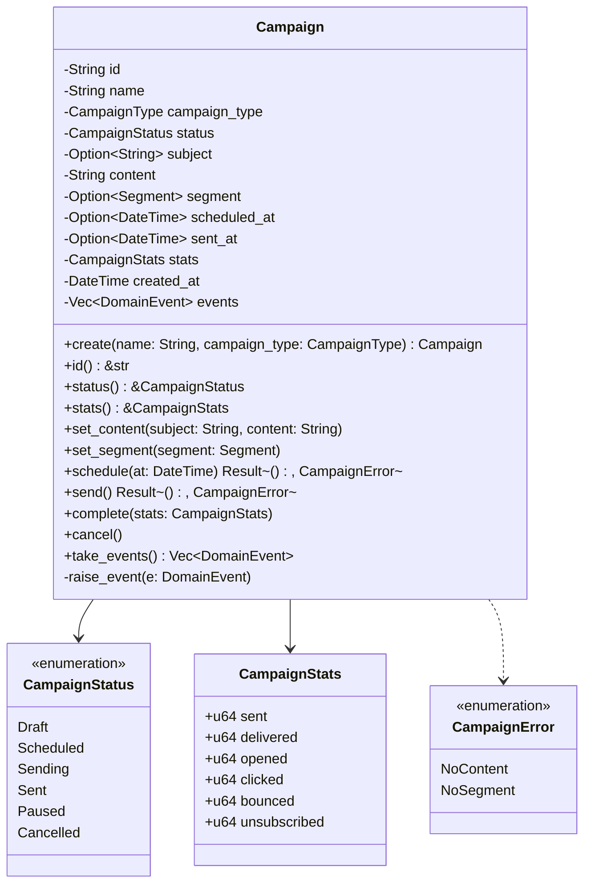
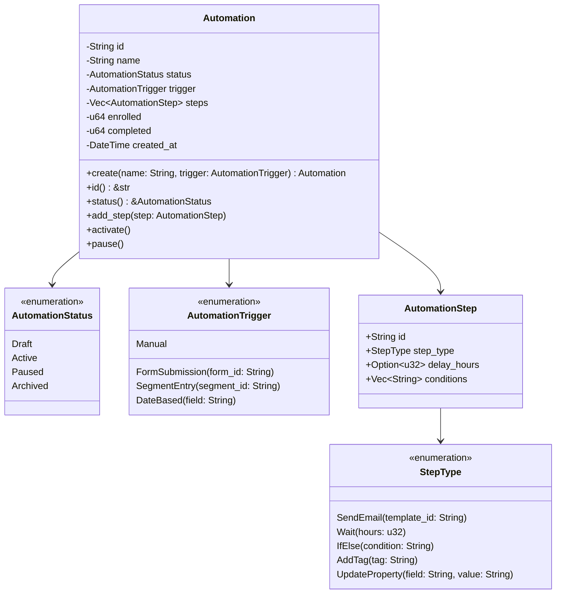
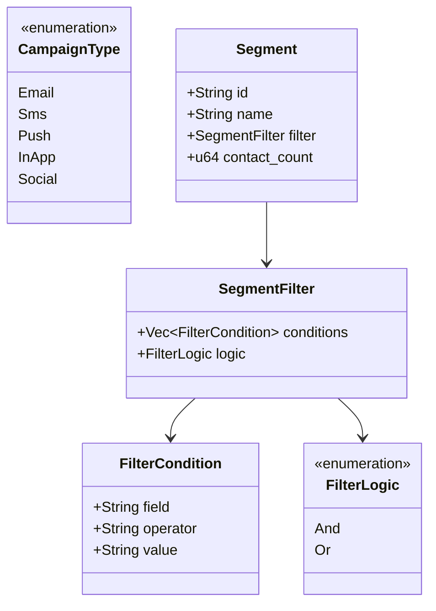
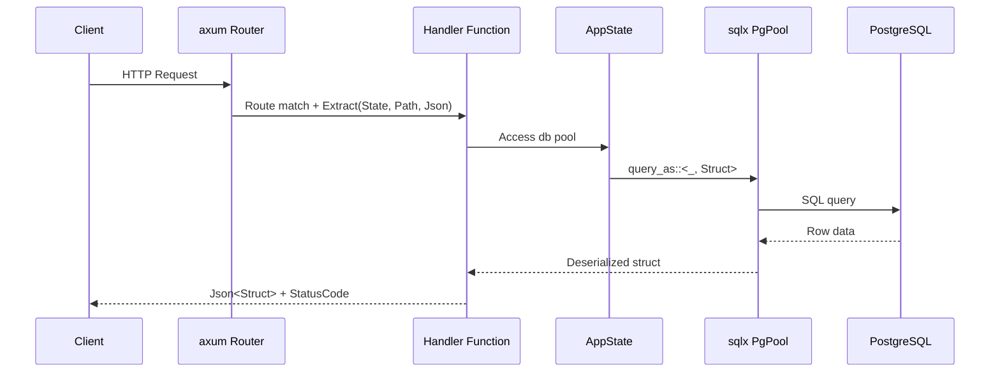
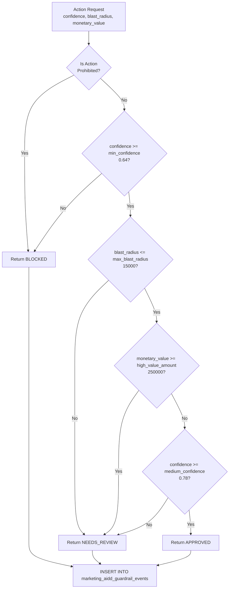
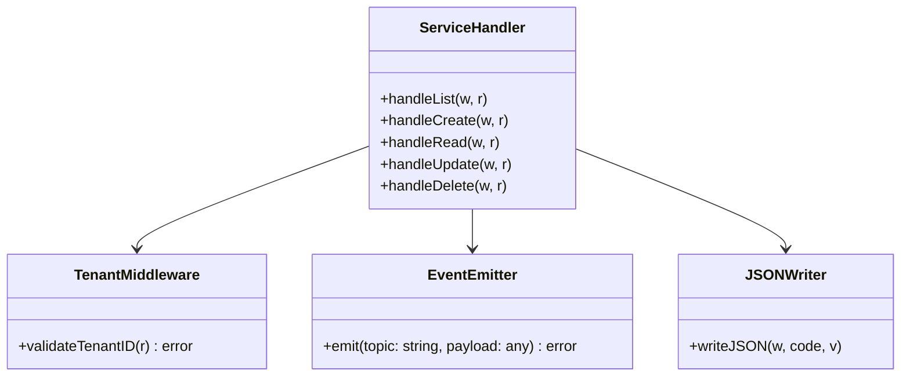
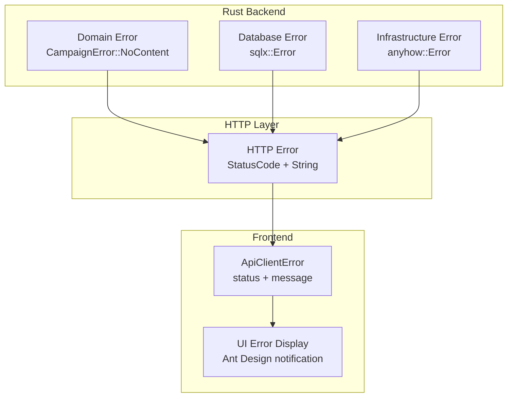

# ERP-Marketing -- Low-Level Design

## 1. Overview

This document provides detailed design specifications for the core components of ERP-Marketing, including class-level structures, database interaction patterns, API handler implementations, and event processing logic.

## 2. Domain Model Details

### 2.1 Campaign Aggregate



### 2.2 Automation Aggregate



### 2.3 Value Objects



## 3. API Handler Implementation Details

### 3.1 Request/Response Flow



### 3.2 Create Campaign Handler (Detailed)

```rust
// Input validation
struct CreateCampaignRequest {
    name: String,           // Required, non-empty
    subject: Option<String>, // Optional for non-email channels
    channel: Option<String>, // Default: "email"
    audience_id: Option<Uuid>,
    template_id: Option<Uuid>,
}

// Handler logic:
// 1. Generate UUID v7 (time-ordered)
// 2. Default channel to "email" if not provided
// 3. Default status to "draft"
// 4. Default stats to empty JSON object
// 5. INSERT with RETURNING * for atomic create+read
// 6. Return 201 Created with full campaign object
```

### 3.3 AIDD Guardrail Evaluation Logic



## 4. Database Access Patterns

### 4.1 Connection Pool Configuration

```rust
PgPoolOptions::new()
    .max_connections(10)          // Max concurrent connections
    .connect(&database_url)       // From DATABASE_URL env var
    .await?;
```

### 4.2 Migration Execution

```rust
sqlx::migrate!("./migrations")   // Compile-time migration embedding
    .run(&db)                     // Run on startup
    .await?;
```

### 4.3 Query Patterns

| Pattern | SQL | Usage |
|---|---|---|
| List with ordering | `SELECT * FROM campaigns ORDER BY created_at DESC` | List endpoints |
| Get by ID | `SELECT * FROM campaigns WHERE id = $1` | Detail endpoints |
| Insert with return | `INSERT INTO ... VALUES ($1, ...) RETURNING *` | Create endpoints |
| Update with return | `UPDATE ... SET ... WHERE id = $1 RETURNING *` | Update endpoints |
| Count aggregation | `SELECT COUNT(*) FROM contacts WHERE lifecycle_stage = 'mql'` | Dashboard KPIs |
| Weighted aggregation | `SELECT channel, SUM(attribution_weight) FROM touchpoints GROUP BY channel` | Attribution |

## 5. Go Microservice Internal Design

### 5.1 Service Structure



### 5.2 Tenant Validation

Every Go service handler validates the `X-Tenant-ID` header as the first operation:

```go
if r.Header.Get("X-Tenant-ID") == "" {
    writeJSON(w, http.StatusBadRequest, map[string]string{
        "error": "missing X-Tenant-ID",
    })
    return
}
```

### 5.3 Event Topic Naming

Events follow the convention `erp.marketing.<entity>.<action>`:

| Entity | Actions | Example Topic |
|---|---|---|
| campaign | created, read, listed, updated, deleted | `erp.marketing.campaign.created` |
| journey | created, read, listed, updated, deleted | `erp.marketing.journey.activated` |
| social | created, read, listed, updated, deleted | `erp.marketing.social.published` |
| ads | created, read, listed, updated, deleted | `erp.marketing.ads.launched` |
| content | created, read, listed, updated, deleted | `erp.marketing.content.published` |
| segment | created, read, listed, updated, deleted | `erp.marketing.segment.evaluated` |
| attribution | created, read, listed, updated, deleted | `erp.marketing.attribution.calculated` |
| email-marketing | created, read, listed, updated, deleted | `erp.marketing.email-marketing.sent` |
| analytics | created, read, listed, updated, deleted | `erp.marketing.analytics.generated` |

## 6. Frontend API Client Design

### 6.1 Request Pipeline

```mermaid
flowchart LR
    CALL[API Function Call] --> BUILD[Build Request<br/>URL + Headers + Body]
    BUILD --> FETCH[fetch() with<br/>Content-Type: application/json]
    FETCH --> CHECK{Response OK?}
    CHECK -->|No| ERROR[throw ApiClientError<br/>status + message]
    CHECK -->|Yes| STATUS{204 No Content?}
    STATUS -->|Yes| UNDEFINED[Return undefined]
    STATUS -->|No| PARSE[Parse JSON]
    PARSE --> TRANSFORM[Transform snake_case<br/>to camelCase]
    TRANSFORM --> RETURN[Return typed object]
```

### 6.2 Type Transformation Pattern

Each API entity follows a consistent transformation pattern:

1. Define `*Raw` type matching backend snake_case JSON
2. Define public `*` type in camelCase for frontend consumption
3. Write `to*` transformation function
4. Export `fetch*` function that calls API and transforms response

## 7. Error Handling Chain


