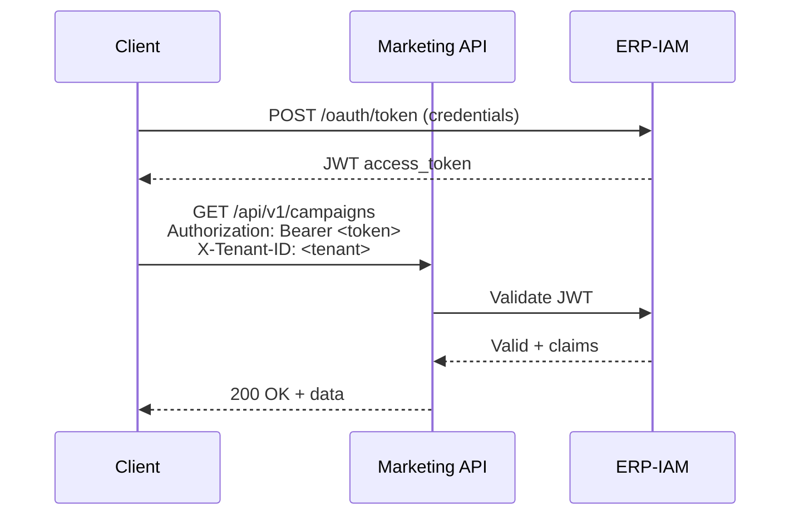

# ERP-Marketing -- Technical Specifications

## 1. System Requirements

### 1.1 Hardware Requirements (Production)

| Component | Minimum | Recommended |
|---|---|---|
| CPU | 4 cores | 8 cores |
| RAM | 8 GB | 16 GB |
| Storage | 100 GB SSD | 500 GB NVMe |
| Network | 1 Gbps | 10 Gbps |

### 1.2 Software Requirements

| Software | Minimum Version | Recommended |
|---|---|---|
| Rust | 1.75 | Latest stable |
| Go | 1.22 | Latest stable |
| Node.js | 20 LTS | 20 LTS |
| PostgreSQL | 16 | 16 |
| Apache Pulsar | 3.0 | 3.x latest |
| Quickwit | 0.8 | Latest |
| Docker | 24 | Latest |
| Kubernetes | 1.28 | 1.29+ |

## 2. API Specifications

### 2.1 Base URL

```
https://api.{domain}/api/v1
```

### 2.2 Authentication

All API requests require authentication via bearer token obtained from ERP-IAM:

```http
Authorization: Bearer <jwt_token>
X-Tenant-ID: <tenant_uuid>
Content-Type: application/json
```

### 2.3 Error Response Format

```json
{
  "error": "string",
  "code": "string",
  "details": {}
}
```

### 2.4 Pagination

```http
GET /api/v1/campaigns?limit=50&offset=0
```

Response includes pagination metadata:
```json
{
  "items": [],
  "total": 150,
  "limit": 50,
  "offset": 0
}
```

### 2.5 Endpoint Specifications

#### Campaigns

```yaml
POST /api/v1/campaigns:
  request:
    name: string (required)
    subject: string (optional)
    channel: enum [email, sms, push, in_app, social] (default: email)
    objective: string (optional, default: conversion)
    budget: float (optional, default: 0)
    expected_reach: integer (optional, default: 0)
    owner: string (optional, default: "Growth Team")
    audience_id: uuid (optional)
    template_id: uuid (optional)
  response: 201 Created
    id: uuid
    name: string
    subject: string
    channel: string
    status: "draft"
    stats: {}
    created_at: datetime

POST /api/v1/campaigns/:id/launch:
  request:
    ai_confidence: float (required, 0.0-1.0)
    expected_reach: integer (required)
    approved_by: string (optional)
  response: 200 OK
    campaign object with status updated
  guardrail: AIDD evaluation before execution
```

#### Contacts

```yaml
POST /api/v1/contacts:
  request:
    email: string (required, unique)
    first_name: string (optional)
    last_name: string (optional)
    company: string (optional)
    job_title: string (optional)
  response: 201 Created
    id: uuid
    email: string
    lifecycle_stage: "subscriber"
    lead_score: 0
    consent_status: "opt_in"
    tags: []
    traits: {}

POST /api/v1/contacts/:id/score:
  request:
    lead_score: integer (required)
    ai_confidence: float (required)
    approved_by: string (optional)
    reason: string (optional)
  response: 200 OK
  guardrail: AIDD evaluation for score changes > 20 points
```

#### Journeys

```yaml
POST /api/v1/journeys/:id/activate:
  request:
    ai_confidence: float (required)
    blast_radius: integer (required)
    approved_by: string (optional)
  response: 200 OK
  guardrail: AIDD evaluation based on blast_radius
```

## 3. Database Specifications

### 3.1 Connection Configuration

```
DATABASE_URL=postgres://postgres:postgres@db:5432/marketing
Max Connections: 10
Connection Timeout: 30s
Idle Timeout: 600s
```

### 3.2 Index Strategy

```mermaid
flowchart TB
    subgraph "Hot Path Indexes"
        IDX1[idx_campaigns_status<br/>campaigns(status)]
        IDX2[idx_marketing_contacts_score<br/>contacts(lead_score DESC)]
        IDX3[idx_marketing_contacts_stage<br/>contacts(lifecycle_stage)]
        IDX4[idx_marketing_touchpoints_contact<br/>touchpoints(contact_id, occurred_at DESC)]
        IDX5[idx_marketing_touchpoints_campaign<br/>touchpoints(campaign_id, occurred_at DESC)]
    end
    subgraph "Lookup Indexes"
        IDX6[idx_marketing_journeys_status<br/>journeys(status)]
        IDX7[idx_marketing_segments_status<br/>segments(status)]
        IDX8[idx_marketing_experiments_status<br/>experiments(status)]
        IDX9[idx_marketing_opportunities_stage<br/>opportunities(stage, status)]
    end
    subgraph "Audit Indexes"
        IDX10[idx_marketing_guardrail_created<br/>guardrail_events(created_at DESC)]
        IDX11[idx_marketing_form_submissions_form<br/>form_submissions(form_id, created_at DESC)]
    end
```

### 3.3 JSONB Column Specifications

| Table | Column | JSON Schema | Usage |
|---|---|---|---|
| campaigns | stats | `{sent: int, opened: int, clicked: int, bounced: int}` | Campaign performance |
| contacts | tags | `["tag1", "tag2"]` | Contact classification |
| contacts | traits | `{key: value}` | Custom properties |
| journeys | channels | `["email", "sms", "in_app"]` | Supported channels |
| journeys | settings | `{max_touch_per_week: int, stop_on_sql: bool}` | Journey configuration |
| journey_steps | condition_json | `{if_opened: "action", else: "action"}` | Branch conditions |
| segments | rule_json | `{score_gte: int, intent: ["high"]}` | Dynamic filter rules |
| experiments | variants | `[{id: "A", name: "Control"}]` | Test variants |
| experiments | results | `{A: {open_rate: 0.24}}` | Variant performance |
| scoring_models | rules_json | `{page_visit: 12, demo_request: 30}` | Scoring weights |

## 4. Event Specifications

### 4.1 Pulsar Topic Configuration

```yaml
Broker URL: pulsar://pulsar-broker:6650
HTTP URL: http://pulsar-broker:8080
Tenant: billyronks
Namespace: extract-marketing

Topics:
  - persistent://billyronks/extract-marketing/command (6 partitions)
  - persistent://billyronks/extract-marketing/event (6 partitions)
  - persistent://billyronks/extract-marketing/audit (6 partitions)
  - persistent://billyronks/global/observability (6 partitions)
```

### 4.2 Event Envelope (CloudEvents)

```json
{
  "specversion": "1.0",
  "type": "erp.marketing.campaign.created",
  "source": "/api/v1/campaigns",
  "id": "uuid-v4",
  "time": "2026-02-23T10:00:00Z",
  "datacontenttype": "application/json",
  "data": {
    "campaign_id": "uuid",
    "name": "Campaign Name",
    "status": "draft"
  },
  "tenantid": "tenant-uuid"
}
```

## 5. Observability Specifications

### 5.1 Log Schema

```json
{
  "timestamp": "datetime",
  "level": "enum[DEBUG, INFO, WARN, ERROR, FATAL]",
  "service": "string",
  "trace_id": "string",
  "span_id": "string",
  "tenant_id": "string",
  "message": "string",
  "attrs": {}
}
```

### 5.2 Quickwit Index Configuration

```yaml
Index: logs-extract-marketing
Endpoint: http://quickwit-searcher:7280
Ingestion: via Pulsar observability topic
Retention: 90 days (configurable)
```

## 6. Performance Specifications

| Metric | Target | Measurement |
|---|---|---|
| API p50 latency | < 50ms | Quickwit trace aggregation |
| API p95 latency | < 200ms | Quickwit trace aggregation |
| API p99 latency | < 500ms | Quickwit trace aggregation |
| Campaign send throughput | 100,000/hour | Benchmark test |
| Journey step execution | < 100ms/step | Benchmark test |
| Dashboard load time | < 2 seconds | Frontend performance |
| Database query p95 | < 50ms | sqlx instrumentation |
| Pulsar publish latency | < 10ms | Pulsar metrics |
| Memory usage (API pod) | < 512MB | Kubernetes metrics |

## 7. Security Specifications

### 7.1 Encryption

| Layer | Standard | Implementation |
|---|---|---|
| In Transit | TLS 1.3 | nginx/envoy TLS termination |
| At Rest (DB) | AES-256 | PostgreSQL encryption |
| At Rest (Storage) | AES-256 | Mayastor/Vitastor encryption |
| Secrets | Environment variables | Never committed to source |

### 7.2 Authentication Flow


