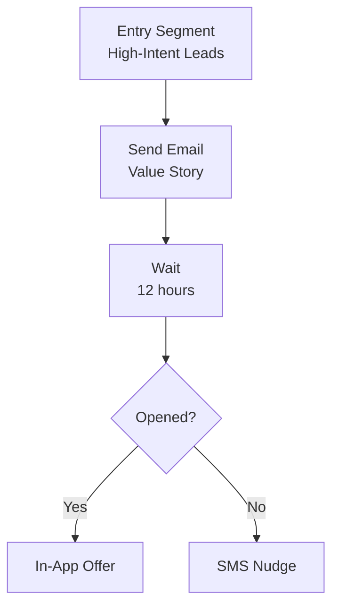

# ERP-Marketing -- Figma Design Prompts

## Overview

This document contains 30 detailed Figma design prompts for the ERP-Marketing platform UI. Each prompt specifies the screen purpose, key components, data displayed, interactions, and design constraints. The design language follows Ant Design 5 conventions with a dark/light mode toggle and tenant-aware branding.

---

## Prompt 1: Marketing Command Center Dashboard

**Screen:** Main dashboard -- the first screen users see after login.

**Layout:** Full-width with 12-column grid. Top: KPI card row (6 cards). Middle: Attribution donut chart (left), Active campaigns table (right). Bottom: AI Recommendations list (left), Guardrail audit feed (right).

**KPI Cards:** Active Campaigns, Active Journeys, Total Contacts, MQL Contacts, Open Pipeline Value ($), Weighted Pipeline ($). Each card has metric value, trend arrow (up/down), and sparkline.

**Interactions:** Click any KPI card to navigate to the corresponding detail view. Click a recommendation to open a confirmation modal with AIDD guardrail details (confidence, blast radius, risk level).

**Data Binding:** Fetched from `/api/v1/dashboard/summary` and `/api/v1/dashboard/attribution`.

**Constraints:** Responsive breakpoints at 1440px, 1024px, 768px. Maximum 2-second render time. Ant Design color palette with enterprise-grade spacing.

---

## Prompt 2: Campaign Studio -- List View

**Screen:** Campaign management table with filtering, sorting, and bulk actions.

**Layout:** Top: page title "Campaigns" + "Create Campaign" primary button. Filter bar: status dropdown, channel dropdown, date range picker, search input. Table: columns for Name, Channel, Status (color-coded badge), Budget, Reach, Owner, Created Date. Row actions: View, Edit, Launch, Pause, Delete.

**Status Badges:** Draft (gray), Scheduled (blue), Sending (orange), Sent (green), Paused (yellow), Cancelled (red).

**Interactions:** Click "Create Campaign" opens a drawer form. Click row opens campaign detail. Launch button triggers AIDD guardrail modal.

---

## Prompt 3: Campaign Studio -- Create/Edit Drawer

**Screen:** Slide-out drawer for campaign creation and editing.

**Form Fields:** Name (text input, required), Subject (text input), Channel (select: Email/SMS/Push/InApp/Social), Objective (select: Pipeline Acceleration/Retention/Conversion/Awareness), Budget (currency input), Expected Reach (number input), Owner (text input), Audience (select from segments), Template (select from templates).

**Footer:** Cancel button, Save as Draft button (secondary), Save and Launch button (primary, triggers AIDD guardrail).

---

## Prompt 4: Email Template Builder

**Screen:** Drag-and-drop email template editor.

**Layout:** Left sidebar: component palette (Header, Text Block, Image, Button, Divider, Spacer, Social Links, Footer). Center: email canvas with drag-and-drop zones, WYSIWYG editing. Right sidebar: component properties panel (font, color, padding, link URL). Top bar: Template name, Subject line input, Preview toggle (desktop/mobile), Save, Send Test.

**Interactions:** Drag components from palette to canvas. Click component to show properties. Toggle desktop/mobile preview.

---

## Prompt 5: Journey Canvas Builder

**Screen:** Visual journey builder with step sequencing and branching.

**Layout:** Top bar: Journey name, Goal display, Status badge, Activate button, Settings gear icon. Canvas: vertical flowchart layout with draggable step nodes. Left palette: step types (Send Message, Wait, Branch, Add Tag, Update Property, Escalate). Right panel: selected step configuration.

**Step Nodes:** Rounded rectangles with icon (envelope for email, clock for wait, branch icon for if/else), step label, and connection lines. Branch nodes show two output paths (True/False).

**Interactions:** Drag step from palette to canvas. Click step to configure in right panel. Connect steps with click-and-drag lines. Activate button triggers AIDD guardrail modal.

---

## Prompt 6: Social Media Publisher

**Screen:** Social post management with platform preview.

**Layout:** Left: Post list with filters (platform, status, date). Center: Post composer with platform selector tabs (LinkedIn, X, Facebook, Instagram, TikTok), text area with character count, media attachment zone, campaign link selector. Right: Live preview of how the post will look on the selected platform.

**Bottom Bar:** Save Draft, Schedule (with datetime picker), Publish Now (triggers AIDD guardrail).

---

## Prompt 7: Ads Manager Dashboard

**Screen:** Advertising campaign overview with ROI metrics.

**Layout:** Top: KPI cards (Total Spend, Total Impressions, Total Clicks, Total Conversions, Average CPC, Average ROAS). Table: Ad name, Network (with logo icons: Google, Meta, LinkedIn, TikTok), Status, Budget, Spend (with progress bar), Impressions, Clicks, Conversions, CTR, CPC. Chart: Spend vs. Conversions over time (line chart).

**Interactions:** Click ad row for detail view. "Launch Ad" triggers AIDD guardrail with projected spend/reach.

---

## Prompt 8: Content CMS Dashboard

**Screen:** Content asset management for blogs and landing pages.

**Layout:** Top: Tab bar (All, Blog Posts, Landing Pages). Grid/List toggle. Cards: Content title, type icon, status badge, SEO score indicator, CTA preview, owner, last updated. Filter bar: type, status, keyword search.

**Card Interactions:** Click opens content editor. Hover shows quick preview.

---

## Prompt 9: Landing Page Builder

**Screen:** Visual landing page builder with drag-and-drop.

**Layout:** Left palette: section types (Hero, Feature Grid, Testimonial, CTA, Form Embed, FAQ, Footer). Center: page canvas with drag-and-drop sections. Right: section properties (text, images, colors, spacing, CTA button config). Top bar: Page title, Slug input, SEO settings button, Preview, Publish.

---

## Prompt 10: Analytics Dashboard

**Screen:** Comprehensive marketing analytics with drill-down.

**Layout:** Top: Date range picker, channel filter, campaign filter. Row 1: Conversion funnel chart (Visitors > Leads > MQLs > SQLs > Opportunities > Customers). Row 2: Email performance cards (Sent, Delivered, Opens, Clicks, Bounces, Unsubscribes). Row 3: Social engagement chart (by platform). Row 4: Ad ROI chart (spend vs. revenue by network).

---

## Prompt 11: Segment Builder

**Screen:** Dynamic segment creation with rule builder.

**Layout:** Top: Segment name input, description textarea. Center: Rule builder with condition rows. Each row: field selector (dropdown of contact fields), operator selector (equals, not equals, greater than, less than, contains), value input. Logic toggle: AND/OR between conditions. Bottom: Estimated segment size preview (live calculation), Save button.

---

## Prompt 12: A/B Test Results Dashboard

**Screen:** Experiment results with statistical analysis.

**Layout:** Top: Experiment name, hypothesis, status badge. Variant cards: each variant shows name, sample size, open rate (with confidence interval), click rate, conversion rate. Winner highlight with green border. Statistical significance indicator (confidence percentage). Chart: variant performance over time (line chart).

---

## Prompt 13: Contact Profile 360-View

**Screen:** Complete contact profile with activity timeline.

**Layout:** Left column: Contact photo/avatar, name, email, company, job title, lifecycle stage badge, lead score gauge, consent status indicator, tags as chips. Center: Activity timeline (touchpoints, form submissions, email opens, page views). Right: Related entities (campaigns, journeys, opportunities, tasks).

---

## Prompt 14: Lead Scoring Configuration

**Screen:** Scoring model builder with rule weights.

**Layout:** Model name and status at top. Rule table: Event/Attribute (dropdown), Weight (number input with +/- stepper), Category (behavioral/firmographic/engagement). SQL threshold input. Preview: test scoring against sample contact. Active/Inactive toggle.

---

## Prompt 15: AIDD Guardrail Configuration Panel

**Screen:** Admin panel for configuring AIDD guardrail thresholds.

**Layout:** Four slider inputs: Minimum Confidence (0.0-1.0), Medium Confidence (0.0-1.0), Max Blast Radius (0-100000), High Value Amount ($0-$1M). Action classification table: action name, current category (autonomous/supervised/prohibited), toggle switches. Save Configuration button.

---

## Prompt 16: Guardrail Audit Log

**Screen:** AIDD guardrail event history with filtering.

**Layout:** Filter bar: date range, decision type (approved/needs_review/blocked), risk level, entity type. Table: Timestamp, Entity Type, Action, Confidence, Blast Radius, Monetary Value, Decision (color badge), Risk Level, Approved By, Rationale (expandable).

---

## Prompt 17: Sequence Builder

**Screen:** Sales sequence step editor.

**Layout:** Sequence name and trigger type at top. Step timeline: vertical list of steps with type icons (email, call, task), delay between steps (editable), step content preview. Enrollment stats: total enrolled, active, completed, paused.

---

## Prompt 18: Form Builder

**Screen:** Drag-and-drop form field editor.

**Layout:** Left palette: field types (Text, Email, Select, Checkbox, Textarea, Hidden). Center: form preview with drag-and-drop field ordering. Right: field properties (label, placeholder, required toggle, validation rules). Bottom: Success message editor, Embed code generator.

---

## Prompt 19: Meeting Scheduler

**Screen:** Meeting management with calendar integration.

**Layout:** Calendar view (week/month toggle) showing scheduled meetings. Meeting detail card: title, type, contact, opportunity link, owner, time, outcome field. Create meeting form: contact selector, opportunity selector, type, title, date/time pickers.

---

## Prompt 20: Ticket Management

**Screen:** Support ticket queue with SLA tracking.

**Layout:** Kanban board: columns for Open, In Progress, Waiting, Resolved. Cards: ticket subject, priority badge (P1-P4), SLA countdown timer, owner, contact name. Filter by: priority, pipeline, owner.

---

## Prompt 21: Knowledge Base Manager

**Screen:** Knowledge article management with helpfulness tracking.

**Layout:** Article list with categories as tabs. Each article: title, category, status, helpful votes count, owner, last updated. Article editor: title, slug, category selector, rich text body, publish/draft toggle.

---

## Prompt 22: Playbook Editor

**Screen:** Sales and service playbook step editor.

**Layout:** Playbook name, category, success criteria. Step list: drag-and-drop reorderable steps with descriptive labels. Each step has an expandable detail section for notes and resources.

---

## Prompt 23: Data Sync Configuration

**Screen:** External system sync job management.

**Layout:** Sync job table: name, source system (with logo), target system, status badge, last run time, records processed, error rate (red if > 1%), schedule cron, owner. Actions: Run Now (AIDD guardrail), Edit Schedule, View Logs.

---

## Prompt 24: Attribution Model Configurator

**Screen:** Multi-touch attribution model selection and customization.

**Layout:** Model selector: tabs for First Touch, Last Touch, Linear, Time Decay, Position Based, AI Custom. Visualization: Sankey diagram showing touchpoint flow from first to last interaction. Weight configuration: sliders for each model's weight distribution. Preview: apply model to recent deals and show attribution split.

---

## Prompt 25: Conversation Inbox

**Screen:** Unified conversation view across channels.

**Layout:** Left: conversation list with contact name, channel icon (email/chat/social), sentiment badge (positive/neutral/negative), last message preview. Center: conversation thread with alternating inbound/outbound message bubbles. Right: contact context card (profile, ticket link, account info).

---

## Prompt 26: Pipeline Kanban Board

**Screen:** Opportunity pipeline visualization.

**Layout:** Kanban columns: Qualification, Discovery, Proposal, Negotiation, Closed-Won, Closed-Lost. Cards: opportunity name, amount, probability %, account name, owner, close date. Drag-and-drop between stages (triggers AIDD guardrail for high-value deals).

---

## Prompt 27: Campaign Calendar View

**Screen:** Calendar showing all scheduled campaigns, journeys, and social posts.

**Layout:** Full-width calendar (month view default, week/day toggles). Color-coded events: campaigns (blue), journeys (green), social posts (purple), ads (orange). Click event to see detail popover. Drag to reschedule.

---

## Prompt 28: Real-Time Event Stream Monitor

**Screen:** Live event stream from Pulsar topics for admin monitoring.

**Layout:** Three-column layout: Command events (left), Domain events (center), Audit events (right). Each event: timestamp, topic, type badge, tenant, entity ID, expandable payload. Auto-scroll with pause button. Filter by event type.

---

## Prompt 29: Multi-Channel Campaign Wizard

**Screen:** Step-by-step wizard for creating multi-channel campaigns.

**Layout:** Horizontal stepper: 1) Define Campaign, 2) Select Channels, 3) Build Content per Channel, 4) Set Audience, 5) Configure Budget, 6) Review & Launch. Each step is a full-page form. Final step shows summary with AIDD guardrail pre-evaluation.

---

## Prompt 30: Mobile Marketing Dashboard (Responsive)

**Screen:** Mobile-optimized dashboard for on-the-go marketing managers.

**Layout:** Single column, swipeable KPI cards at top. Expandable sections: Campaigns (mini cards), Tasks (checklist), Recommendations (action cards with approve/dismiss buttons). Bottom nav: Dashboard, Campaigns, Tasks, Notifications, Settings.

**Constraints:** Touch-friendly tap targets (44px minimum), bottom navigation bar, swipe gestures for navigation, optimized for 375px-428px viewport widths.
