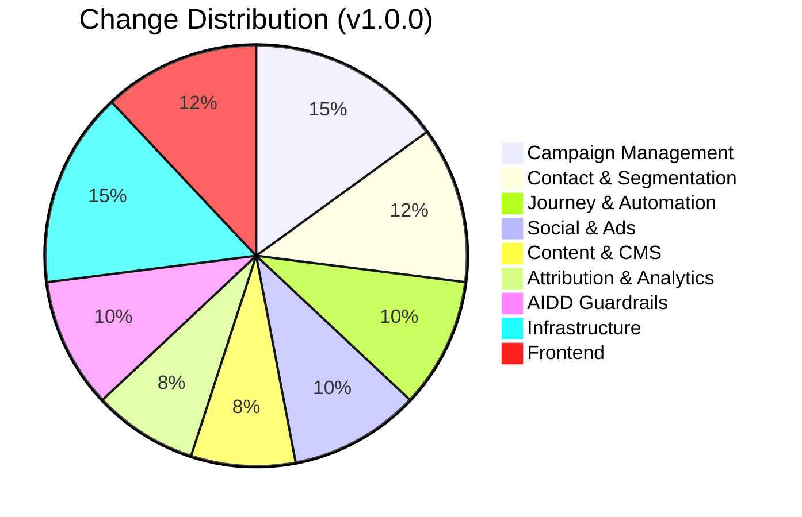

# ERP-Marketing -- Changelog

All notable changes to the ERP-Marketing module are documented in this file. The format is based on [Keep a Changelog](https://keepachangelog.com/en/1.1.0/), and this project adheres to [Semantic Versioning](https://semver.org/spec/v2.0.0.html).

---

## [1.0.0] - 2026-02-23

### Added
- Multi-channel campaign management (email, SMS, push, in-app, social) with full lifecycle (draft, scheduled, sending, sent, paused, cancelled)
- Email template management with HTML and plain-text content
- Customer journey builder with step types: send_message, wait, branch, escalation
- Journey step sequencing with entry segment binding and goal tracking
- Social media post management with scheduling and multi-platform support (LinkedIn, X, Facebook, Instagram, TikTok)
- Ads management across Google Ads, LinkedIn Ads, Meta Ads, TikTok Ads with budget/spend tracking
- Content management system for blog posts and landing pages with SEO keyword tracking
- Multi-touch attribution with configurable weights and channel-level summaries
- Dynamic segmentation with JSON rule-based filtering and AND/OR logic
- Contact management with lifecycle stages, lead scoring, consent tracking
- A/B/n experiment framework with hypothesis, variants, and winner detection
- Lead scoring models with configurable behavioral and firmographic rules
- Account management with health scores and expansion potential tracking
- Opportunity pipeline management with stage progression
- Task management linked to opportunities and journeys
- Form builder with field configuration and submission tracking
- Sales sequence automation with manual and segment-entry triggers
- Meeting scheduling linked to contacts and opportunities
- Support ticket management with SLA tracking and priority routing
- Conversation inbox with channel attribution and sentiment analysis
- Knowledge base article management with helpfulness voting
- Sales and service playbook management
- Data sync jobs for external system integration (Salesforce, Zendesk)
- AIDD guardrail framework with three-tier action classification (autonomous, supervised, prohibited)
- Guardrail event persistence with full audit trail
- AI recommendation engine with confidence scoring and risk assessment
- Dashboard summary API with KPI aggregation
- Attribution summary by channel with weighted distribution
- Nine Go domain microservices (campaign, email-marketing, journey, social, ads, content, attribution, segment, analytics)
- Rust API gateway with axum, sqlx, tokio
- React + Ant Design + Refine web command center
- Flutter, Android (Kotlin/Compose), iOS (SwiftUI) mobile scaffolds
- GraphQL schema and codegen pipeline
- Apache Pulsar event backbone with 4 topics x 6 partitions
- Quickwit structured log indexing
- Harvester HCI Kubernetes deployment target with Mayastor/Vitastor storage
- Docker Compose local development environment
- Multi-stage Dockerfile with non-root user execution
- GitHub Actions CI pipeline (test, build, Docker push)
- PostgreSQL 16 with 25+ tables and comprehensive indexing
- SOC2, HIPAA, PCI-DSS, CAN-SPAM, GDPR, CCPA compliance mapping

### Infrastructure
- ADR-0001: Sovereign baseline architecture decision
- ADR-001: Language choice (Rust for API gateway)
- ADR-002: Database selection (PostgreSQL 16)
- Apache Pulsar topic configuration (command, event, audit, observability)
- Quickwit index configuration for log search
- Harvester HCI storage baseline with Mayastor

---

## [0.2.0] - 2026-02-19

### Added
- Frontend stack standardization across all platforms
- Aligned web (Refine + AntD + React Query), Flutter (Ferry + Riverpod + GoRouter), Android (Compose + Apollo + Hilt + Orbit), iOS (SwiftUI + Apollo + TCA) scaffolds
- CI workflows for frontend pipeline, regeneration, and quality checks

### Changed
- Unified GraphQL schema across all frontend platforms
- Standardized code generation configuration

---

## [0.1.0] - 2026-02-18

### Added
- Initial frontend stack scaffolding for web, flutter, android, and ios
- GraphQL schema and codegen scripts
- CI workflows for metadata and schema triggers
- Architecture and code generation documentation

---

## Change Categories

