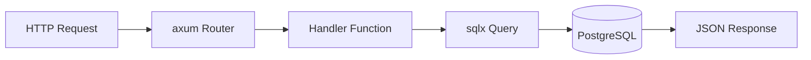
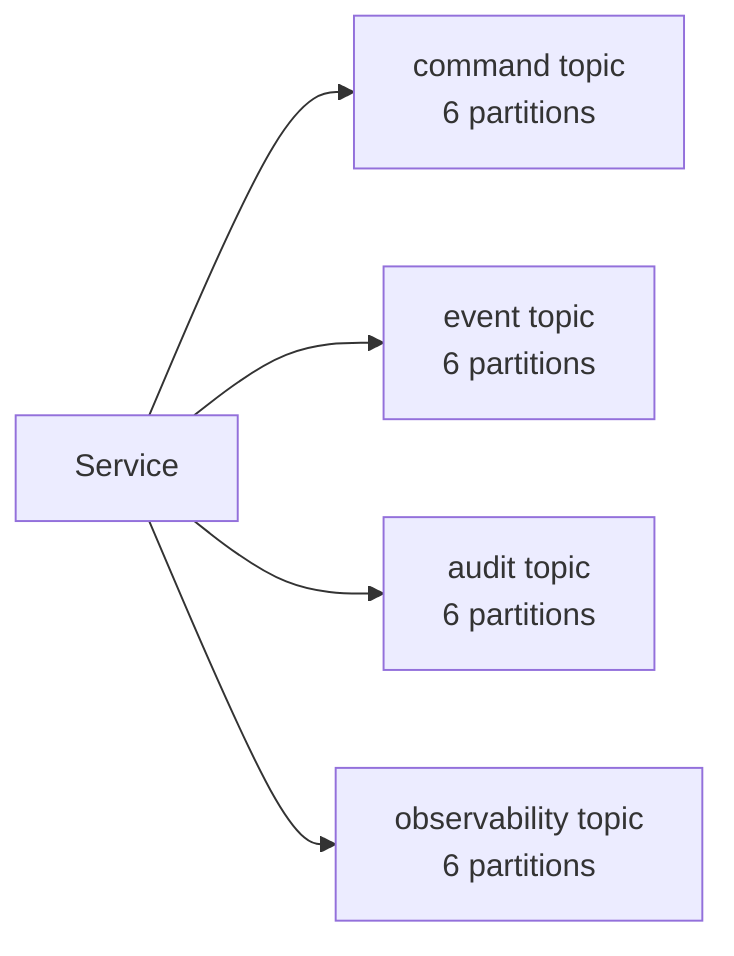

# ERP-Marketing -- Architecture Decision Records

## ADR Index

| ADR | Title | Status | Date |
|---|---|---|---|
| ADR-001 | Rust as API Gateway Language | Accepted | 2026-02-18 |
| ADR-002 | PostgreSQL as Primary Database | Accepted | 2026-02-18 |
| ADR-003 | Apache Pulsar as Event Backbone | Accepted | 2026-02-20 |
| ADR-004 | Go for Domain Microservices | Accepted | 2026-02-20 |
| ADR-005 | React + Ant Design + Refine for Frontend | Accepted | 2026-02-18 |
| ADR-006 | AIDD Guardrail Framework | Accepted | 2026-02-20 |
| ADR-007 | JSONB for Flexible Schema Data | Accepted | 2026-02-18 |
| ADR-008 | Hybrid Monolith + Microservice Architecture | Accepted | 2026-02-20 |
| ADR-009 | Quickwit for Observability Search | Accepted | 2026-02-20 |
| ADR-010 | CloudEvents for Event Envelope | Accepted | 2026-02-20 |

---

## ADR-001: Rust as API Gateway Language

**Status:** Accepted
**Date:** 2026-02-18
**Context:** The API gateway handles all incoming HTTP traffic, database queries, AIDD guardrail evaluation, and response serialization. It needs to be fast, memory-safe, and capable of high concurrent throughput.

**Decision:** Use Rust with axum web framework, sqlx for compile-time-checked SQL, and tokio for async runtime.

**Consequences:**
- (+) Sub-millisecond p99 latency achievable
- (+) Memory safety without garbage collector pauses
- (+) Compile-time SQL verification prevents runtime query errors
- (-) Steeper learning curve for new team members
- (-) Longer compilation times compared to Go

---

## ADR-002: PostgreSQL as Primary Database

**Status:** Accepted
**Date:** 2026-02-18
**Context:** The marketing platform requires relational data integrity (foreign keys, constraints), flexible schema support for evolving data models, advanced indexing for query performance, and ACID guarantees for financial and audit data.

**Decision:** Use PostgreSQL 16 as the single primary database with JSONB columns for flexible schema data.

**Alternatives Considered:**
- MySQL: Lacks native JSONB support and partial index capabilities
- MongoDB: No ACID transactions across collections, weaker referential integrity
- CockroachDB: Higher operational complexity for the initial deployment scale

**Consequences:**
- (+) JSONB enables flexible schema without sacrificing relational integrity
- (+) Mature indexing (B-tree, GIN, partial) for query optimization
- (+) Strong ecosystem with sqlx compile-time verification
- (-) Single-node write bottleneck requires careful capacity planning

---

## ADR-003: Apache Pulsar as Event Backbone

**Status:** Accepted
**Date:** 2026-02-20
**Context:** The platform needs asynchronous event-driven communication between services, with multi-tenant topic isolation, persistent messaging, and exactly-once delivery semantics.

**Decision:** Use Apache Pulsar with tenant-namespaced topics. Four topic categories: command, event, audit, and observability, each with 6 partitions.

**Alternatives Considered:**
- Apache Kafka: Lacks native multi-tenant topic namespacing
- RabbitMQ: Limited persistent storage and partition scaling
- NATS JetStream: Less mature for enterprise-grade multi-tenant scenarios

**Consequences:**
- (+) Native multi-tenant support with tenant/namespace/topic hierarchy
- (+) Persistent storage with configurable retention
- (+) 6 partitions per topic enables parallel consumer processing
- (-) Higher operational complexity than simple message queues

---

## ADR-004: Go for Domain Microservices

**Status:** Accepted
**Date:** 2026-02-20
**Context:** Nine domain microservices (campaign, email-marketing, journey, social, ads, content, attribution, segment, analytics) need to be developed and maintained by the team. Development velocity, deployment simplicity, and team familiarity are priorities.

**Decision:** Use Go for all domain microservices with a standardized HTTP handler pattern including tenant validation and event emission.

**Consequences:**
- (+) Fast compilation (seconds vs. minutes for Rust)
- (+) Simple deployment (single static binary per service)
- (+) Strong concurrency model for parallel request handling
- (+) Standardized handler pattern enables consistent service development
- (-) Less type safety than Rust for complex domain logic

---

## ADR-005: React + Ant Design + Refine for Frontend

**Status:** Accepted
**Date:** 2026-02-18
**Context:** The marketing command center needs enterprise-grade UI components (tables, forms, charts, drawers, modals), data-provider abstraction for API integration, and responsive design for desktop and tablet.

**Decision:** Use React 18 with Ant Design 5 component library and Refine 4 data-provider framework.

**Consequences:**
- (+) Ant Design provides 60+ enterprise components out of the box
- (+) Refine abstracts CRUD operations, reducing boilerplate
- (+) TanStack React Query provides caching, refetching, and optimistic updates
- (-) Larger bundle size than minimal frameworks (mitigated by code splitting)

---

## ADR-006: AIDD Guardrail Framework

**Status:** Accepted
**Date:** 2026-02-20
**Context:** Marketing automation can have significant business impact -- a misconfigured campaign can reach thousands of contacts, a bad ad spend can waste significant budget, and an incorrect lead score can misroute pipeline. The platform needs safety mechanisms that prevent accidental high-impact actions while allowing autonomous low-risk operations.

**Decision:** Implement a three-tier AIDD guardrail framework:
1. **Autonomous**: Read-only queries, low-risk notifications (auto-approved)
2. **Supervised**: Data mutations, workflow automation, bulk operations (requires confidence threshold and/or named approver)
3. **Prohibited**: Cross-tenant data access, irreversible deletes without backup, privilege escalation (always blocked)

All guardrail decisions are persisted in `marketing_aidd_guardrail_events` with full audit trail.

**Consequences:**
- (+) Prevents accidental high-impact actions
- (+) Full audit trail for compliance
- (+) Configurable thresholds per tenant
- (-) Adds friction to legitimate high-impact actions (mitigated by named approver fast-path)

---

## ADR-007: JSONB for Flexible Schema Data

**Status:** Accepted
**Date:** 2026-02-18
**Context:** Marketing data includes highly variable schemas: segment filter rules, contact traits, campaign statistics, journey step conditions, experiment results, and scoring model weights. A rigid relational schema would require frequent migrations as requirements evolve.

**Decision:** Use PostgreSQL JSONB columns for flexible, query-able data while maintaining relational structure for core entities.

**Consequences:**
- (+) Schema evolution without migrations for flexible fields
- (+) GIN indexing enables efficient JSONB queries
- (+) Preserves relational integrity for core relationships (foreign keys)
- (-) JSONB queries are less optimized than native column queries

---

## ADR-008: Hybrid Monolith + Microservice Architecture

**Status:** Accepted
**Date:** 2026-02-20
**Context:** The team needs to balance development velocity (favoring a monolith) with domain isolation and independent scaling (favoring microservices).

**Decision:** Use a Rust monolith for the API gateway and database access layer, with nine Go microservices for domain-specific processing.

**Consequences:**
- (+) Single database schema managed by the monolith prevents data fragmentation
- (+) Domain services can be scaled independently
- (+) Monolith provides consistent API surface and AIDD guardrail enforcement
- (-) Requires internal HTTP calls between monolith and services

---

## ADR-009: Quickwit for Observability Search

**Status:** Accepted
**Date:** 2026-02-20
**Context:** The platform needs structured log indexing with sub-second full-text search for operational debugging, compliance auditing, and performance analysis.

**Decision:** Use Quickwit with a shared log schema, ingested from the Pulsar observability topic.

**Alternatives Considered:**
- Elasticsearch: Higher memory requirements, JVM-based
- Grafana Loki: Limited full-text search capabilities

**Consequences:**
- (+) Rust-native, low resource usage
- (+) Sub-second search on structured logs
- (-) Smaller ecosystem than Elasticsearch

---

## ADR-010: CloudEvents for Event Envelope

**Status:** Accepted
**Date:** 2026-02-20
**Context:** Events published to Pulsar need a standard envelope format for interoperability with other ERP modules and external systems.

**Decision:** Use the CloudEvents 1.0 specification for all event envelopes with `erp.marketing.<entity>.<action>` type naming convention.

**Consequences:**
- (+) Industry-standard envelope format
- (+) Consistent across all ERP modules
- (+) Built-in support for content type, source, and tenant identification
- (-) Slightly larger payload than custom envelopes
