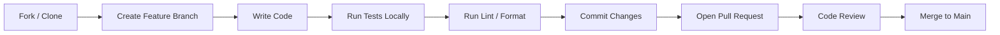
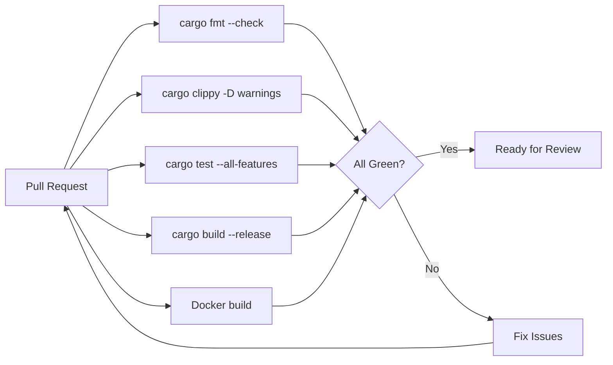

# ERP-Marketing -- Contributing Guide

## Welcome

Thank you for contributing to ERP-Marketing. This guide explains the development workflow, coding standards, testing requirements, and review process.

## Development Workflow



### 1. Branch Naming

Use the following branch naming convention:

```
feature/<short-description>
fix/<issue-number>-<short-description>
docs/<topic>
refactor/<component>
```

### 2. Create a Feature Branch

```bash
git checkout main
git pull origin main
git checkout -b feature/journey-analytics
```

### 3. Development Loop

```bash
# Rust backend
cargo check --all-targets    # Verify compilation
cargo test --all-features    # Run tests
cargo fmt                    # Format code
cargo clippy -- -D warnings  # Lint check

# Frontend
cd web
npm run typecheck            # TypeScript type checking
npm run lint                 # ESLint
npm test                     # Vitest
```

### 4. Commit Guidelines

Follow the [Conventional Commits](https://www.conventionalcommits.org/) specification:

```
feat(campaigns): add campaign cloning endpoint
fix(journeys): correct step ordering on branch insertion
docs(api): update attribution endpoint documentation
refactor(scoring): extract scoring logic into domain service
test(segments): add integration tests for dynamic evaluation
chore(deps): bump axum to 0.7.x
```

### 5. Pull Request Process

1. Push your branch and open a PR against `main`
2. Fill in the PR template with:
   - Summary of changes
   - Related issue numbers
   - Testing performed
   - Breaking changes (if any)
3. Ensure all CI checks pass:
   - `cargo fmt -- --check`
   - `cargo clippy -- -D warnings`
   - `cargo test --all-features`
   - Docker build success
4. Request review from at least one maintainer
5. Address review feedback
6. Maintainer merges after approval

## Coding Standards

### Rust

- Follow Rust 2021 edition idioms
- Use `thiserror` for domain errors, `anyhow` for infrastructure errors
- Use `sqlx::query_as` with compile-time verified SQL
- Prefer `Uuid::now_v7()` for time-ordered primary keys
- Keep handler functions under 30 lines; extract logic into domain methods
- All public types must derive `Debug, Clone, Serialize, Deserialize`
- Document public APIs with `///` doc comments

### Go (Microservices)

- Follow standard Go project layout
- Always validate `X-Tenant-ID` header first
- Use `writeJSON` helper for consistent response formatting
- Emit domain events for all CRUD operations
- Keep `main.go` under 100 lines per service

### TypeScript/React

- Strict TypeScript (`"strict": true` in tsconfig)
- Use Ant Design components (do not introduce competing UI libraries)
- Follow the typed API client pattern in `marketingApi.ts`
- Transform snake_case API responses to camelCase at the boundary
- Test all components with React Testing Library

### SQL/Migrations

- All migrations are forward-only (no down migrations)
- Use `IF NOT EXISTS` for table creation
- Use `ON CONFLICT (id) DO NOTHING` for seed data
- Index all foreign key columns and frequently filtered columns
- Use JSONB with explicit default values (`DEFAULT '{}'::jsonb`)

## Testing Requirements

| Type | Location | Runner | Minimum Coverage |
|---|---|---|---|
| Unit tests | `src/**/*` | `cargo test` | 80% line coverage |
| Integration tests | `tests/` | `cargo test` with DB | All API endpoints |
| Frontend unit tests | `web/src/**/*.test.tsx` | `vitest` | 70% line coverage |
| Lint | All source files | `cargo fmt`, `cargo clippy`, `eslint` | Zero warnings |

## Documentation

When your change affects behavior:

1. Update the relevant doc in `docs/`
2. Update `CHANGELOG.md` with an entry under `[Unreleased]`
3. If API changes, update `API_SPEC.yaml`
4. If schema changes, add a new migration file

## Security

- Never commit secrets, API keys, or credentials
- Use environment variables for all configuration
- Report vulnerabilities privately to maintainers (see `SECURITY.md`)
- Run `cargo audit` before submitting PRs

## Required CI Checks



## Code of Conduct

All contributors must follow our [Code of Conduct](../CODE_OF_CONDUCT.md). Be respectful, constructive, and professional in all interactions.

## Getting Help

- Check existing documentation in `docs/`
- Search closed PRs and issues for similar topics
- Open a discussion for design-level questions
- Tag `@maintainers` for urgent blockers
