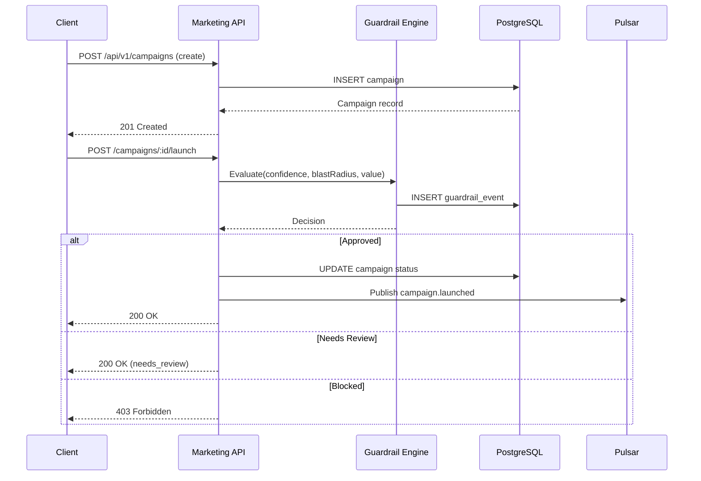

# ERP-Marketing -- API Documentation

## Base URL

```
Production:  https://api.{domain}/api/v1
Local:       http://localhost:8086/api/v1
```

## Authentication

All endpoints (except `/health`) require:

```http
Authorization: Bearer <jwt_token>
X-Tenant-ID: <tenant_uuid>
Content-Type: application/json
```

## Common Response Codes

| Code | Meaning |
|---|---|
| 200 | Success |
| 201 | Created |
| 202 | Accepted (async processing) |
| 204 | No Content |
| 400 | Bad Request (missing tenant ID, invalid input) |
| 401 | Unauthorized (missing/invalid token) |
| 404 | Not Found |
| 405 | Method Not Allowed |
| 500 | Internal Server Error |

---

## Health Check

### GET /health

Returns service health status.

**Response:**
```json
{
  "status": "healthy",
  "service": "opensase-marketing"
}
```

---

## Campaigns

### GET /api/v1/campaigns

List all campaigns ordered by creation date (descending).

**Query Parameters:**
| Parameter | Type | Default | Description |
|---|---|---|---|
| limit | integer | 200 | Max results |
| offset | integer | 0 | Pagination offset |

**Response:** `200 OK`
```json
[
  {
    "id": "uuid",
    "name": "Q2 Enterprise Expansion",
    "subject": "Unlock expansion outcomes",
    "channel": "email",
    "objective": "pipeline_acceleration",
    "budget": 120000.0,
    "expected_reach": 12000,
    "owner": "Growth Team",
    "status": "scheduled",
    "audience_id": "uuid",
    "template_id": "uuid",
    "scheduled_at": "2026-02-25T10:00:00Z",
    "sent_at": null,
    "stats": {},
    "created_at": "2026-02-18T10:00:00Z"
  }
]
```

### POST /api/v1/campaigns

Create a new campaign.

**Request Body:**
```json
{
  "name": "Campaign Name",
  "subject": "Email Subject Line",
  "channel": "email",
  "objective": "pipeline_acceleration",
  "budget": 120000,
  "expected_reach": 12000,
  "owner": "Growth Team",
  "audience_id": "uuid",
  "template_id": "uuid"
}
```

**Response:** `201 Created`

### GET /api/v1/campaigns/:id

Get a single campaign by UUID.

**Response:** `200 OK` -- Campaign object

### POST /api/v1/campaigns/:id/send

Trigger campaign send. Updates status to `sent`.

**Response:** `200 OK` -- Updated campaign object

### POST /api/v1/campaigns/:id/launch

Launch campaign with AIDD guardrail evaluation.

**Request Body:**
```json
{
  "ai_confidence": 0.82,
  "expected_reach": 12000,
  "approved_by": "jane.doe@company.com"
}
```

**AIDD Behavior:**
- Confidence < 0.64: BLOCKED
- Blast radius > 15,000 or monetary value > $250,000 without approver: NEEDS_REVIEW
- Confidence >= 0.78 and within thresholds: APPROVED

**Response:** `200 OK` -- Updated campaign object

### POST /api/v1/campaigns/:id/pause

Pause an active campaign.

**Response:** `200 OK` -- Updated campaign object

---

## Audiences

### GET /api/v1/audiences

List all audiences.

**Response:** `200 OK`
```json
[
  {
    "id": "uuid",
    "name": "High-Intent Pipeline Leads",
    "description": "Lead score >= 75 with recent intent",
    "filters": {},
    "member_count": 1260,
    "created_at": "2026-02-18T10:00:00Z"
  }
]
```

### POST /api/v1/audiences

Create audience.

**Request Body:**
```json
{
  "name": "Audience Name",
  "description": "Description",
  "filters": {"score_gte": 75}
}
```

---

## Email Templates

### GET /api/v1/templates

List all email templates.

### POST /api/v1/templates

Create email template.

**Request Body:**
```json
{
  "name": "Template Name",
  "subject": "Email Subject",
  "html_content": "<html>...</html>",
  "text_content": "Plain text version"
}
```

---

## Contacts

### GET /api/v1/contacts

List contacts with pagination.

**Response:** `200 OK`
```json
[
  {
    "id": "uuid",
    "email": "sarah.nguyen@northstar.example",
    "first_name": "Sarah",
    "last_name": "Nguyen",
    "company": "Northstar Health",
    "job_title": "VP Revenue Ops",
    "lifecycle_stage": "mql",
    "lead_score": 91,
    "consent_status": "opt_in",
    "tags": ["enterprise", "healthcare"],
    "traits": {"region": "NA", "intent": "high"},
    "last_activity_at": "2026-02-22T15:30:00Z"
  }
]
```

### POST /api/v1/contacts

Create contact.

### POST /api/v1/contacts/:id/score

Update contact lead score with AIDD guardrail.

**Request Body:**
```json
{
  "lead_score": 91,
  "ai_confidence": 0.88,
  "approved_by": "ops@company.com",
  "reason": "High intent signals from pricing page visits"
}
```

---

## Segments

### GET /api/v1/segments

List dynamic segments.

---

## Journeys

### GET /api/v1/journeys

List customer journeys.

### POST /api/v1/journeys/:id/activate

Activate journey with AIDD guardrail.

**Request Body:**
```json
{
  "ai_confidence": 0.85,
  "blast_radius": 1260,
  "approved_by": "lifecycle@company.com"
}
```

---

## Social Posts

### GET /api/v1/social/posts

List social posts.

### POST /api/v1/social/posts/:id/publish

Publish social post with AIDD guardrail.

---

## Ads

### GET /api/v1/ads

List ad campaigns.

### POST /api/v1/ads/:id/launch

Launch ad campaign with AIDD guardrail.

---

## Content Assets

### GET /api/v1/content/assets

List content assets (blog posts, landing pages).

---

## Sequences

### GET /api/v1/sequences

List sales sequences.

### POST /api/v1/sequences/:id/enroll

Enroll contact in sequence with AIDD guardrail.

---

## Dashboard

### GET /api/v1/dashboard/summary

Get dashboard KPIs.

**Response:** `200 OK`
```json
{
  "active_campaigns": 1,
  "active_journeys": 1,
  "contacts": 3,
  "mql_contacts": 2,
  "avg_lead_score": 83.5,
  "open_pipeline_value": 1460000,
  "weighted_pipeline": 998400,
  "running_experiments": 1,
  "open_tasks": 2,
  "attributed_influence": 0.7,
  "aidd_policy": {
    "min_confidence": 0.64,
    "medium_confidence": 0.78,
    "max_blast_radius": 15000,
    "high_value_amount": 250000
  }
}
```

### GET /api/v1/dashboard/attribution

Get attribution summary by channel.

**Response:** `200 OK`
```json
[
  {"channel": "email", "touches": 148, "weighted_attribution": 31.8},
  {"channel": "in_app", "touches": 112, "weighted_attribution": 28.1},
  {"channel": "paid_search", "touches": 89, "weighted_attribution": 17.4}
]
```

---

## Recommendations

### GET /api/v1/recommendations

Get AI-generated recommendations.

---

## Audit

### GET /api/v1/audit/guardrails

Get AIDD guardrail event history.

**Query Parameters:**
| Parameter | Type | Default |
|---|---|---|
| limit | integer | 100 |

---

## API Flow Diagram


