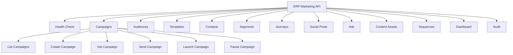
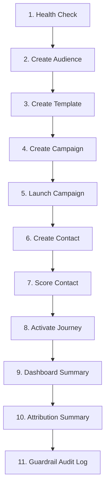

# ERP-Marketing -- Postman Collection

## Collection Overview

This document defines the Postman collection for testing and exploring the ERP-Marketing API. Import this as a JSON collection into Postman or use the requests as cURL references.

## Environment Variables

```json
{
  "base_url": "http://localhost:8086",
  "tenant_id": "tenant-001",
  "auth_token": "Bearer <your-jwt-token>"
}
```

## Collection Structure



---

## Requests

### 1. Health Check

```
GET {{base_url}}/health
```

**Headers:** None required

**Expected Response:** `200 OK`
```json
{"status": "healthy", "service": "opensase-marketing"}
```

---

### 2. List Campaigns

```
GET {{base_url}}/api/v1/campaigns
```

**Headers:**
```
Authorization: {{auth_token}}
X-Tenant-ID: {{tenant_id}}
```

---

### 3. Create Campaign

```
POST {{base_url}}/api/v1/campaigns
```

**Headers:**
```
Authorization: {{auth_token}}
X-Tenant-ID: {{tenant_id}}
Content-Type: application/json
```

**Body:**
```json
{
  "name": "Test Campaign - Pipeline Acceleration",
  "subject": "Unlock your pipeline potential",
  "channel": "email",
  "objective": "pipeline_acceleration",
  "budget": 50000,
  "expected_reach": 5000,
  "owner": "Growth Team"
}
```

---

### 4. Get Campaign by ID

```
GET {{base_url}}/api/v1/campaigns/{{campaign_id}}
```

---

### 5. Send Campaign

```
POST {{base_url}}/api/v1/campaigns/{{campaign_id}}/send
```

---

### 6. Launch Campaign (AIDD Guardrail)

```
POST {{base_url}}/api/v1/campaigns/{{campaign_id}}/launch
```

**Body:**
```json
{
  "ai_confidence": 0.85,
  "expected_reach": 5000,
  "approved_by": "marketing-lead@company.com"
}
```

---

### 7. Pause Campaign

```
POST {{base_url}}/api/v1/campaigns/{{campaign_id}}/pause
```

**Body:**
```json
{}
```

---

### 8. List Audiences

```
GET {{base_url}}/api/v1/audiences
```

---

### 9. Create Audience

```
POST {{base_url}}/api/v1/audiences
```

**Body:**
```json
{
  "name": "High-Value Enterprise Leads",
  "description": "Contacts with lead score >= 80 from enterprise accounts",
  "filters": {"score_gte": 80, "company_size": "enterprise"}
}
```

---

### 10. List Templates

```
GET {{base_url}}/api/v1/templates
```

---

### 11. Create Template

```
POST {{base_url}}/api/v1/templates
```

**Body:**
```json
{
  "name": "Product Update Newsletter",
  "subject": "What's new in ERP-Marketing this month",
  "html_content": "<html><body><h1>Monthly Update</h1><p>Here's what's new...</p></body></html>",
  "text_content": "Monthly Update\n\nHere's what's new..."
}
```

---

### 12. List Contacts

```
GET {{base_url}}/api/v1/contacts?limit=50
```

---

### 13. Create Contact

```
POST {{base_url}}/api/v1/contacts
```

**Body:**
```json
{
  "email": "test.user@example.com",
  "first_name": "Test",
  "last_name": "User",
  "company": "Example Corp",
  "job_title": "Marketing Manager"
}
```

---

### 14. Score Contact (AIDD Guardrail)

```
POST {{base_url}}/api/v1/contacts/{{contact_id}}/score
```

**Body:**
```json
{
  "lead_score": 85,
  "ai_confidence": 0.88,
  "approved_by": "scoring-admin@company.com",
  "reason": "High intent signals: pricing page visits, demo request"
}
```

---

### 15. List Segments

```
GET {{base_url}}/api/v1/segments?limit=50
```

---

### 16. List Journeys

```
GET {{base_url}}/api/v1/journeys?limit=50
```

---

### 17. Activate Journey (AIDD Guardrail)

```
POST {{base_url}}/api/v1/journeys/{{journey_id}}/activate
```

**Body:**
```json
{
  "ai_confidence": 0.82,
  "blast_radius": 1260,
  "approved_by": "lifecycle-lead@company.com"
}
```

---

### 18. List Social Posts

```
GET {{base_url}}/api/v1/social/posts?limit=50
```

---

### 19. Publish Social Post (AIDD Guardrail)

```
POST {{base_url}}/api/v1/social/posts/{{post_id}}/publish
```

**Body:**
```json
{
  "ai_confidence": 0.90,
  "blast_radius": 50000,
  "approved_by": "social-lead@company.com"
}
```

---

### 20. List Ads

```
GET {{base_url}}/api/v1/ads?limit=50
```

---

### 21. Launch Ad (AIDD Guardrail)

```
POST {{base_url}}/api/v1/ads/{{ad_id}}/launch
```

**Body:**
```json
{
  "ai_confidence": 0.78,
  "projected_spend": 50000,
  "projected_reach": 200000,
  "approved_by": "paid-growth@company.com"
}
```

---

### 22. Dashboard Summary

```
GET {{base_url}}/api/v1/dashboard/summary
```

---

### 23. Attribution Summary

```
GET {{base_url}}/api/v1/dashboard/attribution
```

---

### 24. List Recommendations

```
GET {{base_url}}/api/v1/recommendations
```

---

### 25. Guardrail Audit Log

```
GET {{base_url}}/api/v1/audit/guardrails?limit=50
```

---

### 26. List Content Assets

```
GET {{base_url}}/api/v1/content/assets?limit=50
```

---

### 27. List Sequences

```
GET {{base_url}}/api/v1/sequences?limit=50
```

---

### 28. Enroll in Sequence (AIDD Guardrail)

```
POST {{base_url}}/api/v1/sequences/{{sequence_id}}/enroll
```

**Body:**
```json
{
  "contact_id": "90000000-0000-0000-0000-000000000001",
  "ai_confidence": 0.85,
  "approved_by": "sdr-lead@company.com"
}
```

---

### 29. Domain Service Health Checks

```
GET http://localhost:8081/healthz   # Campaign Service
GET http://localhost:8082/healthz   # Journey Service
GET http://localhost:8083/healthz   # Email Service
GET http://localhost:8084/healthz   # Social Service
GET http://localhost:8085/healthz   # Ads Service
```

---

## Test Runner Sequence



Run the requests in this order for a complete integration test sequence.
