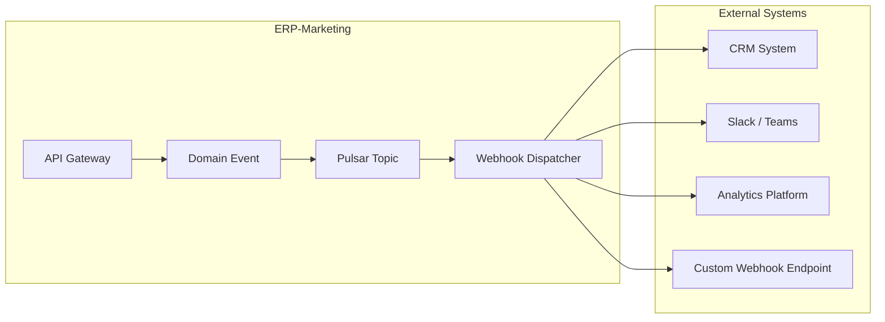
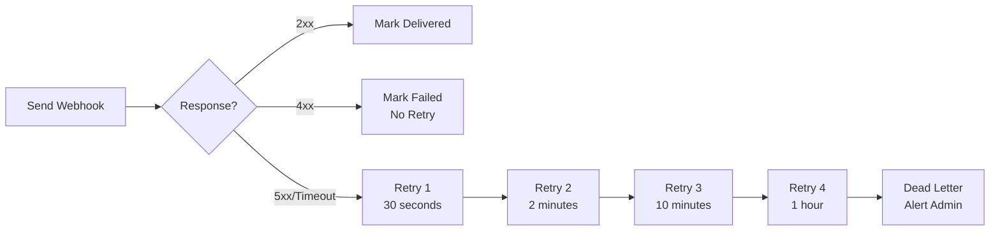

# ERP-Marketing -- Webhook Specifications

## 1. Overview

ERP-Marketing publishes webhooks for key marketing events, enabling external systems to react to changes in real-time. Webhooks follow the CloudEvents 1.0 specification and are delivered via HTTPS POST with retry logic.

## 2. Webhook Architecture



## 3. Webhook Registration

### POST /api/v1/webhooks

Register a new webhook subscription.

```json
{
  "url": "https://hooks.example.com/marketing",
  "events": [
    "erp.marketing.campaign.created",
    "erp.marketing.campaign.sent",
    "erp.marketing.journey.activated",
    "erp.marketing.contact.scored"
  ],
  "secret": "webhook-signing-secret",
  "active": true,
  "description": "CRM sync webhook"
}
```

### GET /api/v1/webhooks

List registered webhooks.

### DELETE /api/v1/webhooks/:id

Deactivate a webhook subscription.

## 4. Webhook Payload Format (CloudEvents)

All webhook payloads follow the CloudEvents 1.0 specification:

```json
{
  "specversion": "1.0",
  "type": "erp.marketing.campaign.sent",
  "source": "/api/v1/campaigns",
  "id": "550e8400-e29b-41d4-a716-446655440000",
  "time": "2026-02-23T10:30:00Z",
  "datacontenttype": "application/json",
  "subject": "campaign/c-1",
  "tenantid": "tenant-001",
  "data": {
    "campaign_id": "c-1",
    "name": "Q2 Enterprise Expansion",
    "channel": "email",
    "recipients": 12000,
    "status": "sent"
  }
}
```

## 5. Supported Event Types

### Campaign Events

| Event Type | Trigger | Data Fields |
|---|---|---|
| `erp.marketing.campaign.created` | Campaign created | campaign_id, name, channel, status |
| `erp.marketing.campaign.updated` | Campaign modified | campaign_id, name, changes |
| `erp.marketing.campaign.sent` | Campaign sent to recipients | campaign_id, name, recipients, channel |
| `erp.marketing.campaign.deleted` | Campaign deleted | campaign_id |

### Journey Events

| Event Type | Trigger | Data Fields |
|---|---|---|
| `erp.marketing.journey.created` | Journey created | journey_id, name, goal |
| `erp.marketing.journey.activated` | Journey activated | journey_id, name, entry_segment, blast_radius |
| `erp.marketing.journey.updated` | Journey modified | journey_id, changes |
| `erp.marketing.journey.deleted` | Journey deleted | journey_id |

### Contact Events

| Event Type | Trigger | Data Fields |
|---|---|---|
| `erp.marketing.contact.created` | Contact created | contact_id, email, lifecycle_stage |
| `erp.marketing.contact.scored` | Lead score updated | contact_id, old_score, new_score, reason |
| `erp.marketing.contact.stage_changed` | Lifecycle stage changed | contact_id, old_stage, new_stage |

### Social Events

| Event Type | Trigger | Data Fields |
|---|---|---|
| `erp.marketing.social.published` | Post published | post_id, channel, title |
| `erp.marketing.social.engagement` | Engagement threshold reached | post_id, channel, engagement_type, count |

### Ads Events

| Event Type | Trigger | Data Fields |
|---|---|---|
| `erp.marketing.ads.launched` | Ad campaign launched | ad_id, network, budget |
| `erp.marketing.ads.budget_alert` | Spend exceeds threshold | ad_id, network, spend, budget, percentage |

### Attribution Events

| Event Type | Trigger | Data Fields |
|---|---|---|
| `erp.marketing.attribution.touchpoint` | New touchpoint recorded | touchpoint_id, contact_id, channel, event_type |
| `erp.marketing.attribution.calculated` | Attribution recalculated | model, channels, total_attributed |

### Guardrail Events

| Event Type | Trigger | Data Fields |
|---|---|---|
| `erp.marketing.guardrail.blocked` | Action blocked by guardrail | entity_type, action, reason, risk_level |
| `erp.marketing.guardrail.needs_review` | Action needs human review | entity_type, action, confidence, approver_required |

## 6. Delivery Specifications

### Retry Policy



| Attempt | Delay | Timeout |
|---|---|---|
| Initial | Immediate | 10 seconds |
| Retry 1 | 30 seconds | 10 seconds |
| Retry 2 | 2 minutes | 10 seconds |
| Retry 3 | 10 minutes | 10 seconds |
| Retry 4 | 1 hour | 10 seconds |
| After 4 retries | Dead letter queue | Admin notification |

### Security

- **Signature Verification**: Each webhook includes an `X-Webhook-Signature` header computed as `HMAC-SHA256(payload, secret)`
- **TLS Required**: Webhook URLs must use HTTPS
- **IP Allowlisting**: Optional source IP restriction

### Headers

```http
POST /webhook-endpoint HTTP/1.1
Content-Type: application/json
X-Webhook-Signature: sha256=<hmac_hex>
X-Webhook-ID: <event_uuid>
X-Webhook-Timestamp: <unix_timestamp>
User-Agent: ERP-Marketing-Webhook/1.0
```

## 7. Verification Example

```python
import hmac
import hashlib

def verify_webhook(payload: bytes, signature: str, secret: str) -> bool:
    expected = hmac.new(
        secret.encode(),
        payload,
        hashlib.sha256
    ).hexdigest()
    return hmac.compare_digest(f"sha256={expected}", signature)
```

## 8. Rate Limits

| Limit | Value |
|---|---|
| Max webhooks per tenant | 50 |
| Max events per webhook | 20 event types |
| Delivery rate | 100 webhooks/second per tenant |
| Payload max size | 256 KB |
