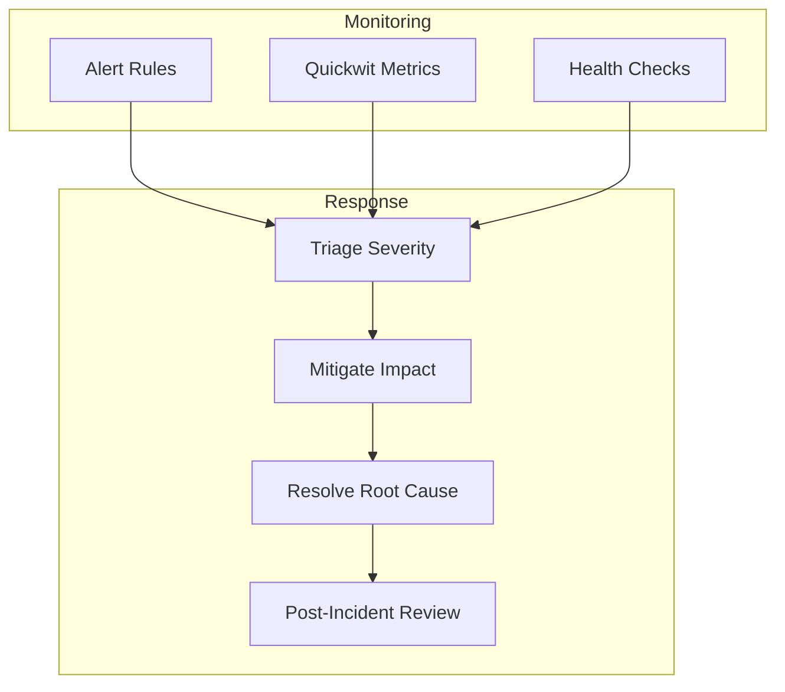

# ERP-Marketing -- Runbooks

## 1. Service Operations Overview



## 2. SLO Baseline

| Metric | Target | Alerting Threshold |
|---|---|---|
| Availability | 99.9% | < 99.5% |
| API p95 latency | < 200ms | > 500ms |
| API error rate | < 0.1% | > 1% |
| Campaign send success rate | > 99% | < 95% |
| Pulsar topic lag | < 1000 messages | > 5000 messages |
| Database connection pool utilization | < 80% | > 90% |
| Error budget | Monthly review | > 50% consumed |

## 3. Runbook: API Gateway Unresponsive

### Symptoms
- Health check returns non-200 or times out
- API error rates spike above 5%
- Frontend shows connection errors

### Diagnosis

```bash
# Check pod status
kubectl get pods -l app=marketing-api -n marketing

# Check pod logs
kubectl logs -l app=marketing-api -n marketing --tail=100

# Check resource usage
kubectl top pods -l app=marketing-api -n marketing

# Test health endpoint directly
kubectl exec -it <pod> -n marketing -- curl localhost:8086/health
```

### Resolution Steps

1. **Pod CrashLoopBackOff**: Check logs for startup errors (database connection, migration failure)
2. **OOMKilled**: Increase memory limits in deployment spec
3. **Database unreachable**: Check PostgreSQL pod health and connection string
4. **Port conflict**: Verify PORT environment variable matches container port

### Rollback

```bash
# Rollback to previous deployment
kubectl rollout undo deployment/marketing-api -n marketing

# Verify rollback
kubectl rollout status deployment/marketing-api -n marketing
```

## 4. Runbook: Database Performance Degradation

### Symptoms
- API p95 latency exceeds 500ms
- Slow query logs in Quickwit show queries > 100ms
- Connection pool exhaustion warnings

### Diagnosis

```bash
# Check active connections
psql -c "SELECT count(*) FROM pg_stat_activity WHERE datname = 'marketing';"

# Check long-running queries
psql -c "SELECT pid, now() - pg_stat_activity.query_start AS duration, query
         FROM pg_stat_activity
         WHERE state = 'active' AND query_start < now() - interval '5 seconds';"

# Check table sizes and index usage
psql -c "SELECT schemaname, tablename, pg_size_pretty(pg_total_relation_size(schemaname||'.'||tablename))
         FROM pg_tables WHERE schemaname = 'public' ORDER BY pg_total_relation_size(schemaname||'.'||tablename) DESC;"
```

### Resolution Steps

1. **Long-running queries**: Terminate with `SELECT pg_terminate_backend(<pid>);`
2. **Missing indexes**: Check explain plans and add missing indexes
3. **Connection exhaustion**: Increase max_connections or optimize connection pooling
4. **Table bloat**: Run `VACUUM ANALYZE` on affected tables

## 5. Runbook: Pulsar Topic Lag Growing

### Symptoms
- Event processing delays
- Dashboard data stale
- Quickwit log ingestion falling behind

### Diagnosis

```bash
# Check topic stats
pulsar-admin topics stats persistent://billyronks/extract-marketing/event

# Check consumer lag
pulsar-admin topics stats-internal persistent://billyronks/extract-marketing/event

# Check DLQ topic
pulsar-admin topics stats persistent://billyronks/extract-marketing/event-DLQ
```

### Resolution Steps

1. **Consumer down**: Restart consumer pods
2. **Slow processing**: Scale consumer replicas
3. **Poison messages**: Check DLQ, fix and replay
4. **Partition imbalance**: Rebalance partition assignments

## 6. Runbook: Campaign Send Failure

### Symptoms
- Campaign stuck in "sending" status
- Low delivery rate in campaign stats
- Email provider error logs

### Diagnosis

```bash
# Check campaign status
curl -H "X-Tenant-ID: tenant-001" localhost:8086/api/v1/campaigns/<id>

# Check email service health
curl localhost:8083/healthz

# Check Pulsar events for campaign
pulsar-admin topics peek-messages persistent://billyronks/extract-marketing/event -n 10
```

### Resolution Steps

1. **SMTP connection failure**: Verify SMTP credentials and connectivity
2. **Rate limiting**: Check email provider rate limits, implement throttling
3. **Template rendering error**: Validate template HTML and dynamic variables
4. **Stuck status**: Manually update campaign status via admin API

## 7. Runbook: AIDD Guardrail False Positives

### Symptoms
- Legitimate actions being blocked
- High volume of "needs_review" decisions for low-risk actions

### Diagnosis

```bash
# Check guardrail event history
curl -H "X-Tenant-ID: tenant-001" localhost:8086/api/v1/audit/guardrails?limit=50

# Review threshold configuration
cat erp/aidd.guardrails.yaml
```

### Resolution Steps

1. **Thresholds too strict**: Adjust min_confidence and max_blast_radius
2. **Confidence scoring inaccurate**: Review scoring model inputs
3. **Blast radius miscalculation**: Verify segment size estimates

## 8. Runbook: Data Sync Job Failure

### Symptoms
- Sync job status stuck on "running"
- High error rate in sync job metrics
- Stale data from external systems

### Diagnosis

```bash
# Check sync job status
curl -H "X-Tenant-ID: tenant-001" localhost:8086/api/v1/data-sync/jobs

# Check external system connectivity
curl -I https://api.salesforce.com/services/data/v59.0
```

### Resolution Steps

1. **Authentication expired**: Refresh OAuth tokens for external system
2. **Schema mismatch**: Update field mappings for changed external schema
3. **Rate limiting**: Reduce batch size or increase sync interval
4. **Network failure**: Check DNS resolution and firewall rules

## 9. Runbook: Quickwit Ingestion Failure

### Symptoms
- Observability search returns stale results
- Audit logs not appearing
- Quickwit ingestion metrics show errors

### Diagnosis

```bash
# Check Quickwit health
curl http://quickwit-searcher:7280/health

# Check index status
curl http://quickwit-searcher:7280/api/v1/indexes/logs-extract-marketing

# Check Pulsar observability topic
pulsar-admin topics stats persistent://billyronks/global/observability
```

### Resolution Steps

1. **Index full**: Check disk space, configure retention policy
2. **Schema mismatch**: Validate log schema against index config
3. **Consumer down**: Restart Quickwit ingestion consumer

## 10. Incident Severity Classification

| Severity | Impact | Response Time | Examples |
|---|---|---|---|
| P1 - Critical | Service down, data loss risk | 15 minutes | API gateway unresponsive, database corruption |
| P2 - Major | Feature degraded, workaround exists | 1 hour | Campaign sends delayed, dashboard stale |
| P3 - Minor | Non-critical feature impacted | 4 hours | Single sync job failing, UI cosmetic issue |
| P4 - Low | Informational, no user impact | Next business day | Log verbosity increase, documentation gap |

## 11. Post-Incident Review Template

```markdown
## Incident: [Title]
**Severity:** P1/P2/P3/P4
**Duration:** Start time - End time
**Impact:** Description of user impact
**Root Cause:** What caused the incident
**Timeline:**
- HH:MM - Alert triggered
- HH:MM - Investigation started
- HH:MM - Root cause identified
- HH:MM - Mitigation applied
- HH:MM - Service restored
**Action Items:**
- [ ] Preventive measure 1
- [ ] Preventive measure 2
- [ ] Monitoring improvement
```
