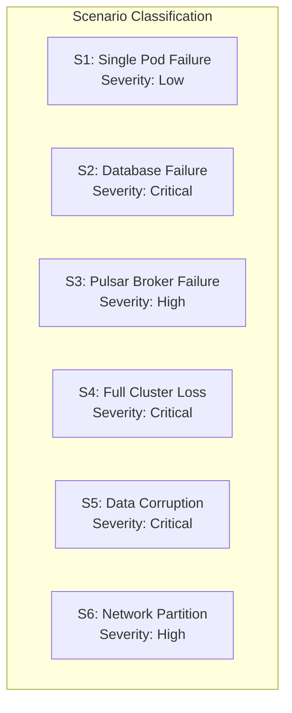
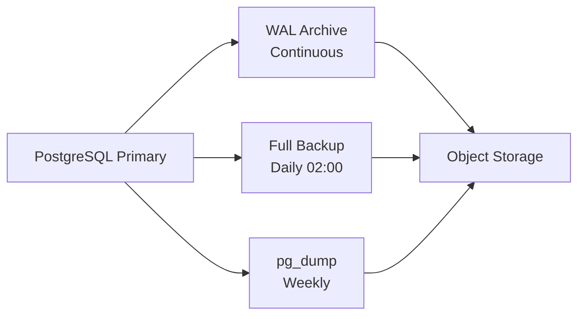
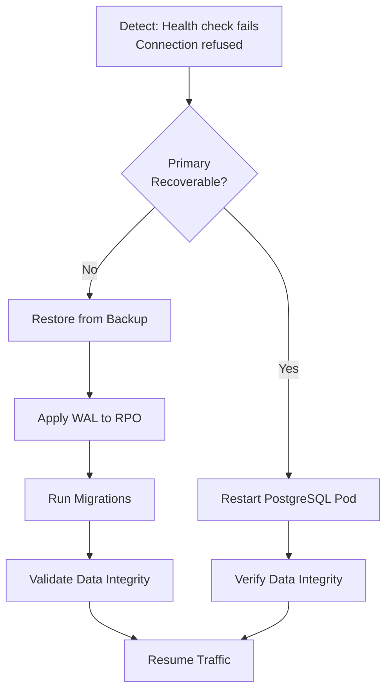
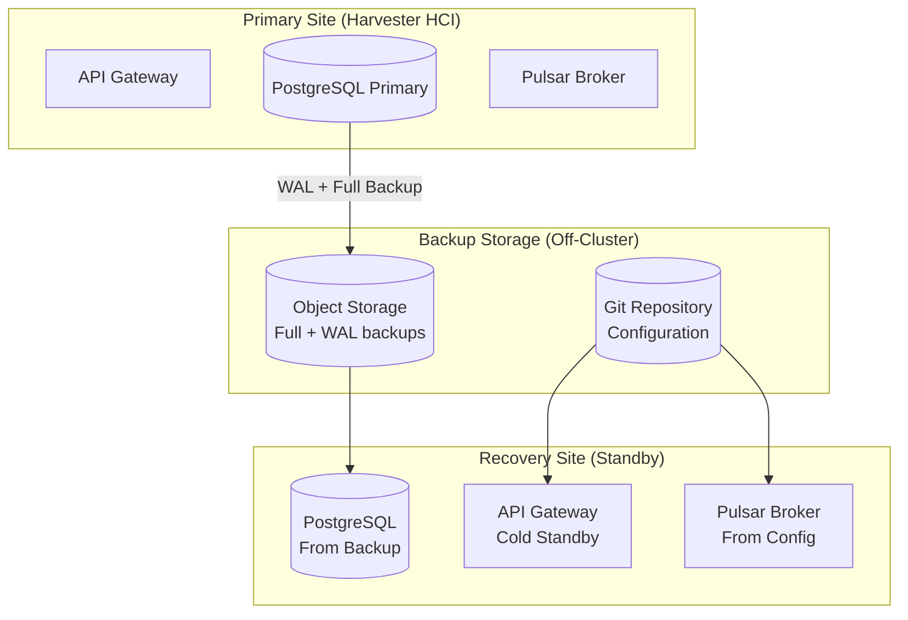

# ERP-Marketing -- Disaster Recovery Plan

## 1. Recovery Objectives

| Metric | Target | Rationale |
|---|---|---|
| Recovery Time Objective (RTO) | < 1 hour | Marketing operations can tolerate brief outages |
| Recovery Point Objective (RPO) | < 15 minutes | Campaign and contact data changes must be preserved |
| Maximum Tolerable Downtime (MTD) | 4 hours | Beyond this, SLA penalties apply |

## 2. Disaster Scenarios

## 3. Backup Strategy

### 3.1 Database Backups

| Backup Type | Frequency | Retention | Storage |
|---|---|---|---|
| Full backup | Daily at 02:00 UTC | 30 days | Off-cluster object storage |
| Incremental WAL | Continuous | 7 days | Off-cluster object storage |
| Logical dump | Weekly | 90 days | Encrypted archive |

### 3.2 Configuration Backups

| Item | Method | Frequency |
|---|---|---|
| Kubernetes manifests | Git repository | Every change |
| Pulsar topic config | `eventing/pulsar/topics.yaml` in Git | Every change |
| Quickwit index config | `observability/quickwit/index-config.yaml` in Git | Every change |
| AIDD guardrails config | `erp/aidd.guardrails.yaml` in Git | Every change |
| Environment variables | Kubernetes Secrets (encrypted) | Every change |

### 3.3 Event Backbone Backup

- Pulsar messages are persisted with configurable retention (default 7 days)
- Audit topic messages have extended retention (90 days)
- Topic configuration is stored in Git

## 4. Recovery Procedures

### 4.1 S1: Single Pod Failure

**Impact:** Momentary request failures, auto-healed by Kubernetes.

**Recovery:**
1. Kubernetes automatically restarts crashed pod
2. Rolling update ensures at least 2 of 3 pods remain available
3. Readiness probe prevents traffic to unhealthy pods
4. **RTO: < 1 minute (automatic)**

### 4.2 S2: Database Failure

**Impact:** All read/write operations fail. Service is unavailable.

**Recovery Procedure:**

1. Detect database failure via health check or connection errors
2. Attempt pod restart: `kubectl delete pod <pg-pod> -n marketing`
3. If restart fails, provision new PostgreSQL instance
4. Restore latest full backup from object storage
5. Apply WAL archives up to the failure point
6. Run `sqlx::migrate!` to verify schema integrity
7. Validate data integrity with spot checks
8. Resume API traffic
9. **RTO: 30-60 minutes**

### 4.3 S3: Pulsar Broker Failure

**Impact:** Async events stop processing. Real-time features degrade. Campaign sends may stall.

**Recovery:**
1. Pulsar messages are persistent; no data loss on broker restart
2. Restart Pulsar broker pods
3. Consumers will resume from last acknowledged position
4. Check DLQ for failed messages during outage
5. **RTO: 15-30 minutes**

### 4.4 S4: Full Cluster Loss

**Impact:** Complete service outage. All components unavailable.

**Recovery:**
1. Provision new Harvester HCI cluster
2. Deploy Kubernetes namespaces and base services
3. Restore PostgreSQL from off-cluster backup
4. Deploy Pulsar and restore topic configuration from Git
5. Deploy Quickwit and rebuild index from Pulsar audit topic
6. Deploy all application pods
7. Verify all health checks pass
8. Restore DNS/load balancer routing
9. **RTO: 2-4 hours**

### 4.5 S5: Data Corruption

**Impact:** Incorrect data served to users. Potential downstream corruption.

**Recovery:**
1. Immediately stop write traffic (scale API to 0 replicas)
2. Identify corruption scope and timestamp
3. Restore database to point-in-time before corruption (using WAL)
4. Identify and replay valid events from Pulsar
5. Validate data integrity
6. Resume traffic
7. **RTO: 1-2 hours**

### 4.6 S6: Network Partition

**Impact:** Some components cannot communicate. Partial functionality.

**Recovery:**
1. Identify partition boundary (which pods cannot reach which services)
2. Check network policies, DNS resolution, and service mesh configuration
3. Resolve network issue
4. Pulsar consumers auto-recover from partition
5. **RTO: 15-30 minutes**

## 5. Communication Plan

| Stakeholder | Notification Method | When |
|---|---|---|
| Engineering On-Call | PagerDuty alert | Immediately |
| Engineering Team | Slack #marketing-incidents | Within 5 minutes |
| Product / Marketing Ops | Email + Slack | Within 15 minutes |
| Customer Success | Email with ETA | Within 30 minutes |
| Executive Team | Email summary | Within 1 hour |

## 6. Testing Schedule

| Test Type | Frequency | Description |
|---|---|---|
| Backup verification | Weekly | Restore backup to test environment and validate |
| Failover drill | Monthly | Simulate pod failure and verify auto-recovery |
| Full DR drill | Quarterly | Simulate cluster loss and execute full recovery |
| Tabletop exercise | Semi-annually | Walk through scenarios with all stakeholders |

## 7. Recovery Validation Checklist

After any recovery procedure:

- [ ] Health endpoint returns 200 on all pods
- [ ] Database connectivity verified (list campaigns, list contacts)
- [ ] Pulsar topics are producing and consuming
- [ ] Quickwit is ingesting new logs
- [ ] AIDD guardrails are functioning (test a supervised action)
- [ ] Frontend loads and displays data
- [ ] No data loss beyond RPO
- [ ] No data corruption detected
- [ ] Monitoring and alerting restored

## 8. DR Architecture

