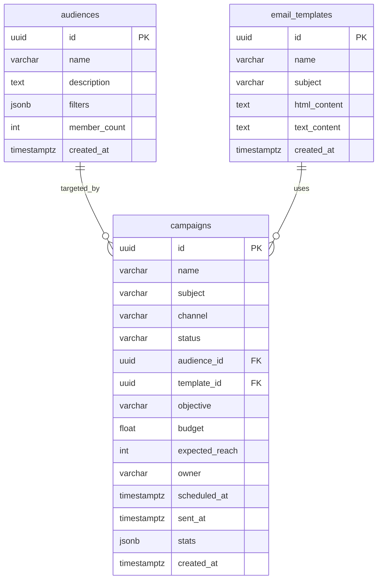
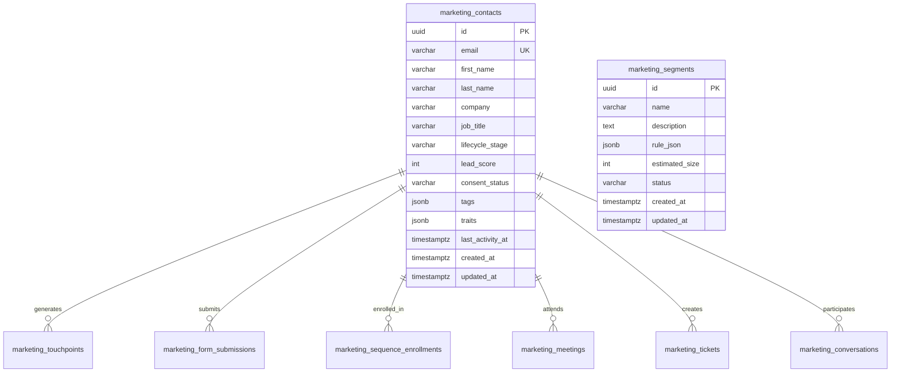
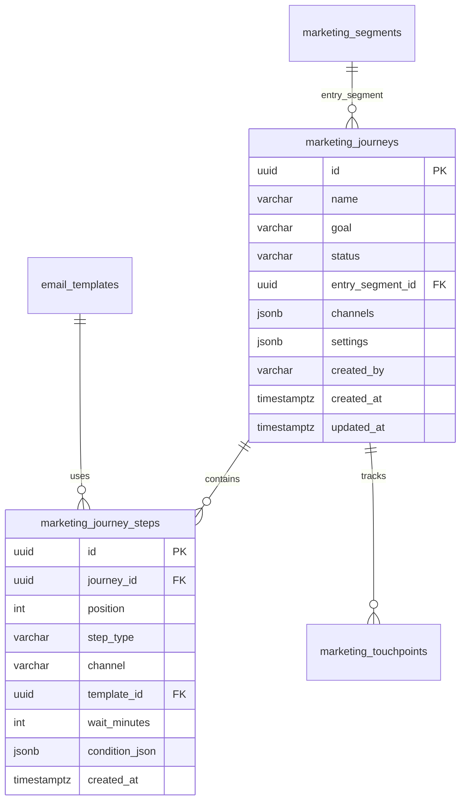
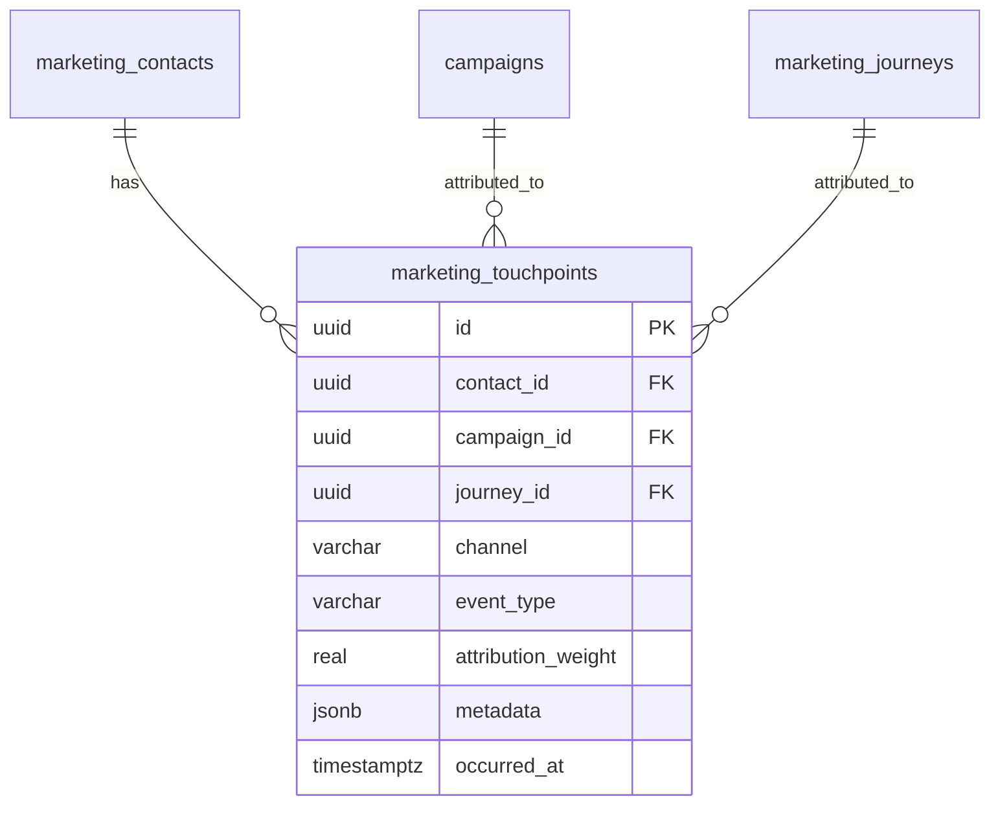
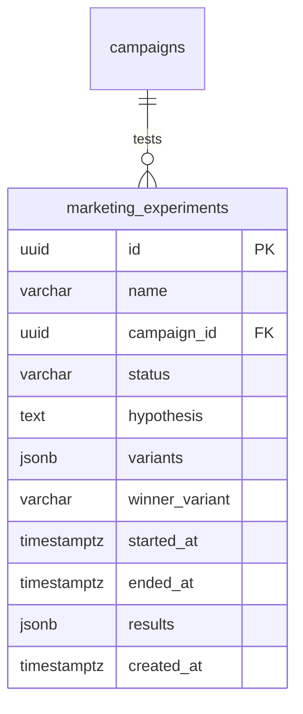
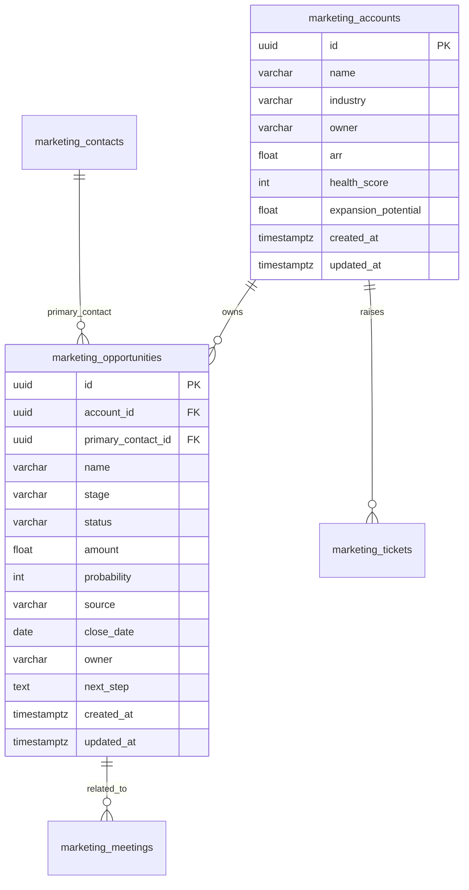
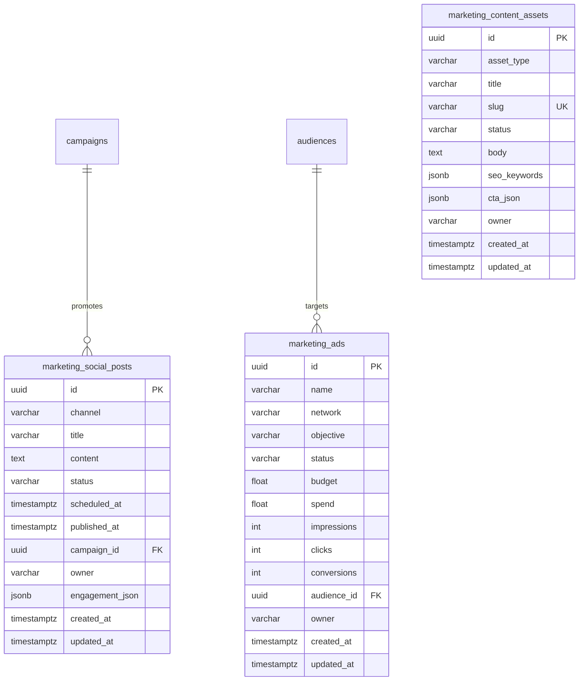
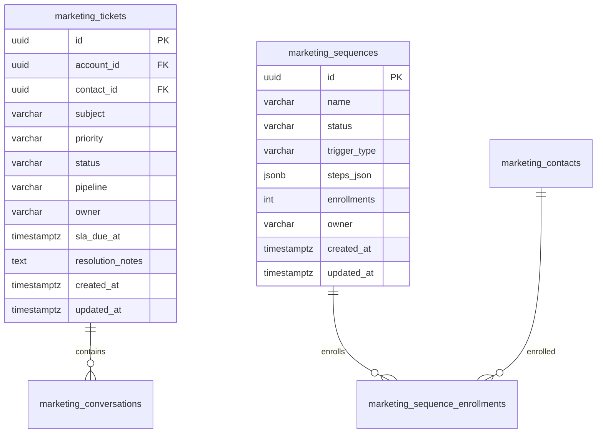
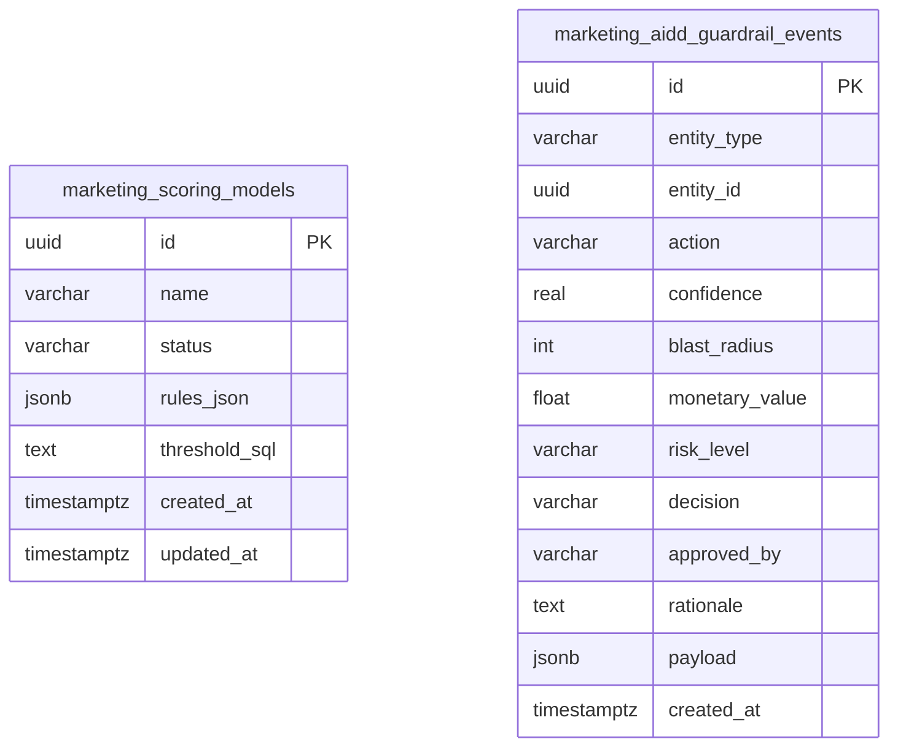

# ERP-Marketing -- Entity Relationship Diagram

## 1. Core Entity Relationships

## 2. Contact and Lifecycle Entities

## 3. Journey and Automation Entities

## 4. Attribution and Touchpoint Entities

## 5. Experimentation Entities

## 6. Account and Pipeline Entities

## 7. Social, Ads, and Content Entities

## 8. Service and Operations Entities

## 9. Governance Entities

## 10. Complete Table Summary

| Table | Records (Seed) | Primary Relationships |
|---|---|---|
| audiences | 2 | campaigns, ads |
| email_templates | 2 | campaigns, journey_steps |
| campaigns | 2 | audiences, templates, touchpoints, experiments, social_posts |
| marketing_contacts | 3 | touchpoints, submissions, enrollments, meetings, tickets |
| marketing_segments | 2 | journeys |
| marketing_journeys | 2 | segments, steps, touchpoints |
| marketing_journey_steps | 3 | journeys, templates |
| marketing_touchpoints | 2 | contacts, campaigns, journeys |
| marketing_forms | 1 | submissions |
| marketing_form_submissions | 0 | forms, contacts |
| marketing_experiments | 1 | campaigns |
| marketing_scoring_models | 1 | standalone |
| marketing_accounts | 2 | opportunities, tickets |
| marketing_opportunities | 2 | accounts, contacts, meetings |
| marketing_tasks | 2 | any entity (polymorphic) |
| marketing_ads | 2 | audiences |
| marketing_social_posts | 2 | campaigns |
| marketing_content_assets | 2 | standalone |
| marketing_sequences | 2 | enrollments |
| marketing_sequence_enrollments | 1 | sequences, contacts |
| marketing_meetings | 2 | contacts, opportunities |
| marketing_tickets | 2 | accounts, contacts, conversations |
| marketing_conversations | 2 | tickets, contacts |
| marketing_knowledge_articles | 2 | standalone |
| marketing_playbooks | 2 | standalone |
| marketing_data_sync_jobs | 2 | standalone |
| marketing_aidd_guardrail_events | 0+ | any entity (polymorphic) |
