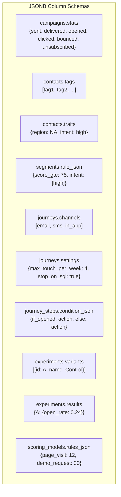

# ERP-Marketing -- Data Dictionary

## 1. Overview

This data dictionary documents all database tables, columns, types, constraints, and relationships in the ERP-Marketing PostgreSQL schema. All tables use UUID primary keys and TIMESTAMPTZ timestamps.

## 2. Core Tables

### 2.1 audiences

| Column | Type | Nullable | Default | Description |
|---|---|---|---|---|
| id | UUID | No | -- | Primary key |
| name | VARCHAR(255) | No | -- | Audience name |
| description | TEXT | Yes | NULL | Description of the audience |
| filters | JSONB | Yes | `'{}'` | Filter criteria for audience membership |
| member_count | INTEGER | Yes | 0 | Estimated number of members |
| created_at | TIMESTAMPTZ | Yes | NOW() | Creation timestamp |

### 2.2 email_templates

| Column | Type | Nullable | Default | Description |
|---|---|---|---|---|
| id | UUID | No | -- | Primary key |
| name | VARCHAR(255) | No | -- | Template name |
| subject | VARCHAR(255) | No | -- | Email subject line |
| html_content | TEXT | No | -- | HTML email body |
| text_content | TEXT | Yes | NULL | Plain text fallback |
| created_at | TIMESTAMPTZ | Yes | NOW() | Creation timestamp |

### 2.3 campaigns

| Column | Type | Nullable | Default | Description |
|---|---|---|---|---|
| id | UUID | No | -- | Primary key |
| name | VARCHAR(255) | No | -- | Campaign name |
| subject | VARCHAR(255) | Yes | NULL | Email subject line |
| channel | VARCHAR(50) | Yes | `'email'` | Channel: email, sms, push, in_app, social |
| status | VARCHAR(50) | Yes | `'draft'` | Lifecycle status |
| audience_id | UUID | Yes | NULL | FK to audiences.id |
| template_id | UUID | Yes | NULL | FK to email_templates.id |
| objective | VARCHAR(100) | Yes | `'conversion'` | Campaign objective |
| budget | DOUBLE PRECISION | Yes | 0 | Budget allocation |
| expected_reach | INTEGER | Yes | 0 | Estimated recipient count |
| owner | VARCHAR(120) | Yes | `'Growth Team'` | Owning team/individual |
| scheduled_at | TIMESTAMPTZ | Yes | NULL | Scheduled send time |
| sent_at | TIMESTAMPTZ | Yes | NULL | Actual send time |
| stats | JSONB | Yes | `'{}'` | Performance metrics JSON |
| created_at | TIMESTAMPTZ | Yes | NOW() | Creation timestamp |

**Indexes:** `idx_campaigns_status (status)`

## 3. Contact and Lifecycle Tables

### 3.1 marketing_contacts

| Column | Type | Nullable | Default | Description |
|---|---|---|---|---|
| id | UUID | No | -- | Primary key |
| email | VARCHAR(255) | No | -- | Contact email (UNIQUE) |
| first_name | VARCHAR(120) | Yes | NULL | First name |
| last_name | VARCHAR(120) | Yes | NULL | Last name |
| company | VARCHAR(180) | Yes | NULL | Company name |
| job_title | VARCHAR(180) | Yes | NULL | Job title |
| lifecycle_stage | VARCHAR(60) | No | `'subscriber'` | Lifecycle stage |
| lead_score | INTEGER | No | 0 | Lead score (0-100) |
| consent_status | VARCHAR(30) | No | `'opt_in'` | Consent: opt_in, opt_out, unsubscribed |
| tags | JSONB | No | `'[]'` | Array of classification tags |
| traits | JSONB | No | `'{}'` | Key-value custom properties |
| last_activity_at | TIMESTAMPTZ | Yes | NULL | Last activity timestamp |
| created_at | TIMESTAMPTZ | No | NOW() | Creation timestamp |
| updated_at | TIMESTAMPTZ | No | NOW() | Last update timestamp |

**Indexes:** `idx_marketing_contacts_score (lead_score DESC)`, `idx_marketing_contacts_stage (lifecycle_stage)`

**Lifecycle Stage Values:** subscriber, lead, mql, sql, opportunity, customer, advocate

### 3.2 marketing_segments

| Column | Type | Nullable | Default | Description |
|---|---|---|---|---|
| id | UUID | No | -- | Primary key |
| name | VARCHAR(150) | No | -- | Segment name |
| description | TEXT | Yes | NULL | Segment description |
| rule_json | JSONB | No | `'{}'` | Dynamic filter rules |
| estimated_size | INTEGER | No | 0 | Estimated contact count |
| status | VARCHAR(30) | No | `'active'` | Status: active, inactive |
| created_at | TIMESTAMPTZ | No | NOW() | Creation timestamp |
| updated_at | TIMESTAMPTZ | No | NOW() | Last update timestamp |

## 4. Journey Tables

### 4.1 marketing_journeys

| Column | Type | Nullable | Default | Description |
|---|---|---|---|---|
| id | UUID | No | -- | Primary key |
| name | VARCHAR(200) | No | -- | Journey name |
| goal | VARCHAR(200) | No | -- | Journey goal description |
| status | VARCHAR(30) | No | `'draft'` | Status: draft, active, paused, archived |
| entry_segment_id | UUID | Yes | NULL | FK to marketing_segments.id |
| channels | JSONB | No | `'[]'` | Supported channels array |
| settings | JSONB | No | `'{}'` | Journey configuration settings |
| created_by | VARCHAR(120) | No | -- | Creator identifier |
| created_at | TIMESTAMPTZ | No | NOW() | Creation timestamp |
| updated_at | TIMESTAMPTZ | No | NOW() | Last update timestamp |

### 4.2 marketing_journey_steps

| Column | Type | Nullable | Default | Description |
|---|---|---|---|---|
| id | UUID | No | -- | Primary key |
| journey_id | UUID | No | -- | FK to marketing_journeys.id (CASCADE) |
| position | INTEGER | No | -- | Step sequence order (UNIQUE per journey) |
| step_type | VARCHAR(80) | No | -- | Type: send_message, wait, branch, escalation |
| channel | VARCHAR(50) | Yes | NULL | Channel for this step |
| template_id | UUID | Yes | NULL | FK to email_templates.id |
| wait_minutes | INTEGER | Yes | NULL | Wait duration in minutes |
| condition_json | JSONB | No | `'{}'` | Branch conditions |
| created_at | TIMESTAMPTZ | No | NOW() | Creation timestamp |

## 5. Attribution Tables

### 5.1 marketing_touchpoints

| Column | Type | Nullable | Default | Description |
|---|---|---|---|---|
| id | UUID | No | -- | Primary key |
| contact_id | UUID | Yes | NULL | FK to marketing_contacts.id |
| campaign_id | UUID | Yes | NULL | FK to campaigns.id |
| journey_id | UUID | Yes | NULL | FK to marketing_journeys.id |
| channel | VARCHAR(60) | No | -- | Channel: email, in_app, sms, paid_search, etc. |
| event_type | VARCHAR(60) | No | -- | Event: open, click, cta_click, page_view, etc. |
| attribution_weight | REAL | No | 0 | Attribution model weight (0.0-1.0) |
| metadata | JSONB | No | `'{}'` | Additional event context |
| occurred_at | TIMESTAMPTZ | No | NOW() | Event timestamp |

**Indexes:** `idx_marketing_touchpoints_contact (contact_id, occurred_at DESC)`, `idx_marketing_touchpoints_campaign (campaign_id, occurred_at DESC)`

## 6. Form Tables

### 6.1 marketing_forms

| Column | Type | Nullable | Default | Description |
|---|---|---|---|---|
| id | UUID | No | -- | Primary key |
| name | VARCHAR(160) | No | -- | Form name |
| slug | VARCHAR(200) | No | -- | URL slug (UNIQUE) |
| status | VARCHAR(30) | No | `'active'` | Status: active, inactive |
| fields | JSONB | No | `'[]'` | Field definitions array |
| success_message | TEXT | Yes | NULL | Post-submission message |
| created_at | TIMESTAMPTZ | No | NOW() | Creation timestamp |

### 6.2 marketing_form_submissions

| Column | Type | Nullable | Default | Description |
|---|---|---|---|---|
| id | UUID | No | -- | Primary key |
| form_id | UUID | No | -- | FK to marketing_forms.id (CASCADE) |
| contact_id | UUID | Yes | NULL | FK to marketing_contacts.id |
| email | VARCHAR(255) | No | -- | Submitted email |
| payload | JSONB | No | `'{}'` | Form field values |
| utm | JSONB | No | `'{}'` | UTM tracking parameters |
| created_at | TIMESTAMPTZ | No | NOW() | Submission timestamp |

## 7. Experimentation Tables

### 7.1 marketing_experiments

| Column | Type | Nullable | Default | Description |
|---|---|---|---|---|
| id | UUID | No | -- | Primary key |
| name | VARCHAR(200) | No | -- | Experiment name |
| campaign_id | UUID | Yes | NULL | FK to campaigns.id |
| status | VARCHAR(30) | No | `'draft'` | Status: draft, running, completed |
| hypothesis | TEXT | No | -- | Test hypothesis statement |
| variants | JSONB | No | `'[]'` | Variant definitions array |
| winner_variant | VARCHAR(120) | Yes | NULL | Winning variant ID |
| started_at | TIMESTAMPTZ | Yes | NULL | Experiment start time |
| ended_at | TIMESTAMPTZ | Yes | NULL | Experiment end time |
| results | JSONB | No | `'{}'` | Per-variant results |
| created_at | TIMESTAMPTZ | No | NOW() | Creation timestamp |

## 8. Account and Pipeline Tables

### 8.1 marketing_accounts

| Column | Type | Nullable | Default | Description |
|---|---|---|---|---|
| id | UUID | No | -- | Primary key |
| name | VARCHAR(200) | No | -- | Account name |
| industry | VARCHAR(120) | Yes | NULL | Industry vertical |
| owner | VARCHAR(120) | No | -- | Account owner |
| arr | DOUBLE PRECISION | No | 0 | Annual recurring revenue |
| health_score | INTEGER | No | 70 | Account health (0-100) |
| expansion_potential | DOUBLE PRECISION | No | 0 | Expansion revenue potential |
| created_at | TIMESTAMPTZ | No | NOW() | Creation timestamp |
| updated_at | TIMESTAMPTZ | No | NOW() | Last update timestamp |

### 8.2 marketing_opportunities

| Column | Type | Nullable | Default | Description |
|---|---|---|---|---|
| id | UUID | No | -- | Primary key |
| account_id | UUID | Yes | NULL | FK to marketing_accounts.id |
| primary_contact_id | UUID | Yes | NULL | FK to marketing_contacts.id |
| name | VARCHAR(220) | No | -- | Opportunity name |
| stage | VARCHAR(60) | No | `'qualification'` | Pipeline stage |
| status | VARCHAR(30) | No | `'open'` | Status: open, won, lost |
| amount | DOUBLE PRECISION | No | 0 | Deal amount |
| probability | INTEGER | No | 10 | Win probability (0-100) |
| source | VARCHAR(80) | No | `'marketing'` | Lead source |
| close_date | DATE | Yes | NULL | Expected close date |
| owner | VARCHAR(120) | No | -- | Deal owner |
| next_step | TEXT | Yes | NULL | Next action description |
| created_at | TIMESTAMPTZ | No | NOW() | Creation timestamp |
| updated_at | TIMESTAMPTZ | No | NOW() | Last update timestamp |

## 9. Governance Tables

### 9.1 marketing_aidd_guardrail_events

| Column | Type | Nullable | Default | Description |
|---|---|---|---|---|
| id | UUID | No | -- | Primary key |
| entity_type | VARCHAR(50) | No | -- | Entity: campaign, journey, contact, ad, etc. |
| entity_id | UUID | Yes | NULL | Entity identifier |
| action | VARCHAR(100) | No | -- | Action attempted |
| confidence | REAL | Yes | NULL | AI confidence score (0.0-1.0) |
| blast_radius | INTEGER | Yes | NULL | Affected contact count |
| monetary_value | DOUBLE PRECISION | Yes | NULL | Financial impact |
| risk_level | VARCHAR(30) | No | -- | Risk: low, medium, high, critical |
| decision | VARCHAR(30) | No | -- | Decision: approved, needs_review, blocked |
| approved_by | VARCHAR(120) | Yes | NULL | Approver identity |
| rationale | TEXT | No | -- | Decision rationale |
| payload | JSONB | No | `'{}'` | Additional context |
| created_at | TIMESTAMPTZ | No | NOW() | Decision timestamp |

**Indexes:** `idx_marketing_guardrail_created (created_at DESC)`

## 10. JSONB Schema Reference

