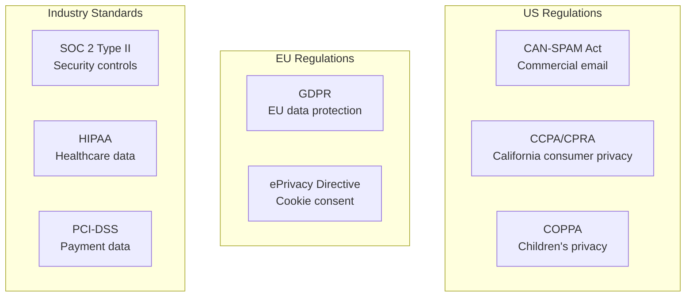
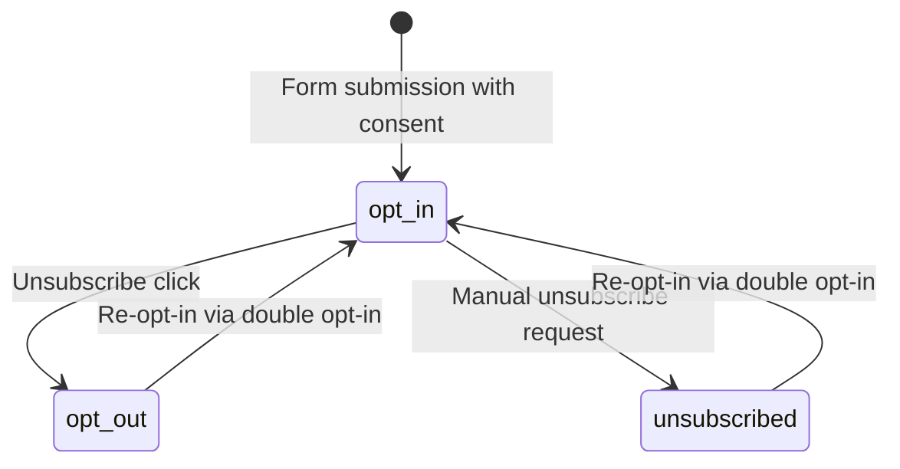
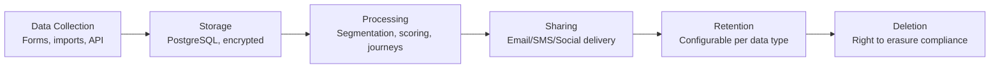
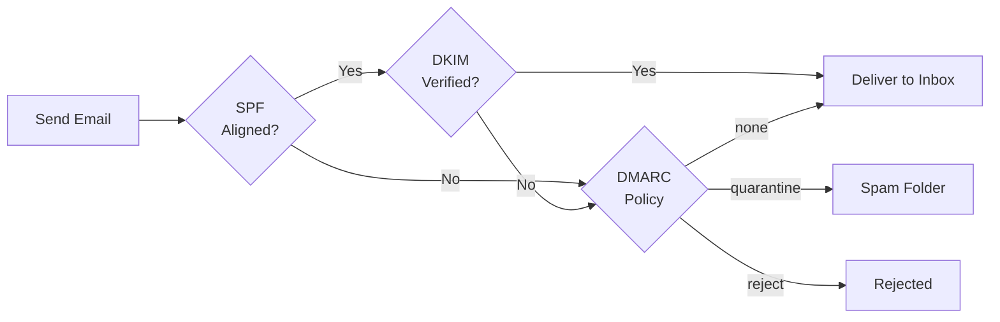
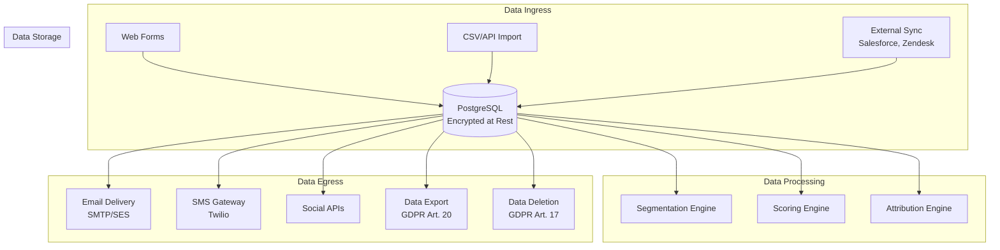

# ERP-Marketing -- Data Privacy and Compliance

## 1. Regulatory Scope

ERP-Marketing processes personal data for marketing automation purposes and must comply with the following regulations:



## 2. CAN-SPAM Compliance

The CAN-SPAM Act of 2003 governs commercial email messages sent to US recipients.

### 2.1 Requirements and Implementation

| CAN-SPAM Requirement | ERP-Marketing Implementation |
|---|---|
| No false or misleading header information | Sender identity verified at campaign creation |
| No deceptive subject lines | Subject line audit in content review workflow |
| Identify message as advertisement | Ad disclosure template block available |
| Physical postal address included | Organization address configurable per tenant |
| Opt-out mechanism in every email | Unsubscribe link auto-injected in all templates |
| Honor opt-out within 10 business days | Immediate consent_status update to 'opt_out' |
| Monitor third-party email compliance | Guardrail prevents sending to opt_out contacts |

### 2.2 Consent Status Tracking



The `marketing_contacts.consent_status` field tracks consent state:
- `opt_in`: Contact has actively consented to receive marketing communications
- `opt_out`: Contact has opted out via unsubscribe link
- `unsubscribed`: Contact has been manually unsubscribed

**Enforcement**: The campaign send pipeline checks consent_status before delivery. Contacts with `opt_out` or `unsubscribed` status are automatically excluded from all sends.

## 3. GDPR Compliance

The General Data Protection Regulation governs processing of personal data for EU residents.

### 3.1 Lawful Basis

| Processing Activity | Lawful Basis | GDPR Article |
|---|---|---|
| Email marketing to prospects | Consent (opt-in) | Art. 6(1)(a) |
| Customer communication | Legitimate interest | Art. 6(1)(f) |
| Analytics and attribution | Legitimate interest | Art. 6(1)(f) |
| Lead scoring | Legitimate interest with DPIA | Art. 6(1)(f) |
| Automated decision-making | Consent with human review | Art. 22 |

### 3.2 Data Subject Rights

| Right | GDPR Article | Implementation |
|---|---|---|
| Right of access | Art. 15 | Contact profile export via API |
| Right to rectification | Art. 16 | Contact edit via API or UI |
| Right to erasure | Art. 17 | Contact deletion with cascade |
| Right to restrict processing | Art. 18 | Consent status to opt_out |
| Right to data portability | Art. 20 | JSON/CSV export of contact data |
| Right to object | Art. 21 | Unsubscribe + opt-out mechanism |
| Right re: automated decisions | Art. 22 | AIDD guardrails enforce human review |

### 3.3 Data Processing Records (Art. 30)



| Data Category | Purpose | Retention | Legal Basis |
|---|---|---|---|
| Contact PII (email, name) | Marketing communication | Active +2 years | Consent |
| Behavioral data (opens, clicks) | Analytics, attribution | 3 years rolling | Legitimate interest |
| Form submissions | Lead capture | Active +5 years | Consent |
| Campaign performance | Reporting | Indefinite (aggregated) | Legitimate interest |
| AIDD guardrail events | Audit trail | 7 years | Legal obligation |

### 3.4 Consent Management

- **Double opt-in**: Configurable requirement for new contacts
- **Granular consent**: Per-channel consent tracking (email, SMS, push)
- **Consent receipts**: Timestamped records of consent events
- **Withdrawal**: One-click unsubscribe updates consent immediately
- **Cookie consent**: ePrivacy-compliant cookie banner for web tracking

### 3.5 Data Protection Impact Assessment (DPIA)

Required for:
- Automated lead scoring affecting contact lifecycle stage
- Large-scale profiling for segmentation
- Cross-channel behavioral tracking

The AIDD guardrail framework serves as a technical measure for Art. 22 compliance, ensuring that automated decisions with significant effects require human review.

## 4. CCPA/CPRA Compliance

The California Consumer Privacy Act (CCPA) and California Privacy Rights Act (CPRA) govern personal information of California residents.

### 4.1 Consumer Rights

| Right | Implementation |
|---|---|
| Right to know | Contact data export endpoint |
| Right to delete | Cascade deletion of contact and associated data |
| Right to opt-out of sale | Data sale tracking (N/A -- self-hosted, no data selling) |
| Right to non-discrimination | No service degradation for privacy exercisers |
| Right to correct | Contact profile edit API |
| Right to limit sensitive data use | Sensitive field classification and access controls |

### 4.2 Data Categories

| Category | Examples | Collected | Sold | Purpose |
|---|---|---|---|---|
| Identifiers | Email, name | Yes | No | Marketing communication |
| Commercial info | Company, job title | Yes | No | Segmentation |
| Internet activity | Page views, email opens | Yes | No | Attribution, scoring |
| Geolocation | Region (from traits) | Yes | No | Segment targeting |
| Professional info | Job title, company | Yes | No | Firmographic scoring |

## 5. Email Authentication

### 5.1 DKIM (DomainKeys Identified Mail)

DKIM signing ensures email integrity and sender authentication. Configuration:
- 2048-bit RSA key pairs per sending domain
- Selector rotation every 6 months
- Key published in DNS TXT record

### 5.2 SPF (Sender Policy Framework)

SPF records authorize sending IP addresses:
```
v=spf1 include:_spf.marketing.yourcompany.com ~all
```

### 5.3 DMARC (Domain-based Message Authentication)

DMARC policy alignment:
```
v=DMARC1; p=quarantine; rua=mailto:dmarc-reports@yourcompany.com; pct=100
```



## 6. Audit Trail

All privacy-relevant actions are logged to the `marketing_aidd_guardrail_events` table and the Pulsar audit topic:

| Event | Logged Data | Retention |
|---|---|---|
| Contact created | Source, consent method, timestamp | 7 years |
| Consent changed | Old status, new status, method | 7 years |
| Data accessed | Accessor, purpose, fields accessed | 7 years |
| Data exported | Requester, format, timestamp | 7 years |
| Data deleted | Requester, scope, confirmation | 7 years |
| Campaign sent | Recipients (count, not PII), channel | 7 years |
| AIDD decision | Full guardrail event | 7 years |

## 7. Data Flow Diagram



## 8. Compliance Checklist

- [ ] Privacy policy published and linked in all marketing communications
- [ ] Cookie consent banner implemented on tracked web properties
- [ ] Double opt-in configured for all new contact sources
- [ ] Unsubscribe link present in every marketing email
- [ ] Data retention policies configured per data category
- [ ] DKIM/SPF/DMARC configured for all sending domains
- [ ] Data export endpoint tested and validated
- [ ] Data deletion endpoint tested with cascade verification
- [ ] AIDD guardrails active for automated decision-making
- [ ] Audit trail retention set to minimum 7 years
- [ ] Incident response plan documented for data breaches
- [ ] DPIA completed for lead scoring and profiling activities
- [ ] Staff training on data privacy responsibilities
