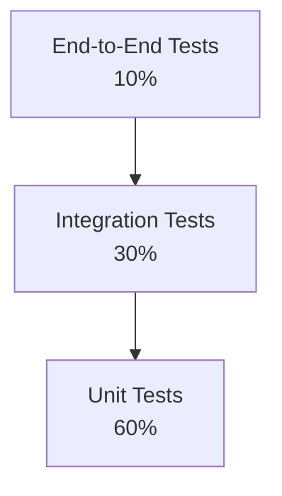
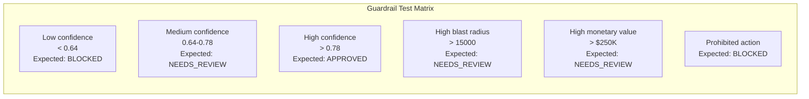
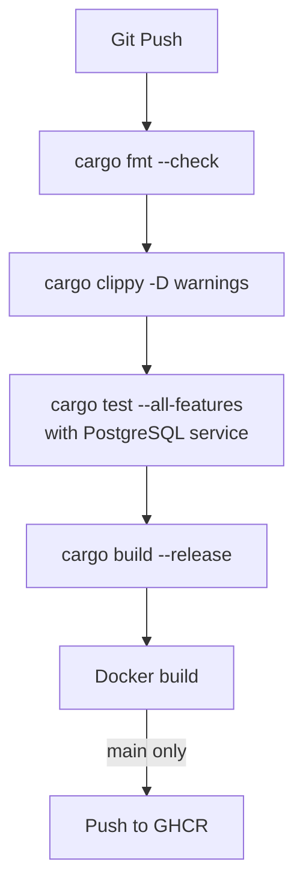

# ERP-Marketing -- Test Strategy

## 1. Testing Philosophy

ERP-Marketing employs a multi-layered testing strategy aligned with the test pyramid. Given the system's role in automating high-impact marketing actions with AIDD guardrails, testing focuses on correctness of domain logic, API contract stability, guardrail decision accuracy, and end-to-end workflow integrity.

## 2. Test Pyramid



| Layer | Scope | Runner | Target Coverage |
|---|---|---|---|
| Unit | Domain aggregates, value objects, event handlers, transformations | `cargo test`, `vitest` | 80% line coverage |
| Integration | API endpoints, database queries, service interactions | `cargo test` with PostgreSQL | All endpoints |
| End-to-End | Full workflow: campaign create -> launch -> send -> report | Playwright or Cypress | Critical paths |

## 3. Unit Testing

### 3.1 Rust Domain Tests

Location: `src/domain/aggregates/*.rs` (`#[cfg(test)]` modules)

**Existing test:**
```rust
#[test]
fn test_campaign() {
    let mut c = Campaign::create("Welcome Series", CampaignType::Email);
    c.set_content("Welcome!", "Hello and welcome...");
    c.send().unwrap();
    assert_eq!(c.status(), &CampaignStatus::Sending);
}
```

**Required test cases for Campaign aggregate:**

| Test Case | Assertion |
|---|---|
| Create campaign with defaults | Status is Draft, stats are zero |
| Set content | Subject and content are updated |
| Schedule with content | Status transitions to Scheduled |
| Schedule without content | Returns CampaignError::NoContent |
| Send with content | Status transitions to Sending |
| Send without content | Returns CampaignError::NoContent |
| Complete with stats | Status is Sent, stats recorded, event raised |
| Cancel | Status is Cancelled |
| Take events | Events are drained and returned |

**Required test cases for Automation aggregate:**

| Test Case | Assertion |
|---|---|
| Create automation | Status is Draft, no steps |
| Add step | Step is appended |
| Activate | Status is Active |
| Pause | Status is Paused |
| Multiple steps | Steps maintain insertion order |

### 3.2 Frontend Tests

Location: `web/src/**/*.test.tsx`

**Runner:** Vitest with React Testing Library

**Test areas:**
- Component rendering: Dashboard, Campaign list, Contact list
- API client functions: Type transformations (snake_case to camelCase)
- Form validation: Required fields, email format
- AIDD guardrail modal: Decision display and approval flow

### 3.3 Type Transformation Tests

```typescript
// Test snake_case to camelCase transformation
test('toCampaign transforms raw data correctly', () => {
  const raw = {
    id: 'c-1',
    name: 'Test',
    expected_reach: 5000,
    created_at: '2026-02-23T10:00:00Z'
  };
  const result = toCampaign(raw);
  expect(result.expectedReach).toBe(5000);
  expect(result.createdAt).toBe('2026-02-23T10:00:00Z');
});
```

## 4. Integration Testing

### 4.1 API Endpoint Tests

**Setup:** PostgreSQL service container in CI (see `workflows/ci.yml`)

| Endpoint | Test Cases |
|---|---|
| GET /health | Returns 200 with healthy status |
| POST /api/v1/campaigns | Creates campaign, returns 201, verifies DB record |
| GET /api/v1/campaigns | Returns list ordered by created_at DESC |
| GET /api/v1/campaigns/:id | Returns campaign by ID, 404 for missing |
| POST /api/v1/campaigns/:id/send | Updates status to sent |
| POST /api/v1/audiences | Creates audience with filters |
| POST /api/v1/templates | Creates template with HTML content |

### 4.2 Database Integration Tests

| Test Case | Assertion |
|---|---|
| Migration applies cleanly | All tables and indexes created |
| Foreign key constraints | Campaign with invalid audience_id fails |
| Unique constraints | Duplicate email on contacts fails |
| JSONB queries | Filter by JSON field values works |
| Index effectiveness | Explain plans show index usage |

### 4.3 Go Service Integration Tests

| Service | Test Cases |
|---|---|
| Campaign Service | List, Create, Read, Update, Delete with tenant validation |
| Journey Service | List, Create, Read, Update, Delete with tenant validation |
| All Services | Missing X-Tenant-ID returns 400 |
| All Services | Health check returns 200 |

## 5. AIDD Guardrail Testing

The AIDD guardrail system requires specific testing for decision accuracy:



| Test Case | Confidence | Blast Radius | Monetary | Expected Decision |
|---|---|---|---|---|
| Low confidence campaign | 0.50 | 1000 | $10,000 | BLOCKED |
| Medium confidence, small blast | 0.70 | 500 | $5,000 | NEEDS_REVIEW |
| High confidence, small blast | 0.85 | 1000 | $10,000 | APPROVED |
| High confidence, large blast | 0.90 | 20,000 | $50,000 | NEEDS_REVIEW |
| High confidence, high value | 0.95 | 1000 | $300,000 | NEEDS_REVIEW |
| Cross-tenant access | Any | Any | Any | BLOCKED |
| Irreversible delete | Any | Any | Any | BLOCKED |

## 6. Performance Testing

### 6.1 Benchmark Tests

**Runner:** Criterion (Rust benchmarking framework)

| Benchmark | Target |
|---|---|
| Campaign creation (API) | < 10ms p95 |
| Campaign list (100 records) | < 50ms p95 |
| Contact scoring | < 5ms p95 |
| Segment evaluation (1000 contacts) | < 100ms p95 |
| Dashboard summary aggregation | < 200ms p95 |
| Attribution calculation | < 150ms p95 |

### 6.2 Load Testing

| Scenario | Target |
|---|---|
| 100 concurrent dashboard requests | < 2s p95 response |
| 500 concurrent API requests | < 500ms p95 response |
| 10,000 contact bulk import | < 30s total |
| 100,000 email campaign send | < 1 hour completion |

## 7. Security Testing

| Test Type | Tool | Frequency |
|---|---|---|
| Dependency vulnerability scan | `cargo audit`, `npm audit` | Every CI run |
| SQL injection | sqlx compile-time verification + parameterized queries | Every CI run |
| XSS prevention | React auto-escaping + Content Security Policy | Manual + CI |
| Auth bypass | API tests without token | Every CI run |
| Tenant isolation | Cross-tenant API tests | Every CI run |

## 8. Test Data Management

### 8.1 Seed Data

The migrations include realistic seed data for local development and testing:
- 3 contacts with different lifecycle stages
- 2 segments with dynamic rules
- 2 journeys with steps
- 2 campaigns with different statuses
- 1 experiment in running state
- 2 accounts with opportunities
- 2 ads across different networks
- 2 social posts (scheduled and draft)
- 2 content assets (landing page and blog post)

### 8.2 Test Isolation

- Each integration test uses a fresh database transaction that is rolled back
- CI uses a dedicated `crm_test` database
- Seed data uses deterministic UUIDs for predictable test assertions

## 9. CI Pipeline Test Flow



## 10. Quality Gates

All PRs must pass these gates before merge:

| Gate | Tool | Threshold |
|---|---|---|
| Code formatting | `cargo fmt -- --check` | Zero diffs |
| Lint warnings | `cargo clippy -- -D warnings` | Zero warnings |
| Unit tests | `cargo test --all-features` | All passing |
| TypeScript types | `tsc --noEmit` | Zero errors |
| Frontend lint | `eslint .` | Zero errors |
| Frontend tests | `vitest run` | All passing |
| Dependency audit | `cargo audit` | No critical vulnerabilities |
