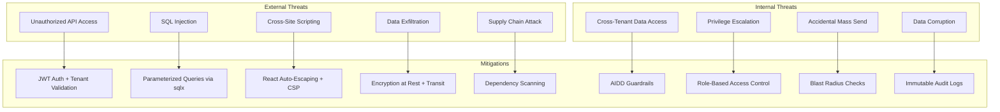
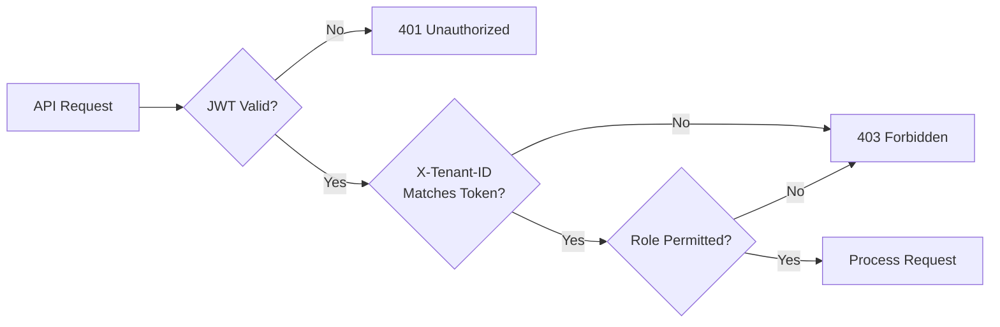
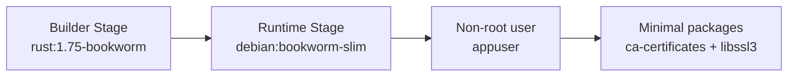

# ERP-Marketing -- Security Documentation

## 1. Security Overview

ERP-Marketing handles sensitive marketing data including personal information (contact records), financial data (budgets, deal amounts, ARR), and behavioral data (engagement metrics, touchpoints). This document describes the security controls, threat model, and operational security practices.

## 2. Threat Model



## 3. Authentication and Authorization

### 3.1 Authentication

- **Protocol**: OAuth 2.0 / OpenID Connect via ERP-IAM
- **Token Format**: JWT (JSON Web Token) with RS256 signing
- **Token Lifetime**: Access token: 1 hour; Refresh token: 24 hours
- **MFA**: Required for admin-level accounts

### 3.2 Authorization



### 3.3 Role-Based Access Control

| Role | Campaigns | Journeys | Contacts | Settings | AIDD Config |
|---|---|---|---|---|---|
| Viewer | Read | Read | Read | None | None |
| Marketer | CRUD | CRUD | Read | None | None |
| Campaign Manager | CRUD + Launch | CRUD + Activate | CRUD | Read | None |
| Admin | Full | Full | Full | Full | Full |

## 4. Data Protection

### 4.1 Encryption

| Layer | Standard | Implementation |
|---|---|---|
| In Transit | TLS 1.3 | Nginx/envoy TLS termination at ingress |
| At Rest (Database) | AES-256 | PostgreSQL tablespace encryption |
| At Rest (Storage) | AES-256 | Mayastor/Vitastor volume encryption |
| At Rest (Backups) | AES-256 | Encrypted backup archives |
| Secrets | N/A | Environment variables; never in source |

### 4.2 Secret Management

Secrets are managed through Kubernetes Secrets (encrypted at rest via etcd encryption) and environment variables. The following secrets are required:

| Secret | Purpose | Rotation |
|---|---|---|
| DATABASE_URL | PostgreSQL connection string | On credential rotation |
| AUTH_TOKEN | ERP-IAM service token | Every 90 days |
| HASURA_ADMIN_SECRET | GraphQL admin access | Every 90 days |
| SMTP credentials | Email delivery authentication | Every 90 days |
| Social API keys | Platform OAuth tokens | Per platform policy |
| Ad network API keys | Ad platform access | Per platform policy |
| Webhook signing secret | Webhook payload signing | Every 180 days |

### 4.3 PII Protection

| Field | Classification | Protection |
|---|---|---|
| email | PII | Unique index, deletion cascade |
| first_name, last_name | PII | Encrypted at rest |
| company, job_title | Business PII | Encrypted at rest |
| lead_score | Derived PII | AIDD guardrail on changes |
| lifecycle_stage | Derived PII | Audit trail on changes |
| traits, tags | Potentially PII | JSONB with access controls |

## 5. Application Security

### 5.1 SQL Injection Prevention

All database queries use sqlx parameterized queries with compile-time verification:

```rust
// Safe: parameterized query
sqlx::query_as::<_, Campaign>("SELECT * FROM campaigns WHERE id = $1")
    .bind(id)
    .fetch_optional(&s.db)
    .await
```

The sqlx `query_as!` macro verifies SQL at compile time, preventing syntactically invalid or type-mismatched queries.

### 5.2 Cross-Site Scripting (XSS) Prevention

- React auto-escapes all rendered content by default
- Content Security Policy (CSP) headers restrict inline scripts
- User-generated HTML content (email templates) is sanitized before storage

### 5.3 Cross-Origin Resource Sharing (CORS)

```rust
.layer(CorsLayer::permissive())  // Development only
// Production: configured per environment
```

Production CORS configuration restricts allowed origins to the frontend domain.

### 5.4 Input Validation

- Request body deserialization via serde rejects malformed JSON
- UUID parameters are validated by axum's `Path<Uuid>` extractor
- String length constraints enforced by database VARCHAR limits
- JSONB input validated at application layer before persistence

## 6. Tenant Isolation

### 6.1 Multi-Tenant Security

Every API request requires the `X-Tenant-ID` header. Go microservices validate tenant ID as the first operation in every handler:

```go
if r.Header.Get("X-Tenant-ID") == "" {
    writeJSON(w, http.StatusBadRequest, map[string]string{
        "error": "missing X-Tenant-ID",
    })
    return
}
```

### 6.2 Cross-Tenant Access Prevention

Cross-tenant data access is classified as a **prohibited action** in the AIDD guardrail framework:

```yaml
prohibited_actions:
  - cross_tenant_data_access
  - irreversible_delete_without_backup
  - privilege_escalation
```

Any attempt to access data across tenants is blocked and logged.

## 7. AIDD Security Controls

The AIDD guardrail framework provides security-relevant controls:

| Control | Description |
|---|---|
| Decision logging | All guardrail evaluations are persisted with full context |
| Human-in-the-loop | High-risk actions require named human approver |
| Rollback window | 24-hour rollback window for supervised actions |
| Blast radius limits | Configurable maximum affected contacts per action |
| Monetary limits | Configurable maximum financial commitment per action |
| Prohibited actions | Hard-blocked actions that cannot be overridden |

## 8. Audit Logging

### 8.1 Audit Events

All security-relevant events are logged to:
1. The `marketing_aidd_guardrail_events` database table
2. The Apache Pulsar audit topic (`persistent://billyronks/extract-marketing/audit`)
3. The Quickwit observability index for searchable audit trail

### 8.2 Log Schema

```json
{
  "timestamp": "2026-02-23T10:30:00Z",
  "level": "INFO",
  "service": "marketing-api",
  "trace_id": "abc-123",
  "span_id": "def-456",
  "tenant_id": "tenant-001",
  "message": "Campaign launched",
  "attrs": {
    "campaign_id": "uuid",
    "decision": "approved",
    "confidence": 0.85,
    "approved_by": "user@company.com"
  }
}
```

### 8.3 Audit Retention

- Guardrail events: 7 years minimum
- Security logs: 7 years minimum
- Access logs: 90 days
- Performance logs: 30 days

## 9. Supply Chain Security

### 9.1 Dependency Management

| Language | Audit Tool | CI Integration |
|---|---|---|
| Rust | `cargo audit` | GitHub Actions |
| Go | `govulncheck` | GitHub Actions |
| JavaScript | `npm audit` | GitHub Actions |

### 9.2 Container Security

- Multi-stage Docker builds minimize attack surface
- Runtime image: `debian:bookworm-slim` (minimal base)
- Non-root user execution (`appuser`)
- No shell access (`/bin/false`)
- Package manager cleaned after install



## 10. Vulnerability Reporting

### 10.1 Reporting Process

Report suspected vulnerabilities privately to the maintainers with:
- Impact summary
- Reproduction steps
- Affected version/commit

Do not disclose publicly until remediation guidance is available.

### 10.2 Response SLA

| Severity | Response Time | Fix Target |
|---|---|---|
| Critical | 4 hours | 24 hours |
| High | 24 hours | 7 days |
| Medium | 72 hours | 30 days |
| Low | 7 days | Next release |

## 11. Security Checklist

- [ ] JWT validation on all authenticated endpoints
- [ ] X-Tenant-ID validation on all data endpoints
- [ ] Parameterized SQL queries (no string concatenation)
- [ ] CORS restricted to frontend domain in production
- [ ] TLS 1.3 on all external connections
- [ ] Database encrypted at rest
- [ ] Secrets in environment variables (never in source)
- [ ] Non-root container execution
- [ ] Dependency vulnerability scanning in CI
- [ ] AIDD guardrails active for high-impact actions
- [ ] Audit logs for all security-relevant events
- [ ] Backup encryption for off-cluster storage
- [ ] Network policies restricting pod-to-pod communication
