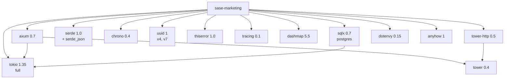
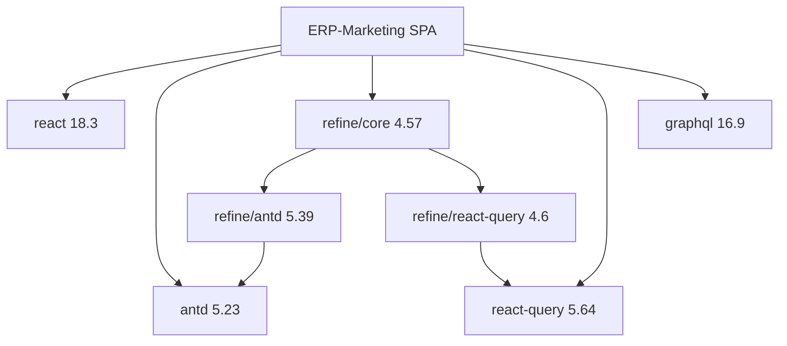
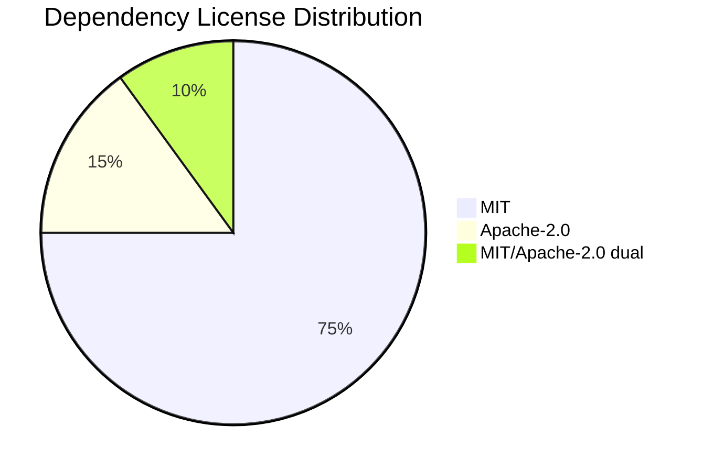

# ERP-Marketing -- Dependency Manifest

## 1. Overview

This document catalogs all direct and significant transitive dependencies across the ERP-Marketing technology stack, including Rust backend, Go microservices, and React frontend.

## 2. Rust Backend Dependencies

Source: `/Users/AbiolaOgunsakin1/ERP/ERP-Marketing/Cargo.toml`

### 2.1 Direct Dependencies

| Crate | Version | License | Purpose |
|---|---|---|---|
| tokio | 1.35 (full) | MIT | Async runtime with work-stealing scheduler |
| async-trait | 0.1 | MIT/Apache-2.0 | Async trait support for Rust |
| serde | 1.0 (derive) | MIT/Apache-2.0 | Serialization/deserialization framework |
| serde_json | 1.0 | MIT/Apache-2.0 | JSON serialization |
| chrono | 0.4 (serde) | MIT/Apache-2.0 | Date/time handling |
| uuid | 1 (v4, serde) | MIT/Apache-2.0 | UUID generation and parsing |
| thiserror | 1.0 | MIT/Apache-2.0 | Derive macro for Error trait |
| tracing | 0.1 | MIT | Structured logging and tracing |
| dashmap | 5.5 | MIT | Concurrent hash map |

### 2.2 Inferred Dependencies (from main.rs usage)

| Crate | Version | License | Purpose |
|---|---|---|---|
| axum | 0.7.x | MIT | Web framework (HTTP routing, extractors) |
| sqlx | 0.7.x (postgres) | MIT/Apache-2.0 | Async database driver with compile-time SQL |
| tower-http | 0.5.x | MIT | HTTP middleware (CORS, tracing) |
| tracing-subscriber | 0.3.x | MIT | Tracing layer configuration |
| dotenvy | 0.15.x | MIT | .env file loading |
| anyhow | 1.x | MIT/Apache-2.0 | Error handling with context |

### 2.3 Dependency Graph

## 3. Go Microservice Dependencies

Source: Nine services under `/Users/AbiolaOgunsakin1/ERP/ERP-Marketing/services/`

### 3.1 Standard Library Only

All Go microservices use only the Go standard library:

| Package | Purpose |
|---|---|
| `encoding/json` | JSON serialization/deserialization |
| `log` | Structured logging |
| `net/http` | HTTP server and routing |
| `os` | Environment variable access |
| `strings` | URL path parsing |

No external Go dependencies are required. This is a deliberate design decision to minimize supply chain risk and deployment complexity.

## 4. Frontend Dependencies

Source: `/Users/AbiolaOgunsakin1/ERP/ERP-Marketing/web/package.json`

### 4.1 Production Dependencies

| Package | Version | License | Purpose |
|---|---|---|---|
| @refinedev/antd | ^5.39.2 | MIT | Ant Design integration for Refine |
| @refinedev/core | ^4.57.10 | MIT | Refine data-provider framework core |
| @refinedev/react-query | ^4.6.0 | MIT | React Query integration for Refine |
| @tanstack/react-query | ^5.64.2 | MIT | Async state management |
| antd | ^5.23.0 | MIT | Ant Design component library |
| graphql | ^16.9.0 | MIT | GraphQL query parsing |
| react | ^18.3.1 | MIT | UI component library |
| react-dom | ^18.3.1 | MIT | React DOM renderer |

### 4.2 Development Dependencies

| Package | Version | License | Purpose |
|---|---|---|---|
| @graphql-codegen/cli | ^5.0.3 | MIT | GraphQL code generation CLI |
| @graphql-codegen/typescript | ^4.1.2 | MIT | TypeScript type generation |
| @graphql-codegen/typescript-operations | ^4.4.0 | MIT | TypeScript operation generation |
| @testing-library/jest-dom | ^6.6.3 | MIT | DOM testing matchers |
| @testing-library/react | ^16.1.0 | MIT | React component testing utilities |
| @types/react | ^18.3.17 | MIT | React TypeScript type definitions |
| @types/react-dom | ^18.3.5 | MIT | React DOM TypeScript types |
| @vitejs/plugin-react | ^4.3.4 | MIT | Vite React plugin |
| eslint | ^9.17.0 | MIT | JavaScript/TypeScript linter |
| eslint-plugin-react-hooks | ^5.1.0 | MIT | React hooks linting rules |
| prettier | ^3.4.2 | MIT | Code formatter |
| typescript | ^5.7.2 | Apache-2.0 | TypeScript compiler |
| vite | ^6.0.5 | MIT | Build tool and dev server |
| vitest | ^2.1.8 | MIT | Test runner |

### 4.3 Frontend Dependency Graph

## 5. Infrastructure Dependencies

### 5.1 Container Base Images

| Image | Version | Purpose |
|---|---|---|
| rust | 1.75-bookworm | Rust build environment |
| debian | bookworm-slim | Runtime base image |
| postgres | 16-alpine | Database |
| nats | 2.10-alpine | Message broker (dev) |

### 5.2 Kubernetes Infrastructure

| Component | Version | Purpose |
|---|---|---|
| Apache Pulsar | 3.x | Production event backbone |
| Quickwit | 0.8+ | Log search and indexing |
| Mayastor/Vitastor | Latest | Block storage |
| Harvester HCI | Latest | Bare-metal Kubernetes |

## 6. Development Tools

| Tool | Version | Purpose |
|---|---|---|
| cargo-fmt | Bundled | Rust code formatting |
| cargo-clippy | Bundled | Rust linting |
| cargo-audit | Latest | Dependency vulnerability scanning |
| Docker Buildx | v3 | Multi-platform Docker builds |

## 7. License Summary

| License | Count | Commercial Use | Copyleft |
|---|---|---|---|
| MIT | 75% | Yes | No |
| Apache-2.0 | 15% | Yes | No |
| MIT/Apache-2.0 | 10% | Yes | No |

All dependencies are permissively licensed with no copyleft obligations. The ERP-Marketing module itself is licensed under Apache License 2.0.

## 8. Vulnerability Monitoring

### 8.1 Automated Scanning

| Ecosystem | Tool | Schedule |
|---|---|---|
| Rust | `cargo audit` | Every CI run |
| Go | `govulncheck` (planned) | Every CI run |
| JavaScript | `npm audit` | Every CI run |
| Docker | Trivy / Snyk (planned) | Weekly |

### 8.2 Update Policy

| Severity | Response Time |
|---|---|
| Critical (CVSS >= 9.0) | Patch within 24 hours |
| High (CVSS 7.0-8.9) | Patch within 7 days |
| Medium (CVSS 4.0-6.9) | Patch within 30 days |
| Low (CVSS < 4.0) | Next scheduled update |

## 9. Version Pinning Strategy

- **Rust**: Semantic versioning with caret ranges (e.g., `"1.35"` allows minor updates)
- **Go**: Standard library only; version controlled by Go toolchain
- **JavaScript**: Caret ranges for all packages (e.g., `"^5.23.0"`)
- **Docker**: Specific tags for base images (e.g., `rust:1.75-bookworm`)

## 10. Supply Chain Security Measures

1. All dependencies sourced from official registries (crates.io, npm, pkg.go.dev)
2. Lock files committed to source control (`Cargo.lock`, `package-lock.json`)
3. Dependency audits run in CI on every push
4. Docker base images pinned to specific versions
5. GitHub Actions uses pinned action versions (`@v4`, `@v3`)
6. No private registries or custom package sources required
