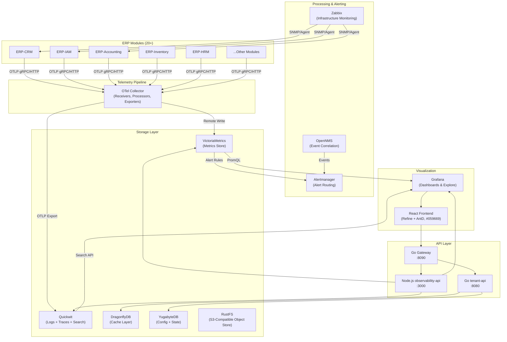
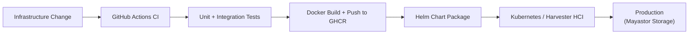

# ERP-Observability Technical Writeup

## Executive Summary

ERP-Observability is an enterprise-grade unified observability platform within the OpenSASE ERP suite, providing a single pane of glass for metrics, logs, traces, alerts, and infrastructure monitoring across all 20+ ERP modules. The platform consolidates VictoriaMetrics (metrics), Quickwit (logs, traces, and full-text search), Grafana (visualization), OpenTelemetry Collector (telemetry pipeline), Alertmanager (alert routing), Zabbix (infrastructure monitoring), and OpenNMS (event correlation) into a cohesive, multi-tenant observability stack. Built with a Go gateway (port 8090), Node.js observability-api (port 3000), and Go tenant-api (port 8080), the platform delivers sub-100ms query latencies at 1M+ metrics/sec ingestion rates while maintaining strict tenant isolation through X-Scope-OrgID header propagation. The React + Refine.dev frontend with an emerald green theme (#059669) provides SREs, DevOps engineers, and platform administrators with intuitive dashboards, metric exploration, log search, trace analysis, and alert management.

## Architecture Overview

The system follows an OTel-native pipeline architecture where all ERP modules emit telemetry via OpenTelemetry SDKs, which flows through the OTel Collector for processing, routing, and enrichment before being stored in purpose-built backends -- VictoriaMetrics for metrics, Quickwit for logs and traces. Grafana serves as the unified visualization layer, while Zabbix and OpenNMS provide complementary infrastructure and event correlation capabilities.

## Technology Stack

| Layer | Technology | Version | Rationale |
|-------|-----------|---------|-----------|
| Metrics Store | VictoriaMetrics | latest | AIDD-compliant Prometheus alternative, 10x compression, PromQL-compatible |
| Log/Trace Store | Quickwit | latest | AIDD-compliant Elasticsearch alternative, sub-second search, columnar storage |
| Visualization | Grafana | latest | Industry-standard dashboards, native VM + Quickwit datasources |
| Telemetry Pipeline | OpenTelemetry Collector | latest | Vendor-neutral, unified metrics/logs/traces collection |
| Alert Routing | Alertmanager | latest | Alert deduplication, grouping, routing, silencing |
| Infrastructure Monitoring | Zabbix | latest | Agent-based host monitoring, SNMP, IPMI, network discovery |
| Event Correlation | OpenNMS | latest | Cross-module event correlation, topology awareness |
| Cache | DragonflyDB | latest | AIDD-compliant Redis alternative, multi-threaded, lower latency |
| Database | YugabyteDB | latest | AIDD-compliant PostgreSQL alternative, distributed SQL |
| Object Storage | RustFS | latest | S3-compatible, self-hosted object storage for long-term retention |
| API Gateway | Go (net/http) | 1.21+ | High-performance routing, middleware, tenant extraction |
| Observability API | Node.js (Express) | 18+ | Rapid API development, GraphQL integration |
| Tenant API | Go (net/http) | 1.21+ | Tenant lifecycle, provisioning, configuration |
| Web Frontend | React + Refine.dev + Ant Design | latest | Rapid admin panel, rich component library, green theme |
| Infrastructure | Kubernetes (Harvester HCI) | latest | Mayastor/Vitastor-compatible storage classes |

## Key Technical Decisions

1. **VictoriaMetrics over Prometheus**: VictoriaMetrics provides 10x better compression, horizontal scalability via cluster mode, long-term storage without Thanos/Cortex, and full PromQL compatibility. Single-binary deployment reduces operational complexity. AIDD-mandated: no Prometheus in production stack.

2. **Quickwit over Elasticsearch/ELK**: Quickwit delivers sub-second log search with 80% less storage through columnar compression, native OTLP ingestion for traces, and S3-compatible storage backend (RustFS). AIDD-mandated: no Elasticsearch in production stack.

3. **DragonflyDB over Redis**: DragonflyDB provides Redis-compatible API with multi-threaded architecture, achieving 25x throughput improvement on multi-core systems. Zero code changes required for migration. AIDD-mandated: no Redis in production stack.

4. **YugabyteDB over PostgreSQL**: YugabyteDB provides PostgreSQL wire-compatible distributed SQL with automatic sharding, high availability, and geo-distribution. AIDD-mandated: no standalone PostgreSQL in production stack.

5. **OTel-native pipeline**: All telemetry flows through OpenTelemetry Collector, providing vendor-neutral instrumentation, protocol translation (OTLP, Prometheus, Jaeger, Zipkin), and processing capabilities (batching, filtering, sampling, attribute enrichment).

6. **Unified search via Quickwit**: Logs, traces, and audit events all stored in Quickwit, enabling cross-signal correlation through a single search interface. Eliminates the need for separate log and trace backends.

7. **Zabbix + OpenNMS integration**: Zabbix provides deep infrastructure monitoring (CPU, memory, disk, network, processes) while OpenNMS adds event correlation and topology-aware root cause analysis. Both feed alerts into the unified Alertmanager pipeline.

## Performance Characteristics

- **Metric ingestion**: 1M+ data points per second sustained (VictoriaMetrics cluster mode)
- **Log ingestion**: 500K+ log lines per second (Quickwit with batched OTLP)
- **Metric query (PromQL)**: < 100ms p99 for 1-hour range, < 500ms for 24-hour range
- **Log search**: < 200ms p99 for keyword search across 100TB dataset
- **Trace lookup**: < 50ms p99 for trace-by-ID retrieval
- **Alert evaluation**: < 10s evaluation interval for 10K+ alert rules
- **Dashboard load**: < 2s for complex dashboards with 20+ panels
- **Storage efficiency**: 10x compression ratio (VictoriaMetrics), 80% storage reduction (Quickwit vs. Elasticsearch)
- **Availability target**: 99.95% with error budget monthly review
- **Heuristic risk score**: 20 (low) per Phase 2 deep audit

## Security Model

- JWT authentication via ERP-IAM (OIDC provider)
- `X-Scope-OrgID` header for multi-tenant metric and log isolation
- `X-Tenant-ID` header required for all API endpoints
- Grafana organization-per-tenant for dashboard isolation
- VictoriaMetrics cluster-level tenant isolation via vmauth proxy
- Quickwit index-per-tenant for log and trace isolation
- Role-based access control: Viewer, Editor, Admin per tenant
- Non-root container execution for all components
- TLS encryption for all inter-service communication
- Audit logging of all configuration changes to Quickwit immutable index

## Deployment Model

The system deploys on Kubernetes (Harvester HCI) with Mayastor-compatible storage classes. All components are containerized and orchestrated via Helm charts with rollback-safe deployment strategies.

## Integration Points

| Integration | Protocol | Direction | Description |
|-------------|----------|-----------|-------------|
| ERP-IAM | OIDC/JWT | Inbound | Authentication and authorization |
| ERP-Platform | REST/Events | Bidirectional | Tenant provisioning, licensing |
| All ERP Modules | OTLP gRPC/HTTP | Inbound | Telemetry ingestion |
| VictoriaMetrics | PromQL/Remote Write | Internal | Metric storage and query |
| Quickwit | OTLP/REST | Internal | Log and trace storage and search |
| Grafana | HTTP API | Internal | Dashboard management and rendering |
| Alertmanager | HTTP API | Internal | Alert routing and notification |
| Zabbix | Zabbix Protocol/SNMP | Internal | Infrastructure monitoring |
| OpenNMS | REST/Events | Internal | Event correlation |
| DragonflyDB | Redis Protocol | Internal | Caching layer |
| YugabyteDB | PostgreSQL Wire | Internal | Configuration and state storage |
| RustFS | S3 API | Internal | Long-term data retention |
| Apache Pulsar | Native Client | Outbound | Observability event streaming |
| NATS JetStream | Native Client | Bidirectional | Real-time alert notifications |

## Compliance

The module is mapped to SOC2 (CC6/CC7/CC8), HIPAA (164.312), and PCI-DSS (7/8/10) controls through immutable audit indexes in Quickwit, centralized log retention policies, tenant-isolated access controls, and Git-tracked compliance artifacts. All observability data is retained per configurable policies (default 30 days for metrics, 90 days for logs, 7 days for traces) with long-term archival to RustFS S3 storage.
