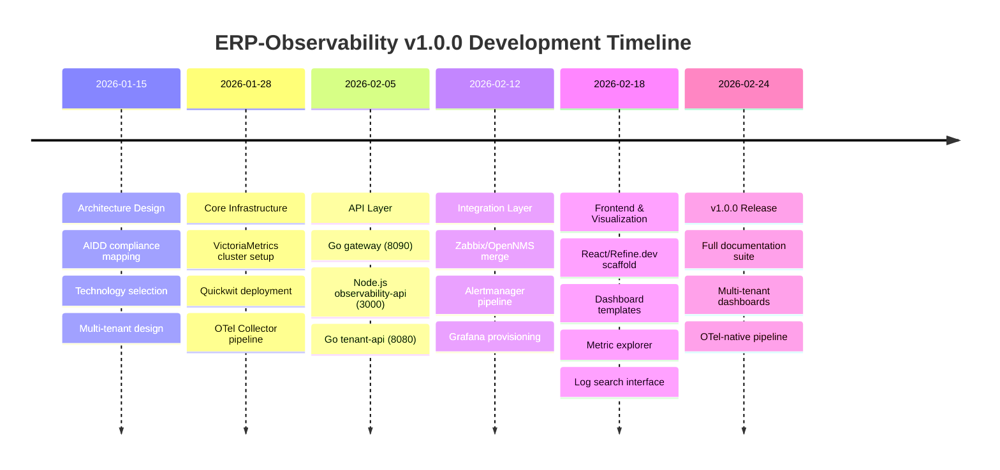

# ERP-Observability Release Notes

## Version 1.0.0 -- Initial Release (2026-02-24)

### Overview

ERP-Observability v1.0.0 is the inaugural release of the unified observability platform for the OpenSASE ERP suite. This release consolidates metrics monitoring (VictoriaMetrics), log and trace management (Quickwit), infrastructure monitoring (Zabbix), event correlation (OpenNMS), and visualization (Grafana) into a single, multi-tenant platform providing a single pane of glass for all 20+ ERP modules.

### Highlights

### New Features

#### VictoriaMetrics Integration
- Full PromQL-compatible metrics engine replacing Prometheus
- Cluster mode deployment with vmstorage, vminsert, and vmselect components
- Remote write receiver for OTel Collector metric export
- Multi-tenant isolation via X-Scope-OrgID header and vmauth proxy
- 10x compression ratio compared to Prometheus TSDB
- Long-term storage with configurable retention (default 30 days, configurable up to 5 years)
- Downsampling for efficient long-range queries
- VictoriaMetrics Operator for Kubernetes-native management
- PrometheusRule-compatible alert rule evaluation via vmalert
- Recording rules for pre-computed aggregations

#### Quickwit Unified Search
- Sub-second full-text search across all ERP module logs
- Native OTLP ingestion for traces and logs
- Columnar storage with 80% compression vs. Elasticsearch
- Per-tenant index isolation with configurable retention
- S3-compatible backend via RustFS for cost-effective long-term storage
- Structured log schema with tenant_id, service, trace_id, span_id fields
- Tantivy-based search engine with BM25 relevance scoring
- Aggregation support for log analytics (count, avg, percentiles, histograms)
- Trace search and waterfall visualization data
- Cross-module log correlation via trace context propagation

#### OpenTelemetry Native Pipeline
- OTel Collector as the single telemetry ingestion point
- OTLP gRPC (4317) and HTTP (4318) receivers
- Prometheus receiver for scraping legacy endpoints
- Batch processor with configurable timeout and send batch size
- Memory limiter processor for backpressure handling
- Attributes processor for tenant_id injection and enrichment
- Filter processor for dropping noisy/debug telemetry
- Resource processor for standardized resource attributes
- Tail sampling processor for intelligent trace sampling
- Multiple exporters: VictoriaMetrics (remote write), Quickwit (OTLP), Alertmanager

#### Multi-Tenant Dashboards
- Grafana organization-per-tenant provisioning
- Pre-built dashboard templates for all ERP modules
- Module health overview with RED metrics (Rate, Error, Duration)
- SLO status board with burn rate calculations
- Infrastructure overview with Zabbix integration
- Custom dashboard creation with row-level tenant isolation
- Dashboard-as-code via Grafana provisioning API
- Annotation support for deployment markers and incidents
- Variable-driven dashboards for dynamic filtering

#### Zabbix Infrastructure Monitoring
- Agent-based host monitoring (CPU, memory, disk, network, processes)
- SNMP monitoring for network devices
- IPMI monitoring for bare-metal servers
- Auto-discovery of new hosts and services
- Custom template library for ERP-specific monitoring
- Low-level discovery for dynamic resource monitoring
- Trigger-based alerting integrated with Alertmanager
- Host groups organized by ERP module and environment
- Zabbix proxy support for distributed monitoring

#### OpenNMS Event Correlation
- Event-driven monitoring with topology awareness
- Cross-module event correlation for root cause analysis
- Service polling for availability monitoring
- Threshold-based event generation
- Alarm lifecycle management (acknowledge, escalate, clear)
- Integration with Alertmanager for unified alert routing
- Network topology discovery and visualization
- Event forwarding to Quickwit for long-term analysis

#### Alert Management
- Alertmanager-based alert routing with multi-channel support
- Alert rule management via vmalert (PromQL-based)
- Alert grouping, deduplication, and silencing
- Notification channels: email, Slack, webhook, PagerDuty, OpsGenie
- Alert history and timeline stored in Quickwit
- Escalation policies with configurable timeouts
- Maintenance window scheduling
- Alert correlation with Zabbix triggers and OpenNMS alarms

#### Refine.dev Frontend
- React + Refine.dev + Ant Design frontend with emerald green theme (#059669)
- Main monitoring dashboard with KPI cards and real-time metrics
- Metric explorer with PromQL query editor and time series graphs
- Log search interface with structured field filtering
- Trace list and waterfall view
- Alert rules management and timeline
- Tenant administration panel
- Zabbix host overview integration
- OpenNMS event console integration
- Responsive design for desktop and laptop viewports
- Dark mode support

### Technical Improvements

#### Architecture
- Microservice architecture with Go gateway, Node.js API, and Go tenant API
- OTel-native telemetry pipeline with vendor-neutral instrumentation
- Multi-tenant isolation at every layer (API, storage, visualization)
- Event-driven alert processing with Alertmanager

#### Performance
- 1M+ metrics/sec ingestion via VictoriaMetrics cluster
- < 100ms p99 PromQL query latency for 1-hour ranges
- < 200ms p99 log search across 100TB datasets
- DragonflyDB caching for frequently accessed dashboards and queries

#### Infrastructure
- Docker Compose for local development (all services)
- Kubernetes Helm charts for production deployment
- GitHub Actions CI/CD with automated testing
- Multi-stage Docker builds for minimal production images

#### Observability (self-monitoring)
- Self-monitoring pipeline: OTel Collector monitors itself via internal metrics
- Grafana health dashboard for all observability components
- Alertmanager dead man's switch for pipeline health
- Quickwit index health monitoring

### API Endpoints

| Endpoint | Methods | Description |
|----------|---------|-------------|
| `/health` | GET | Gateway health check |
| `/ready` | GET | Readiness probe with backend connectivity |
| `/api/v1/metrics/query` | GET, POST | PromQL instant query proxy |
| `/api/v1/metrics/query_range` | GET, POST | PromQL range query proxy |
| `/api/v1/metrics/series` | GET | Metric series metadata |
| `/api/v1/metrics/labels` | GET | Label names |
| `/api/v1/metrics/label/:name/values` | GET | Label values |
| `/api/v1/logs/search` | GET, POST | Quickwit log search |
| `/api/v1/logs/tail` | WebSocket | Real-time log tailing |
| `/api/v1/traces/search` | GET, POST | Trace search |
| `/api/v1/traces/:traceId` | GET | Get trace by ID |
| `/api/v1/alerts/rules` | GET, POST, PUT, DELETE | Alert rule CRUD |
| `/api/v1/alerts/active` | GET | Active alerts |
| `/api/v1/alerts/history` | GET | Alert history |
| `/api/v1/alerts/silences` | GET, POST, DELETE | Silence management |
| `/api/v1/dashboards` | GET, POST, PUT, DELETE | Dashboard CRUD |
| `/api/v1/tenants` | GET, POST, PUT, DELETE | Tenant management |
| `/api/v1/tenants/:id/provision` | POST | Provision tenant observability stack |
| `/api/v1/infrastructure/hosts` | GET | Zabbix host list |
| `/api/v1/infrastructure/hosts/:id` | GET | Zabbix host details |
| `/api/v1/infrastructure/triggers` | GET | Active Zabbix triggers |
| `/api/v1/events` | GET | OpenNMS event list |
| `/api/v1/events/correlate` | POST | Cross-module event correlation |

### Known Limitations

1. Grafana embedded panels require iframe allowlisting in CSP headers
2. Quickwit trace search limited to 10,000 spans per query
3. Zabbix agent auto-registration requires manual template assignment for custom modules
4. OpenNMS topology discovery limited to SNMP-enabled devices
5. Real-time log tailing WebSocket limited to 1,000 lines/sec per connection
6. Dashboard-as-code provisioning does not support folder-level permissions yet

### Breaking Changes

None (initial release).

### Upgrade Instructions

Not applicable (initial release). See `20-Local-Environment-Setup.md` for installation instructions.

### Contributors

- OpenSASE Platform Team
