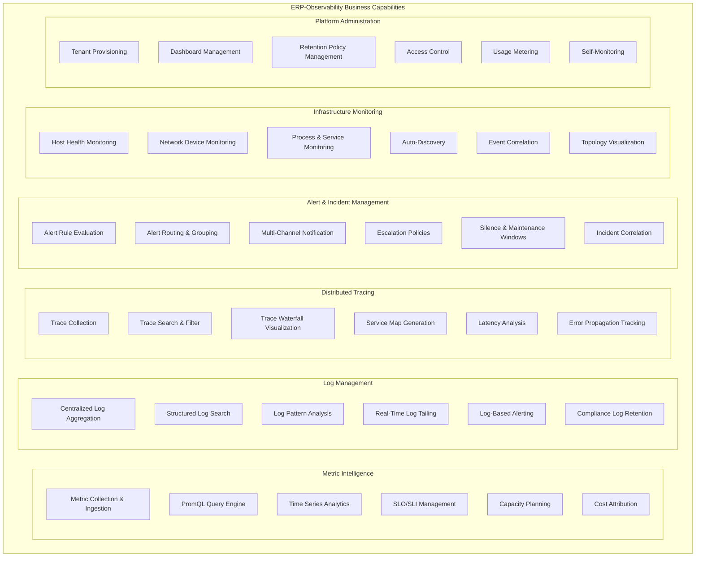
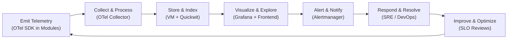
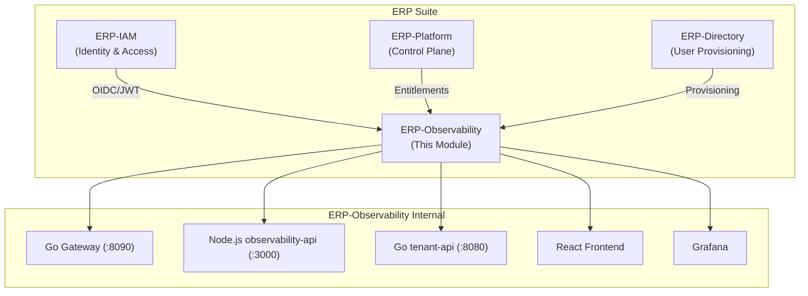
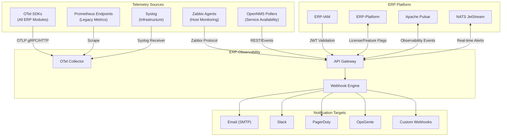
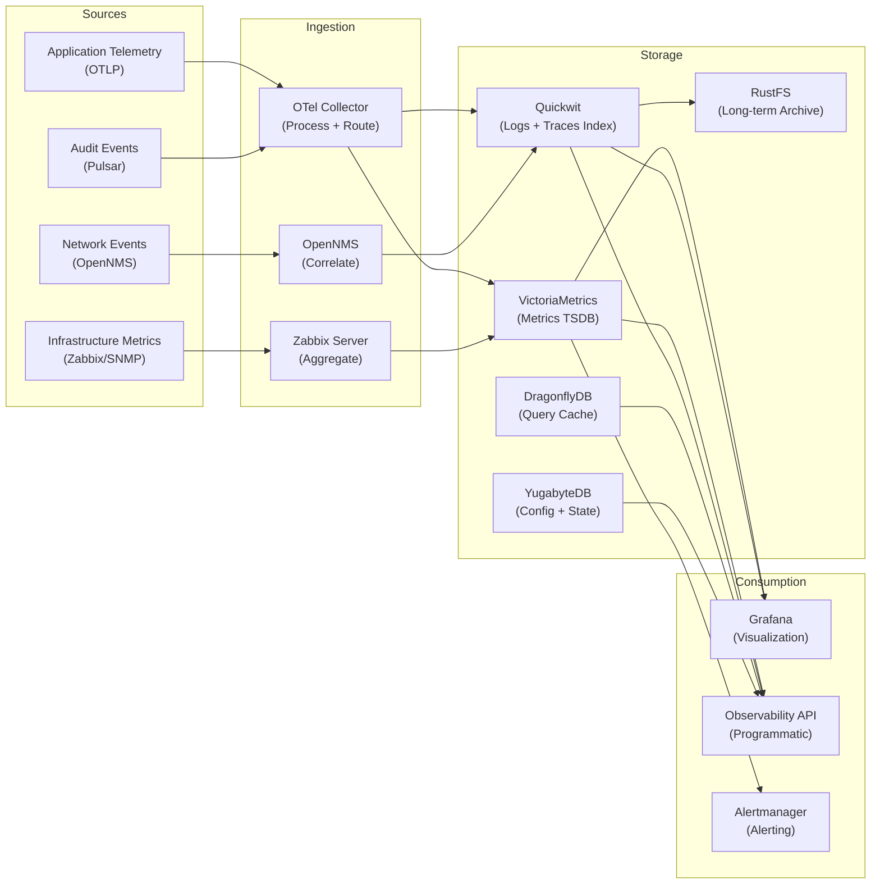
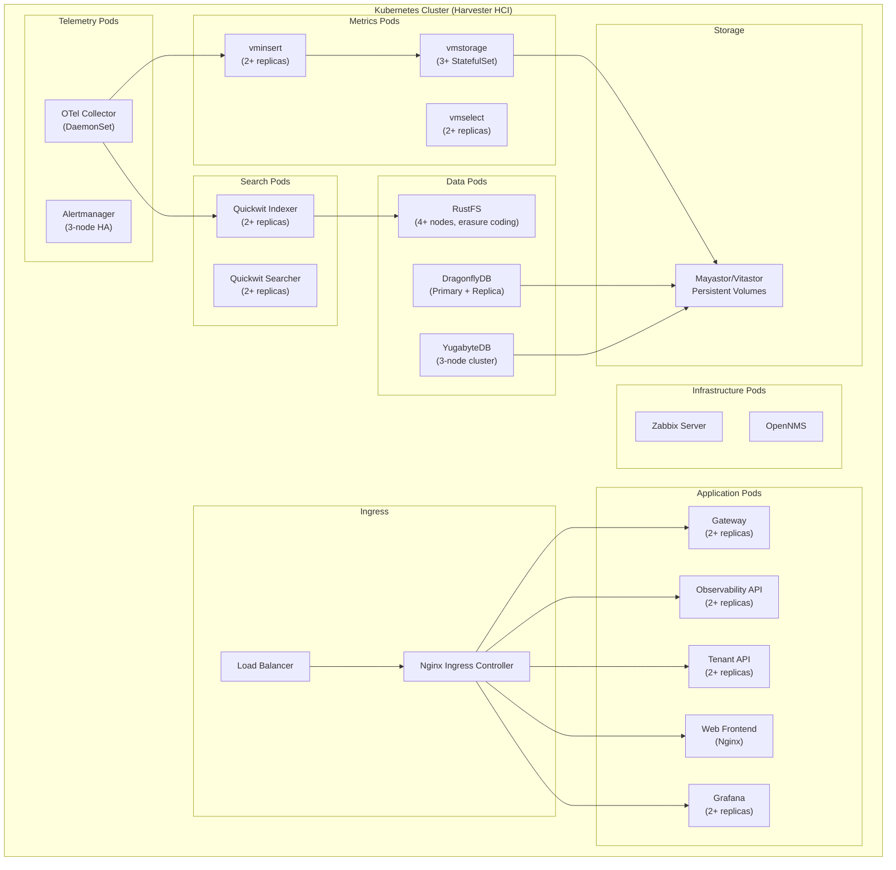

# ERP-Observability Enterprise Architecture

## 1. Business Architecture

### 1.1 Business Capability Model

### 1.2 Value Stream Mapping

### 1.3 Stakeholder Map

| Stakeholder | Role | Primary Concerns |
|------------|------|-----------------|
| Site Reliability Engineers (SREs) | Primary User | SLO compliance, incident response, error budgets, capacity planning |
| DevOps Engineers | Primary User | Pipeline health, deployment monitoring, infrastructure automation |
| Platform Engineers | Primary User | Multi-tenant management, self-service observability, cost optimization |
| Module Developers | End User | Application debugging, log analysis, trace exploration |
| Security Engineers | End User | Audit log review, anomaly detection, compliance reporting |
| IT Operations | Technical | Infrastructure health, network monitoring, Zabbix/OpenNMS management |
| Executive Leadership | Sponsor | Platform reliability KPIs, cost reduction, SLA compliance |
| Tenant Administrators | Admin | Tenant-specific dashboards, alert configuration, access management |

### 1.4 Observability-as-a-Service for ERP Modules

ERP-Observability functions as an internal observability platform, providing self-service monitoring capabilities to all 20+ ERP modules:

```mermaid
graph TB
    subgraph "ERP Suite (Consumers)"
        CRM["ERP-CRM"]
        IAM["ERP-IAM"]
        ACC["ERP-Accounting"]
        INV["ERP-Inventory"]
        HRM["ERP-HRM"]
        SCM["ERP-Supply-Chain"]
        PROJ["ERP-Projects"]
        PLAT["ERP-Platform"]
        DIR["ERP-Directory"]
        COMM["ERP-Communication"]
        WH["ERP-Warehouse"]
        MFG["ERP-Manufacturing"]
        PROC["ERP-Procurement"]
        PAY["ERP-Payroll"]
        BI["ERP-Analytics"]
        DOC["ERP-Documents"]
        QUAL["ERP-Quality"]
        MAINT["ERP-Maintenance"]
        FLEET["ERP-Fleet"]
        ASSET["ERP-Assets"]
    end

    subgraph "ERP-Observability (Provider)"
        METRICS["Metrics Service<br/>(VictoriaMetrics)"]
        LOGS["Log Service<br/>(Quickwit)"]
        TRACES["Trace Service<br/>(Quickwit)"]
        ALERTS["Alert Service<br/>(Alertmanager)"]
        INFRA["Infrastructure Service<br/>(Zabbix + OpenNMS)"]
        DASH["Dashboard Service<br/>(Grafana)"]
    end

    CRM & IAM & ACC & INV & HRM & SCM --> METRICS & LOGS & TRACES
    PROJ & PLAT & DIR & COMM & WH & MFG --> METRICS & LOGS & TRACES
    PROC & PAY & BI & DOC & QUAL & MAINT --> METRICS & LOGS & TRACES
    FLEET & ASSET --> METRICS & LOGS & TRACES
    METRICS & LOGS & TRACES --> ALERTS
    METRICS & LOGS & TRACES --> DASH
    ALERTS --> DASH
    INFRA --> ALERTS & DASH
```

## 2. Application Architecture

### 2.1 Application Portfolio

### 2.2 Integration Architecture

### 2.3 Application Decomposition

| Application Component | Technology | Deployment | Scaling Strategy |
|-----------------------|-----------|------------|-----------------|
| API Gateway | Go (net/http) | Docker/K8s | Horizontal (stateless) |
| Observability API | Node.js (Express) | Docker/K8s | Horizontal (stateless) |
| Tenant API | Go (net/http) | Docker/K8s | Horizontal (stateless) |
| VictoriaMetrics (vmselect) | Go | Docker/K8s | Horizontal (query parallelism) |
| VictoriaMetrics (vminsert) | Go | Docker/K8s | Horizontal (write throughput) |
| VictoriaMetrics (vmstorage) | Go | Docker/K8s (StatefulSet) | Vertical + horizontal sharding |
| Quickwit (Searcher) | Rust | Docker/K8s | Horizontal (search parallelism) |
| Quickwit (Indexer) | Rust | Docker/K8s | Horizontal (indexing throughput) |
| Grafana | Go | Docker/K8s | Horizontal (session affinity) |
| OTel Collector | Go | Docker/K8s (DaemonSet) | One per node |
| Alertmanager | Go | Docker/K8s | HA cluster (gossip) |
| Zabbix Server | C | Docker/K8s | Vertical |
| Zabbix Proxy | C | Docker/K8s | Per-location deployment |
| OpenNMS | Java | Docker/K8s | Vertical |
| DragonflyDB | C++ | Docker/K8s (StatefulSet) | Vertical + replication |
| YugabyteDB | C++ | Docker/K8s (StatefulSet) | Horizontal (automatic sharding) |
| RustFS | Rust | Docker/K8s (StatefulSet) | Horizontal (erasure coding) |
| Web Frontend | React (static) | CDN/Nginx | CDN edge caching |

## 3. Data Architecture

### 3.1 Data Flow Architecture

### 3.2 Data Classification

| Data Category | Sensitivity | Retention | Encryption |
|--------------|------------|-----------|-----------|
| Application Metrics | Low | 30 days (default), up to 5 years | TLS in transit |
| Application Logs | Medium (may contain PII) | 90 days (default) | AES-256 at rest, TLS in transit |
| Distributed Traces | Low | 7 days (default) | TLS in transit |
| Infrastructure Metrics (Zabbix) | Low | 30 days | TLS in transit |
| Network Events (OpenNMS) | Low | 30 days | TLS in transit |
| Alert History | Medium | 1 year | TLS in transit |
| Audit Events | High | 7 years (regulatory) | AES-256 at rest, immutable |
| Tenant Configuration | High | Indefinite | AES-256 at rest, TLS in transit |
| Dashboard Definitions | Low | Indefinite (Git-tracked) | TLS in transit |
| SLO Definitions | Medium | Indefinite | TLS in transit |

## 4. Technology Architecture

### 4.1 Infrastructure Topology

### 4.2 Technology Standards

| Standard | Implementation |
|----------|---------------|
| Authentication | OIDC/JWT via ERP-IAM |
| Authorization | RBAC with tenant isolation (X-Scope-OrgID) |
| API Style | REST (gateway) + PromQL (metrics) + Quickwit Query (logs) |
| Telemetry Protocol | OTLP (gRPC + HTTP) |
| Metric Query | PromQL (VictoriaMetrics-compatible) |
| Log Query | Quickwit Query Language |
| Observability | Self-monitoring via internal OTel pipeline |
| Storage | Mayastor/Vitastor on Harvester HCI |
| Object Storage | RustFS (S3-compatible) |
| CI/CD | GitHub Actions |
| Containerization | Docker (multi-stage) |
| Orchestration | Kubernetes + Helm |
| Event Format | CloudEvents v1.0 |

## 5. Governance

### 5.1 Architecture Principles

1. **AIDD Compliance**: All technology choices must comply with AIDD standards -- VictoriaMetrics (not Prometheus), Quickwit (not Elasticsearch), DragonflyDB (not Redis), YugabyteDB (not PostgreSQL)
2. **OTel-native**: All telemetry must flow through OpenTelemetry, no proprietary agent lock-in
3. **Multi-tenant by design**: All data scoped by tenant at every layer via X-Scope-OrgID
4. **Self-service**: Module teams can create dashboards, alerts, and SLOs without platform team intervention
5. **Sovereign-first**: Self-hosted, no external SaaS dependencies for core observability
6. **Immutable audit**: All configuration changes and alerts are immutably logged
7. **Cost-aware**: Storage tiering with automatic archival to RustFS for long-term retention

### 5.2 Architecture Review Checklist

- [ ] All new telemetry sources use OTel SDKs or OTel Collector receivers
- [ ] Tenant isolation verified at API gateway and storage layers
- [ ] Alert rules reviewed for noise and actionability
- [ ] Dashboard templates provisioned for new modules
- [ ] Retention policies configured per data classification
- [ ] Performance benchmarks established for query latency targets
- [ ] AIDD compliance verified (no banned technologies)
- [ ] Architecture Decision Record created for significant changes
