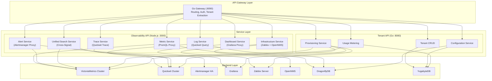
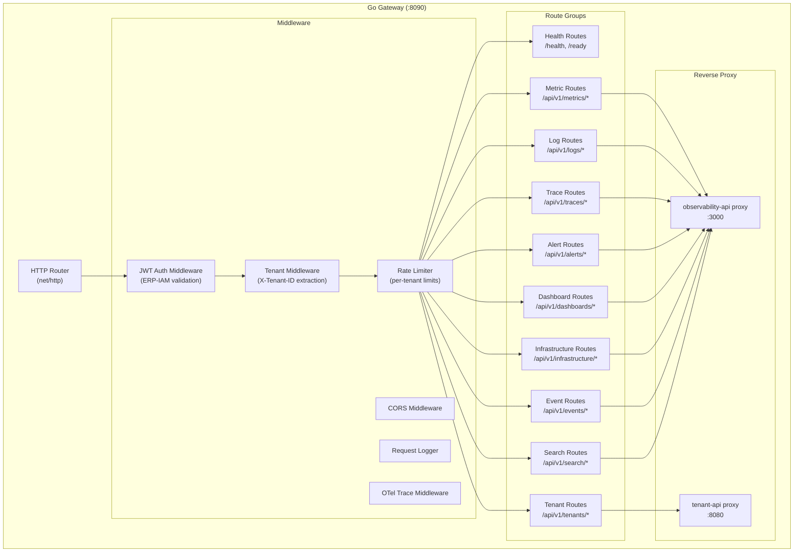
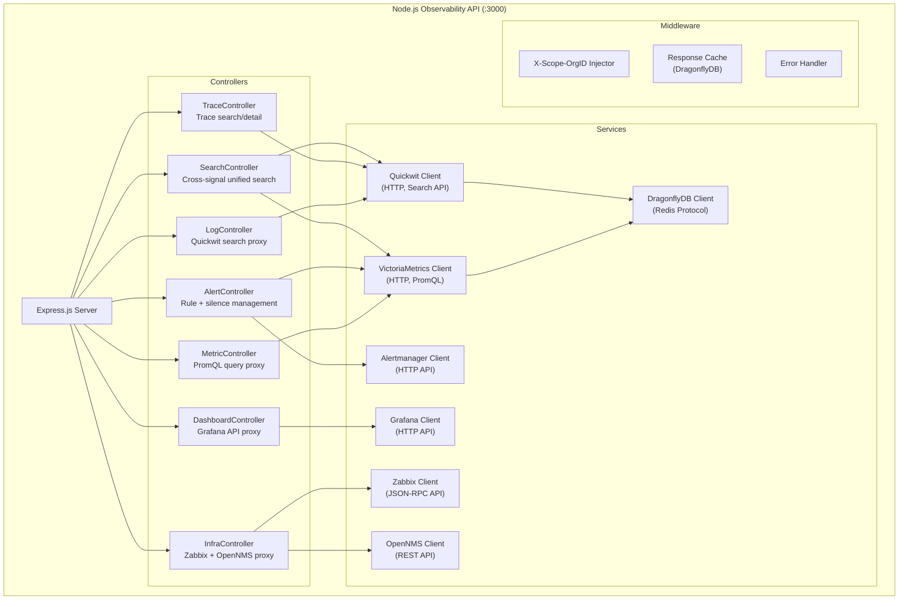
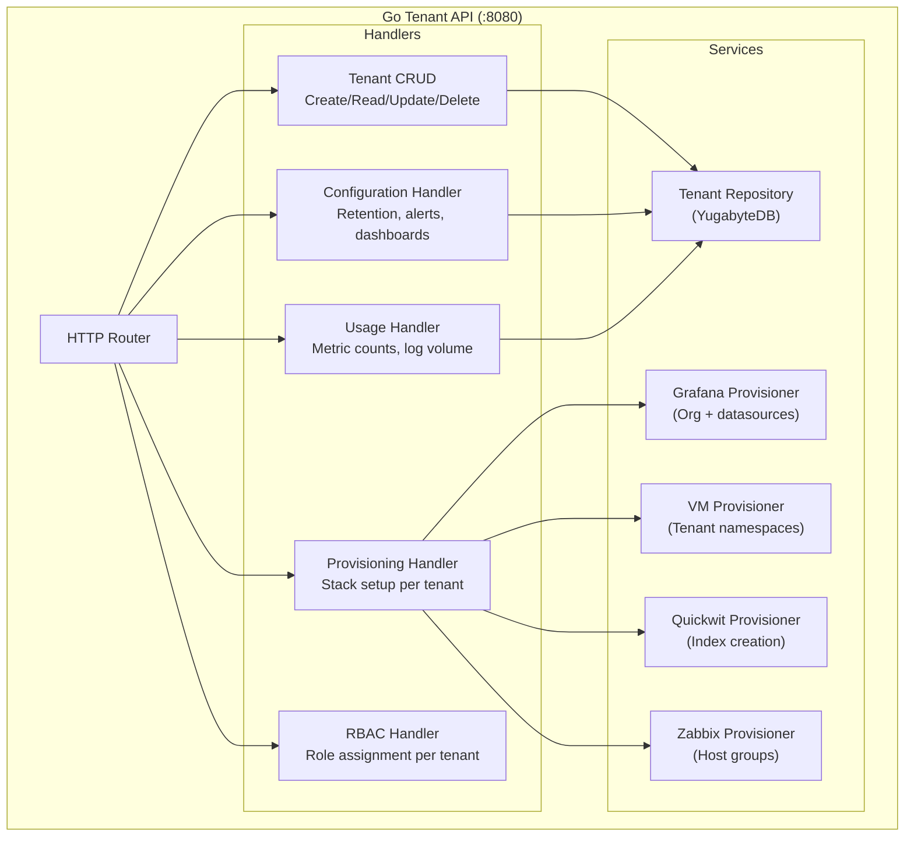
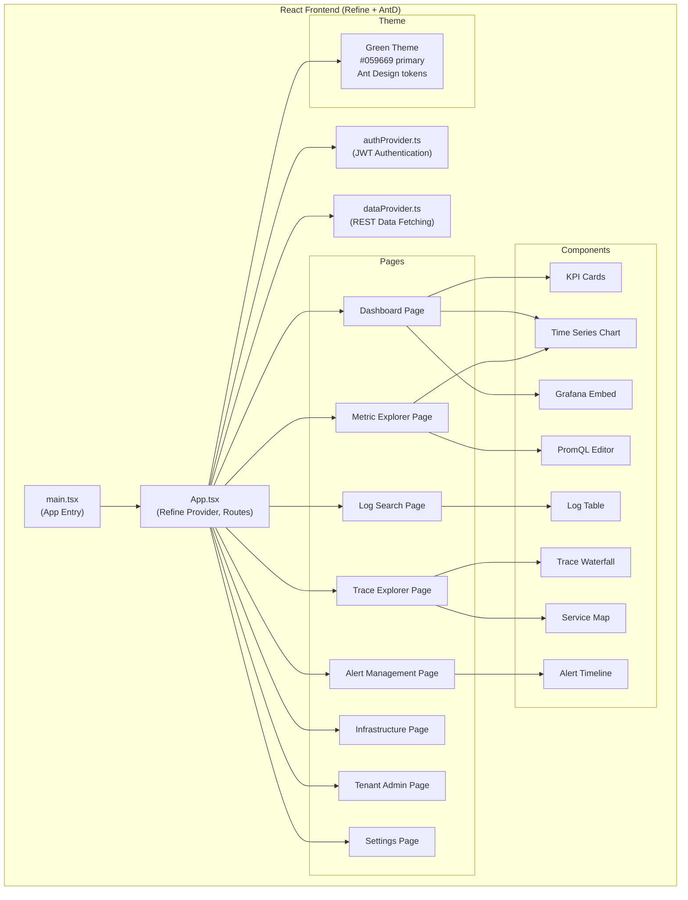
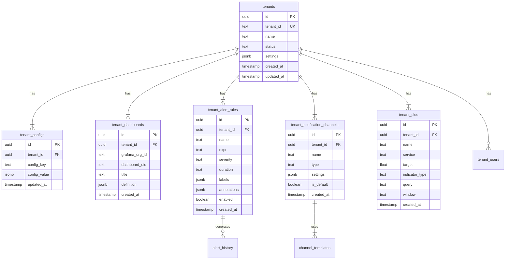
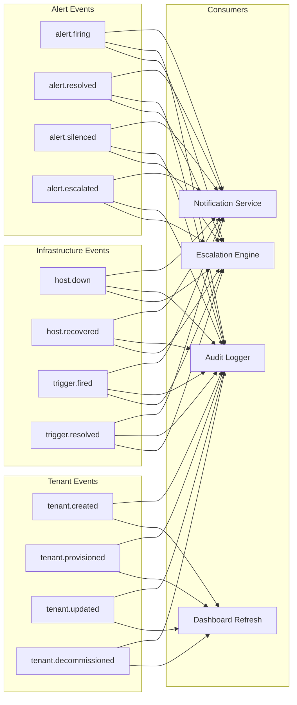
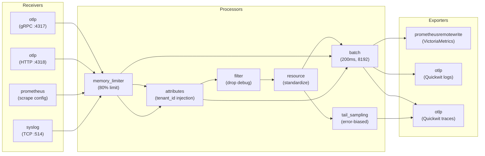
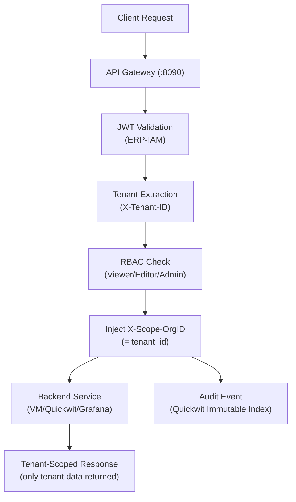

# ERP-Observability Software Architecture

## 1. Architecture Style

ERP-Observability employs a microservice architecture with three distinct API services -- a Go gateway for routing and authentication, a Node.js observability-api for telemetry query orchestration, and a Go tenant-api for tenant lifecycle management. The platform follows Domain-Driven Design principles with bounded contexts for metrics, logs, traces, alerts, infrastructure, and tenants.



## 2. Component Architecture

### 2.1 Go Gateway (`cmd/server/main.go`)

The Go gateway is the single entry point for all API requests, handling authentication, tenant extraction, rate limiting, and request routing.



### 2.2 Node.js Observability API (`observability-api/`)



### 2.3 Go Tenant API (`tenant-api/`)



### 2.4 Web Frontend (`web/`)



## 3. Data Model

### 3.1 Tenant Configuration (YugabyteDB)



### 3.2 Quickwit Log Index Schema

```json
{
  "version": "0.7",
  "index_id": "logs-{tenant_id}",
  "doc_mapping": {
    "field_mappings": [
      {"name": "timestamp", "type": "datetime", "fast": true, "input_formats": ["rfc3339"]},
      {"name": "tenant_id", "type": "text", "tokenizer": "raw", "fast": true},
      {"name": "service_name", "type": "text", "tokenizer": "raw", "fast": true},
      {"name": "severity", "type": "text", "tokenizer": "raw", "fast": true},
      {"name": "body", "type": "text", "tokenizer": "default"},
      {"name": "trace_id", "type": "text", "tokenizer": "raw", "fast": true},
      {"name": "span_id", "type": "text", "tokenizer": "raw", "fast": true},
      {"name": "resource_attributes", "type": "json"},
      {"name": "log_attributes", "type": "json"}
    ],
    "timestamp_field": "timestamp"
  },
  "search_settings": {
    "default_search_fields": ["body", "service_name"]
  },
  "retention": {
    "period": "90 days",
    "schedule": "daily"
  }
}
```

### 3.3 VictoriaMetrics Metric Model

Metrics follow the Prometheus data model with multi-tenant isolation:

```
# Metric naming convention
{module}_{component}_{metric_name}_{unit}

# Examples
erp_crm_http_requests_total{method="GET", status="200", tenant_id="acme"}
erp_iam_auth_latency_seconds{quantile="0.99", tenant_id="acme"}
erp_accounting_invoice_processing_duration_seconds_bucket{le="0.5", tenant_id="acme"}

# Tenant isolation via vmauth
# Request: GET /select/{tenant_id}/prometheus/api/v1/query?query=...
# X-Scope-OrgID header propagated to all queries
```

## 4. Event Architecture

### 4.1 Observability Events



### 4.2 Event Format (CloudEvents)

```json
{
  "specversion": "1.0",
  "type": "com.opensase.observability.alert.firing",
  "source": "opensase-observability",
  "id": "550e8400-e29b-41d4-a716-446655440000",
  "time": "2026-02-24T10:00:00Z",
  "data": {
    "alert_name": "HighErrorRate",
    "tenant_id": "acme-corp",
    "severity": "critical",
    "module": "erp-crm",
    "value": 0.15,
    "threshold": 0.05
  }
}
```

## 5. OTel Collector Pipeline Design

### 5.1 Pipeline Configuration



## 6. Security Architecture



## 7. Concurrency Model

The Go gateway and tenant-api use Go's goroutine-based concurrency:

- **Gateway**: One goroutine per HTTP request, `http.ReverseProxy` for backend forwarding
- **Tenant API**: Connection pool to YugabyteDB via `pgx`, DragonflyDB connection pool via `go-redis`
- **Node.js API**: Event loop with async/await for non-blocking I/O to all backends
- **DragonflyDB**: Multi-threaded shared-nothing architecture for cache operations
- **VictoriaMetrics**: Concurrent query execution with per-tenant query limits
- **Quickwit**: Search parallelism across index splits
