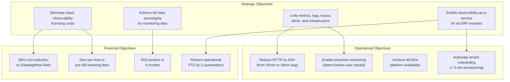
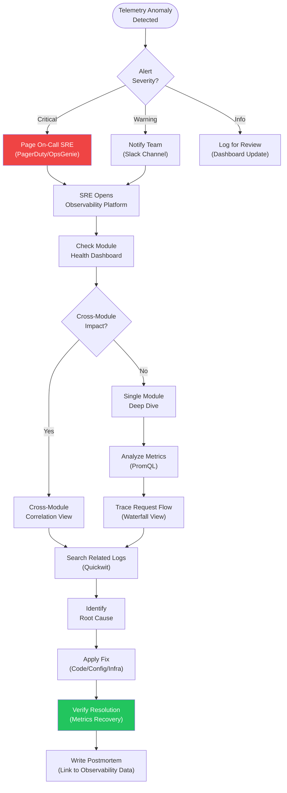
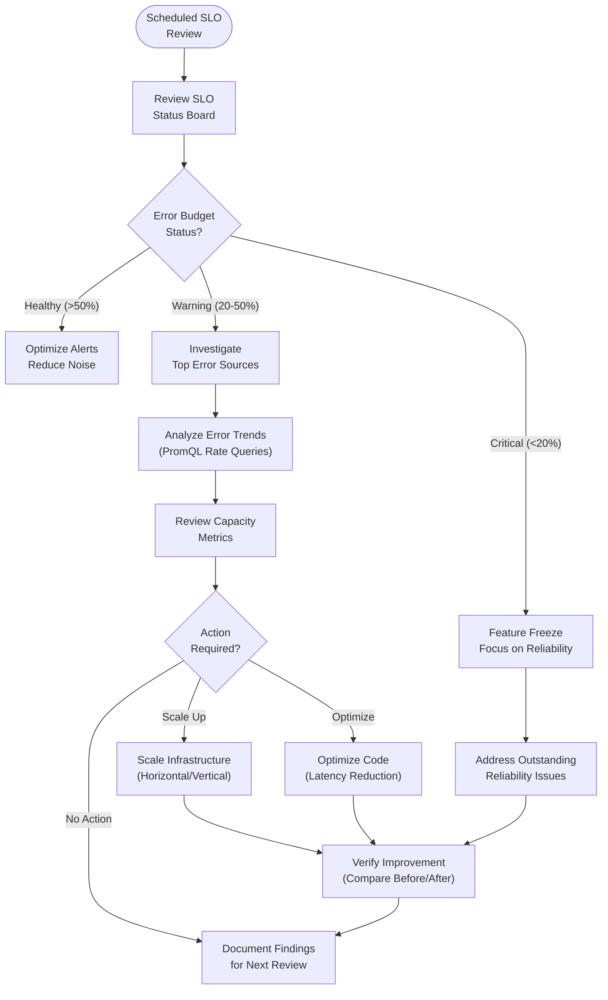
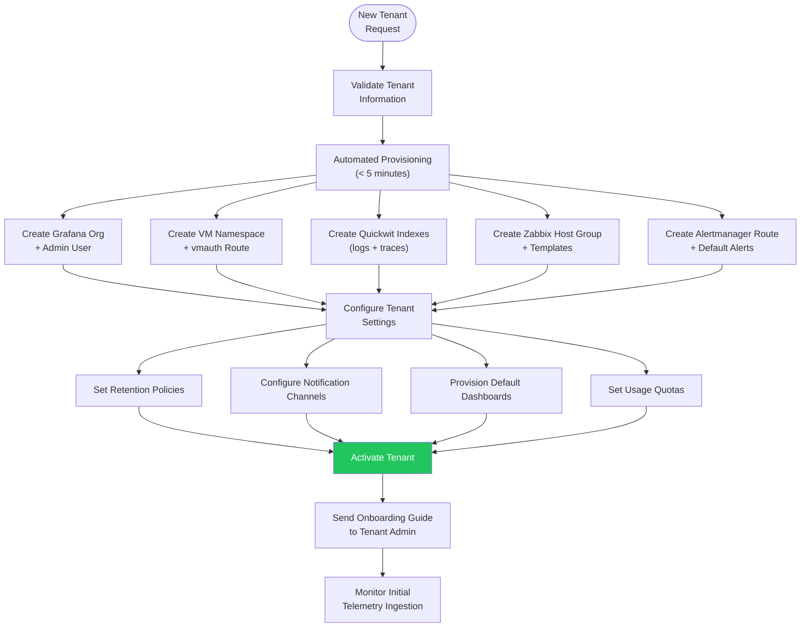
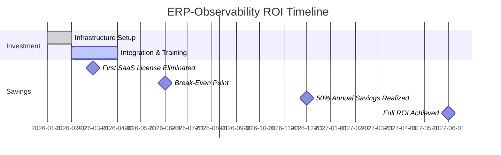

# ERP-Observability Business Requirements Document

## 1. Executive Summary

ERP-Observability addresses the critical business need for a unified, self-hosted observability platform that eliminates fragmented monitoring toolchains, reduces incident resolution time, and enables proactive monitoring across the entire OpenSASE ERP suite. Organizations relying on commercial observability platforms (Datadog, New Relic, Splunk) face annual costs of $200,000-$2,000,000+ for enterprise-scale deployments with 500+ hosts and 1TB+/day log ingestion. ERP-Observability eliminates these recurring costs while ensuring full data sovereignty, regulatory compliance, and deep integration with all 20+ ERP modules.

## 2. Business Objectives

## 3. Business Process Requirements

### 3.1 Incident Detection and Resolution Process

### 3.2 Proactive Monitoring Process

### 3.3 Tenant Onboarding Process

## 4. Business Rules

### 4.1 Tenant Isolation Rules

| Rule ID | Rule | Enforcement |
|---------|------|------------|
| BR-TN-001 | All telemetry data must be isolated by tenant_id | X-Scope-OrgID header propagation at every layer |
| BR-TN-002 | Tenants cannot access other tenants' data | API gateway + storage-level enforcement |
| BR-TN-003 | Tenant decommissioning must delete all associated data | Automated cleanup job with audit log |
| BR-TN-004 | Default retention must be applied to all new tenants | Provisioning service default values |
| BR-TN-005 | Usage quotas must be enforced to prevent resource abuse | Rate limiting + ingestion quotas per tenant |

### 4.2 Alert Management Rules

| Rule ID | Rule | Enforcement |
|---------|------|------------|
| BR-AL-001 | Critical alerts must page on-call within 30 seconds | Alertmanager route configuration |
| BR-AL-002 | Alerts must be deduplicated within a 5-minute window | Alertmanager group_wait setting |
| BR-AL-003 | Silences must have an expiration time (max 7 days) | Silence API validation |
| BR-AL-004 | Alert rules must include a runbook_url annotation | Alert rule template validation |
| BR-AL-005 | Resolved alerts must be automatically cleared | Alertmanager resolve_timeout setting |

### 4.3 Data Retention Rules

| Rule ID | Rule | Enforcement |
|---------|------|------------|
| BR-DR-001 | Metrics must be retained for minimum 7 days | Tenant config validation |
| BR-DR-002 | Audit logs must be retained for minimum 7 years | Immutable Quickwit index + RustFS archival |
| BR-DR-003 | Traces must be retained for minimum 3 days | Quickwit index retention policy |
| BR-DR-004 | Data exceeding retention must be automatically purged | Scheduled cleanup jobs |
| BR-DR-005 | Archived data must be retrievable within 24 hours | RustFS with Quickwit re-indexing |

### 4.4 Performance Rules

| Rule ID | Rule | Enforcement |
|---------|------|------------|
| BR-PF-001 | PromQL queries must timeout after 30 seconds | VictoriaMetrics -search.maxQueryDuration |
| BR-PF-002 | Log queries must be limited to 10,000 results | Quickwit max_hits parameter |
| BR-PF-003 | Dashboard refresh must not exceed 15-second intervals | Grafana minimum refresh interval |
| BR-PF-004 | Metric cardinality must be monitored per tenant | VictoriaMetrics cardinality endpoint |
| BR-PF-005 | Heavy queries must not impact other tenants | Per-tenant query concurrency limits |

## 5. Organizational Impact

### 5.1 Role-Based Requirements

| Role | Primary Requirements | Secondary Requirements |
|------|---------------------|----------------------|
| SRE | SLO dashboards, alert management, incident correlation | Runbook automation, error budget tracking |
| DevOps Engineer | Infrastructure dashboards, deployment monitoring, log tailing | Capacity planning, cost attribution |
| Platform Admin | Tenant provisioning, retention management, usage metering | Compliance reporting, access control |
| Module Developer | Log search, trace exploration, metric query | Custom alerts, application dashboards |
| Security Engineer | Audit log review, anomaly detection | Compliance reporting, access log analysis |
| Executive | Platform reliability KPIs, cost dashboards | SLA compliance trends |

### 5.2 Training Requirements

| Audience | Training Type | Duration | Delivery |
|----------|-------------|----------|----------|
| SREs | Advanced observability (PromQL, log correlation, tracing) | 8 hours | In-person + video |
| DevOps Engineers | Platform operations (dashboards, alerts, infrastructure) | 6 hours | In-person + video |
| Platform Admins | Tenant management and configuration | 4 hours | In-person |
| Module Developers | Self-service observability (OTel SDK, log search, traces) | 4 hours | Video |
| Security Engineers | Audit and compliance features | 2 hours | Video |
| Executives | Dashboard interpretation | 1 hour | Video |

## 6. Cost-Benefit Analysis

### 6.1 Cost Comparison (500-Host Organization, Annual)

| Cost Category | Datadog | New Relic | Splunk Cloud | Elastic Cloud | ERP-Observability |
|--------------|---------|-----------|--------------|---------------|-------------------|
| Infrastructure Monitoring | $108,000 | $75,000 | N/A | N/A | $0 |
| APM / Traces | $156,000 | $90,000 | N/A | $60,000 | $0 |
| Log Management (1TB/day) | $216,000 | $120,000 | $360,000 | $96,000 | $0 |
| Custom Metrics | $36,000 | $30,000 | N/A | $24,000 | $0 |
| Infrastructure (self-hosted) | $0 | $0 | $0 | $0 | $36,000 |
| Admin/DevOps | $20,000 | $20,000 | $30,000 | $25,000 | $60,000 |
| **Total Annual** | **$536,000** | **$335,000** | **$390,000** | **$205,000** | **$96,000** |
| **3-Year TCO** | **$1,608,000** | **$1,005,000** | **$1,170,000** | **$615,000** | **$288,000** |

### 6.2 ROI Timeline

### 6.3 Intangible Benefits

1. **Reduced MTTR**: 60% reduction in incident resolution time saves 4+ engineering hours per incident
2. **Proactive detection**: Preventing outages before user impact avoids revenue loss and reputation damage
3. **Developer productivity**: Self-service observability reduces time-to-debug from hours to minutes
4. **Data sovereignty**: Complete control over monitoring data eliminates regulatory exposure
5. **Vendor independence**: No lock-in to proprietary query languages or data formats

## 7. Constraints

| Constraint | Impact | Mitigation |
|-----------|--------|-----------|
| Self-hosted requires infrastructure expertise | Higher operational burden | Automated provisioning, Helm charts, runbooks |
| VictoriaMetrics learning curve (vs Prometheus) | Team retraining needed | Full PromQL compatibility minimizes learning curve |
| Quickwit query syntax differs from Elasticsearch | New query patterns | Documentation, training, query examples |
| Zabbix/OpenNMS add operational complexity | More components to manage | Pre-configured templates, auto-discovery |
| Multi-tenant isolation requires rigorous testing | Security risk if misconfigured | Automated isolation tests in CI/CD |

## 8. Acceptance Criteria

| Criterion | Measure | Target |
|-----------|---------|--------|
| Metric ingestion rate | Load test | 1M+ data points/sec sustained |
| PromQL query latency | Performance test | < 100ms p99 for 1h range |
| Log search latency | Performance test | < 200ms p99 for keyword search |
| Tenant provisioning time | Integration test | < 5 minutes end-to-end |
| Multi-tenant isolation | Security test | Zero cross-tenant data leakage |
| Alert delivery latency | Integration test | < 30s from threshold breach to notification |
| Dashboard load time | Performance test | < 2s for 20-panel dashboard |
| MTTR improvement | Operational review | 60% reduction from baseline |
| Module coverage | Integration checklist | 100% of ERP modules instrumented |
| Availability | Production monitoring | 99.95% over 30-day rolling window |
