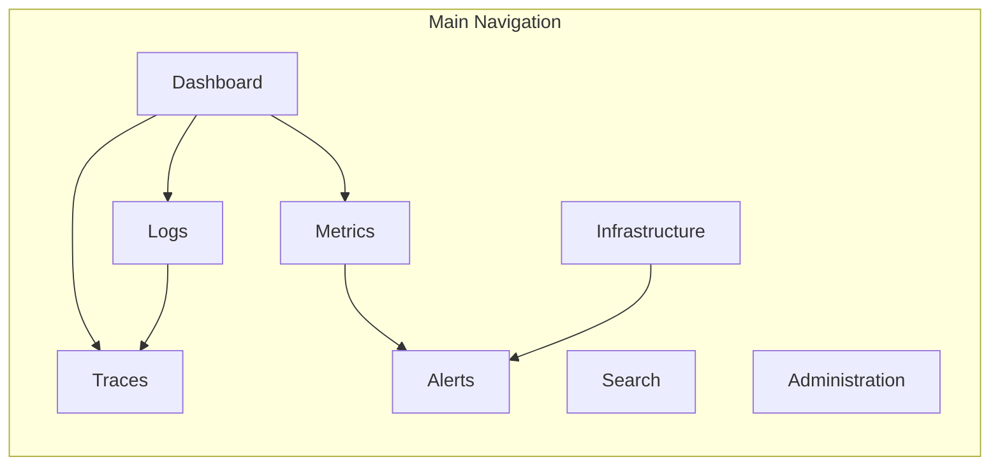

# ERP-Observability User Manual

## Table of Contents

1. [Getting Started](#1-getting-started)
2. [For SREs and DevOps Engineers](#2-for-sres-and-devops-engineers)
3. [For Module Developers](#3-for-module-developers)
4. [For Platform Administrators](#4-for-platform-administrators)
5. [Infrastructure Monitoring](#5-infrastructure-monitoring)

---

## 1. Getting Started

### 1.1 Logging In

ERP-Observability authenticates through ERP-IAM using OIDC/JWT. Navigate to your organization's observability URL (e.g., `https://observe.your-domain.com`) and sign in with your corporate credentials. Upon successful authentication, a JWT token is issued and stored in your browser session. The system extracts your tenant_id from the JWT claims and scopes all data access accordingly.

### 1.2 Navigation Overview



The sidebar navigation provides access to all major platform features:

- **Dashboard**: Main monitoring overview with module health, KPIs, and real-time feeds
- **Metrics**: Metric explorer with PromQL query editor and time series charts
- **Logs**: Log search interface with structured filtering and real-time tailing
- **Traces**: Trace explorer with search, waterfall view, and service map
- **Alerts**: Alert rules, active alerts, silences, and notification channels
- **Infrastructure**: Zabbix host overview, OpenNMS event console, network topology
- **Search**: Unified cross-signal search across metrics, logs, and traces
- **Administration**: Tenant management, dashboard builder, system settings

### 1.3 Understanding the Main Dashboard

The dashboard provides an at-a-glance view of your observability posture:

- **Module Health Grid**: Status cards for each ERP module (green/yellow/red based on error rate and latency)
- **SLO Status Board**: Current SLO compliance for critical services with burn rate indicators
- **Active Alerts**: Count and severity breakdown of currently firing alerts
- **Real-Time Event Feed**: Live stream of recent events (deployments, alerts, incidents)
- **Key Metrics**: Total requests/sec, global error rate, p99 latency, active hosts
- **Infrastructure Summary**: Host count, up/down status, average CPU/memory utilization

---

## 2. For SREs and DevOps Engineers

### 2.1 Exploring Metrics

#### Using the Metric Explorer

1. Navigate to **Metrics** in the sidebar
2. The Metric Explorer provides three ways to find metrics:
   - **Browse**: Expand the metric tree organized by module and component
   - **Search**: Type a partial metric name (e.g., `http_request`) to see matching metrics
   - **PromQL**: Enter a raw PromQL query in the editor

#### Writing PromQL Queries

The PromQL editor supports autocomplete for metric names, label names, and label values. All queries are automatically scoped to your tenant via X-Scope-OrgID.

Common query patterns:

```
# Request rate per module
sum(rate(erp_http_requests_total[5m])) by (module)

# Error rate percentage
sum(rate(erp_http_requests_total{status=~"5.."}[5m])) / sum(rate(erp_http_requests_total[5m])) * 100

# P99 latency
histogram_quantile(0.99, sum(rate(erp_http_request_duration_seconds_bucket[5m])) by (le, module))

# Active connections
sum(erp_active_connections) by (module)

# Memory usage per service
process_resident_memory_bytes / 1024 / 1024
```

#### Time Range Selection

Use the time picker in the top-right corner to select a range:
- Quick ranges: Last 15m, 1h, 3h, 6h, 12h, 24h, 7d, 30d
- Custom range: Click "Custom" and specify start/end dates
- Relative time: Enter an expression like `now-2h to now`

The chart auto-refreshes at the configured interval (default: 30 seconds).

#### Comparing Time Periods

1. Select a metric chart
2. Click **Compare** in the chart toolbar
3. Choose a comparison period (previous day, previous week, previous month)
4. The overlay shows both time periods for visual comparison

### 2.2 Searching Logs

#### Basic Log Search

1. Navigate to **Logs** in the sidebar
2. Enter a search query in the search bar:
   - Keyword search: `connection timeout`
   - Field filter: `service_name:erp-crm AND severity:ERROR`
   - Wildcard: `body:*NullPointerException*`
3. Select the time range
4. Click **Search** or press Enter

#### Structured Field Filtering

Use the filter panel on the left to refine results:
- **Service**: Select one or more service names
- **Severity**: Filter by ERROR, WARN, INFO, DEBUG
- **Module**: Filter by ERP module
- **Trace ID**: Paste a trace ID to find all correlated logs
- **Custom fields**: Add filters on any log attribute

#### Real-Time Log Tailing

1. Click the **Live** toggle in the top-right
2. Logs stream in real-time via WebSocket connection
3. Apply filters to narrow the stream
4. Click a log line to expand its details
5. Click **Pause** to stop the stream for analysis

#### Log-to-Trace Correlation

When a log line contains a `trace_id` field:
1. Click the log line to expand details
2. Click the **View Trace** button next to the trace_id
3. The system navigates to the trace waterfall view for that trace

### 2.3 Analyzing Traces

#### Trace Search

1. Navigate to **Traces** in the sidebar
2. Filter by:
   - **Service**: The originating service
   - **Operation**: The span operation name (e.g., `HTTP GET /api/v1/contacts`)
   - **Duration**: Min/max duration to find slow requests
   - **Status**: Success or Error
   - **Tags**: Custom span attributes
3. Results show a list of matching traces with duration, span count, and error indicators

#### Trace Waterfall View

Click a trace to open the waterfall view:
- Horizontal bars represent spans, with width proportional to duration
- Parent-child relationships shown via nesting and connecting lines
- Error spans highlighted in red
- Click a span to see its attributes, events, and linked logs
- Timeline ruler at the top shows total trace duration

#### Service Map

1. Click **Service Map** in the Traces section
2. The map shows services as nodes, with edges representing calls between them
3. Edge labels show request rate and error rate
4. Node color indicates health: green (healthy), yellow (degraded), red (unhealthy)
5. Click a node to drill into that service's metrics and traces

### 2.4 Managing Alerts

#### Viewing Active Alerts

1. Navigate to **Alerts** in the sidebar
2. The **Active** tab shows all currently firing alerts
3. Each alert shows: name, severity (critical/warning/info), module, firing since, value
4. Click an alert to see its details, expression, labels, annotations, and runbook link

#### Creating Alert Rules

1. Click **Rules** tab, then **+ New Rule**
2. Fill in:
   - **Name**: Descriptive alert name (e.g., "ERP-CRM High Error Rate")
   - **Expression**: PromQL expression (e.g., `rate(erp_http_requests_total{status=~"5..", module="erp-crm"}[5m]) > 0.05`)
   - **Duration**: How long the condition must hold before firing (e.g., `5m`)
   - **Severity**: critical, warning, or info
   - **Labels**: Additional labels for routing
   - **Annotations**: Summary, description, runbook_url, dashboard_url
3. Click **Save**

#### Managing Silences

During maintenance windows or known issues:
1. Click the **Silences** tab
2. Click **+ New Silence**
3. Set matchers (e.g., `module=erp-crm`, `severity=warning`)
4. Set expiration time (max 7 days)
5. Add a comment explaining the reason
6. Click **Create**

#### Alert History

The **History** tab shows a timeline of all alert state changes (firing, resolved) with timestamps, duration, and associated notification records.

---

## 3. For Module Developers

### 3.1 Finding Your Module's Data

All data is organized by module. Use the module filter available in every section:

1. **Metrics**: Filter by `module="erp-your-module"` in PromQL
2. **Logs**: Filter by `service_name:"erp-your-module"` in the sidebar
3. **Traces**: Select your module in the service dropdown
4. **Dashboards**: Find your module's pre-built dashboard in the dashboard list

### 3.2 Debugging with Logs

When investigating an issue:
1. Start with the approximate time range of the problem
2. Filter logs by your service and ERROR severity
3. Expand error log lines to see full stack traces
4. Copy the trace_id from the error log
5. Navigate to Traces and paste the trace_id
6. The trace waterfall shows the full request flow, revealing where the failure occurred

### 3.3 Monitoring After Deployments

After deploying a new version:
1. Open your module's dashboard
2. Look at the "Deployment Markers" annotations on the time series
3. Compare error rate and latency before/after the deployment
4. Use the Logs section to tail logs for new error patterns
5. If issues appear, use traces to identify the root cause

### 3.4 Creating Custom Alerts

Module developers can create alerts specific to their application:
1. Navigate to **Alerts > Rules > + New Rule**
2. Use PromQL expressions targeting your module's metrics
3. Set appropriate thresholds based on your SLOs
4. Add a runbook_url annotation linking to your module's runbook
5. Alert notifications will route to your configured channels

---

## 4. For Platform Administrators

### 4.1 Tenant Management

#### Creating a New Tenant

1. Navigate to **Administration > Tenants**
2. Click **+ New Tenant**
3. Fill in:
   - **Tenant ID**: Unique identifier (e.g., `acme-corp`)
   - **Name**: Display name
   - **Settings**: Retention policies, quotas, notification defaults
4. Click **Create and Provision**
5. The system automatically provisions:
   - Grafana organization with admin user
   - VictoriaMetrics tenant namespace
   - Quickwit log and trace indexes
   - Zabbix host group with default templates
   - Default alert rules and notification channels

#### Managing Retention Policies

1. Navigate to **Administration > Tenants > [Tenant] > Configuration**
2. Set retention periods for each data type:
   - Metrics: 7 days to 5 years (default: 30 days)
   - Logs: 30 days to 2 years (default: 90 days)
   - Traces: 3 days to 30 days (default: 7 days)
3. Click **Save**
4. Changes apply to new data immediately; existing data is purged on the next cleanup cycle

#### Reviewing Usage

1. Navigate to **Administration > Tenants > [Tenant] > Usage**
2. View metrics:
   - Active time series count
   - Log volume (GB/day)
   - Trace volume (spans/day)
   - Storage consumption per data type
3. Set alerts on usage thresholds to prevent quota exhaustion

### 4.2 Dashboard Management

#### Provisioning Default Dashboards

New tenants automatically receive dashboard templates for:
- Module Health Overview (all modules)
- Per-module RED metrics (Rate, Error, Duration)
- Infrastructure Overview (Zabbix hosts)
- SLO Status Board
- Alert Overview

#### Creating Custom Dashboards

1. Navigate to **Administration > Dashboards > + New Dashboard**
2. Use the Grafana editor to add panels:
   - Time series charts (PromQL queries)
   - Log panels (Quickwit queries)
   - Stat panels (single value KPIs)
   - Table panels (structured data)
3. Save and assign to tenant

### 4.3 Notification Channel Configuration

1. Navigate to **Administration > Notification Channels**
2. Configure channels per tenant:
   - **Email**: SMTP settings, recipient list
   - **Slack**: Webhook URL, channel
   - **PagerDuty**: Integration key, escalation policy
   - **OpsGenie**: API key, team
   - **Webhook**: Custom URL, headers, payload template
3. Set one channel as the default for each severity level

### 4.4 System Health

Monitor the observability platform itself:
- `/health` -- Gateway health check
- `/ready` -- Backend connectivity check (VM, Quickwit, YugabyteDB, DragonflyDB)
- Self-monitoring dashboard showing component health, ingestion rates, query latency, storage capacity

---

## 5. Infrastructure Monitoring

### 5.1 Zabbix Host Overview

1. Navigate to **Infrastructure > Hosts**
2. View all monitored hosts with:
   - Hostname, IP, agent status (online/offline)
   - CPU, memory, disk, network utilization sparklines
   - Active triggers (problems)
   - Host group (organized by ERP module)
3. Click a host for detailed metrics and trigger history

### 5.2 OpenNMS Event Console

1. Navigate to **Infrastructure > Events**
2. View correlated events across modules:
   - Event severity (Critical, Major, Minor, Warning, Normal, Cleared)
   - Source (service, host, network device)
   - Correlation status (acknowledged, escalated, cleared)
3. Acknowledge events to indicate they are being investigated
4. Escalate events that require immediate attention

### 5.3 Network Topology

1. Navigate to **Infrastructure > Topology**
2. View the network topology map generated by OpenNMS auto-discovery
3. Node colors indicate status (green=up, red=down, yellow=degraded)
4. Click nodes for detailed status and connection information
5. Use the search bar to locate specific devices
