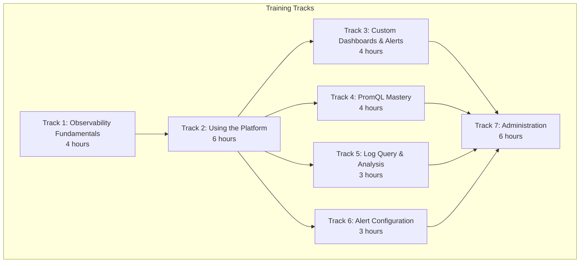
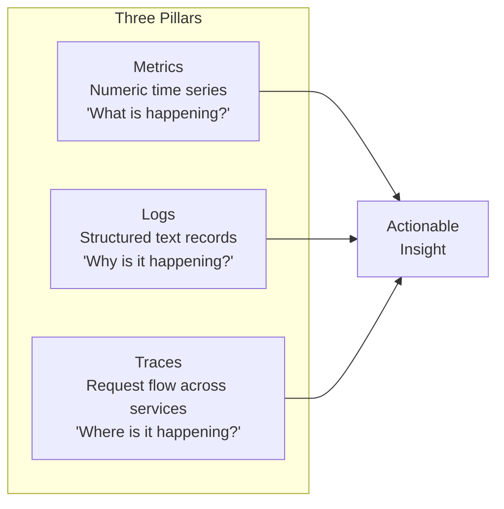

# ERP-Observability Training Manual

## Training Program Overview

This training manual provides structured learning paths for all ERP-Observability user roles. Each module includes objectives, hands-on exercises, and assessment criteria.



---

## Track 1: Observability Fundamentals (4 Hours)

### Module 1.1: What Is Observability? (60 minutes)

**Objectives:**
- Distinguish observability from traditional monitoring
- Understand the three pillars: metrics, logs, and traces
- Understand how observability reduces Mean Time to Resolution (MTTR)
- Learn the role of SLOs, SLIs, and error budgets

**Key Concepts:**



**Exercise 1.1.1:** Define the difference between monitoring (predefined dashboards, known-unknowns) and observability (exploratory, unknown-unknowns). Provide two examples of each.

**Exercise 1.1.2:** For a scenario where an API endpoint returns 500 errors intermittently:
- What metric would you check first?
- What log query would you write?
- How would a trace help identify the root cause?

### Module 1.2: The ERP-Observability Stack (60 minutes)

**Objectives:**
- Identify all components of the observability platform
- Understand the data flow from application to dashboard
- Explain the role of each technology (VictoriaMetrics, Quickwit, Grafana, OTel, Alertmanager, Zabbix, OpenNMS)

**Exercise 1.2.1:** Draw the data flow from an HTTP request in ERP-CRM through:
1. OTel SDK instrumentation
2. OTel Collector processing
3. VictoriaMetrics (metric) and Quickwit (log + trace) storage
4. Grafana dashboard visualization

**Exercise 1.2.2:** Match each technology to its purpose:

| Technology | Purpose |
|-----------|---------|
| VictoriaMetrics | ? |
| Quickwit | ? |
| Grafana | ? |
| OTel Collector | ? |
| Alertmanager | ? |
| Zabbix | ? |
| OpenNMS | ? |
| DragonflyDB | ? |
| YugabyteDB | ? |

### Module 1.3: Multi-Tenant Architecture (60 minutes)

**Objectives:**
- Understand tenant isolation mechanisms
- Explain X-Scope-OrgID header propagation
- Describe per-tenant data storage and query scoping

**Exercise 1.3.1:** Trace a metric query through the system and identify at which layers tenant isolation is enforced:
1. React frontend
2. Go gateway
3. VictoriaMetrics (vmauth)
4. VictoriaMetrics (vmstorage)

### Module 1.4: AIDD Compliance (60 minutes)

**Objectives:**
- Understand why specific technologies were chosen (AIDD mandate)
- Know the banned technologies and their replacements
- Explain the rationale for each technology choice

**Key Mappings:**

| Banned | Replacement | Rationale |
|--------|-------------|-----------|
| Prometheus | VictoriaMetrics | Better compression, built-in clustering, PromQL-compatible |
| Elasticsearch | Quickwit | Columnar storage, 80% less storage, OTLP-native |
| Redis | DragonflyDB | Multi-threaded, Redis-compatible, 25x throughput |
| PostgreSQL | YugabyteDB | Distributed SQL, automatic sharding, PostgreSQL-compatible |

---

## Track 2: Using the Platform (6 Hours)

### Module 2.1: Dashboard Navigation (60 minutes)

**Objectives:**
- Navigate the main dashboard and sidebar
- Interpret module health indicators
- Use time range selectors and auto-refresh
- Understand dashboard variables and template filters

**Exercise 2.1.1:** Open the Main Dashboard and identify:
1. Which modules are currently healthy (green)?
2. Which modules show degraded performance (yellow)?
3. What is the current global error rate?
4. How many active alerts are firing?

**Exercise 2.1.2:** Use the time range picker to:
1. View the last 1 hour of data
2. Switch to the last 24 hours
3. Set a custom range covering yesterday 9:00 AM to 5:00 PM
4. Enable 30-second auto-refresh

### Module 2.2: Metric Explorer (90 minutes)

**Objectives:**
- Browse available metrics by module
- Write basic PromQL queries
- Create time series visualizations
- Compare metrics across time periods

**Exercise 2.2.1:** Use the Metric Explorer to answer:
1. What is the current request rate for ERP-CRM? (Hint: `sum(rate(erp_http_requests_total{module="erp-crm"}[5m]))`)
2. What is the p99 latency for ERP-IAM? (Hint: `histogram_quantile(0.99, ...)`)
3. Which module has the highest error rate? (Hint: group by module)

**Exercise 2.2.2:** Create a comparison view:
1. Select the `erp_http_requests_total` metric for ERP-CRM
2. Enable "Compare with previous day"
3. Identify any significant changes in traffic patterns

### Module 2.3: Log Search (90 minutes)

**Objectives:**
- Perform keyword and structured log searches
- Use field filters to narrow results
- Correlate logs with traces
- Use real-time log tailing

**Exercise 2.3.1:** Find all errors in the ERP-CRM module from the last hour:
1. Navigate to Logs
2. Set time range to "Last 1 hour"
3. Enter query: `service_name:erp-crm AND severity:ERROR`
4. Count the total number of matching logs
5. Expand the first error and note the trace_id

**Exercise 2.3.2:** Perform a log-to-trace correlation:
1. From the error log in Exercise 2.3.1, click "View Trace"
2. Examine the trace waterfall
3. Identify which service/operation caused the error
4. Report: service name, operation, error message, duration

**Exercise 2.3.3:** Start a real-time log tail:
1. Click the "Live" toggle
2. Filter by your module
3. Observe logs streaming in real-time
4. Pause the stream and search within captured logs

### Module 2.4: Trace Analysis (90 minutes)

**Objectives:**
- Search for traces by service, duration, and status
- Read trace waterfall diagrams
- Identify bottlenecks and errors in request flows
- Use the service map

**Exercise 2.4.1:** Find slow traces:
1. Navigate to Traces
2. Set minimum duration to 1 second
3. Select service: ERP-CRM
4. Identify the slowest trace
5. Open the waterfall and report which span consumed the most time

**Exercise 2.4.2:** Use the Service Map:
1. Navigate to Traces > Service Map
2. Identify the most heavily used communication path
3. Note any services with elevated error rates (red edges)
4. Click a service node and review its metrics

### Module 2.5: Alert Overview (60 minutes)

**Objectives:**
- View and filter active alerts
- Understand alert severity levels
- Silence alerts during maintenance
- Review alert history

**Exercise 2.5.1:** Review current alerts:
1. Navigate to Alerts > Active
2. Filter by severity: Critical
3. For each critical alert, note: module, expression, firing duration
4. Click one alert and review its annotations and runbook link

---

## Track 3: Custom Dashboards and Alerts (4 Hours)

### Module 3.1: Creating Dashboards (120 minutes)

**Objectives:**
- Create a new Grafana dashboard
- Add time series, stat, table, and log panels
- Configure variables for dynamic filtering
- Save and share dashboards

**Exercise 3.1.1:** Build a Module Health Dashboard:
1. Create a new dashboard
2. Add a stat panel showing total request rate for your module
3. Add a time series panel showing error rate over time
4. Add a time series panel showing p95 latency over time
5. Add a log panel showing recent errors
6. Add a variable for environment (staging/production)
7. Save the dashboard

### Module 3.2: Creating Alert Rules (120 minutes)

**Objectives:**
- Write PromQL alert expressions
- Configure alert severity and duration
- Add annotations with runbook links
- Test alert rules

**Exercise 3.2.1:** Create a high error rate alert:
1. Navigate to Alerts > Rules > + New Rule
2. Name: "[Module] High Error Rate"
3. Expression: `rate(erp_http_requests_total{status=~"5..", module="your-module"}[5m]) / rate(erp_http_requests_total{module="your-module"}[5m]) > 0.05`
4. Duration: 5m
5. Severity: warning
6. Annotations: summary, description, runbook_url
7. Save and verify the rule appears in the rules list

---

## Track 4: PromQL Mastery (4 Hours)

### Module 4.1: PromQL Basics (60 minutes)

**Objectives:**
- Understand metric types (counter, gauge, histogram, summary)
- Write instant and range vector selectors
- Use label matchers (=, !=, =~, !~)

### Module 4.2: Rate and Aggregation (60 minutes)

**Objectives:**
- Use `rate()`, `irate()`, and `increase()` functions
- Aggregate with `sum()`, `avg()`, `min()`, `max()`, `count()`
- Group by labels using `by` and `without` clauses

**Exercise 4.2.1:** Calculate the per-module request rate:
```
sum(rate(erp_http_requests_total[5m])) by (module)
```

### Module 4.3: Histogram Quantiles (60 minutes)

**Objectives:**
- Understand histogram buckets and `_bucket`, `_count`, `_sum` suffixes
- Calculate percentiles with `histogram_quantile()`
- Create latency heatmaps

**Exercise 4.3.1:** Calculate the p99 latency:
```
histogram_quantile(0.99, sum(rate(erp_http_request_duration_seconds_bucket[5m])) by (le, module))
```

### Module 4.4: Advanced PromQL (60 minutes)

**Objectives:**
- Use `predict_linear()` for capacity planning
- Use `absent()` and `absent_over_time()` for dead man's switch alerts
- Write multi-metric expressions for SLO calculations
- Use recording rules for performance optimization

---

## Track 5: Log Query and Analysis (3 Hours)

### Module 5.1: Quickwit Query Syntax (60 minutes)

**Objectives:**
- Write full-text search queries
- Use field-specific filters
- Combine queries with AND, OR, NOT operators
- Use range queries for timestamps and numeric fields

### Module 5.2: Log Aggregations (60 minutes)

**Objectives:**
- Count logs by severity level
- Create histograms of log volume over time
- Calculate error rate from log counts
- Extract patterns from log messages

### Module 5.3: Correlation Techniques (60 minutes)

**Objectives:**
- Correlate logs across multiple services using trace_id
- Find related log entries using contextual fields
- Build log-based investigations for incident response
- Export log query results for reporting

---

## Track 6: Alert Configuration (3 Hours)

### Module 6.1: Alert Rule Design (60 minutes)

**Objectives:**
- Write effective alert expressions (avoiding false positives)
- Set appropriate thresholds and durations
- Configure severity levels that match incident priority

### Module 6.2: Notification Routing (60 minutes)

**Objectives:**
- Configure Alertmanager routes for severity-based routing
- Set up notification channels (Slack, email, PagerDuty)
- Configure alert grouping and deduplication
- Test notification delivery

### Module 6.3: Silence and Maintenance (60 minutes)

**Objectives:**
- Create silences for planned maintenance
- Use matchers to precisely silence specific alerts
- Schedule recurring maintenance windows
- Review silence audit history

---

## Track 7: Administration (6 Hours)

### Module 7.1: Tenant Provisioning (120 minutes)

**Objectives:**
- Create and provision new tenants
- Configure tenant-specific settings
- Manage tenant RBAC (Viewer, Editor, Admin)
- Decommission tenants with data cleanup

### Module 7.2: Retention and Storage (120 minutes)

**Objectives:**
- Configure retention policies per data type
- Monitor storage consumption
- Set up long-term archival to RustFS
- Plan capacity based on usage trends

### Module 7.3: System Health and Self-Monitoring (120 minutes)

**Objectives:**
- Monitor observability platform health
- Interpret self-monitoring dashboards
- Troubleshoot common issues (ingestion lag, query timeouts)
- Execute runbook procedures for platform incidents

---

## Assessment and Certification

Each track concludes with a practical assessment:

| Track | Assessment | Passing Score |
|-------|-----------|--------------|
| Observability Fundamentals | Concepts quiz + architecture diagram | 80% accuracy |
| Using the Platform | Complete all hands-on exercises | Complete all exercises |
| Custom Dashboards & Alerts | Build dashboard + create alert rule | Functional dashboard + firing alert |
| PromQL Mastery | Write 10 PromQL queries from scenarios | 8/10 correct |
| Log Query & Analysis | Investigate simulated incident using logs | Root cause identified |
| Alert Configuration | Configure alerting pipeline end-to-end | Notification received |
| Administration | Provision tenant + configure retention | Functional tenant |

Certification is valid for 12 months and requires re-certification upon major version upgrades.
