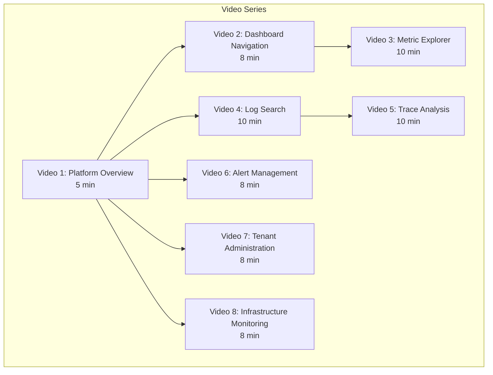

# ERP-Observability Video Training Scripts

## Video Series Overview

This document contains production-ready scripts for 8 training videos covering all ERP-Observability functionality. Each script includes narration, screen directions, and timing markers.

---

## Video 1: Platform Overview (5 minutes)

### TITLE CARD
**"ERP-Observability: Your Unified Monitoring Platform"**

### NARRATION

**[0:00 - 0:30] Opening**

> Welcome to ERP-Observability, the unified observability platform for the OpenSASE ERP suite. In this video, you will get an overview of how the platform provides a single pane of glass for monitoring all 20+ ERP modules, enabling you to detect issues faster, resolve incidents more efficiently, and maintain the reliability your users expect.

**[0:30 - 1:30] What is ERP-Observability?**

*[Screen: Show the main dashboard with module health grid and KPIs]*

> ERP-Observability consolidates five critical monitoring capabilities into a single platform. First, Metrics -- powered by VictoriaMetrics, giving you real-time numerical data about your systems. Second, Logs -- powered by Quickwit, providing sub-second search across billions of log lines. Third, Traces -- also powered by Quickwit, showing you the complete path of requests across services. Fourth, Alerts -- powered by Alertmanager, notifying you when things go wrong. And fifth, Infrastructure Monitoring -- powered by Zabbix and OpenNMS, keeping an eye on your hosts, networks, and physical infrastructure. Think of it as Datadog, Splunk, and Zabbix combined into one self-hosted solution.

**[1:30 - 3:00] Architecture at a Glance**

*[Screen: Show animated architecture diagram]*

> Here is how data flows through the platform. Every ERP module is instrumented with OpenTelemetry SDKs. These SDKs emit metrics, logs, and traces to the OTel Collector, which is the central telemetry pipeline. The Collector processes, enriches, and routes this data to the appropriate backends: VictoriaMetrics for metrics and Quickwit for logs and traces. Grafana connects to these backends to power your dashboards. When metrics cross thresholds, VictoriaMetrics evaluates alert rules and sends them to Alertmanager, which handles routing, grouping, and notification delivery to your channels -- Slack, email, PagerDuty, or custom webhooks.

**[3:00 - 4:00] Navigation Tour**

*[Screen: Click through each sidebar item]*

> Let me walk you through the main navigation. The Dashboard shows your module health grid, SLO status, and real-time event feed. Metrics opens the Metric Explorer where you can write PromQL queries and build time series charts. Logs gives you a powerful search interface for finding needles in your log haystack. Traces lets you follow requests across service boundaries. Alerts shows your active alerts, rules, and silences. Infrastructure provides the Zabbix host overview, OpenNMS event console, and network topology. Search offers unified cross-signal search. And Administration handles tenant management, dashboard provisioning, and system settings.

**[4:00 - 4:30] Multi-Tenant Isolation**

*[Screen: Show tenant selector and X-Scope-OrgID explanation]*

> Everything in ERP-Observability is multi-tenant. When you log in, your tenant is automatically identified from your JWT token. All queries, dashboards, alerts, and data are scoped to your tenant. You will only ever see your own data. This isolation is enforced at every layer -- from the API gateway through to the storage backends.

**[4:30 - 5:00] Closing**

> In the following videos, we will dive deep into each area. Whether you are an SRE monitoring SLOs, a developer debugging a production issue, or an administrator managing tenants, this platform has you covered. Let us start with Dashboard Navigation.

---

## Video 2: Dashboard Navigation (8 minutes)

### NARRATION

**[0:00 - 0:30] Introduction**

> In this video, you will learn how to navigate the observability dashboards to quickly assess the health of your ERP modules and identify areas that need attention.

**[0:30 - 2:30] Main Dashboard Layout**

*[Screen: Show the main dashboard with all components visible]*

> The main dashboard is organized into four sections. At the top, KPI cards show your global metrics: total requests per second across all modules, global error rate, p99 latency, and the count of active alerts. These update in real-time. Below that, the Module Health Grid shows a card for each ERP module. Green means healthy -- error rate below 1% and latency within SLO. Yellow means degraded -- error rate between 1% and 5%. Red means critical -- error rate above 5% or the module is unreachable. Click any module card to drill into its dedicated dashboard.

*[Screen: Show SLO Status Board]*

> On the right side, the SLO Status Board shows your Service Level Objectives. Each SLO displays: the target (e.g., 99.9% availability), the current compliance percentage, and the remaining error budget. The burn rate indicator shows whether you are consuming error budget faster than expected. A burn rate above 1.0 means you are on track to exhaust your budget before the window ends.

**[2:30 - 4:30] Time Range and Refresh**

*[Screen: Demonstrate time range picker]*

> The time range picker in the top right controls the data window for all panels. Click it to choose quick ranges like Last 15 minutes, Last 1 hour, or Last 24 hours. For incident investigation, use the Custom option to pinpoint exact time windows. The auto-refresh dropdown next to it controls how often data updates -- 10 seconds for live monitoring, 30 seconds for general use, or off for static analysis.

*[Screen: Zoom into a chart]*

> You can also zoom into charts by click-dragging to select a time range directly on the chart. This updates the global time range, and all other panels follow. To zoom back out, use the browser back button or click the time range picker and select a wider range.

**[4:30 - 6:30] Module-Specific Dashboards**

*[Screen: Click into ERP-CRM module dashboard]*

> Let us drill into the ERP-CRM module dashboard. This dashboard follows the RED method: Rate, Errors, Duration. The top row shows the request rate -- total requests per second broken down by endpoint. The middle row shows error rate -- both as a percentage and as a count of 4xx and 5xx responses. The bottom row shows duration -- p50, p95, and p99 latency. Below these are panels for the top 5 slowest endpoints, recent error logs, and active alerts specific to this module.

**[6:30 - 7:30] Dashboard Variables**

*[Screen: Show variable dropdowns at the top of a dashboard]*

> Most dashboards include variables at the top -- dropdown menus that let you filter data. Common variables include: Environment (production, staging), Service Instance (individual pod), and HTTP Method (GET, POST, PUT). Select different values and watch the panels update instantly. This lets you focus on exactly the slice of data you need.

**[7:30 - 8:00] Summary**

> Dashboards are your first stop for understanding system health. Start with the main dashboard for the big picture, drill into module dashboards for details, and use variables to filter down to specific components. In the next video, we will explore the Metric Explorer for ad-hoc analysis.

---

## Video 3: Metric Explorer (10 minutes)

### NARRATION

**[0:00 - 0:30] Introduction**

> The Metric Explorer is your tool for ad-hoc metric analysis. While dashboards show pre-built views, the Metric Explorer lets you write custom queries to answer any question about your system's behavior.

**[0:30 - 3:00] Browsing Metrics**

*[Screen: Open Metric Explorer, show the metric browser tree]*

> Open the Metric Explorer from the sidebar. On the left, you will see the metric browser organized by module. Expand a module to see its available metrics. Each metric shows its type -- counter, gauge, or histogram -- and a description. Click a metric to see its current value and available labels.

*[Screen: Show autocomplete in the query editor]*

> Alternatively, start typing in the query editor. The autocomplete suggests metric names as you type. Type "erp_crm" and you will see all CRM metrics. Select one, and the autocomplete then suggests label names and values. This makes it easy to build queries without memorizing metric names.

**[3:00 - 5:30] Writing PromQL Queries**

*[Screen: Type queries and show results]*

> Let me walk through common query patterns. For request rate, type: sum rate erp_http_requests_total, select a 5 minute range, and group by module. This shows you the requests per second for each module as a time series chart.

> For error rate as a percentage, divide the rate of 5xx responses by the total request rate and multiply by 100. This gives you a clean error rate percentage that you can compare across modules.

> For latency percentiles, use histogram_quantile with the bucket metric. The 0.99 quantile gives you the p99 latency, meaning 99% of requests complete faster than this value. This is your most important latency metric for SLO tracking.

**[5:30 - 7:30] Visualization Options**

*[Screen: Switch between chart types]*

> The Metric Explorer supports several visualization types. Time Series shows values over time as a line or area chart. This is your default view. Table shows the raw data in tabular form, useful for exact values. Heatmap is ideal for histograms, showing latency distribution over time with color intensity. Stat shows a single aggregate value, perfect for KPI displays.

*[Screen: Show chart options]*

> Customize your chart with the options panel: change the Y-axis scale (linear or logarithmic), add thresholds (draw lines at warning and critical levels), enable stacking for area charts, and adjust the legend position.

**[7:30 - 9:00] Comparing Time Periods**

*[Screen: Enable comparison mode]*

> Click Compare to overlay a previous time period. Choose "Previous day" to see how today compares to yesterday. The comparison appears as a dotted line. This is invaluable after deployments -- you can immediately see if request rates, error rates, or latency changed. The percentage difference is shown in the legend.

**[9:00 - 10:00] Saving Queries and Summary**

> When you find a useful query, click Save to add it to your personal query library. You can also click "Add to Dashboard" to create a new panel on any of your dashboards. The Metric Explorer is the power tool for SREs -- master PromQL and you can answer any question about your system.

---

## Video 4: Log Search (10 minutes)

### NARRATION

**[0:00 - 0:30] Introduction**

> When metrics tell you something is wrong, logs tell you why. In this video, you will learn how to search, filter, and analyze logs across all ERP modules using the Quickwit-powered log search interface.

**[0:30 - 3:00] Basic Search**

*[Screen: Navigate to Logs, show the search interface]*

> The Log Search interface has three main areas: the search bar at the top, the filter panel on the left, and the results table in the center. Start by entering a keyword in the search bar -- for example, "connection refused". The search runs across all log messages and returns matching entries sorted by timestamp.

*[Screen: Show search results expanding]*

> Each result shows: timestamp, severity badge, service name, and the log message. Click a row to expand it and see all fields: trace_id, span_id, resource attributes (like pod name and namespace), and any custom log attributes. The matching keyword is highlighted in the message.

**[3:00 - 5:00] Structured Filtering**

*[Screen: Use the filter panel]*

> For more precise searches, use the filter panel. Click the Service dropdown and select "erp-crm". Click Severity and check "ERROR" and "WARN". Now you see only warnings and errors from the CRM module. Add a time range -- say, the last hour. The query updates in real-time as you add filters.

*[Screen: Show field-specific search]*

> You can also search specific fields. Enter "service_name:erp-iam AND severity:ERROR AND body:authentication" to find authentication errors in the IAM module. Use AND, OR, and NOT operators to combine conditions. Use quotes for exact phrases: "database connection pool exhausted".

**[5:00 - 7:00] Log-to-Trace Correlation**

*[Screen: Find a log with trace_id, click to view trace]*

> One of the most powerful features is log-to-trace correlation. When you find an error log, look for the trace_id field. Click the "View Trace" button next to it. This takes you directly to the trace waterfall view, showing you the complete request flow that produced this error. You can see which upstream service made the call, which downstream service failed, and exactly how long each step took.

**[7:00 - 8:30] Real-Time Log Tailing**

*[Screen: Enable live mode]*

> For monitoring deployments or reproducing issues, use the Live mode. Click the Live toggle in the top right. Logs begin streaming in real-time via WebSocket. Apply filters to focus on your specific service and severity. The stream auto-scrolls to show new entries. Click Pause to freeze the stream and investigate a specific log line. Click Resume to continue.

**[8:30 - 9:30] Log Aggregations**

*[Screen: Show aggregation charts]*

> Above the results table, you will see the log volume histogram showing log count over time. The colored bars represent severity levels. Spikes in error logs often correlate with incidents. Click a bar to zoom into that time window. You can also switch to aggregation mode to see counts by service, severity, or any other field.

**[9:30 - 10:00] Summary**

> Log search is your diagnostic tool. Start with a keyword, narrow with filters, correlate with traces, and use live tailing for real-time debugging. In the next video, we will explore trace analysis in detail.

---

## Video 5: Trace Analysis (10 minutes)

### NARRATION

**[0:00 - 0:30] Introduction**

> Distributed traces show you the complete journey of a request across all services. In this video, you will learn how to search for traces, interpret waterfall diagrams, and use the service map.

**[0:30 - 3:00] Trace Search**

*[Screen: Navigate to Traces, show search interface]*

> The Trace search interface lets you find traces by multiple criteria. Select a Service to filter by the originating service. Set a minimum Duration to find slow requests -- for example, set it to 500 milliseconds to find all requests taking over half a second. Filter by Status to see only error traces. The results table shows each trace with its trace ID, root service, root operation, total duration, span count, and error indicator.

**[3:00 - 6:00] Waterfall View**

*[Screen: Click a trace, show waterfall diagram]*

> Click a trace to open the waterfall view. Each horizontal bar represents a span -- a unit of work within a service. The width of the bar is proportional to its duration. Bars are nested to show parent-child relationships: the top bar is the root span (usually an HTTP handler), and child spans below it show downstream calls.

> Error spans are highlighted in red. Look for the red spans to quickly identify failure points. Click any span to see its details: service name, operation name, duration, status code, and all span attributes. The Events tab shows log-like events attached to the span.

*[Screen: Show a specific slow trace]*

> In this example, we can see the root span took 1.2 seconds. Most of that time was spent in a database query span that took 1.1 seconds. This immediately tells us the root cause is a slow database query, not application code. We can click the database span to see the SQL query in its attributes.

**[6:00 - 8:00] Service Map**

*[Screen: Navigate to Service Map]*

> The Service Map provides a topology view of all services and their communication patterns. Each node is a service, and each edge represents calls between services. The node size reflects request volume. Edge labels show the request rate and error rate.

> Green edges indicate healthy communication. Red edges indicate elevated error rates. Thick edges indicate high traffic. This view is invaluable for understanding the overall system architecture and identifying which service relationships are problematic.

*[Screen: Click a service node]*

> Click a service node to see its summary: request rate, error rate, latency percentiles, and the services it depends on. Click "View Traces" to search for traces involving this service.

**[8:00 - 9:30] Cross-Service Correlation**

*[Screen: Show a trace spanning multiple services]*

> Distributed tracing really shines when a request spans multiple services. In this trace, we can see a request enter through the API gateway, flow to ERP-CRM, which calls ERP-IAM for authentication, then calls ERP-Accounting for invoice generation. If any step fails, the trace shows exactly where and why. Combine this with log correlation -- click any span's "View Logs" to see all logs produced during that span's execution.

**[9:30 - 10:00] Summary**

> Traces are your most powerful debugging tool for distributed systems. Use search to find interesting traces, the waterfall to understand request flows, and the service map for topology awareness. Combined with metrics and logs, you have complete observability.

---

## Video 6: Alert Management (8 minutes)

### NARRATION

**[0:00 - 0:30] Introduction**

> Alerts are the bridge between observability data and human action. In this video, you will learn how to manage alert rules, handle active alerts, and configure silences.

**[0:30 - 2:30] Viewing Active Alerts**

*[Screen: Navigate to Alerts > Active]*

> The Active Alerts page shows all currently firing alerts. Each alert displays: severity badge (Critical in red, Warning in orange, Info in blue), alert name, the module it belongs to, the current value that triggered it, and how long it has been firing. Click any alert to see its full details: the PromQL expression, all labels, annotations including a summary and runbook link, and the notification history.

**[2:30 - 4:30] Creating Alert Rules**

*[Screen: Navigate to Rules, create a new rule]*

> To create an alert rule, click New Rule. Enter a descriptive name. Write the PromQL expression that defines the alert condition. For example, to alert on high error rate: rate of 5xx responses divided by total requests, greater than 5%. Set the Duration to 5 minutes -- this means the condition must hold for 5 minutes before the alert fires, reducing false positives. Choose the Severity. Add annotations: summary (one-line description), description (detailed context), runbook_url (link to the resolution procedure), and dashboard_url (link to the relevant dashboard). Save the rule.

**[4:30 - 6:00] Alert Routing**

*[Screen: Show Alertmanager routes configuration]*

> Alerts are routed based on their labels. Critical alerts from production go to PagerDuty. Warning alerts go to the team Slack channel. Info alerts go to email. You can customize routes based on module, severity, or any label. The routing tree evaluates top-to-bottom, using the first matching route. Each route specifies: the receiver (notification channel), group_by labels (how alerts are grouped), group_wait (initial wait before sending), and repeat_interval (how often to re-send).

**[6:00 - 7:30] Managing Silences**

*[Screen: Create a silence]*

> During planned maintenance, you do not want alerts firing. Create a Silence by specifying matchers -- label pairs that identify which alerts to silence. For example, matcher module equals erp-crm silences all CRM alerts. Set an expiration time -- silences cannot exceed 7 days. Add a comment explaining why this silence exists. The silence takes effect immediately and appears in the Silences tab. Active silences show a countdown to expiration.

**[7:30 - 8:00] Summary**

> Effective alerting is about signal, not noise. Create alerts for actionable conditions, set appropriate thresholds, always include runbook links, and use silences responsibly during maintenance.

---

## Video 7: Tenant Administration (8 minutes)

### NARRATION

**[0:00 - 0:30] Introduction**

> Platform administrators manage the multi-tenant observability environment. In this video, you will learn how to provision tenants, configure settings, and monitor usage.

**[0:30 - 3:00] Creating a New Tenant**

*[Screen: Navigate to Administration > Tenants > New Tenant]*

> Click New Tenant and fill in the tenant ID -- this is the unique identifier used across all systems. Enter the display name and configure initial settings: default retention periods, notification channels, and resource quotas. Click Create and Provision.

> The automated provisioning process creates: a Grafana organization with an admin user, a VictoriaMetrics namespace with vmauth routing, Quickwit indexes for logs and traces, a Zabbix host group with default monitoring templates, and Alertmanager routes with default alert rules. This typically completes in under 5 minutes.

**[3:00 - 5:00] Configuring Tenant Settings**

*[Screen: Open tenant configuration page]*

> Each tenant has configurable settings. Retention policies control how long data is kept: 30 days default for metrics, 90 days for logs, 7 days for traces. Adjust these based on the tenant's compliance requirements and budget. Quotas limit resource consumption: maximum active time series, log ingestion rate, and storage capacity. Notification channels define where alerts are sent: configure Slack webhooks, email recipients, PagerDuty integration keys.

**[5:00 - 6:30] Monitoring Usage**

*[Screen: Show usage dashboard for a tenant]*

> The Usage page shows per-tenant resource consumption. Active time series count shows how many unique metric series the tenant is generating. Log volume shows daily ingestion in gigabytes. Trace volume shows daily span count. Storage consumption shows total disk usage across all data types. Set usage alerts to notify you when tenants approach their quotas.

**[6:30 - 7:30] Tenant Decommissioning**

*[Screen: Show decommission process]*

> When a tenant no longer needs observability services, use the Decommission workflow. This removes the Grafana organization, deletes VictoriaMetrics data, drops Quickwit indexes, removes Zabbix host groups, and cleans up Alertmanager routes. A confirmation dialog lists all resources that will be deleted. The operation is logged in the audit trail for compliance.

**[7:30 - 8:00] Summary**

> Tenant administration is about enabling self-service while maintaining control. Automated provisioning gets tenants up and running quickly, quotas prevent resource abuse, and usage monitoring enables informed capacity planning.

---

## Video 8: Infrastructure Monitoring (8 minutes)

### NARRATION

**[0:00 - 0:30] Introduction**

> While application observability covers your code, infrastructure monitoring covers the hosts, networks, and physical systems your code runs on. In this video, you will learn how to use the Zabbix and OpenNMS integration for infrastructure monitoring.

**[0:30 - 3:00] Zabbix Host Overview**

*[Screen: Navigate to Infrastructure > Hosts]*

> The host overview shows all Zabbix-monitored hosts. Each row displays: hostname, IP address, agent status (online shown in green, offline in red), and sparkline charts for CPU, memory, disk, and network utilization. The status column shows active problems -- click the count to see the specific triggers.

*[Screen: Click into a host detail]*

> Click a host for its detailed view. The overview tab shows current metrics: CPU cores and utilization, total and used memory, disk partitions with usage percentages, and network interfaces with throughput. The History tab shows metric graphs over time. The Triggers tab shows the host's alert conditions and their current status.

**[3:00 - 5:00] Zabbix Triggers and Alerts**

*[Screen: Show active triggers]*

> Navigate to Infrastructure > Triggers to see all active problems. Triggers are ordered by severity: Disaster, High, Average, Warning, Information. Common triggers include: CPU utilization above 90% for 10 minutes, disk space below 10%, memory usage above 95%, and network interface down. These triggers feed into Alertmanager alongside application alerts, so your on-call rotation receives both infrastructure and application alerts through the same channels.

**[5:00 - 6:30] OpenNMS Event Console**

*[Screen: Navigate to Infrastructure > Events]*

> The OpenNMS event console shows correlated events across your infrastructure. Unlike individual metrics, OpenNMS performs event correlation -- it connects related events to identify root causes. For example, if a network switch fails, OpenNMS correlates the switch-down event with all downstream host-unreachable events, helping you quickly identify that 20 host alerts are all caused by one switch failure.

*[Screen: Show event acknowledgment]*

> Acknowledge events to indicate they are being investigated. Escalate events that need immediate attention. Clear events that have been resolved. The event lifecycle is tracked and auditable.

**[6:30 - 7:30] Network Topology**

*[Screen: Show network topology map]*

> The topology view shows your network as an interactive map. Nodes represent hosts and network devices. Edges represent connections. Node colors indicate status. Click and drag to explore. Search for specific devices. The topology is auto-discovered by OpenNMS, so as new devices appear on the network, they are automatically added to the map.

**[7:30 - 8:00] Summary**

> Infrastructure monitoring complements application observability. Zabbix provides deep host-level metrics and triggers, OpenNMS adds event correlation and topology awareness. Together with VictoriaMetrics metrics and Quickwit logs, you have complete visibility from the application layer down to the physical infrastructure.

---

## Production Notes

| Video | Resolution | Format | Estimated File Size |
|-------|-----------|--------|-------------------|
| All | 1920x1080 | MP4 (H.264) | 50-150 MB each |
| Screen recording | 60 FPS | Lossless capture | Post-process to 30 FPS |
| Audio | 48kHz/16-bit | WAV capture | Post-process to AAC |
| Captions | SRT format | Auto + manual review | - |

Total series duration: approximately 67 minutes.
