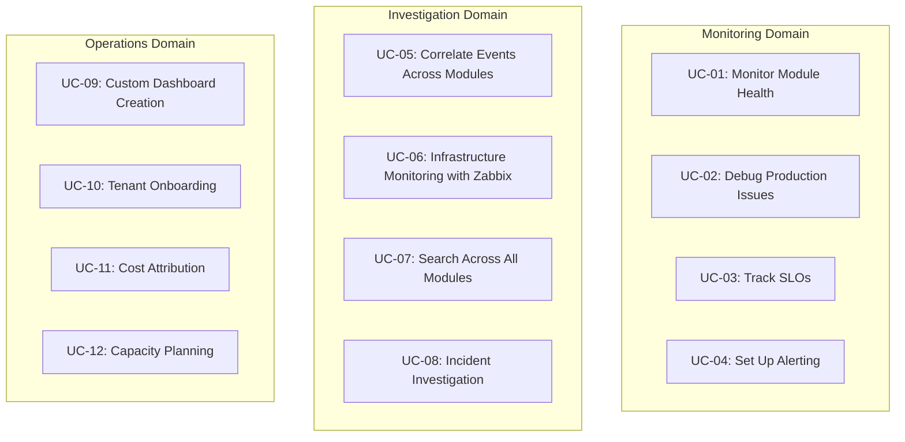

# ERP-Observability Use Cases

## Use Case Overview

This document defines 12 use cases spanning metrics, logs, traces, alerts, infrastructure, and administration domains within ERP-Observability.

---

## Monitoring Domain

### UC-01: Monitor Module Health

**Actor:** SRE, DevOps Engineer
**Precondition:** ERP modules are instrumented with OTel SDKs and emitting telemetry
**Trigger:** Routine health check or shift handoff

**Main Flow:**
1. SRE navigates to the Main Dashboard
2. System displays Module Health Grid with status cards for each ERP module
3. Each card shows: module name, status indicator (green/yellow/red), request rate, error rate, p99 latency
4. SRE identifies any modules in yellow (degraded) or red (critical) state
5. SRE clicks a degraded module card to drill into its dedicated dashboard
6. Module dashboard shows RED metrics (Rate, Errors, Duration) broken down by endpoint
7. SRE reviews top-5 slowest endpoints and recent error logs
8. SRE checks the SLO Status Board for error budget consumption

**Alternative Flows:**
- 4a. All modules green: SRE reviews SLO burn rates for early warning signs
- 6a. Module dashboard shows spike in errors: SRE proceeds to UC-02 (Debug Production Issues)
- 8a. Error budget below 20%: SRE escalates to module team for reliability focus

**Postcondition:** SRE has current understanding of system health across all modules

---

### UC-02: Debug Production Issues

**Actor:** SRE, Module Developer
**Precondition:** An issue has been identified (alert firing, user report, or dashboard anomaly)
**Trigger:** Alert notification or health check reveals a problem

**Main Flow:**
1. SRE opens the alert notification containing the alert name, severity, and module
2. SRE navigates to the module's dashboard and identifies the affected metric (error rate, latency, availability)
3. SRE uses the Metric Explorer to write a targeted PromQL query narrowing down the problem:
   - `rate(erp_http_requests_total{status=~"5..", module="erp-crm", endpoint="/api/v1/contacts"}[5m])`
4. SRE pivots to Log Search: filters by module, severity=ERROR, and the time window of the anomaly
5. SRE finds error log messages with stack traces and a trace_id
6. SRE clicks "View Trace" to open the trace waterfall view
7. Trace waterfall reveals: request entered via API gateway, called ERP-CRM contacts endpoint, which called YugabyteDB, and the database span shows a timeout error
8. SRE identifies root cause: database connection pool exhaustion due to a slow query
9. SRE adds a Grafana annotation marking the incident start time
10. SRE or developer applies a fix (query optimization, connection pool increase)
11. SRE monitors metrics to confirm recovery

**Alternative Flows:**
- 5a. No error logs found: SRE checks infrastructure metrics (Zabbix) for host-level issues
- 7a. Trace shows error in external service: SRE checks OpenNMS event console for network issues
- 10a. Fix requires deployment: SRE creates a silence for the alert during remediation

**Postcondition:** Root cause identified and resolved, incident documented with observability data links

---

### UC-03: Track Service Level Objectives (SLOs)

**Actor:** SRE, Platform Admin
**Precondition:** SLOs are defined in the platform with target percentages and measurement windows
**Trigger:** Weekly SLO review meeting or automated SLO report

**Main Flow:**
1. SRE navigates to the SLO Status Board on the Main Dashboard
2. System displays all defined SLOs with: service name, SLO target, current compliance, error budget remaining, burn rate
3. SRE identifies SLOs with burn rate above 1.0 (consuming budget faster than sustainable)
4. SRE drills into a specific SLO to see the compliance trend over the measurement window (e.g., 30 days)
5. SRE reviews the error budget timeline showing consumption over time
6. SRE identifies the incidents that consumed the most error budget
7. SRE correlates these incidents with alert history to understand patterns
8. SRE presents findings at the SLO review meeting with recommended actions

**Alternative Flows:**
- 3a. All burn rates below 1.0: SRE considers tightening SLO targets
- 6a. Single incident consumed >50% of budget: SRE recommends postmortem and preventive action
- 8a. SLO consistently exceeded: SRE recommends increasing the target

**Postcondition:** SRE has data-driven assessment of service reliability for stakeholder review

---

### UC-04: Set Up Alerting for a New Module

**Actor:** DevOps Engineer, Module Developer
**Precondition:** New ERP module is deployed and emitting metrics via OTel SDK
**Trigger:** New module onboarding to observability platform

**Main Flow:**
1. DevOps engineer navigates to Alerts > Rules > + New Rule
2. Engineer creates standard alert rules for the module:
   - **High Error Rate**: `rate(erp_http_requests_total{status=~"5..", module="erp-new-module"}[5m]) / rate(erp_http_requests_total{module="erp-new-module"}[5m]) > 0.05` for 5m, severity: warning
   - **Critical Error Rate**: Same expression with threshold > 0.10, severity: critical
   - **High Latency**: `histogram_quantile(0.99, sum(rate(erp_http_request_duration_seconds_bucket{module="erp-new-module"}[5m])) by (le)) > 1` for 5m, severity: warning
   - **Service Down**: `up{module="erp-new-module"} == 0` for 1m, severity: critical
3. Engineer adds annotations to each rule: summary, description, runbook_url, dashboard_url
4. Engineer configures notification routing: critical to PagerDuty, warning to Slack
5. Engineer tests rules by temporarily lowering thresholds to trigger an alert
6. Engineer verifies notification delivery to configured channels
7. Engineer restores production thresholds

**Alternative Flows:**
- 2a. Module uses custom metrics: Engineer creates module-specific alerts based on business metrics
- 6a. Notification not received: Engineer checks Alertmanager routes and receiver configuration

**Postcondition:** New module has complete alerting coverage with tested notification delivery

---

## Investigation Domain

### UC-05: Correlate Events Across Modules

**Actor:** SRE
**Precondition:** An incident affects multiple ERP modules simultaneously
**Trigger:** Multiple alerts fire across different modules within a short time window

**Main Flow:**
1. SRE receives multiple alert notifications from different modules
2. SRE opens the Main Dashboard and sees multiple modules in red/yellow state
3. SRE navigates to Search (Unified Cross-Signal Search)
4. SRE searches for the time window of the incident across all modules
5. System returns correlated results from metrics (anomalies), logs (errors), and traces (failures)
6. SRE uses the Service Map to visualize inter-module dependencies
7. SRE identifies the common upstream service (e.g., ERP-IAM authentication failure affecting all modules)
8. SRE checks OpenNMS Event Console for infrastructure event correlation
9. OpenNMS shows: the IAM database server had a disk failure, correlating with all downstream service errors
10. SRE focuses remediation on the root cause (database server) rather than individual module symptoms

**Alternative Flows:**
- 7a. No common upstream service: SRE checks infrastructure (Zabbix) for shared resource issues
- 9a. No infrastructure events: SRE investigates network-level issues via OpenNMS topology

**Postcondition:** Root cause of multi-module incident identified through cross-signal correlation

---

### UC-06: Monitor Infrastructure with Zabbix

**Actor:** IT Operations, DevOps Engineer
**Precondition:** Zabbix agents are deployed on hosts and SNMP is configured for network devices
**Trigger:** Routine infrastructure review or Zabbix trigger alert

**Main Flow:**
1. IT Ops navigates to Infrastructure > Hosts
2. System displays all monitored hosts with status, CPU, memory, disk, network sparklines
3. IT Ops identifies a host with CPU utilization consistently above 85%
4. IT Ops clicks the host for detailed metrics
5. Host detail shows: per-core CPU usage, memory breakdown (used, cached, buffers), disk I/O per partition, network throughput per interface
6. IT Ops checks the Triggers tab for active problems
7. Trigger shows: "CPU utilization > 85% for 30 minutes" -- Warning severity
8. IT Ops investigates the top processes consuming CPU by checking application-level metrics
9. IT Ops determines the cause (e.g., a runaway log aggregation job) and takes corrective action
10. IT Ops verifies CPU utilization returns to normal levels

**Alternative Flows:**
- 3a. All hosts healthy: IT Ops reviews capacity trends for planning
- 7a. No triggers but high utilization: IT Ops reviews thresholds and adjusts if needed
- 9a. Cause is application-level: IT Ops notifies module team and links to observability data

**Postcondition:** Infrastructure issue identified and resolved, capacity data recorded for planning

---

### UC-07: Search Across All Modules

**Actor:** SRE, Module Developer
**Precondition:** Observability data is being ingested from multiple modules
**Trigger:** Need to find occurrences of a specific pattern across the entire platform

**Main Flow:**
1. User navigates to Search (Unified Search)
2. User enters a search query: "database connection refused"
3. System searches across:
   - Quickwit logs: full-text search in log body field
   - Quickwit traces: search in span attributes and events
   - VictoriaMetrics: search in metric label values
4. Results are displayed in a unified view, grouped by signal type (logs, traces, metrics)
5. User filters results by module, time range, and severity
6. User identifies that "database connection refused" appears in ERP-CRM, ERP-Accounting, and ERP-Inventory logs
7. User correlates the timestamp to find they all started at the same time
8. User concludes that the shared database had a connectivity issue at that time

**Alternative Flows:**
- 4a. No results: User broadens the search query or time range
- 6a. Pattern appears in only one module: User proceeds with module-specific investigation

**Postcondition:** Cross-module pattern identified and correlated

---

### UC-08: Incident Investigation (Full Lifecycle)

**Actor:** SRE (On-Call)
**Precondition:** A critical alert has fired, indicating a production incident
**Trigger:** PagerDuty page received by on-call SRE

**Main Flow:**
1. SRE receives page: "Critical: ERP-CRM Error Rate > 10% for 5 minutes"
2. SRE opens the observability platform on their laptop or phone
3. SRE navigates to the ERP-CRM module dashboard
4. Dashboard confirms: error rate spiked from 0.5% to 12% starting at 14:32 UTC
5. SRE checks recent deployment annotations -- no recent deployments
6. SRE opens Log Search, filters: module=erp-crm, severity=ERROR, time=14:30-now
7. Logs show: "context deadline exceeded" errors from the contacts endpoint
8. SRE copies a trace_id from the error log and opens the trace
9. Trace waterfall shows: the database call span has a 30-second timeout
10. SRE checks Zabbix: the database server shows disk I/O saturation at 100%
11. SRE adds a Grafana annotation marking incident start
12. SRE creates a silence for warning-level CRM alerts to reduce noise
13. SRE contacts DBA team with specific evidence: disk I/O charts, slow query logs, trace waterfall
14. DBA identifies and terminates a runaway maintenance query
15. SRE monitors metrics: error rate drops to normal within 2 minutes
16. SRE resolves the silence and adds annotation marking incident end
17. SRE writes postmortem with links to all observability data (dashboard URLs, log queries, trace IDs)

**Postcondition:** Incident resolved, postmortem documented with observability data links, mean time to resolution recorded

---

## Operations Domain

### UC-09: Custom Dashboard Creation

**Actor:** DevOps Engineer, SRE
**Precondition:** Grafana access with Editor or Admin role
**Trigger:** Team needs a custom view not covered by default dashboards

**Main Flow:**
1. User navigates to Administration > Dashboards > + New Dashboard
2. User adds panels one by one:
   - Time series panel: request rate over time (PromQL query)
   - Stat panel: current p99 latency (PromQL instant query)
   - Log panel: recent error logs (Quickwit query)
   - Table panel: top endpoints by latency (PromQL)
3. User adds variables: module dropdown, environment dropdown, time range
4. User configures panel refresh intervals
5. User arranges panels on the grid and sets titles
6. User saves the dashboard with a descriptive name and tags
7. User shares the dashboard URL with the team

**Alternative Flows:**
- 2a. User needs Zabbix data: Add panels using the Zabbix datasource
- 6a. User wants to share publicly: Enables public snapshot (if permitted by admin)

**Postcondition:** Custom dashboard available and shared with the team

---

### UC-10: Tenant Onboarding

**Actor:** Platform Administrator
**Precondition:** New organization or team requires observability services
**Trigger:** Tenant onboarding request received

**Main Flow:**
1. Admin navigates to Administration > Tenants > + New Tenant
2. Admin enters: tenant_id, display name, initial settings
3. Admin clicks "Create and Provision"
4. System automatically:
   a. Creates Grafana organization with admin user
   b. Creates VictoriaMetrics tenant namespace with vmauth route
   c. Creates Quickwit indexes: `logs-{tenant_id}` and `traces-{tenant_id}`
   d. Creates Zabbix host group: `{tenant_name}`
   e. Creates Alertmanager route for the tenant
   f. Provisions default dashboards (Module Health, SLO Board, Infrastructure)
   g. Creates default alert rules (high error rate, high latency, service down)
5. System reports provisioning status for each component
6. Admin configures tenant-specific settings: retention policies, notification channels, quotas
7. Admin sends onboarding guide to the tenant administrator
8. Tenant admin logs in and verifies access to dashboards, alerts, and data

**Alternative Flows:**
- 5a. Provisioning fails for a component: Admin retries or manually provisions the component
- 8a. No telemetry data appearing: Admin verifies OTel Collector configuration for the tenant's modules

**Postcondition:** Tenant fully provisioned with dashboards, alerts, and data flowing within 5 minutes

---

### UC-11: Cost Attribution

**Actor:** Platform Administrator, Finance
**Precondition:** Multiple tenants are consuming observability resources
**Trigger:** Monthly cost review or billing cycle

**Main Flow:**
1. Admin navigates to Administration > Usage
2. System displays per-tenant resource consumption:
   - Active time series count (VictoriaMetrics)
   - Log volume in GB/day (Quickwit)
   - Trace volume in spans/day (Quickwit)
   - Storage consumption in GB (total across all backends)
3. Admin exports usage data as CSV for the billing period
4. Admin calculates cost attribution using the resource unit costs:
   - Compute cost per 1M time series
   - Storage cost per TB
   - Ingestion cost per GB/day
5. Admin generates cost report per tenant
6. Admin identifies tenants with anomalous usage growth
7. Admin contacts tenants with recommendations for optimization (reduce cardinality, adjust retention, enable sampling)

**Alternative Flows:**
- 6a. Tenant exceeds quota: Admin receives automated alert, contacts tenant
- 7a. Tenant requests cost reduction: Admin enables trace sampling and reduces retention

**Postcondition:** Cost attribution report generated, optimization recommendations delivered

---

### UC-12: Capacity Planning

**Actor:** Platform Administrator, DevOps Engineer
**Precondition:** Historical usage data is available for trend analysis
**Trigger:** Quarterly capacity review or growth projection request

**Main Flow:**
1. Admin navigates to the Platform Capacity Dashboard
2. Dashboard shows trend lines for:
   - Total active time series (growth rate per month)
   - Daily log ingestion volume (growth rate per month)
   - Storage consumption with projected exhaustion date
   - Query latency trends (p99 over time)
3. Admin uses PromQL `predict_linear()` to forecast:
   - `predict_linear(vm_active_timeseries[90d], 180*24*3600)` -- predicted time series in 180 days
   - `predict_linear(quickwit_storage_bytes[90d], 180*24*3600)` -- predicted storage in 180 days
4. Admin identifies that storage will be exhausted in 120 days at current growth rate
5. Admin evaluates options:
   a. Add storage nodes to RustFS cluster
   b. Reduce retention for non-critical tenants
   c. Enable more aggressive downsampling in VictoriaMetrics
   d. Enable trace sampling to reduce trace volume
6. Admin creates a capacity plan with timeline and budget request
7. Admin presents findings to leadership

**Alternative Flows:**
- 4a. Plenty of capacity: Admin documents current state and schedules next review
- 5a. Growth is from a specific tenant: Admin contacts tenant about optimization

**Postcondition:** Capacity plan created with data-driven projections and recommendations
