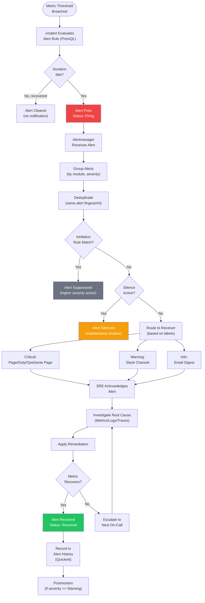
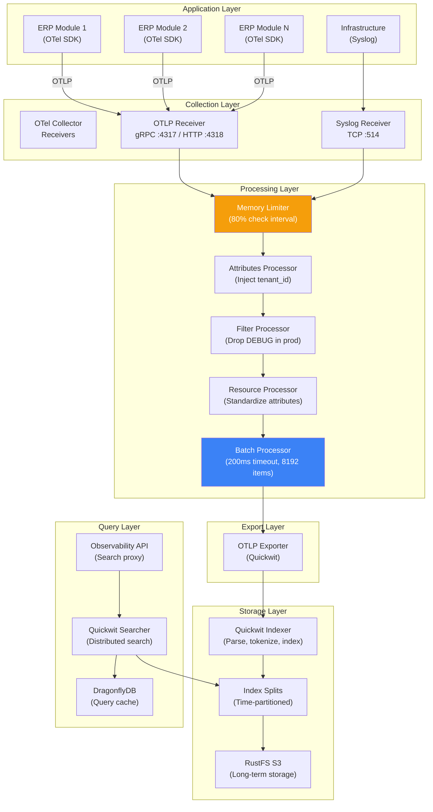
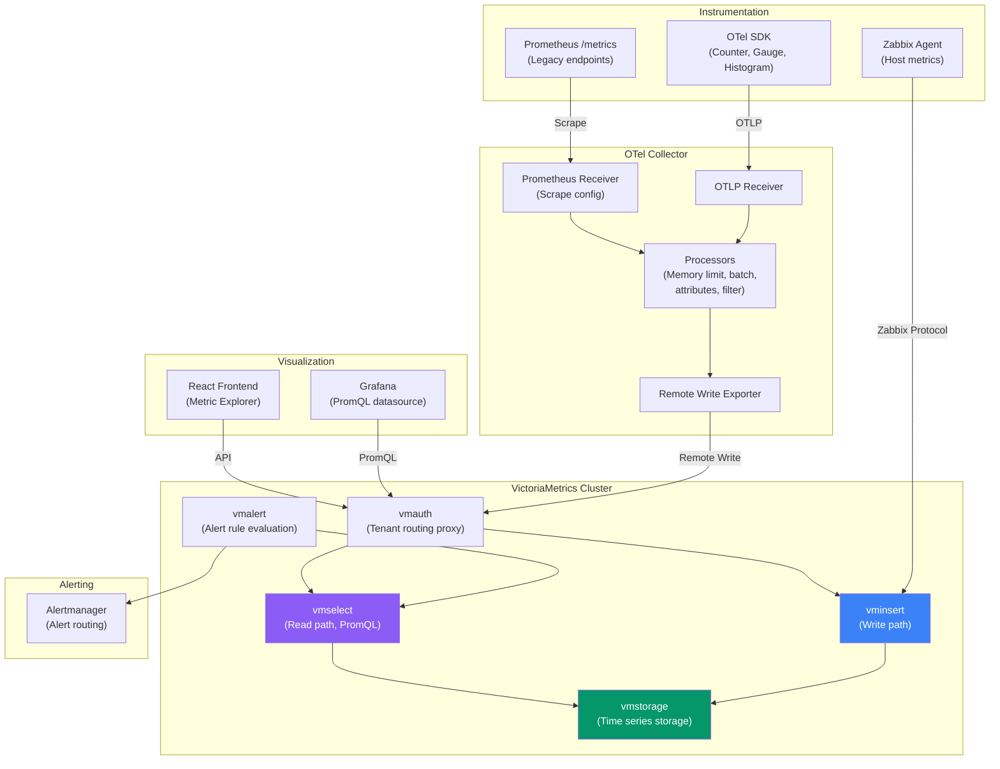
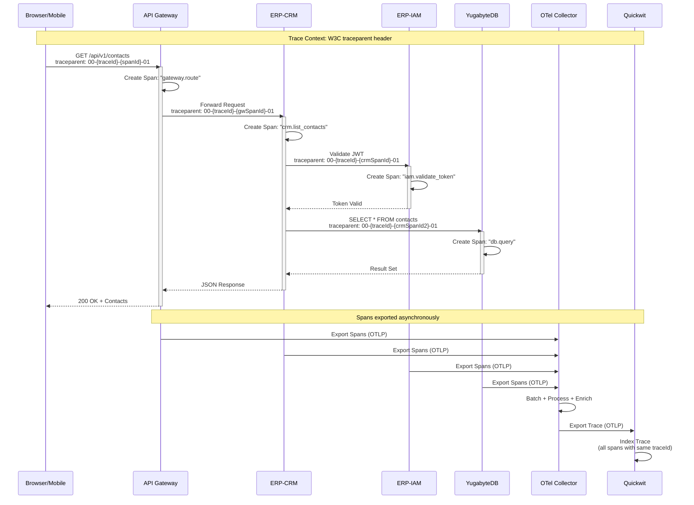
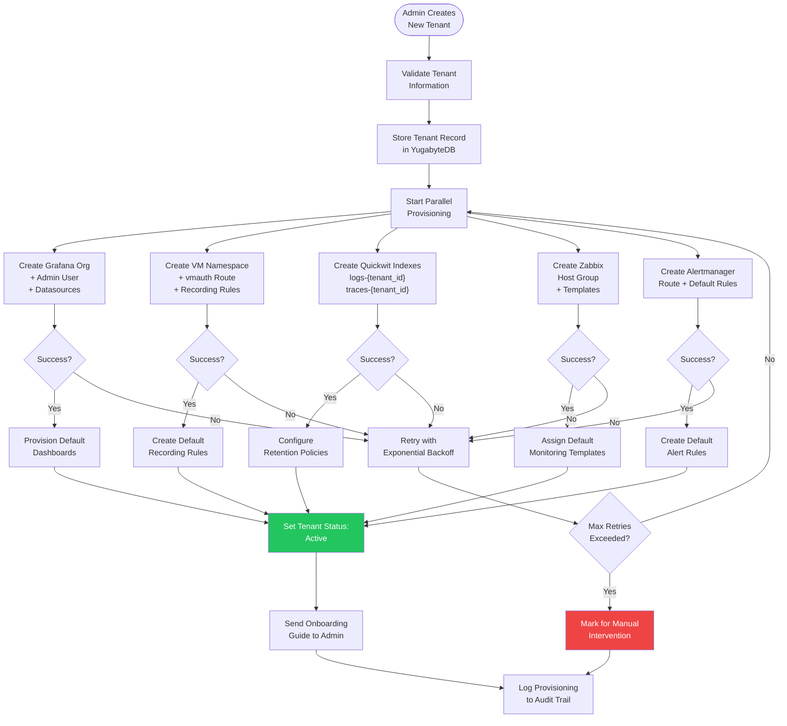
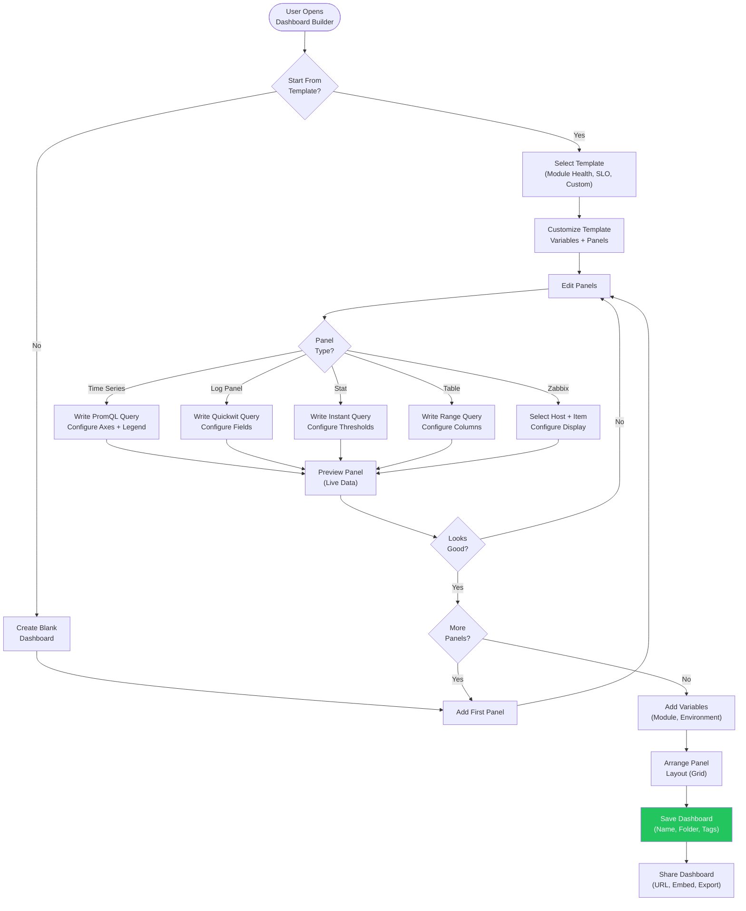
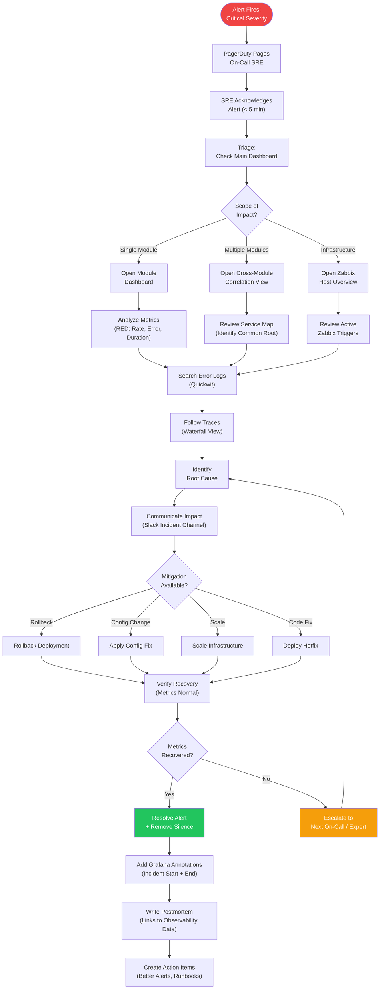
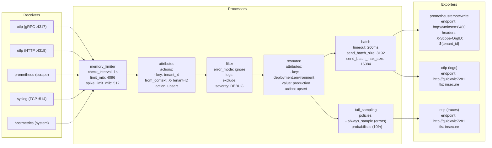
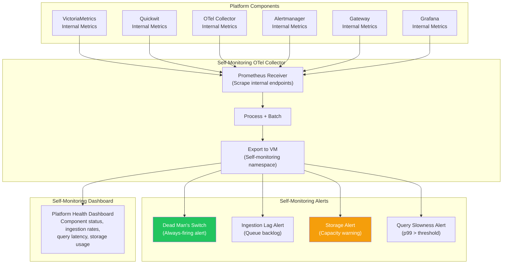

# ERP-Observability Workflow Diagrams

## 1. Alert Lifecycle Workflow

The complete lifecycle of an alert from threshold breach through resolution.

## 2. Log Ingestion Pipeline Workflow

From application log emission through storage and search.

## 3. Metric Collection Flow

From application instrumentation through VictoriaMetrics storage.

## 4. Trace Propagation Workflow

How trace context propagates across ERP services.

## 5. Tenant Provisioning Workflow

Automated stack provisioning when a new tenant is onboarded.

## 6. Dashboard Creation Workflow

From user intent to interactive Grafana dashboard.

## 7. Incident Response Workflow

End-to-end incident response using the observability platform.

## 8. OTel Collector Pipeline Configuration Workflow

How OTel Collector processes telemetry data.

## 9. Self-Monitoring Pipeline Workflow

How the observability platform monitors itself.

