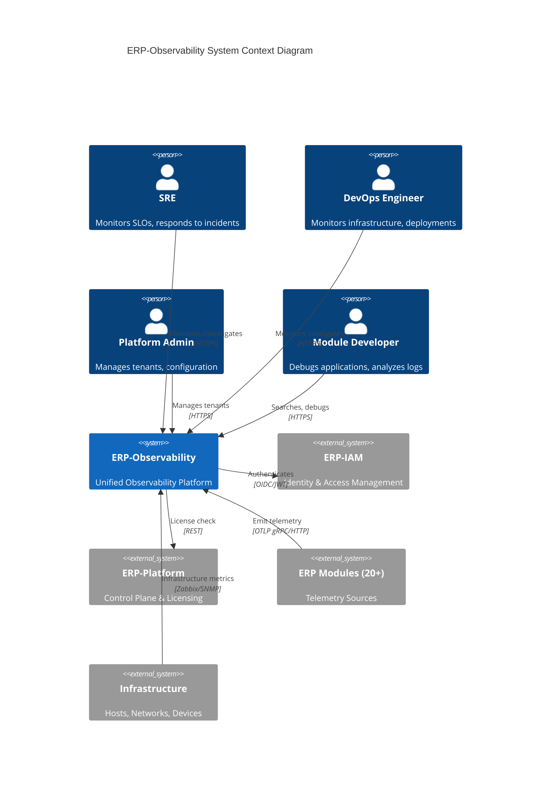
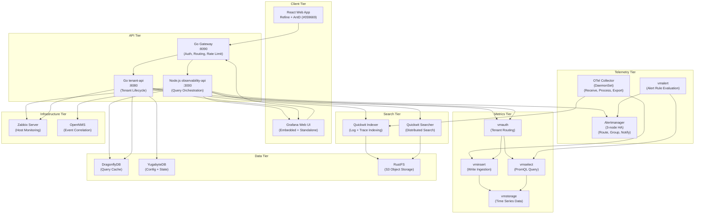
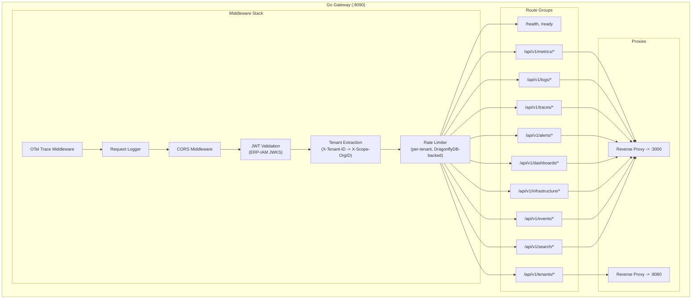
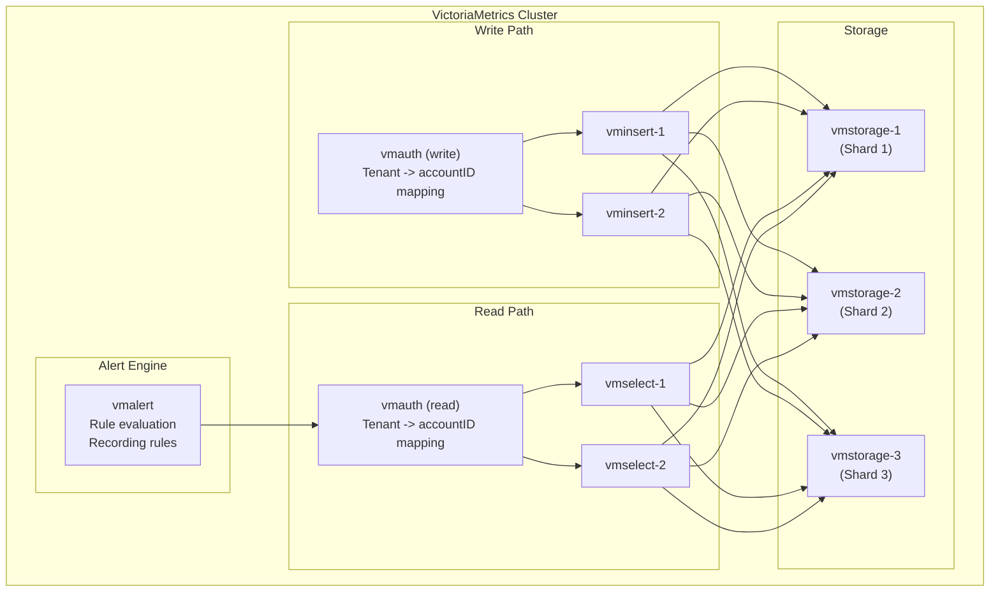
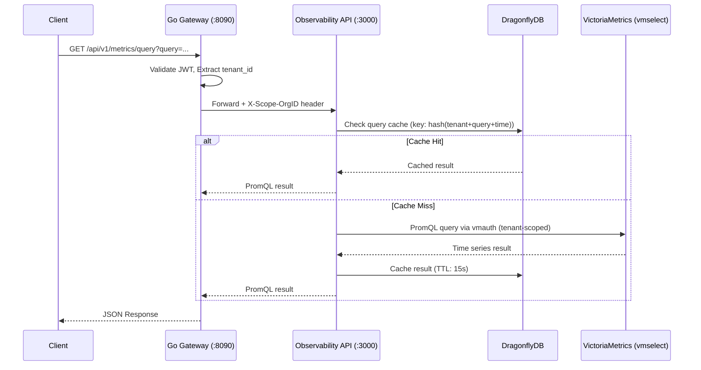
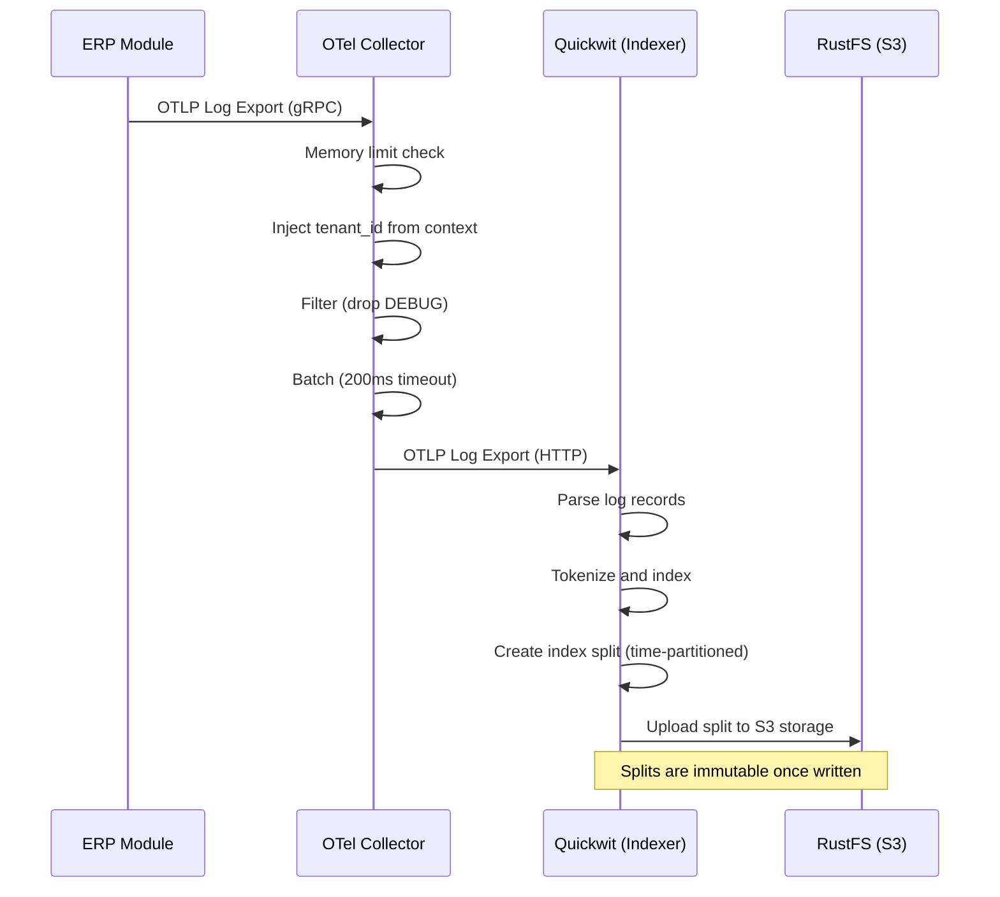
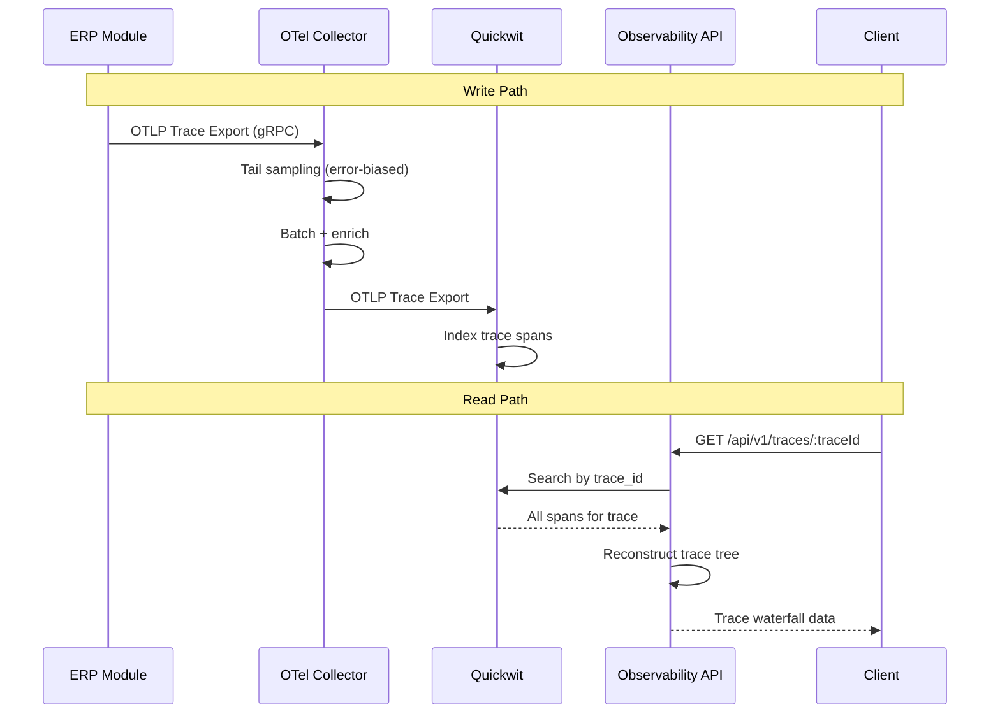
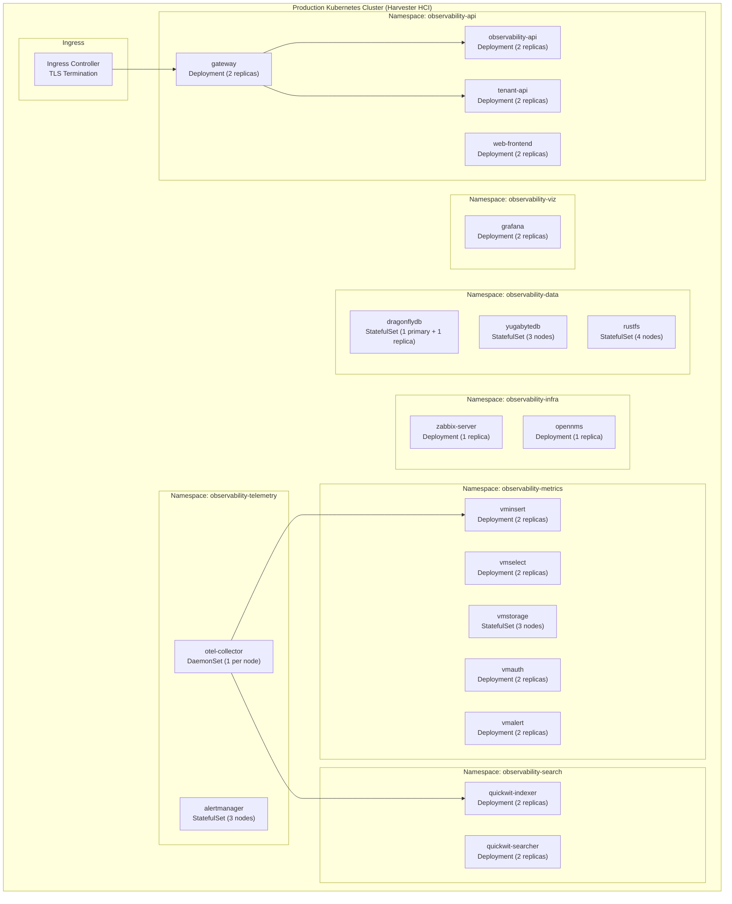
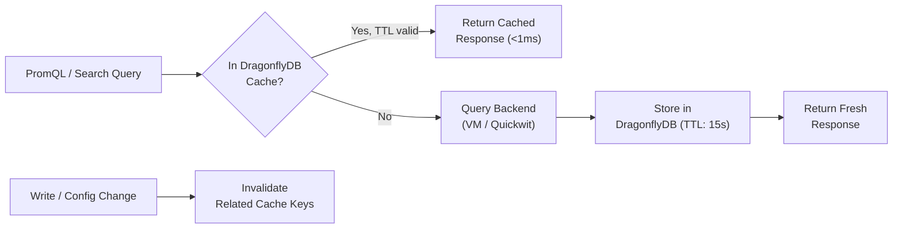
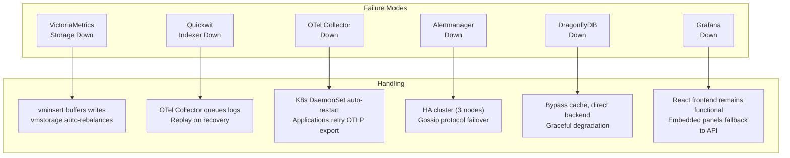

# ERP-Observability High-Level Design

## 1. System Context

## 2. Container Architecture

## 3. Component Design

### 3.1 Go Gateway Components

### 3.2 VictoriaMetrics Cluster Components

## 4. Data Flow Design

### 4.1 Metric Read Path

### 4.2 Log Write Path

### 4.3 Trace Write and Read Path

## 5. Deployment Architecture

## 6. External Interfaces

### 6.1 Inbound Interfaces

| Interface | Protocol | Port | Purpose |
|-----------|----------|------|---------|
| OTLP gRPC | gRPC | 4317 | Telemetry ingestion from OTel SDKs |
| OTLP HTTP | HTTP | 4318 | Telemetry ingestion from OTel SDKs |
| Prometheus Scrape | HTTP | varies | Legacy metric scraping |
| Syslog | TCP | 514 | Infrastructure log ingestion |
| Zabbix Agent | Zabbix Protocol | 10050/10051 | Host metric collection |
| SNMP | UDP | 161/162 | Network device monitoring |
| API Gateway | HTTPS | 443 (8090 internal) | User and API access |

### 6.2 Outbound Interfaces

| Interface | Protocol | Purpose |
|-----------|----------|---------|
| SMTP | TCP/587 | Email alert notifications |
| Slack Webhook | HTTPS | Slack alert notifications |
| PagerDuty API | HTTPS | PagerDuty incident creation |
| OpsGenie API | HTTPS | OpsGenie alert creation |
| Custom Webhooks | HTTPS | Custom notification integrations |
| Pulsar | Native | Observability event streaming |
| NATS JetStream | Native | Real-time alert notifications |

### 6.3 Query Interfaces

| Interface | Query Language | Backend |
|-----------|---------------|---------|
| PromQL | `rate(metric[5m])` | VictoriaMetrics |
| Quickwit Query | `service_name:erp-crm AND severity:ERROR` | Quickwit |
| Grafana Explore | PromQL + Quickwit | Grafana |
| Zabbix API | JSON-RPC | Zabbix Server |
| OpenNMS REST | REST API | OpenNMS |

## 7. Scalability Design

### 7.1 Horizontal Scaling Strategy

| Component | Scaling Method | Scaling Trigger | Max Scale |
|-----------|---------------|----------------|-----------|
| Go Gateway | HPA (CPU 70%) | Request rate | 10 replicas |
| Observability API | HPA (CPU 70%) | Request rate | 10 replicas |
| Tenant API | HPA (CPU 60%) | Request rate | 5 replicas |
| vminsert | HPA (CPU 70%) | Ingestion rate | 10 replicas |
| vmselect | HPA (CPU 70%) | Query rate | 10 replicas |
| vmstorage | Manual scaling | Storage capacity | 20 nodes |
| Quickwit Indexer | HPA (CPU 70%) | Ingestion rate | 10 replicas |
| Quickwit Searcher | HPA (CPU 70%) | Search rate | 10 replicas |
| OTel Collector | DaemonSet | Node count | 1 per node |
| Alertmanager | StatefulSet | N/A (3-node HA) | 5 nodes |
| Grafana | HPA (Memory 80%) | Connection count | 5 replicas |
| DragonflyDB | Vertical + replication | Cache hit ratio | 1 primary + 3 replicas |
| YugabyteDB | Horizontal | Storage + query load | 9 nodes |
| RustFS | Horizontal | Storage capacity | 16 nodes |

### 7.2 Caching Strategy

## 8. Reliability Design

### 8.1 Failure Handling

### 8.2 Data Durability

| Data Type | Durability Mechanism | RPO |
|-----------|---------------------|-----|
| Metrics (VictoriaMetrics) | Replication factor 2, Mayastor PV | < 1 minute |
| Logs (Quickwit) | Immutable splits on RustFS (erasure coded) | < 5 minutes |
| Traces (Quickwit) | Immutable splits on RustFS | < 5 minutes |
| Configuration (YugabyteDB) | Raft consensus (3 replicas) | 0 (synchronous) |
| Cache (DragonflyDB) | Ephemeral (rebuild from backends) | N/A |
| Dashboards (Grafana) | YugabyteDB backend + Git versioning | 0 |
