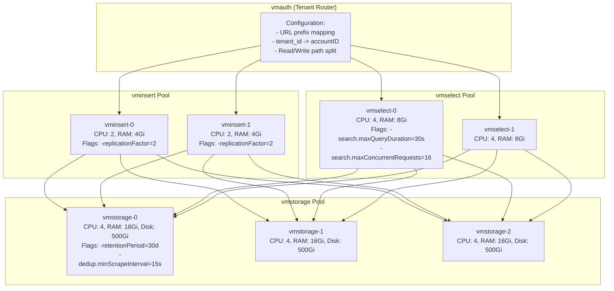
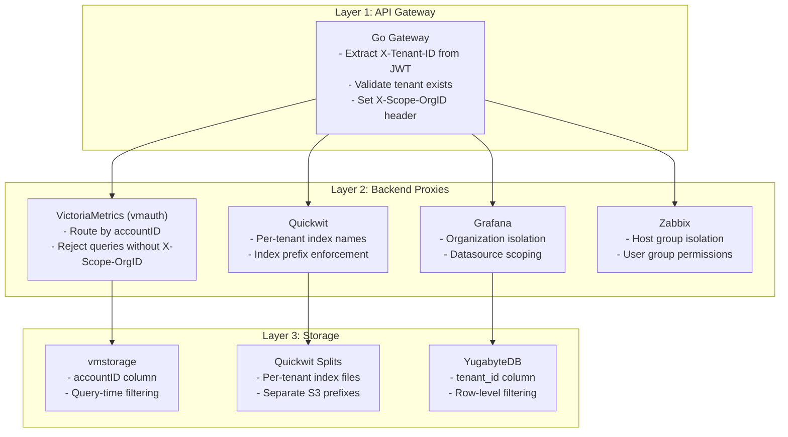
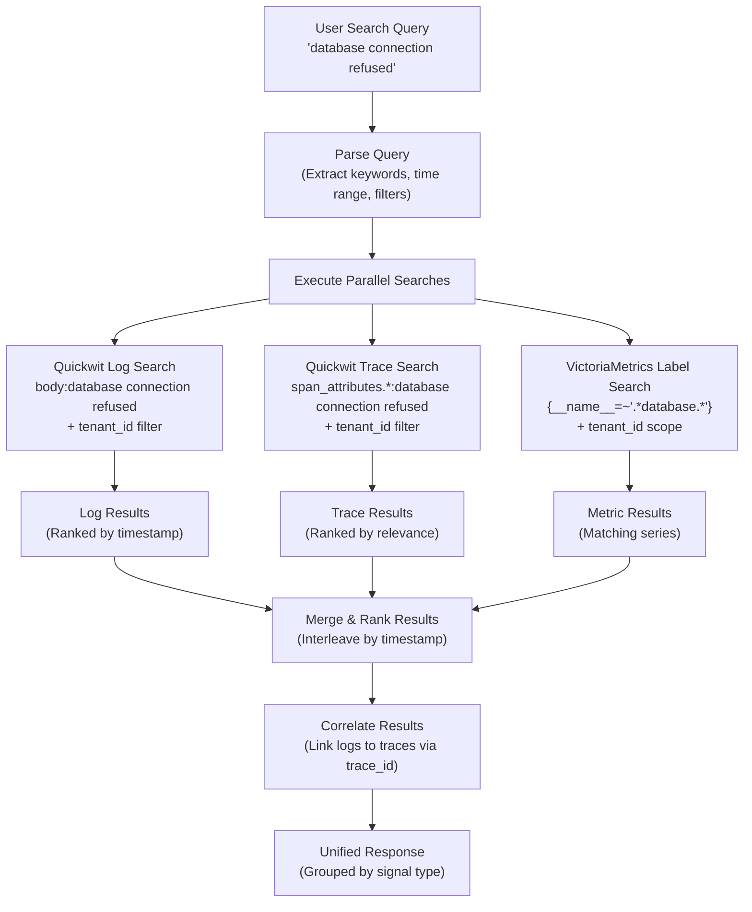
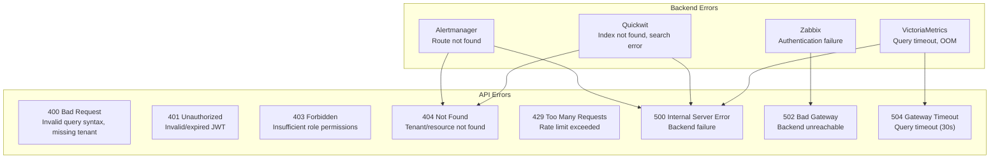

# ERP-Observability Low-Level Design

## 1. Module Structure

### 1.1 Repository Layout

```
ERP-Observability/
  cmd/
    server/
      main.go              -- Go gateway entry point, router, middleware
  observability-api/
    src/
      index.ts             -- Express.js entry point
      controllers/
        metricController.ts    -- PromQL query proxy
        logController.ts       -- Quickwit log search proxy
        traceController.ts     -- Trace search and detail
        alertController.ts     -- Alertmanager proxy
        dashboardController.ts -- Grafana API proxy
        infraController.ts     -- Zabbix + OpenNMS proxy
        searchController.ts    -- Unified cross-signal search
      services/
        vmClient.ts            -- VictoriaMetrics HTTP client
        qwClient.ts            -- Quickwit HTTP client
        amClient.ts            -- Alertmanager HTTP client
        grafanaClient.ts       -- Grafana HTTP API client
        zabbixClient.ts        -- Zabbix JSON-RPC client
        opennmsClient.ts       -- OpenNMS REST client
        cacheService.ts        -- DragonflyDB client (ioredis)
      middleware/
        scopeOrgId.ts          -- X-Scope-OrgID injection
        cacheMiddleware.ts     -- Response caching
        errorHandler.ts        -- Error handling
      types/
        index.ts               -- TypeScript type definitions
    package.json
    tsconfig.json
  tenant-api/
    cmd/
      main.go                  -- Go tenant-api entry point
    internal/
      handlers/
        tenant.go              -- Tenant CRUD handlers
        provision.go           -- Provisioning handlers
        config.go              -- Configuration handlers
        usage.go               -- Usage metering handlers
      services/
        provisioner.go         -- Orchestrates provisioning
        grafana.go             -- Grafana org provisioner
        victoriametrics.go     -- VM namespace provisioner
        quickwit.go            -- Quickwit index provisioner
        zabbix.go              -- Zabbix host group provisioner
        alertmanager.go        -- Alertmanager route provisioner
      repository/
        tenant_repo.go         -- YugabyteDB tenant repository
        config_repo.go         -- YugabyteDB config repository
      models/
        tenant.go              -- Tenant model
        config.go              -- Configuration model
  web/
    src/
      App.tsx                  -- Refine.dev app with green theme
      pages/
        dashboard/             -- Main monitoring dashboard
        metrics/               -- Metric explorer
        logs/                  -- Log search
        traces/                -- Trace explorer
        alerts/                -- Alert management
        infrastructure/        -- Zabbix + OpenNMS views
        admin/                 -- Tenant administration
      components/
        KpiCard.tsx            -- KPI stat card
        TimeSeriesChart.tsx    -- PromQL time series chart
        LogTable.tsx           -- Log results table
        TraceWaterfall.tsx     -- Trace waterfall visualization
        ServiceMap.tsx         -- Service dependency map
        AlertTimeline.tsx      -- Alert state timeline
        PromQLEditor.tsx       -- PromQL autocomplete editor
        GrafanaEmbed.tsx       -- Embedded Grafana panel
      providers/
        authProvider.ts        -- JWT auth provider
        dataProvider.ts        -- REST data provider
      theme/
        index.ts               -- Ant Design token overrides (#059669)
    package.json
    vite.config.ts
  infra/
    docker-compose.yml         -- Local development stack
    helm/
      Chart.yaml               -- Helm chart definition
      values.yaml              -- Default configuration
      templates/               -- K8s manifests
  otel-config/
    collector.yaml             -- OTel Collector configuration
    alertmanager.yml           -- Alertmanager configuration
    vmalert-rules/             -- Alert rule files
    grafana-provisioning/      -- Dashboard + datasource provisioning
  migrations/
    001_initial_schema.sql     -- YugabyteDB schema
```

## 2. OTel Collector Pipeline Stages (Detailed)

### 2.1 Receiver Configuration

```yaml
receivers:
  otlp:
    protocols:
      grpc:
        endpoint: 0.0.0.0:4317
        max_recv_msg_size_mib: 16
      http:
        endpoint: 0.0.0.0:4318
        cors:
          allowed_origins: ["*"]

  prometheus:
    config:
      scrape_configs:
        - job_name: 'otel-collector'
          scrape_interval: 15s
          static_configs:
            - targets: ['localhost:8888']
        - job_name: 'victoriametrics'
          scrape_interval: 15s
          static_configs:
            - targets: ['vmstorage:8482', 'vminsert:8480', 'vmselect:8481']
        - job_name: 'quickwit'
          scrape_interval: 15s
          static_configs:
            - targets: ['quickwit:7280']

  syslog:
    tcp:
      listen_address: 0.0.0.0:514
    protocol: rfc5424

  hostmetrics:
    collection_interval: 30s
    scrapers:
      cpu:
      memory:
      disk:
      network:
      filesystem:
      process:
```

### 2.2 Processor Configuration

```yaml
processors:
  memory_limiter:
    check_interval: 1s
    limit_mib: 4096
    spike_limit_mib: 512

  attributes/tenant:
    actions:
      - key: tenant_id
        from_context: metadata.X-Tenant-ID
        action: upsert

  filter/logs:
    error_mode: ignore
    logs:
      log_record:
        - 'severity_number < 9'  # Drop DEBUG and TRACE in production

  resource/standardize:
    attributes:
      - key: deployment.environment
        value: ${ENVIRONMENT}
        action: upsert
      - key: service.namespace
        value: opensase-erp
        action: upsert

  batch:
    timeout: 200ms
    send_batch_size: 8192
    send_batch_max_size: 16384

  tail_sampling:
    decision_wait: 10s
    num_traces: 100000
    expected_new_traces_per_sec: 10000
    policies:
      - name: errors-policy
        type: status_code
        status_code: {status_codes: [ERROR]}
      - name: slow-traces-policy
        type: latency
        latency: {threshold_ms: 1000}
      - name: probabilistic-policy
        type: probabilistic
        probabilistic: {sampling_percentage: 10}
```

### 2.3 Exporter Configuration

```yaml
exporters:
  prometheusremotewrite:
    endpoint: http://vminsert:8480/insert/0/prometheus/api/v1/write
    headers:
      X-Scope-OrgID: ${TENANT_ID}
    resource_to_telemetry_conversion:
      enabled: true
    retry_on_failure:
      enabled: true
      initial_interval: 5s
      max_interval: 30s

  otlp/quickwit-logs:
    endpoint: http://quickwit:7281
    tls:
      insecure: true
    headers:
      content-type: application/x-protobuf

  otlp/quickwit-traces:
    endpoint: http://quickwit:7281
    tls:
      insecure: true

service:
  pipelines:
    metrics:
      receivers: [otlp, prometheus, hostmetrics]
      processors: [memory_limiter, attributes/tenant, batch]
      exporters: [prometheusremotewrite]
    logs:
      receivers: [otlp, syslog]
      processors: [memory_limiter, attributes/tenant, filter/logs, resource/standardize, batch]
      exporters: [otlp/quickwit-logs]
    traces:
      receivers: [otlp]
      processors: [memory_limiter, attributes/tenant, resource/standardize, tail_sampling, batch]
      exporters: [otlp/quickwit-traces]
```

## 3. VictoriaMetrics Cluster Topology

### 3.1 Cluster Component Configuration



### 3.2 vmauth Tenant Routing

```yaml
# vmauth config for multi-tenant routing
users:
  - url_prefix:
      - "http://vminsert-0:8480/insert/{tenant_id}/prometheus"
      - "http://vminsert-1:8480/insert/{tenant_id}/prometheus"
    headers:
      - "X-Scope-OrgID: {tenant_id}"
    src_paths:
      - "/insert/.*"

  - url_prefix:
      - "http://vmselect-0:8481/select/{tenant_id}/prometheus"
      - "http://vmselect-1:8481/select/{tenant_id}/prometheus"
    headers:
      - "X-Scope-OrgID: {tenant_id}"
    src_paths:
      - "/select/.*"
```

## 4. Quickwit Index Schema (Detailed)

### 4.1 Log Index

```yaml
version: "0.7"
index_id: "logs-{tenant_id}"
doc_mapping:
  mode: dynamic
  field_mappings:
    - name: timestamp
      type: datetime
      input_formats: ["rfc3339", "unix_timestamp"]
      output_format: rfc3339
      fast: true
    - name: tenant_id
      type: text
      tokenizer: raw
      fast: true
    - name: service_name
      type: text
      tokenizer: raw
      fast: true
    - name: severity_text
      type: text
      tokenizer: raw
      fast: true
    - name: severity_number
      type: u64
      fast: true
    - name: body
      type: text
      tokenizer: default
      record: position
    - name: trace_id
      type: text
      tokenizer: raw
      fast: true
    - name: span_id
      type: text
      tokenizer: raw
      fast: true
    - name: resource
      type: json
    - name: attributes
      type: json
  timestamp_field: timestamp
  tag_fields:
    - tenant_id
    - service_name
    - severity_text

search_settings:
  default_search_fields:
    - body
    - service_name

indexing_settings:
  commit_timeout_secs: 30
  merge_policy:
    type: stable_log
    min_level_num_docs: 100000
    merge_factor: 10

retention:
  period: "90 days"
  schedule: "daily"
```

### 4.2 Trace Index

```yaml
version: "0.7"
index_id: "traces-{tenant_id}"
doc_mapping:
  mode: dynamic
  field_mappings:
    - name: trace_id
      type: text
      tokenizer: raw
      fast: true
    - name: span_id
      type: text
      tokenizer: raw
      fast: true
    - name: parent_span_id
      type: text
      tokenizer: raw
      fast: true
    - name: service_name
      type: text
      tokenizer: raw
      fast: true
    - name: span_name
      type: text
      tokenizer: default
    - name: span_kind
      type: text
      tokenizer: raw
      fast: true
    - name: start_timestamp_nanos
      type: u64
      fast: true
    - name: end_timestamp_nanos
      type: u64
      fast: true
    - name: duration_nanos
      type: u64
      fast: true
    - name: status_code
      type: text
      tokenizer: raw
      fast: true
    - name: status_message
      type: text
      tokenizer: default
    - name: resource_attributes
      type: json
    - name: span_attributes
      type: json
    - name: events
      type: json
    - name: tenant_id
      type: text
      tokenizer: raw
      fast: true
  tag_fields:
    - tenant_id
    - service_name
    - trace_id

retention:
  period: "7 days"
  schedule: "daily"
```

## 5. Tenant Isolation Implementation

### 5.1 Isolation Enforcement Points



### 5.2 Tenant ID Propagation Flow

```go
// Gateway middleware: extract tenant and inject scope header
func TenantMiddleware(next http.Handler) http.Handler {
    return http.HandlerFunc(func(w http.ResponseWriter, r *http.Request) {
        // Extract tenant_id from JWT claims
        tenantID := r.Header.Get("X-Tenant-ID")
        if tenantID == "" {
            tenantID = extractTenantFromJWT(r)
        }
        if tenantID == "" {
            http.Error(w, "X-Tenant-ID required", http.StatusBadRequest)
            return
        }

        // Inject X-Scope-OrgID for VictoriaMetrics
        r.Header.Set("X-Scope-OrgID", tenantID)

        // Store in context for downstream use
        ctx := context.WithValue(r.Context(), "tenant_id", tenantID)
        next.ServeHTTP(w, r.WithContext(ctx))
    })
}
```

## 6. Alert Evaluation Engine (vmalert)

### 6.1 Alert Rule Format

```yaml
groups:
  - name: erp-module-health
    interval: 15s
    rules:
      - alert: HighErrorRate
        expr: |
          sum(rate(erp_http_requests_total{status=~"5.."}[5m])) by (module, tenant_id)
          /
          sum(rate(erp_http_requests_total[5m])) by (module, tenant_id)
          > 0.05
        for: 5m
        labels:
          severity: warning
        annotations:
          summary: "High error rate in {{ $labels.module }} for tenant {{ $labels.tenant_id }}"
          description: "Error rate is {{ $value | humanizePercentage }} (threshold: 5%)"
          runbook_url: "https://wiki.opensase.com/runbooks/high-error-rate"
          dashboard_url: "https://observe.opensase.com/d/module-health?var-module={{ $labels.module }}"

      - alert: CriticalErrorRate
        expr: |
          sum(rate(erp_http_requests_total{status=~"5.."}[5m])) by (module, tenant_id)
          /
          sum(rate(erp_http_requests_total[5m])) by (module, tenant_id)
          > 0.10
        for: 2m
        labels:
          severity: critical
        annotations:
          summary: "Critical error rate in {{ $labels.module }}"
          runbook_url: "https://wiki.opensase.com/runbooks/critical-error-rate"

      - alert: HighLatency
        expr: |
          histogram_quantile(0.99,
            sum(rate(erp_http_request_duration_seconds_bucket[5m])) by (le, module, tenant_id)
          ) > 2
        for: 5m
        labels:
          severity: warning
        annotations:
          summary: "High p99 latency in {{ $labels.module }}: {{ $value | humanizeDuration }}"

      - alert: ServiceDown
        expr: up == 0
        for: 1m
        labels:
          severity: critical
        annotations:
          summary: "Service {{ $labels.job }} is down"

  - name: platform-self-monitoring
    interval: 30s
    rules:
      - alert: DeadMansSwitch
        expr: vector(1)
        labels:
          severity: none
        annotations:
          summary: "Dead man's switch - observability pipeline is alive"

      - alert: HighIngestionLag
        expr: |
          rate(vm_rows_inserted_total[5m]) == 0
        for: 5m
        labels:
          severity: critical
        annotations:
          summary: "VictoriaMetrics ingestion has stopped"
```

## 7. Cross-Module Search Algorithm

### 7.1 Unified Search Flow



### 7.2 Search Service Implementation

```typescript
// searchController.ts
async function unifiedSearch(req: Request, res: Response) {
  const { query, timeRange, limit = 100 } = req.body;
  const tenantId = req.headers['x-scope-orgid'] as string;

  // Execute searches in parallel
  const [logResults, traceResults, metricResults] = await Promise.all([
    qwClient.searchLogs(tenantId, query, timeRange, limit),
    qwClient.searchTraces(tenantId, query, timeRange, limit),
    vmClient.searchSeries(tenantId, query),
  ]);

  // Correlate log trace_ids with trace results
  const correlatedLogs = logResults.map(log => ({
    ...log,
    linkedTrace: traceResults.find(t => t.traceId === log.traceId),
  }));

  // Merge and sort by timestamp
  const merged = [
    ...correlatedLogs.map(l => ({ type: 'log', ...l })),
    ...traceResults.map(t => ({ type: 'trace', ...t })),
    ...metricResults.map(m => ({ type: 'metric', ...m })),
  ].sort((a, b) => b.timestamp - a.timestamp);

  res.json({ results: merged.slice(0, limit), total: merged.length });
}
```

## 8. YugabyteDB Schema

### 8.1 Initial Migration (001_initial_schema.sql)

```sql
-- Tenant management tables
CREATE TABLE tenants (
    id UUID PRIMARY KEY DEFAULT gen_random_uuid(),
    tenant_id TEXT UNIQUE NOT NULL,
    name TEXT NOT NULL,
    status TEXT NOT NULL DEFAULT 'provisioning',
    settings JSONB NOT NULL DEFAULT '{}',
    grafana_org_id INTEGER,
    created_at TIMESTAMPTZ NOT NULL DEFAULT NOW(),
    updated_at TIMESTAMPTZ NOT NULL DEFAULT NOW()
);

CREATE TABLE tenant_configs (
    id UUID PRIMARY KEY DEFAULT gen_random_uuid(),
    tenant_id TEXT NOT NULL REFERENCES tenants(tenant_id),
    config_key TEXT NOT NULL,
    config_value JSONB NOT NULL,
    updated_at TIMESTAMPTZ NOT NULL DEFAULT NOW(),
    UNIQUE(tenant_id, config_key)
);

CREATE TABLE tenant_alert_rules (
    id UUID PRIMARY KEY DEFAULT gen_random_uuid(),
    tenant_id TEXT NOT NULL REFERENCES tenants(tenant_id),
    name TEXT NOT NULL,
    expr TEXT NOT NULL,
    duration TEXT NOT NULL DEFAULT '5m',
    severity TEXT NOT NULL DEFAULT 'warning',
    labels JSONB NOT NULL DEFAULT '{}',
    annotations JSONB NOT NULL DEFAULT '{}',
    enabled BOOLEAN NOT NULL DEFAULT true,
    created_at TIMESTAMPTZ NOT NULL DEFAULT NOW(),
    updated_at TIMESTAMPTZ NOT NULL DEFAULT NOW()
);

CREATE TABLE tenant_notification_channels (
    id UUID PRIMARY KEY DEFAULT gen_random_uuid(),
    tenant_id TEXT NOT NULL REFERENCES tenants(tenant_id),
    name TEXT NOT NULL,
    type TEXT NOT NULL,
    settings JSONB NOT NULL DEFAULT '{}',
    is_default BOOLEAN NOT NULL DEFAULT false,
    created_at TIMESTAMPTZ NOT NULL DEFAULT NOW()
);

CREATE TABLE tenant_slos (
    id UUID PRIMARY KEY DEFAULT gen_random_uuid(),
    tenant_id TEXT NOT NULL REFERENCES tenants(tenant_id),
    name TEXT NOT NULL,
    service TEXT NOT NULL,
    target DECIMAL(5,2) NOT NULL,
    indicator_type TEXT NOT NULL,
    query TEXT NOT NULL,
    window TEXT NOT NULL DEFAULT '30d',
    created_at TIMESTAMPTZ NOT NULL DEFAULT NOW(),
    updated_at TIMESTAMPTZ NOT NULL DEFAULT NOW()
);

CREATE TABLE audit_log (
    id UUID PRIMARY KEY DEFAULT gen_random_uuid(),
    tenant_id TEXT NOT NULL,
    actor TEXT NOT NULL,
    action TEXT NOT NULL,
    resource_type TEXT NOT NULL,
    resource_id TEXT,
    details JSONB NOT NULL DEFAULT '{}',
    created_at TIMESTAMPTZ NOT NULL DEFAULT NOW()
);

-- Indexes
CREATE INDEX idx_tenant_configs_tenant ON tenant_configs(tenant_id);
CREATE INDEX idx_tenant_alert_rules_tenant ON tenant_alert_rules(tenant_id);
CREATE INDEX idx_tenant_notification_channels_tenant ON tenant_notification_channels(tenant_id);
CREATE INDEX idx_tenant_slos_tenant ON tenant_slos(tenant_id);
CREATE INDEX idx_audit_log_tenant ON audit_log(tenant_id);
CREATE INDEX idx_audit_log_created ON audit_log(created_at);
```

## 9. Error Handling Design


