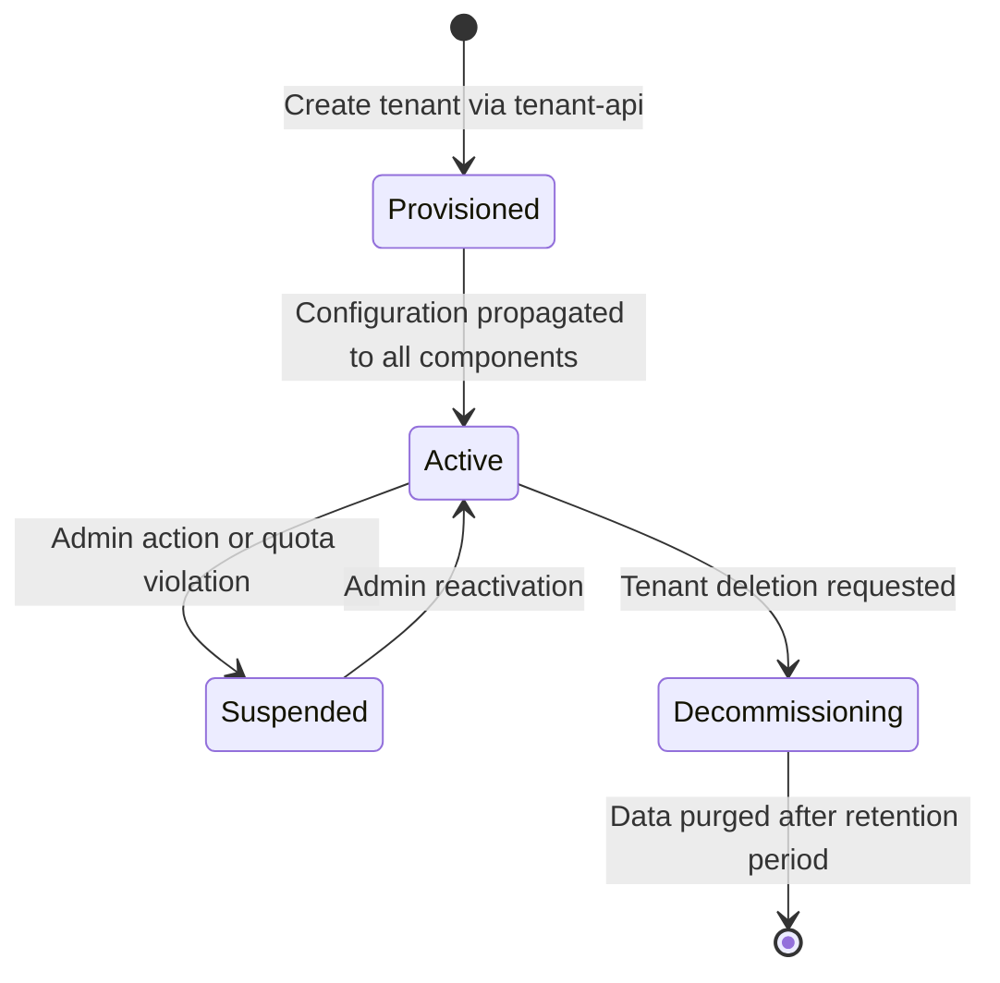

# ERP-Observability Multi-Tenancy Implementation Guide

> **Document ID:** ERP-OBS-MT-028
> **Version:** 1.0.0
> **Last Updated:** 2026-02-24
> **Status:** Approved
> **Related Documents:** [01-Technical-Writeup.md](./01-Technical-Writeup.md), [04-Software-Architecture.md](./04-Software-Architecture.md), [31-SECURITY.md](./31-SECURITY.md)

---

## 1. Overview

Multi-tenancy is a foundational requirement for ERP-Observability. Every ERP module operates in a multi-tenant context (using `tenant_id TEXT` across all modules except CRM which uses UUID primary keys without tenant_id), and the observability platform must enforce strict data isolation while allowing cross-tenant operational views for platform administrators. This guide details how tenant isolation is implemented across every component in the observability stack.

### Multi-Tenancy Principles

| Principle | Implementation |
|-----------|----------------|
| **Data Isolation** | Tenants cannot access each other's metrics, logs, or traces |
| **Header Propagation** | `X-Scope-OrgID` header carries tenant context through the entire pipeline |
| **Label Injection** | All telemetry is labeled with `tenant_id` at the OTel Collector level |
| **Query Enforcement** | All queries are scoped to the authenticated tenant unless admin override |
| **Quota Management** | Per-tenant quotas for ingestion rate, series count, and storage |
| **Retention Policies** | Configurable data retention per tenant tier |
| **Admin Override** | Platform administrators can query across tenants with explicit scope |

### Tenant Lifecycle



---

## 2. Tenant Identification & Header Propagation

### 2.1 The X-Scope-OrgID Header

The `X-Scope-OrgID` header is the universal tenant identifier across the observability stack. This header originates from the ERP-IAM JWT token, is extracted by the Go gateway, and propagated through every component.

**Header Flow:**

```
ERP Module (SDK)
  → Sets X-Scope-OrgID from app context
    → OTel Collector (receives header, injects as resource attribute)
      → VictoriaMetrics (label: tenant_id)
      → Quickwit (field: tenant_id)
      → Grafana (org mapping via X-Scope-OrgID)
        → Alertmanager (tenant routing label)
```

### 2.2 Gateway Tenant Extraction

The Go gateway extracts and validates tenant identity on every request:

```go
// middleware/tenant.go
package middleware

import (
    "context"
    "net/http"
    "strings"
)

type contextKey string
const TenantIDKey contextKey = "tenant_id"

func TenantExtraction(next http.Handler) http.Handler {
    return http.HandlerFunc(func(w http.ResponseWriter, r *http.Request) {
        // Priority 1: Explicit header (from ERP modules via OTel SDK)
        tenantID := r.Header.Get("X-Scope-OrgID")

        // Priority 2: Extract from JWT claims
        if tenantID == "" {
            claims, ok := r.Context().Value("jwt_claims").(map[string]interface{})
            if ok {
                if tid, exists := claims["tenant_id"]; exists {
                    tenantID = tid.(string)
                }
            }
        }

        // Priority 3: Query parameter (for Grafana datasource proxying)
        if tenantID == "" {
            tenantID = r.URL.Query().Get("tenant_id")
        }

        if tenantID == "" {
            http.Error(w, `{"error":"tenant_id required"}`, http.StatusBadRequest)
            return
        }

        // Validate tenant exists and is active
        if !isValidTenant(tenantID) {
            http.Error(w, `{"error":"invalid or suspended tenant"}`, http.StatusForbidden)
            return
        }

        // Sanitize: prevent multi-tenant injection (pipe-separated IDs)
        if strings.Contains(tenantID, "|") {
            // Only platform admins can query multiple tenants
            if !isPlatformAdmin(r.Context()) {
                http.Error(w, `{"error":"multi-tenant query not permitted"}`, http.StatusForbidden)
                return
            }
        }

        // Propagate to downstream services
        ctx := context.WithValue(r.Context(), TenantIDKey, tenantID)
        r = r.WithContext(ctx)
        r.Header.Set("X-Scope-OrgID", tenantID)

        next.ServeHTTP(w, r)
    })
}
```

### 2.3 OTel SDK Tenant Injection (Client Side)

Each ERP module injects tenant context when initializing the OTel SDK:

```go
// Common OTel initialization pattern for ERP modules
package otel

import (
    "go.opentelemetry.io/otel/sdk/resource"
    semconv "go.opentelemetry.io/otel/semconv/v1.21.0"
    "go.opentelemetry.io/otel/attribute"
)

func NewResource(serviceName, tenantID string) *resource.Resource {
    return resource.NewWithAttributes(
        semconv.SchemaURL,
        semconv.ServiceName(serviceName),
        attribute.String("tenant_id", tenantID),
        attribute.String("deployment.environment", "production"),
    )
}

// HTTP middleware that adds tenant_id to span context
func TenantSpanMiddleware(next http.Handler) http.Handler {
    return http.HandlerFunc(func(w http.ResponseWriter, r *http.Request) {
        span := trace.SpanFromContext(r.Context())
        tenantID := r.Header.Get("X-Tenant-ID")
        if tenantID != "" {
            span.SetAttributes(attribute.String("tenant_id", tenantID))
        }
        next.ServeHTTP(w, r)
    })
}
```

---

## 3. VictoriaMetrics Tenant Isolation

### 3.1 Tenant Label Injection via OTel Collector

The OTel Collector injects `tenant_id` as a metric label before writing to VictoriaMetrics. This ensures every time series is tagged with its owning tenant:

```yaml
# OTel Collector processor configuration for tenant label injection
processors:
  attributes/tenant_metrics:
    actions:
      - key: tenant_id
        from_context: X-Scope-OrgID
        action: upsert

  resource/tenant:
    attributes:
      - key: tenant_id
        from_context: X-Scope-OrgID
        action: upsert

  # Transform processor to ensure tenant_id is a metric label
  transform/tenant_label:
    metric_statements:
      - context: datapoint
        statements:
          - set(attributes["tenant_id"], resource.attributes["tenant_id"])
```

### 3.2 VictoriaMetrics Cluster Tenant URL Routing

VictoriaMetrics cluster mode supports native multi-tenancy through URL-based tenant routing. Each tenant is mapped to a numeric account ID:

```
# Write path (vminsert)
POST /insert/{accountID}/prometheus/api/v1/write

# Read path (vmselect)
GET /select/{accountID}/prometheus/api/v1/query
GET /select/{accountID}/prometheus/api/v1/query_range
```

**Tenant-to-AccountID Mapping (tenant-api):**

```go
// internal/tenant/mapping.go
package tenant

import (
    "context"
    "fmt"
    "sync"
)

type AccountMapping struct {
    mu       sync.RWMutex
    tenantDB map[string]int32  // tenant_id -> VM accountID
    nextID   int32
}

func (m *AccountMapping) GetOrCreateAccountID(ctx context.Context, tenantID string) (int32, error) {
    m.mu.RLock()
    if id, exists := m.tenantDB[tenantID]; exists {
        m.mu.RUnlock()
        return id, nil
    }
    m.mu.RUnlock()

    m.mu.Lock()
    defer m.mu.Unlock()

    // Double-check after acquiring write lock
    if id, exists := m.tenantDB[tenantID]; exists {
        return id, nil
    }

    m.nextID++
    m.tenantDB[tenantID] = m.nextID

    // Persist mapping to YugabyteDB
    err := m.persistMapping(ctx, tenantID, m.nextID)
    if err != nil {
        return 0, fmt.Errorf("failed to persist tenant mapping: %w", err)
    }

    return m.nextID, nil
}
```

### 3.3 Query-Time Tenant Enforcement

The observability-api enforces tenant scoping on every VictoriaMetrics query:

```go
// internal/proxy/vm_proxy.go
func (p *VMProxy) ProxyQuery(w http.ResponseWriter, r *http.Request) {
    tenantID := r.Context().Value(middleware.TenantIDKey).(string)
    accountID, err := p.accountMapping.GetOrCreateAccountID(r.Context(), tenantID)
    if err != nil {
        http.Error(w, "tenant resolution failed", http.StatusInternalServerError)
        return
    }

    // Route to tenant-specific VM endpoint
    targetURL := fmt.Sprintf("%s/select/%d/prometheus%s",
        p.vmSelectURL, accountID, r.URL.Path)

    // Additional safety: inject tenant_id label matcher into PromQL
    query := r.URL.Query().Get("query")
    if query != "" {
        query = injectTenantFilter(query, tenantID)
        r.URL.Query().Set("query", query)
    }

    p.reverseProxy.ServeHTTP(w, r)
}

// injectTenantFilter adds {tenant_id="<id>"} to every PromQL selector
func injectTenantFilter(query, tenantID string) string {
    // Uses metricsql parser to inject tenant_id label matcher
    // into every metric selector in the query
    expr, err := metricsql.Parse(query)
    if err != nil {
        return query // Return unmodified if parse fails; VM URL routing is primary isolation
    }
    metricsql.VisitAll(expr, func(me *metricsql.MetricExpr) {
        me.LabelFilters = append(me.LabelFilters, metricsql.LabelFilter{
            Label: "tenant_id",
            Value: tenantID,
        })
    })
    return string(expr.AppendString(nil))
}
```

### 3.4 VictoriaMetrics Tenant Quotas

```yaml
# vmalert recording rules for tenant quota monitoring
groups:
  - name: tenant_quotas
    interval: 1m
    rules:
      - record: tenant:active_series:count
        expr: count by (tenant_id) ({__name__!=""})

      - record: tenant:ingestion_rate:rate5m
        expr: sum by (tenant_id) (rate(vm_rows_inserted_total[5m]))

      - alert: TenantSeriesQuotaExceeded
        expr: |
          tenant:active_series:count
          > on(tenant_id)
          tenant_quotas_max_series
        for: 5m
        labels:
          severity: warning
        annotations:
          summary: "Tenant {{ $labels.tenant_id }} exceeded series quota"

      - alert: TenantIngestionRateExceeded
        expr: |
          tenant:ingestion_rate:rate5m
          > on(tenant_id)
          tenant_quotas_max_ingestion_rate
        for: 5m
        labels:
          severity: warning
        annotations:
          summary: "Tenant {{ $labels.tenant_id }} exceeded ingestion rate quota"
```

---

## 4. Quickwit Tenant Isolation

### 4.1 Index Strategy: Shared Index with Tenant Field

ERP-Observability uses a shared index strategy with a mandatory `tenant_id` field on every document, rather than per-tenant indexes. This approach balances isolation with operational simplicity:

| Strategy | Pros | Cons | Decision |
|----------|------|------|----------|
| **Index per tenant** | Physical isolation, easy deletion | Index proliferation, merge overhead, resource waste at scale | Not selected |
| **Shared index + tenant field** | Efficient merges, simpler operations, better compression | Logical isolation only, requires query enforcement | **Selected** |

**Index Schema with Tenant Field:**

```yaml
# Quickwit index configuration for ERP logs
version: "0.7"
index_id: erp-logs
doc_mapping:
  field_mappings:
    - name: timestamp
      type: datetime
      input_formats: ["rfc3339"]
      output_format: "rfc3339"
      fast: true
    - name: tenant_id
      type: text
      tokenizer: raw
      fast: true          # Fast field for efficient filtering
    - name: severity
      type: text
      tokenizer: raw
      fast: true
    - name: service_name
      type: text
      tokenizer: raw
      fast: true
    - name: trace_id
      type: text
      tokenizer: raw
    - name: span_id
      type: text
      tokenizer: raw
    - name: message
      type: text
      tokenizer: default
      record: position
    - name: attributes
      type: json
  timestamp_field: timestamp
  tag_fields: [tenant_id, severity, service_name]
  partition_key: tenant_id    # Partition by tenant for locality
```

**Key Design Decision:** The `partition_key: tenant_id` configuration ensures that documents from the same tenant are co-located within splits. This provides:
- Better compression within tenant data
- Faster filtered queries (entire splits can be skipped)
- Efficient tenant data deletion when decommissioning

### 4.2 Query-Time Tenant Enforcement

```go
// internal/proxy/quickwit_proxy.go
func (p *QuickwitProxy) ProxySearch(w http.ResponseWriter, r *http.Request) {
    tenantID := r.Context().Value(middleware.TenantIDKey).(string)

    // Parse the incoming search request
    var searchReq QuickwitSearchRequest
    if err := json.NewDecoder(r.Body).Decode(&searchReq); err != nil {
        http.Error(w, "invalid search request", http.StatusBadRequest)
        return
    }

    // Inject tenant filter into query
    // Original: "severity:ERROR AND message:timeout"
    // Modified: "tenant_id:tenant-acme AND (severity:ERROR AND message:timeout)"
    if searchReq.Query == "" || searchReq.Query == "*" {
        searchReq.Query = fmt.Sprintf("tenant_id:%s", tenantID)
    } else {
        searchReq.Query = fmt.Sprintf("tenant_id:%s AND (%s)", tenantID, searchReq.Query)
    }

    // Forward modified request to Quickwit
    modifiedBody, _ := json.Marshal(searchReq)
    proxyReq, _ := http.NewRequest("POST",
        fmt.Sprintf("%s/api/v1/%s/search", p.quickwitURL, searchReq.IndexID),
        bytes.NewReader(modifiedBody))

    p.reverseProxy.ServeHTTP(w, proxyReq)
}
```

### 4.3 Tenant Data Deletion

When a tenant is decommissioned, their data is purged from Quickwit:

```bash
# Delete all documents for a tenant using Quickwit's delete API
# This creates delete tasks that are processed during merge operations

# Delete logs for tenant
curl -X POST "http://quickwit:7280/api/v1/erp-logs/delete-tasks" \
  -H "Content-Type: application/json" \
  -d '{
    "query": "tenant_id:tenant-acme",
    "search_after": 0,
    "search_before": 9999999999
  }'

# Delete traces for tenant
curl -X POST "http://quickwit:7280/api/v1/erp-traces/delete-tasks" \
  -H "Content-Type: application/json" \
  -d '{
    "query": "tenant_id:tenant-acme",
    "search_after": 0,
    "search_before": 9999999999
  }'
```

---

## 5. Grafana Organization Mapping

### 5.1 Tenant-to-Organization Architecture

Each tenant is mapped to a Grafana Organization, providing UI-level isolation:

```
Tenant: tenant-acme  →  Grafana Org ID: 2 (name: "Acme Corp")
Tenant: tenant-globex →  Grafana Org ID: 3 (name: "Globex Inc")
Tenant: tenant-initech → Grafana Org ID: 4 (name: "Initech LLC")
Platform Admin        →  Grafana Org ID: 1 (name: "Platform Admin" - cross-tenant)
```

### 5.2 Automated Organization Provisioning

```go
// internal/grafana/org_provisioner.go
package grafana

import (
    "bytes"
    "encoding/json"
    "fmt"
    "net/http"
)

type OrgProvisioner struct {
    grafanaURL    string
    adminAPIKey   string
    httpClient    *http.Client
}

type GrafanaOrg struct {
    ID   int    `json:"id"`
    Name string `json:"name"`
}

func (p *OrgProvisioner) ProvisionTenant(tenantID, displayName string) (*GrafanaOrg, error) {
    // 1. Create Grafana Organization
    orgReq := map[string]string{"name": displayName}
    body, _ := json.Marshal(orgReq)

    req, _ := http.NewRequest("POST",
        fmt.Sprintf("%s/api/orgs", p.grafanaURL),
        bytes.NewReader(body))
    req.Header.Set("Authorization", "Bearer "+p.adminAPIKey)
    req.Header.Set("Content-Type", "application/json")

    resp, err := p.httpClient.Do(req)
    if err != nil {
        return nil, fmt.Errorf("failed to create org: %w", err)
    }
    defer resp.Body.Close()

    var orgResp struct {
        OrgID   int    `json:"orgId"`
        Message string `json:"message"`
    }
    json.NewDecoder(resp.Body).Decode(&orgResp)

    // 2. Provision datasources for this org
    p.provisionDatasources(orgResp.OrgID, tenantID)

    // 3. Provision default dashboards
    p.provisionDashboards(orgResp.OrgID, tenantID)

    return &GrafanaOrg{ID: orgResp.OrgID, Name: displayName}, nil
}

func (p *OrgProvisioner) provisionDatasources(orgID int, tenantID string) {
    datasources := []map[string]interface{}{
        {
            "name":   "VictoriaMetrics",
            "type":   "prometheus",
            "url":    fmt.Sprintf("http://vmselect:8481/select/0/prometheus"),
            "access": "proxy",
            "orgId":  orgID,
            "jsonData": map[string]interface{}{
                "httpHeaderName1": "X-Scope-OrgID",
            },
            "secureJsonData": map[string]interface{}{
                "httpHeaderValue1": tenantID,
            },
        },
        {
            "name":   "Quickwit Logs",
            "type":   "quickwit-quickwit-datasource",
            "url":    "http://quickwit-searcher:7280/api/v1",
            "access": "proxy",
            "orgId":  orgID,
            "jsonData": map[string]interface{}{
                "index":           "erp-logs",
                "httpHeaderName1": "X-Scope-OrgID",
            },
            "secureJsonData": map[string]interface{}{
                "httpHeaderValue1": tenantID,
            },
        },
        {
            "name":   "Quickwit Traces",
            "type":   "quickwit-quickwit-datasource",
            "url":    "http://quickwit-searcher:7280/api/v1",
            "access": "proxy",
            "orgId":  orgID,
            "jsonData": map[string]interface{}{
                "index":           "erp-traces",
                "httpHeaderName1": "X-Scope-OrgID",
            },
            "secureJsonData": map[string]interface{}{
                "httpHeaderValue1": tenantID,
            },
        },
    }

    for _, ds := range datasources {
        body, _ := json.Marshal(ds)
        req, _ := http.NewRequest("POST",
            fmt.Sprintf("%s/api/datasources", p.grafanaURL),
            bytes.NewReader(body))
        req.Header.Set("Authorization", "Bearer "+p.adminAPIKey)
        req.Header.Set("Content-Type", "application/json")
        req.Header.Set("X-Grafana-Org-Id", fmt.Sprintf("%d", orgID))
        p.httpClient.Do(req)
    }
}
```

### 5.3 Grafana Auth Proxy with Tenant Context

```ini
# grafana.ini - Auth proxy configuration for tenant-aware SSO
[auth.proxy]
enabled = true
header_name = X-WEBAUTH-USER
header_property = username
auto_sign_up = true
headers = "Name:X-WEBAUTH-NAME Email:X-WEBAUTH-EMAIL Groups:X-WEBAUTH-GROUPS OrgId:X-WEBAUTH-ORGID"
enable_login_token = true

[auth.proxy.org_mapping]
# Map Authentik groups to Grafana orgs
# Format: group_name:org_id:role
tenant-acme-admins = 2:Admin
tenant-acme-viewers = 2:Viewer
tenant-globex-admins = 3:Admin
tenant-globex-viewers = 3:Viewer
platform-admins = 1:GrafanaAdmin
```

---

## 6. Alertmanager Tenant Routing

### 6.1 Tenant-Aware Alert Routing

Alertmanager routes alerts to the correct tenant's notification channels based on the `tenant_id` label:

```yaml
# alertmanager.yml
global:
  resolve_timeout: 5m
  smtp_smarthost: 'smtp.internal:587'
  smtp_from: 'alerts@opensase-erp.io'

route:
  receiver: 'platform-default'
  group_by: ['alertname', 'tenant_id', 'module']
  group_wait: 30s
  group_interval: 5m
  repeat_interval: 4h
  routes:
    # Tenant-specific routing based on tenant_id label
    - match_re:
        tenant_id: 'tenant-.*'
      receiver: 'tenant-router'
      group_by: ['alertname', 'tenant_id', 'severity']
      routes:
        - match:
            severity: 'critical'
          receiver: 'tenant-critical'
          repeat_interval: 15m
        - match:
            severity: 'warning'
          receiver: 'tenant-warning'
          repeat_interval: 1h

    # Platform-level alerts (no tenant scope)
    - match:
        scope: 'platform'
      receiver: 'platform-oncall'
      group_by: ['alertname', 'component']

receivers:
  - name: 'platform-default'
    webhook_configs:
      - url: 'http://observability-api:3000/api/v1/alerts/webhook'

  - name: 'platform-oncall'
    pagerduty_configs:
      - routing_key_file: '/secrets/pagerduty-platform-key'
    slack_configs:
      - api_url_file: '/secrets/slack-platform-webhook'
        channel: '#platform-alerts'

  - name: 'tenant-router'
    webhook_configs:
      - url: 'http://observability-api:3000/api/v1/alerts/tenant-route'
        send_resolved: true

  - name: 'tenant-critical'
    webhook_configs:
      - url: 'http://observability-api:3000/api/v1/alerts/tenant-critical'
        send_resolved: true

  - name: 'tenant-warning'
    webhook_configs:
      - url: 'http://observability-api:3000/api/v1/alerts/tenant-warning'
        send_resolved: true

inhibit_rules:
  - source_match:
      severity: 'critical'
    target_match:
      severity: 'warning'
    equal: ['alertname', 'tenant_id', 'module']
```

### 6.2 Tenant Notification Channel Resolution

```javascript
// observability-api/src/routes/alerts.js
const express = require('express');
const router = express.Router();

// Webhook handler that resolves tenant-specific notification channels
router.post('/tenant-route', async (req, res) => {
  const { alerts } = req.body;

  for (const alert of alerts) {
    const tenantId = alert.labels.tenant_id;

    // Look up tenant notification preferences from YugabyteDB
    const tenant = await db.query(
      'SELECT notification_channels, escalation_policy FROM tenants WHERE tenant_id = $1',
      [tenantId]
    );

    if (!tenant.rows[0]) {
      console.warn(`Unknown tenant in alert: ${tenantId}`);
      continue;
    }

    const channels = tenant.rows[0].notification_channels;

    // Route to configured channels
    if (channels.email) {
      await sendEmail(channels.email, alert);
    }
    if (channels.slack_webhook) {
      await sendSlack(channels.slack_webhook, alert);
    }
    if (channels.pagerduty_key && alert.labels.severity === 'critical') {
      await sendPagerDuty(channels.pagerduty_key, alert);
    }
    if (channels.webhook_url) {
      await sendWebhook(channels.webhook_url, alert);
    }
  }

  res.json({ status: 'ok' });
});
```

---

## 7. Zabbix Tenant Isolation

### 7.1 Host Group Per Tenant

Zabbix uses Host Groups to isolate infrastructure monitoring data per tenant:

```
Host Groups:
├── Platform/
│   ├── Platform/Observability
│   ├── Platform/Network
│   └── Platform/Storage
├── Tenants/
│   ├── Tenants/tenant-acme/
│   │   ├── Tenants/tenant-acme/Servers
│   │   ├── Tenants/tenant-acme/Databases
│   │   └── Tenants/tenant-acme/Applications
│   ├── Tenants/tenant-globex/
│   │   ├── Tenants/tenant-globex/Servers
│   │   ├── Tenants/tenant-globex/Databases
│   │   └── Tenants/tenant-globex/Applications
│   └── Tenants/tenant-initech/
│       └── ...
```

### 7.2 Zabbix User Group Permissions

```json
{
  "jsonrpc": "2.0",
  "method": "usergroup.create",
  "params": {
    "name": "Tenant-Acme-Viewers",
    "gui_access": 3,
    "users_status": 0,
    "hostgroup_rights": [
      {
        "id": "{{tenant_acme_group_id}}",
        "permission": 2
      }
    ],
    "templategroup_rights": [
      {
        "id": "{{erp_templates_group_id}}",
        "permission": 2
      }
    ]
  },
  "auth": "{{api_token}}",
  "id": 1
}
```

### 7.3 Automated Host Provisioning per Tenant

```python
# scripts/zabbix_tenant_provisioner.py
from pyzabbix import ZabbixAPI

def provision_tenant_in_zabbix(zabbix_url, api_token, tenant_id, tenant_name):
    zapi = ZabbixAPI(zabbix_url)
    zapi.login(api_auth_token=api_token)

    # 1. Create host groups
    groups = [
        f"Tenants/{tenant_id}",
        f"Tenants/{tenant_id}/Servers",
        f"Tenants/{tenant_id}/Databases",
        f"Tenants/{tenant_id}/Applications",
    ]

    group_ids = {}
    for group_name in groups:
        result = zapi.hostgroup.create(name=group_name)
        group_ids[group_name] = result['groupids'][0]

    # 2. Create user group with read-only access to tenant groups
    zapi.usergroup.create(
        name=f"Tenant-{tenant_name}-Viewers",
        hostgroup_rights=[
            {"id": gid, "permission": 2}  # Read-only
            for gid in group_ids.values()
        ]
    )

    # 3. Create admin user group with read-write access
    zapi.usergroup.create(
        name=f"Tenant-{tenant_name}-Admins",
        hostgroup_rights=[
            {"id": gid, "permission": 3}  # Read-write
            for gid in group_ids.values()
        ]
    )

    # 4. Apply standard templates to tenant groups
    standard_templates = [
        "Template OS Linux by Zabbix agent active",
        "Template DB PostgreSQL",
        "Template App HTTP Service",
    ]

    return group_ids
```

---

## 8. OpenNMS Tenant Isolation

### 8.1 Requisition Per Tenant

OpenNMS uses requisitions (provisioning groups) to organize nodes per tenant:

```xml
<!-- requisition for tenant-acme -->
<model-import xmlns="http://xmlns.opennms.org/xsd/config/model-import"
              date-stamp="2026-02-24T00:00:00.000Z"
              foreign-source="tenant-acme"
              last-import="2026-02-24T00:00:00.000Z">
    <node foreign-id="acme-web-01" node-label="acme-web-01">
        <interface ip-addr="10.100.1.10" descr="eth0" status="1" snmp-primary="P">
            <monitored-service service-name="ICMP"/>
            <monitored-service service-name="HTTP"/>
            <monitored-service service-name="HTTPS"/>
        </interface>
        <category name="Tenant-acme"/>
        <category name="WebServer"/>
        <asset name="tenant_id" value="tenant-acme"/>
    </node>
</model-import>
```

### 8.2 Surveillance Category Filtering

```properties
# opennms.properties - Tenant-based surveillance views
org.opennms.web.console.centerUrl=/surveillance-view.htm?viewName=tenant-${tenant_id}

# Each tenant gets a surveillance view filtered by their category
```

### 8.3 Event and Alarm Filtering

```java
// OpenNMS event filtering for tenant isolation
// Custom event forwarder that tags events with tenant_id

public class TenantEventForwarder implements EventListener {

    @Override
    public void onEvent(Event event) {
        String tenantId = extractTenantFromNode(event.getNodeid());

        if (tenantId != null) {
            // Add tenant parameter to event
            Parm tenantParm = new Parm();
            tenantParm.setParmName("tenant_id");
            Value value = new Value();
            value.setContent(tenantId);
            tenantParm.setValue(value);
            event.addParm(tenantParm);

            // Forward to tenant-specific notification channel
            forwardToTenantChannel(tenantId, event);
        }
    }

    private String extractTenantFromNode(long nodeId) {
        // Look up tenant_id from node's asset record
        OnmsNode node = nodeDao.get((int) nodeId);
        if (node != null && node.getAssetRecord() != null) {
            return node.getAssetRecord().getVendorAsset("tenant_id");
        }
        return null;
    }
}
```

---

## 9. Data Retention Policies Per Tenant Tier

### 9.1 Tier-Based Retention

| Data Type | Free Tier | Standard Tier | Enterprise Tier |
|-----------|-----------|---------------|-----------------|
| **Metrics** | 7 days | 30 days | 90 days (extendable to 365d) |
| **Logs** | 3 days | 14 days | 90 days |
| **Traces** | 1 day | 7 days | 30 days |
| **Alert History** | 7 days | 30 days | 365 days |
| **Zabbix History** | 7 days | 30 days | 90 days |
| **Zabbix Trends** | 30 days | 90 days | 365 days |

### 9.2 Retention Enforcement

```yaml
# VictoriaMetrics retention per tenant (using vmalert recording rules + vmctl)
# Metrics older than tenant retention are deleted by a CronJob

# CronJob: tenant-retention-enforcer
apiVersion: batch/v1
kind: CronJob
metadata:
  name: tenant-retention-enforcer
spec:
  schedule: "0 2 * * *"  # Daily at 2 AM
  jobTemplate:
    spec:
      template:
        spec:
          containers:
            - name: enforcer
              image: erp-observability/retention-enforcer:latest
              env:
                - name: YUGABYTE_URL
                  value: "postgresql://yugabyte:5433/observability"
                - name: VM_DELETE_URL
                  value: "http://vminsert:8480/delete"
                - name: QUICKWIT_URL
                  value: "http://quickwit:7280"
              command:
                - /app/enforce-retention
                - --dry-run=false
```

```go
// cmd/enforce-retention/main.go
func enforceRetention(ctx context.Context) error {
    tenants, err := db.GetAllTenantsWithRetention(ctx)
    if err != nil {
        return err
    }

    for _, tenant := range tenants {
        // Calculate cutoff timestamps
        metricsCutoff := time.Now().Add(-tenant.MetricsRetention)
        logsCutoff := time.Now().Add(-tenant.LogsRetention)
        tracesCutoff := time.Now().Add(-tenant.TracesRetention)

        // Delete old metrics via VictoriaMetrics delete API
        err := vmClient.DeleteSeries(ctx,
            fmt.Sprintf(`{tenant_id=%q}`, tenant.ID),
            time.Time{}, metricsCutoff)
        if err != nil {
            log.Error("metrics retention enforcement failed",
                "tenant", tenant.ID, "error", err)
        }

        // Delete old logs via Quickwit delete tasks
        err = quickwitClient.CreateDeleteTask(ctx, "erp-logs",
            fmt.Sprintf("tenant_id:%s", tenant.ID),
            0, logsCutoff.Unix())
        if err != nil {
            log.Error("logs retention enforcement failed",
                "tenant", tenant.ID, "error", err)
        }

        // Delete old traces via Quickwit delete tasks
        err = quickwitClient.CreateDeleteTask(ctx, "erp-traces",
            fmt.Sprintf("tenant_id:%s", tenant.ID),
            0, tracesCutoff.Unix())
        if err != nil {
            log.Error("traces retention enforcement failed",
                "tenant", tenant.ID, "error", err)
        }

        log.Info("retention enforced",
            "tenant", tenant.ID,
            "metrics_cutoff", metricsCutoff,
            "logs_cutoff", logsCutoff,
            "traces_cutoff", tracesCutoff)
    }

    return nil
}
```

---

## 10. Tenant Quota Management

### 10.1 Quota Configuration

```sql
-- YugabyteDB schema for tenant quotas
CREATE TABLE tenant_quotas (
    tenant_id TEXT PRIMARY KEY,
    tier TEXT NOT NULL DEFAULT 'free',
    max_metric_series INT NOT NULL DEFAULT 100000,
    max_log_ingestion_rate INT NOT NULL DEFAULT 5000,      -- logs/sec
    max_trace_ingestion_rate INT NOT NULL DEFAULT 2000,     -- spans/sec
    max_storage_bytes BIGINT NOT NULL DEFAULT 10737418240,  -- 10 GB
    metrics_retention_days INT NOT NULL DEFAULT 7,
    logs_retention_days INT NOT NULL DEFAULT 3,
    traces_retention_days INT NOT NULL DEFAULT 1,
    created_at TIMESTAMPTZ DEFAULT NOW(),
    updated_at TIMESTAMPTZ DEFAULT NOW()
);

-- Tier presets
INSERT INTO tenant_quotas (tenant_id, tier, max_metric_series, max_log_ingestion_rate,
    max_trace_ingestion_rate, max_storage_bytes, metrics_retention_days,
    logs_retention_days, traces_retention_days)
VALUES
    ('__preset_free__', 'free', 100000, 5000, 2000, 10737418240, 7, 3, 1),
    ('__preset_standard__', 'standard', 500000, 25000, 10000, 107374182400, 30, 14, 7),
    ('__preset_enterprise__', 'enterprise', 5000000, 250000, 100000, 1099511627776, 90, 90, 30);
```

### 10.2 Rate Limiting at OTel Collector

```yaml
# OTel Collector rate limiting per tenant
processors:
  # Custom rate limiter processor
  rate_limiter/tenant:
    type: tenant_rate_limiter
    config:
      quota_source: "http://tenant-api:8080/api/v1/quotas"
      cache_ttl: 60s
      tenant_header: "X-Scope-OrgID"
      metrics:
        rate_limit_key: "max_metric_series"
        action_on_limit: "drop_with_log"
      logs:
        rate_limit_key: "max_log_ingestion_rate"
        action_on_limit: "drop_with_log"
      traces:
        rate_limit_key: "max_trace_ingestion_rate"
        action_on_limit: "drop_with_log"
```

---

## 11. Cross-Tenant Administration

### 11.1 Platform Admin Capabilities

Platform administrators (identified by the `platform-admin` role in JWT claims) have special privileges:

| Capability | Implementation |
|------------|----------------|
| **Cross-tenant queries** | Can set `X-Scope-OrgID: tenant-a\|tenant-b` for multi-tenant queries |
| **Global dashboards** | Access to Grafana Org 1 with datasources that have no tenant filter |
| **Tenant management** | Full CRUD on tenant configuration via tenant-api |
| **Quota overrides** | Can temporarily adjust tenant quotas |
| **Alert silence (global)** | Can silence alerts across any tenant |
| **Data export** | Can export data from any tenant (audit-logged) |

### 11.2 Admin Query Enforcement

```go
// middleware/admin.go
func AdminTenantOverride(next http.Handler) http.Handler {
    return http.HandlerFunc(func(w http.ResponseWriter, r *http.Request) {
        tenantID := r.Context().Value(TenantIDKey).(string)

        // Check for multi-tenant query (pipe-separated)
        if strings.Contains(tenantID, "|") {
            if !isPlatformAdmin(r.Context()) {
                http.Error(w, "multi-tenant queries require platform-admin role",
                    http.StatusForbidden)
                return
            }
            // Log cross-tenant access for audit
            auditLog(r.Context(), "cross_tenant_query", map[string]interface{}{
                "admin":   getUserID(r.Context()),
                "tenants": strings.Split(tenantID, "|"),
                "query":   r.URL.RawQuery,
            })
        }

        // Check for wildcard tenant (admin-only)
        if tenantID == "*" || tenantID == "__all__" {
            if !isPlatformAdmin(r.Context()) {
                http.Error(w, "wildcard tenant queries require platform-admin role",
                    http.StatusForbidden)
                return
            }
            auditLog(r.Context(), "wildcard_tenant_query", map[string]interface{}{
                "admin": getUserID(r.Context()),
                "query": r.URL.RawQuery,
            })
        }

        next.ServeHTTP(w, r)
    })
}
```

---

## 12. Testing Multi-Tenancy

### 12.1 Isolation Verification Tests

```go
// tests/integration/tenant_isolation_test.go
func TestTenantDataIsolation(t *testing.T) {
    // Setup: Create two tenants
    tenantA := createTestTenant(t, "tenant-test-a")
    tenantB := createTestTenant(t, "tenant-test-b")

    // Ingest metrics for tenant A
    ingestMetrics(t, tenantA, []Metric{
        {Name: "test_counter", Value: 42, Labels: map[string]string{"env": "test"}},
    })

    // Ingest metrics for tenant B
    ingestMetrics(t, tenantB, []Metric{
        {Name: "test_counter", Value: 99, Labels: map[string]string{"env": "test"}},
    })

    // Query as tenant A - should only see their data
    result := queryMetrics(t, tenantA, "test_counter")
    assert.Len(t, result, 1)
    assert.Equal(t, float64(42), result[0].Value)

    // Query as tenant B - should only see their data
    result = queryMetrics(t, tenantB, "test_counter")
    assert.Len(t, result, 1)
    assert.Equal(t, float64(99), result[0].Value)

    // Attempt cross-tenant access - should fail
    result = queryMetricsWithHeader(t, tenantA, tenantB, "test_counter")
    assert.Empty(t, result, "tenant A should not see tenant B metrics")
}

func TestTenantLogIsolation(t *testing.T) {
    tenantA := createTestTenant(t, "tenant-log-a")
    tenantB := createTestTenant(t, "tenant-log-b")

    // Ingest logs for each tenant
    ingestLogs(t, tenantA, "Secret message from tenant A")
    ingestLogs(t, tenantB, "Secret message from tenant B")

    // Search as tenant A
    logs := searchLogs(t, tenantA, "Secret message")
    assert.Len(t, logs, 1)
    assert.Contains(t, logs[0].Message, "tenant A")
    assert.NotContains(t, logs[0].Message, "tenant B")

    // Search as tenant B
    logs = searchLogs(t, tenantB, "Secret message")
    assert.Len(t, logs, 1)
    assert.Contains(t, logs[0].Message, "tenant B")
    assert.NotContains(t, logs[0].Message, "tenant A")
}
```
