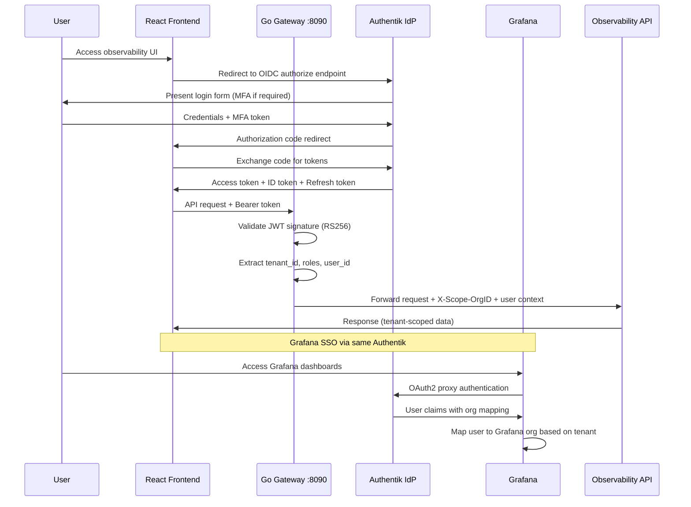

# ERP-Observability Security Guide

> **Document ID:** ERP-OBS-SEC-031
> **Version:** 1.0.0
> **Last Updated:** 2026-02-24
> **Status:** Approved
> **Classification:** Confidential
> **Related Documents:** [01-Technical-Writeup.md](./01-Technical-Writeup.md), [28-Multi-Tenancy-Guide.md](./28-Multi-Tenancy-Guide.md), [26-Disaster-Recovery-Plan.md](./26-Disaster-Recovery-Plan.md)

---

## 1. Overview

This document defines the security architecture, controls, and hardening procedures for the ERP-Observability platform. As the observability layer has visibility into all ERP modules, it represents a high-value target and requires rigorous security controls. This guide covers authentication, authorization, data isolation, API security, component hardening, audit logging, and compliance considerations.

### Security Principles

| Principle | Implementation |
|-----------|----------------|
| **Zero Trust** | Every request is authenticated and authorized, regardless of network origin |
| **Least Privilege** | Users and services receive minimum necessary permissions |
| **Defense in Depth** | Multiple security layers at network, application, and data levels |
| **Tenant Isolation** | Cryptographic and logical separation of tenant data |
| **Audit Everything** | All access to observability data is logged and reviewable |
| **Encrypt in Transit** | TLS 1.3 for all internal and external communication |
| **Encrypt at Rest** | AES-256 for stored telemetry data |
| **Secrets Management** | No hardcoded secrets; all credentials via Kubernetes secrets or vault |

### Threat Model Summary

| Threat | Risk Level | Mitigation |
|--------|-----------|------------|
| Cross-tenant data access | Critical | Header enforcement, query injection, integration tests |
| Unauthorized API access | High | JWT validation, rate limiting, IP allowlisting |
| Credential theft | High | Short-lived tokens, secret rotation, SSO |
| Data exfiltration | High | Audit logging, DLP controls, network policies |
| Injection attacks (PromQL/search) | Medium | Query sanitization, parameterized queries |
| Denial of service | Medium | Rate limiting, resource quotas, circuit breakers |
| Supply chain compromise | Medium | Image scanning, SBOM, dependency audit |
| Insider threat | Medium | RBAC, audit logs, separation of duties |

---

## 2. Authentication Flow

### 2.1 Authentik SSO Integration

ERP-Observability integrates with Authentik (the ERP suite's identity provider) for single sign-on across all observability interfaces.



### 2.2 OIDC Configuration

```yaml
# Authentik OAuth2/OIDC provider configuration for ERP-Observability
provider:
  name: "ERP-Observability"
  authorization_flow: "default-authorization-flow"
  client_type: "confidential"
  client_id: "erp-observability"
  redirect_uris:
    - "https://observe.erp.internal/callback"
    - "https://observe.erp.internal/grafana/login/generic_oauth"
  signing_key: "RS256"
  access_token_validity: "minutes=15"
  refresh_token_validity: "days=7"
  scopes:
    - "openid"
    - "profile"
    - "email"
    - "groups"
  property_mappings:
    - name: "tenant_id"
      expression: "return request.user.group_attributes().get('tenant_id', '')"
    - name: "erp_roles"
      expression: "return [g.name for g in request.user.ak_groups.all()]"
```

### 2.3 JWT Token Structure

```json
{
  "iss": "https://auth.erp.internal/application/o/erp-observability/",
  "sub": "user-uuid-12345",
  "aud": "erp-observability",
  "exp": 1708810800,
  "iat": 1708809900,
  "auth_time": 1708809600,
  "acr": "urn:goauthentik.io:default/mfa",
  "name": "Jane Admin",
  "email": "jane@acme.com",
  "groups": ["tenant-acme-admins", "observability-viewers"],
  "tenant_id": "tenant-acme",
  "erp_roles": ["obs:viewer", "obs:alert-manager"],
  "scope": "openid profile email groups"
}
```

### 2.4 JWT Validation in Go Gateway

```go
// middleware/auth.go
package middleware

import (
    "context"
    "crypto/rsa"
    "encoding/json"
    "fmt"
    "net/http"
    "strings"
    "time"

    "github.com/golang-jwt/jwt/v5"
)

type JWTValidator struct {
    publicKey  *rsa.PublicKey
    issuer     string
    audience   string
    jwksURL    string
    keyCache   map[string]*rsa.PublicKey
}

type Claims struct {
    jwt.RegisteredClaims
    Name     string   `json:"name"`
    Email    string   `json:"email"`
    Groups   []string `json:"groups"`
    TenantID string   `json:"tenant_id"`
    ERPRoles []string `json:"erp_roles"`
    Scope    string   `json:"scope"`
}

func (v *JWTValidator) Authenticate(next http.Handler) http.Handler {
    return http.HandlerFunc(func(w http.ResponseWriter, r *http.Request) {
        // Extract Bearer token
        authHeader := r.Header.Get("Authorization")
        if !strings.HasPrefix(authHeader, "Bearer ") {
            http.Error(w, `{"error":"missing or invalid authorization header"}`, http.StatusUnauthorized)
            return
        }
        tokenString := strings.TrimPrefix(authHeader, "Bearer ")

        // Parse and validate JWT
        token, err := jwt.ParseWithClaims(tokenString, &Claims{}, func(token *jwt.Token) (interface{}, error) {
            // Verify signing algorithm
            if _, ok := token.Method.(*jwt.SigningMethodRSA); !ok {
                return nil, fmt.Errorf("unexpected signing method: %v", token.Header["alg"])
            }

            // Get key ID from header
            kid, ok := token.Header["kid"].(string)
            if !ok {
                return nil, fmt.Errorf("missing kid in token header")
            }

            // Look up public key from JWKS cache
            return v.getPublicKey(kid)
        })

        if err != nil {
            http.Error(w, `{"error":"invalid token"}`, http.StatusUnauthorized)
            return
        }

        claims, ok := token.Claims.(*Claims)
        if !ok || !token.Valid {
            http.Error(w, `{"error":"invalid token claims"}`, http.StatusUnauthorized)
            return
        }

        // Validate issuer and audience
        if claims.Issuer != v.issuer {
            http.Error(w, `{"error":"invalid token issuer"}`, http.StatusUnauthorized)
            return
        }

        // Validate expiration with clock skew tolerance
        if claims.ExpiresAt.Time.Before(time.Now().Add(-30 * time.Second)) {
            http.Error(w, `{"error":"token expired"}`, http.StatusUnauthorized)
            return
        }

        // Inject claims into context
        ctx := context.WithValue(r.Context(), "jwt_claims", claims)
        ctx = context.WithValue(ctx, TenantIDKey, claims.TenantID)
        ctx = context.WithValue(ctx, "user_id", claims.Subject)
        ctx = context.WithValue(ctx, "user_roles", claims.ERPRoles)

        next.ServeHTTP(w, r.WithContext(ctx))
    })
}
```

### 2.5 Service-to-Service Authentication

Internal services authenticate using mTLS certificates or service account tokens:

```yaml
# Service account token for OTel Collector -> VictoriaMetrics
apiVersion: v1
kind: Secret
metadata:
  name: otel-collector-vm-token
  namespace: observability
type: Opaque
data:
  token: <base64-encoded-service-token>

---
# mTLS configuration for internal service communication
apiVersion: v1
kind: Secret
metadata:
  name: observability-internal-tls
  namespace: observability
type: kubernetes.io/tls
data:
  tls.crt: <base64-encoded-cert>
  tls.key: <base64-encoded-key>
  ca.crt: <base64-encoded-ca>
```

---

## 3. RBAC Model for Observability Data

### 3.1 Role Definitions

| Role | Scope | Permissions |
|------|-------|-------------|
| `obs:platform-admin` | Global | Full access to all tenants, system configuration, user management |
| `obs:tenant-admin` | Tenant | Manage tenant settings, users, alert rules, dashboards |
| `obs:alert-manager` | Tenant | Create/edit/silence alerts, acknowledge incidents |
| `obs:dashboard-editor` | Tenant | Create/edit dashboards, add widgets, configure variables |
| `obs:viewer` | Tenant | Read-only access to dashboards, metrics, logs, traces |
| `obs:log-viewer` | Tenant | Read-only access to logs only (restricted metrics/traces) |
| `obs:api-consumer` | Tenant | Programmatic API access, no UI access |

### 3.2 Permission Matrix

| Resource | platform-admin | tenant-admin | alert-manager | dashboard-editor | viewer | log-viewer | api-consumer |
|----------|:---:|:---:|:---:|:---:|:---:|:---:|:---:|
| **Metrics: Query** | All tenants | Own tenant | Own tenant | Own tenant | Own tenant | - | Own tenant |
| **Metrics: Write** | Yes | - | - | - | - | - | Yes |
| **Logs: Search** | All tenants | Own tenant | Own tenant | Own tenant | Own tenant | Own tenant | Own tenant |
| **Traces: Search** | All tenants | Own tenant | Own tenant | Own tenant | Own tenant | - | Own tenant |
| **Alerts: View** | All tenants | Own tenant | Own tenant | Own tenant | Own tenant | - | Own tenant |
| **Alerts: Create/Edit** | Yes | Yes | Yes | - | - | - | Yes |
| **Alerts: Silence** | Yes | Yes | Yes | - | - | - | - |
| **Dashboards: View** | All | Own tenant | Own tenant | Own tenant | Own tenant | - | - |
| **Dashboards: Create/Edit** | Yes | Yes | - | Yes | - | - | - |
| **Dashboards: Delete** | Yes | Yes | - | - | - | - | - |
| **Tenants: Manage** | Yes | - | - | - | - | - | - |
| **System: Configure** | Yes | - | - | - | - | - | - |
| **Audit Logs: View** | Yes | Own tenant | - | - | - | - | - |

### 3.3 RBAC Enforcement Middleware

```go
// middleware/rbac.go
package middleware

import (
    "net/http"
    "strings"
)

type Permission string

const (
    PermMetricsQuery     Permission = "metrics:query"
    PermMetricsWrite     Permission = "metrics:write"
    PermLogsSearch       Permission = "logs:search"
    PermTracesSearch     Permission = "traces:search"
    PermAlertsView       Permission = "alerts:view"
    PermAlertsManage     Permission = "alerts:manage"
    PermAlertsSilence    Permission = "alerts:silence"
    PermDashboardsView   Permission = "dashboards:view"
    PermDashboardsEdit   Permission = "dashboards:edit"
    PermDashboardsDelete Permission = "dashboards:delete"
    PermTenantsManage    Permission = "tenants:manage"
    PermSystemConfig     Permission = "system:config"
    PermAuditView        Permission = "audit:view"
)

var rolePermissions = map[string][]Permission{
    "obs:platform-admin": {
        PermMetricsQuery, PermMetricsWrite, PermLogsSearch, PermTracesSearch,
        PermAlertsView, PermAlertsManage, PermAlertsSilence,
        PermDashboardsView, PermDashboardsEdit, PermDashboardsDelete,
        PermTenantsManage, PermSystemConfig, PermAuditView,
    },
    "obs:tenant-admin": {
        PermMetricsQuery, PermLogsSearch, PermTracesSearch,
        PermAlertsView, PermAlertsManage, PermAlertsSilence,
        PermDashboardsView, PermDashboardsEdit, PermDashboardsDelete,
        PermAuditView,
    },
    "obs:alert-manager": {
        PermMetricsQuery, PermLogsSearch, PermTracesSearch,
        PermAlertsView, PermAlertsManage, PermAlertsSilence,
        PermDashboardsView,
    },
    "obs:dashboard-editor": {
        PermMetricsQuery, PermLogsSearch, PermTracesSearch,
        PermAlertsView, PermDashboardsView, PermDashboardsEdit,
    },
    "obs:viewer": {
        PermMetricsQuery, PermLogsSearch, PermTracesSearch,
        PermAlertsView, PermDashboardsView,
    },
    "obs:log-viewer": {
        PermLogsSearch,
    },
    "obs:api-consumer": {
        PermMetricsQuery, PermMetricsWrite, PermLogsSearch, PermTracesSearch,
        PermAlertsView, PermAlertsManage,
    },
}

func RequirePermission(perm Permission) func(http.Handler) http.Handler {
    return func(next http.Handler) http.Handler {
        return http.HandlerFunc(func(w http.ResponseWriter, r *http.Request) {
            roles, ok := r.Context().Value("user_roles").([]string)
            if !ok {
                http.Error(w, `{"error":"no roles in context"}`, http.StatusForbidden)
                return
            }

            if !hasPermission(roles, perm) {
                http.Error(w, `{"error":"insufficient permissions"}`, http.StatusForbidden)
                return
            }

            next.ServeHTTP(w, r)
        })
    }
}

func hasPermission(userRoles []string, required Permission) bool {
    for _, role := range userRoles {
        if perms, exists := rolePermissions[role]; exists {
            for _, p := range perms {
                if p == required {
                    return true
                }
            }
        }
    }
    return false
}

func isPlatformAdmin(ctx context.Context) bool {
    roles, ok := ctx.Value("user_roles").([]string)
    if !ok {
        return false
    }
    for _, role := range roles {
        if role == "obs:platform-admin" {
            return true
        }
    }
    return false
}
```

### 3.4 Grafana Role Mapping

```ini
# grafana.ini - Role mapping from Authentik groups
[auth.generic_oauth]
enabled = true
name = Authentik
client_id = erp-observability
client_secret_file = /secrets/grafana-oauth-secret
scopes = openid profile email groups
auth_url = https://auth.erp.internal/application/o/authorize/
token_url = https://auth.erp.internal/application/o/token/
api_url = https://auth.erp.internal/application/o/userinfo/
role_attribute_path = contains(groups[*], 'obs:platform-admin') && 'GrafanaAdmin' || contains(groups[*], 'obs:tenant-admin') && 'Admin' || contains(groups[*], 'obs:dashboard-editor') && 'Editor' || 'Viewer'
org_attribute_path = tenant_id
org_mapping = tenant-acme:2:auto tenant-globex:3:auto tenant-initech:4:auto
allow_assign_grafana_admin = true
auto_login = true
```

---

## 4. Tenant Data Isolation Enforcement

### 4.1 Multi-Layer Isolation Architecture

```
Layer 1: Network Policies (Kubernetes)
  └── Only allowed pods can reach observability services

Layer 2: Authentication (JWT/mTLS)
  └── Every request must present valid credentials

Layer 3: Tenant Extraction (Gateway)
  └── tenant_id extracted from JWT, injected as X-Scope-OrgID

Layer 4: Query Enforcement (API Layer)
  └── All queries have tenant filter injected server-side

Layer 5: Storage Isolation (Data Layer)
  └── VictoriaMetrics: URL-based tenant routing + label filtering
  └── Quickwit: partition_key + mandatory tenant_id filter
  └── Grafana: Organization-based datasource isolation

Layer 6: Response Filtering (API Layer)
  └── Response body audited for cross-tenant data leakage
```

### 4.2 Network Policies

```yaml
# Kubernetes NetworkPolicy for observability namespace
apiVersion: networking.k8s.io/v1
kind: NetworkPolicy
metadata:
  name: observability-ingress
  namespace: observability
spec:
  podSelector: {}
  policyTypes:
    - Ingress
    - Egress
  ingress:
    # Allow from ERP modules (OTel SDK -> Collector)
    - from:
        - namespaceSelector:
            matchLabels:
              erp-module: "true"
      ports:
        - port: 4317  # OTLP gRPC
          protocol: TCP
        - port: 4318  # OTLP HTTP
          protocol: TCP

    # Allow from ingress controller (external access)
    - from:
        - namespaceSelector:
            matchLabels:
              kubernetes.io/metadata.name: ingress-nginx
      ports:
        - port: 8090  # Gateway
          protocol: TCP
        - port: 3000  # Grafana
          protocol: TCP

    # Allow internal communication within observability namespace
    - from:
        - podSelector: {}

  egress:
    # Allow DNS
    - to:
        - namespaceSelector: {}
      ports:
        - port: 53
          protocol: UDP
        - port: 53
          protocol: TCP

    # Allow to Authentik for token validation
    - to:
        - namespaceSelector:
            matchLabels:
              kubernetes.io/metadata.name: authentik
      ports:
        - port: 443
          protocol: TCP

    # Allow internal communication
    - to:
        - podSelector: {}

    # Allow to RustFS for object storage
    - to:
        - namespaceSelector:
            matchLabels:
              kubernetes.io/metadata.name: storage
      ports:
        - port: 9000
          protocol: TCP
```

### 4.3 Isolation Testing

Automated tests that run in CI/CD to verify tenant isolation is never broken:

```go
// tests/security/isolation_test.go
func TestCrossTenantMetricIsolation(t *testing.T) {
    // Create unique test data for two tenants
    tenantA := setupTenant(t, "sec-test-a")
    tenantB := setupTenant(t, "sec-test-b")

    secretValue := fmt.Sprintf("secret_%d", time.Now().UnixNano())

    // Ingest a metric with a secret label value for tenant A
    ingestMetric(t, tenantA, "security_test_metric",
        map[string]string{"secret": secretValue}, 42.0)

    time.Sleep(5 * time.Second) // Wait for indexing

    // Attempt to query as tenant B
    result := queryAsTeannt(t, tenantB, fmt.Sprintf(`security_test_metric{secret="%s"}`, secretValue))
    assert.Empty(t, result, "tenant B must NOT see tenant A's metrics")

    // Attempt to query without tenant header
    result = queryWithoutTenant(t, `security_test_metric`)
    assert.Error(t, result.Err, "queries without tenant must be rejected")

    // Attempt header injection (pipe-separated tenants as non-admin)
    result = queryWithForgedHeader(t, tenantB, tenantA.ID+"|"+tenantB.ID,
        "security_test_metric")
    assert.Error(t, result.Err, "multi-tenant header must be rejected for non-admins")
}

func TestCrossTenantLogIsolation(t *testing.T) {
    tenantA := setupTenant(t, "log-sec-a")
    tenantB := setupTenant(t, "log-sec-b")

    secretMessage := fmt.Sprintf("confidential_data_%d", time.Now().UnixNano())
    ingestLog(t, tenantA, secretMessage)

    time.Sleep(10 * time.Second)

    // Tenant B searches for tenant A's secret
    logs := searchLogsAsTenant(t, tenantB, secretMessage)
    assert.Empty(t, logs, "tenant B must NOT find tenant A's logs")

    // Wildcard search as non-admin
    logs = searchLogsWithQuery(t, tenantB, "*")
    for _, log := range logs {
        assert.Equal(t, tenantB.ID, log.TenantID,
            "all returned logs must belong to querying tenant")
    }
}
```

---

## 5. API Security

### 5.1 TLS Configuration

All external and internal endpoints use TLS 1.3:

```yaml
# Gateway TLS configuration
tls:
  minVersion: "1.3"
  cipherSuites:
    - "TLS_AES_256_GCM_SHA384"
    - "TLS_CHACHA20_POLY1305_SHA256"
    - "TLS_AES_128_GCM_SHA256"
  certificates:
    - certFile: /tls/tls.crt
      keyFile: /tls/tls.key
  clientAuth:
    clientAuthType: "VerifyClientCertIfGiven"
    caFiles:
      - /tls/ca.crt

# HSTS header
headers:
  Strict-Transport-Security: "max-age=63072000; includeSubDomains; preload"
  X-Content-Type-Options: "nosniff"
  X-Frame-Options: "DENY"
  X-XSS-Protection: "1; mode=block"
  Content-Security-Policy: "default-src 'self'; script-src 'self' 'unsafe-eval'; style-src 'self' 'unsafe-inline'"
  Referrer-Policy: "strict-origin-when-cross-origin"
```

### 5.2 Rate Limiting

```go
// middleware/ratelimit.go
package middleware

import (
    "net/http"
    "time"

    "github.com/redis/go-redis/v9"
    "golang.org/x/time/rate"
)

type RateLimitConfig struct {
    // Per-tenant limits
    GlobalRequestsPerSecond int     // Default: 1000
    GlobalBurstSize         int     // Default: 2000
    QueryRequestsPerSecond  int     // Default: 100
    QueryBurstSize          int     // Default: 200
    WriteRequestsPerSecond  int     // Default: 500
    WriteBurstSize          int     // Default: 1000
    // Per-IP limits (for unauthenticated endpoints)
    IPRequestsPerSecond     int     // Default: 50
    IPBurstSize             int     // Default: 100
}

// Tier-based rate limits
var tierLimits = map[string]RateLimitConfig{
    "free": {
        GlobalRequestsPerSecond: 100,
        GlobalBurstSize:         200,
        QueryRequestsPerSecond:  20,
        QueryBurstSize:          40,
        WriteRequestsPerSecond:  50,
        WriteBurstSize:          100,
    },
    "standard": {
        GlobalRequestsPerSecond: 500,
        GlobalBurstSize:         1000,
        QueryRequestsPerSecond:  100,
        QueryBurstSize:          200,
        WriteRequestsPerSecond:  250,
        WriteBurstSize:          500,
    },
    "enterprise": {
        GlobalRequestsPerSecond: 2000,
        GlobalBurstSize:         5000,
        QueryRequestsPerSecond:  500,
        QueryBurstSize:          1000,
        WriteRequestsPerSecond:  1000,
        WriteBurstSize:          2000,
    },
}

func RateLimit(dragonfly *redis.Client) func(http.Handler) http.Handler {
    return func(next http.Handler) http.Handler {
        return http.HandlerFunc(func(w http.ResponseWriter, r *http.Request) {
            tenantID := r.Context().Value(TenantIDKey).(string)

            // Use DragonflyDB-backed sliding window rate limiter
            key := fmt.Sprintf("ratelimit:%s:%d", tenantID, time.Now().Unix())
            count, err := dragonfly.Incr(r.Context(), key).Result()
            if err != nil {
                // Fail open but log the error
                next.ServeHTTP(w, r)
                return
            }

            // Set TTL on first increment
            if count == 1 {
                dragonfly.Expire(r.Context(), key, 2*time.Second)
            }

            // Look up tenant tier limits
            tier := getTenantTier(r.Context(), tenantID)
            limits := tierLimits[tier]

            if int(count) > limits.GlobalRequestsPerSecond {
                w.Header().Set("Retry-After", "1")
                w.Header().Set("X-RateLimit-Limit", fmt.Sprintf("%d", limits.GlobalRequestsPerSecond))
                w.Header().Set("X-RateLimit-Remaining", "0")
                http.Error(w, `{"error":"rate limit exceeded"}`, http.StatusTooManyRequests)
                return
            }

            w.Header().Set("X-RateLimit-Limit", fmt.Sprintf("%d", limits.GlobalRequestsPerSecond))
            w.Header().Set("X-RateLimit-Remaining", fmt.Sprintf("%d", limits.GlobalRequestsPerSecond-int(count)))

            next.ServeHTTP(w, r)
        })
    }
}
```

### 5.3 Token Validation

```go
// middleware/token.go
package middleware

// API Key validation for programmatic access (obs:api-consumer role)
func ValidateAPIKey(next http.Handler) http.Handler {
    return http.HandlerFunc(func(w http.ResponseWriter, r *http.Request) {
        // Check for API key header (alternative to JWT for machine-to-machine)
        apiKey := r.Header.Get("X-API-Key")
        if apiKey == "" {
            // Fall through to JWT validation
            next.ServeHTTP(w, r)
            return
        }

        // Validate API key against YugabyteDB
        keyRecord, err := db.ValidateAPIKey(r.Context(), apiKey)
        if err != nil || keyRecord == nil {
            http.Error(w, `{"error":"invalid API key"}`, http.StatusUnauthorized)
            return
        }

        // Check key expiration
        if keyRecord.ExpiresAt.Before(time.Now()) {
            http.Error(w, `{"error":"API key expired"}`, http.StatusUnauthorized)
            return
        }

        // Check key is not revoked
        if keyRecord.Revoked {
            http.Error(w, `{"error":"API key revoked"}`, http.StatusUnauthorized)
            return
        }

        // Inject tenant and role context
        ctx := context.WithValue(r.Context(), TenantIDKey, keyRecord.TenantID)
        ctx = context.WithValue(ctx, "user_id", fmt.Sprintf("apikey:%s", keyRecord.KeyID))
        ctx = context.WithValue(ctx, "user_roles", keyRecord.Roles)

        // Update last used timestamp (async)
        go db.UpdateAPIKeyLastUsed(context.Background(), keyRecord.KeyID)

        next.ServeHTTP(w, r.WithContext(ctx))
    })
}
```

### 5.4 Input Validation and Query Sanitization

```go
// middleware/sanitize.go
package middleware

import (
    "net/http"
    "regexp"
    "strings"
)

var (
    // Patterns that indicate query injection attempts
    dangerousPatterns = []*regexp.Regexp{
        regexp.MustCompile(`(?i)delete\s+from`),
        regexp.MustCompile(`(?i)drop\s+(table|index|database)`),
        regexp.MustCompile(`(?i);\s*(delete|drop|truncate|alter)`),
        regexp.MustCompile(`\x00`),  // Null bytes
    }

    // Maximum query length to prevent DoS
    maxQueryLength = 10000  // 10KB

    // Maximum number of label matchers to prevent cardinality bombs
    maxLabelMatchers = 50
)

func SanitizeQuery(next http.Handler) http.Handler {
    return http.HandlerFunc(func(w http.ResponseWriter, r *http.Request) {
        query := r.URL.Query().Get("query")
        if query == "" {
            // For POST requests, read from body
            // (implementation depends on content type)
            next.ServeHTTP(w, r)
            return
        }

        // Check query length
        if len(query) > maxQueryLength {
            http.Error(w, `{"error":"query too long"}`, http.StatusBadRequest)
            return
        }

        // Check for dangerous patterns
        for _, pattern := range dangerousPatterns {
            if pattern.MatchString(query) {
                auditLog(r.Context(), "query_injection_attempt", map[string]interface{}{
                    "query":     query,
                    "user_id":   getUserID(r.Context()),
                    "tenant_id": r.Context().Value(TenantIDKey),
                    "ip":        r.RemoteAddr,
                })
                http.Error(w, `{"error":"invalid query"}`, http.StatusBadRequest)
                return
            }
        }

        next.ServeHTTP(w, r)
    })
}
```

---

## 6. Grafana Security Hardening

### 6.1 Grafana Security Configuration

```ini
# grafana.ini - Security hardening

[security]
# Disable default admin account creation
disable_initial_admin_creation = true

# Cookie security
cookie_secure = true
cookie_samesite = strict
strict_transport_security = true
strict_transport_security_max_age_seconds = 63072000
strict_transport_security_preload = true
strict_transport_security_subdomains = true

# Content security
content_security_policy = true
content_security_policy_template = """script-src 'self' 'unsafe-eval' 'unsafe-inline'; style-src 'self' 'unsafe-inline'; img-src 'self' data:; font-src 'self'; connect-src 'self'; frame-src 'self';"""

# Disable features that expose data
allow_embedding = false
disable_gravatar = true

# Secret key for signing (rotated quarterly)
secret_key_file = /secrets/grafana-secret-key

[users]
# Disable local user registration
allow_sign_up = false
allow_org_create = false
auto_assign_org = false
verify_email_enabled = true

[auth]
# Disable basic auth (use SSO only)
disable_login_form = true
disable_signout_menu = false
oauth_auto_login = true
oauth_allow_insecure_email_lookup = false

[auth.anonymous]
enabled = false

[snapshots]
# Restrict snapshot sharing
external_enabled = false

[dashboards]
# Minimum refresh interval (prevent query flooding)
min_refresh_interval = 10s

[alerting]
# Restrict alert notification channels
max_annotations_to_return = 100

[log]
# Structured logging for audit
mode = console
level = warn
filters = "auth:info alerting:info dashboards:info"
```

### 6.2 Grafana Datasource Security

```yaml
# Datasource security: All datasources use proxy mode (server-side)
# Frontend never communicates directly with backends

datasources:
  - name: VictoriaMetrics
    type: prometheus
    access: proxy          # Server-side proxy, NOT browser/direct
    url: http://vmselect:8481/select/0/prometheus
    withCredentials: false  # Credentials are on server side
    jsonData:
      httpHeaderName1: "X-Scope-OrgID"
      tlsAuth: false
      oauthPassThru: false  # Do NOT pass user's OAuth token to backend
    secureJsonData:
      httpHeaderValue1: "${TENANT_ID}"  # Injected per org

  - name: Quickwit Logs
    type: quickwit-quickwit-datasource
    access: proxy
    url: http://quickwit-searcher:7280/api/v1
    jsonData:
      httpHeaderName1: "X-Scope-OrgID"
    secureJsonData:
      httpHeaderValue1: "${TENANT_ID}"
```

---

## 7. VictoriaMetrics Auth Proxy

### 7.1 vmauth Configuration

VictoriaMetrics vmauth serves as an authentication and authorization proxy in front of vmselect and vminsert:

```yaml
# vmauth.yml
users:
  # OTel Collector write access (service account)
  - username: "otel-collector"
    password_file: "/secrets/otel-collector-password"
    url_prefix:
      - "http://vminsert:8480/insert/"
    max_concurrent_requests: 100

  # Grafana read access (service account)
  - username: "grafana"
    password_file: "/secrets/grafana-vm-password"
    url_prefix:
      - "http://vmselect:8481/select/"
    max_concurrent_requests: 50

  # Observability API read/write access
  - username: "observability-api"
    password_file: "/secrets/obs-api-vm-password"
    url_prefix:
      - "http://vmselect:8481/select/"
      - "http://vminsert:8480/insert/"
    max_concurrent_requests: 200

  # Alertmanager/vmalert read access
  - username: "vmalert"
    password_file: "/secrets/vmalert-vm-password"
    url_prefix:
      - "http://vmselect:8481/select/"
    max_concurrent_requests: 30

unauthorized_user:
  # Reject all unauthorized requests
  url_prefix: "http://localhost:8481/"
  response_status_code: 401
```

### 7.2 vmauth Deployment

```yaml
apiVersion: apps/v1
kind: Deployment
metadata:
  name: vmauth
  namespace: observability
spec:
  replicas: 2
  selector:
    matchLabels:
      app: vmauth
  template:
    spec:
      containers:
        - name: vmauth
          image: victoriametrics/vmauth:latest
          args:
            - "-auth.config=/config/vmauth.yml"
            - "-httpListenAddr=:8427"
            - "-tls"
            - "-tlsCertFile=/tls/tls.crt"
            - "-tlsKeyFile=/tls/tls.key"
            - "-loggerLevel=WARN"
          ports:
            - containerPort: 8427
          volumeMounts:
            - name: config
              mountPath: /config
            - name: secrets
              mountPath: /secrets
              readOnly: true
            - name: tls
              mountPath: /tls
              readOnly: true
```

---

## 8. Audit Logging

### 8.1 Audit Log Schema

Every security-relevant action is recorded in the audit log:

```sql
-- YugabyteDB audit log table
CREATE TABLE audit_logs (
    id UUID DEFAULT gen_random_uuid() PRIMARY KEY,
    timestamp TIMESTAMPTZ NOT NULL DEFAULT NOW(),
    event_type TEXT NOT NULL,           -- e.g., 'auth.login', 'data.query', 'config.change'
    actor_id TEXT NOT NULL,             -- User ID or service account
    actor_type TEXT NOT NULL,           -- 'user', 'service_account', 'api_key'
    tenant_id TEXT,                     -- Tenant context
    resource_type TEXT,                 -- e.g., 'metric', 'log', 'alert', 'dashboard'
    resource_id TEXT,                   -- Specific resource identifier
    action TEXT NOT NULL,               -- 'create', 'read', 'update', 'delete', 'query'
    result TEXT NOT NULL,               -- 'success', 'failure', 'denied'
    details JSONB,                      -- Action-specific details
    ip_address INET,                    -- Client IP
    user_agent TEXT,                    -- Client user agent
    request_id TEXT,                    -- Correlation ID
    duration_ms INT                     -- Request duration
) PARTITION BY RANGE (timestamp);

-- Create monthly partitions
CREATE TABLE audit_logs_2026_02 PARTITION OF audit_logs
    FOR VALUES FROM ('2026-02-01') TO ('2026-03-01');
CREATE TABLE audit_logs_2026_03 PARTITION OF audit_logs
    FOR VALUES FROM ('2026-03-01') TO ('2026-04-01');

-- Indexes for common queries
CREATE INDEX idx_audit_actor ON audit_logs (actor_id, timestamp DESC);
CREATE INDEX idx_audit_tenant ON audit_logs (tenant_id, timestamp DESC);
CREATE INDEX idx_audit_event_type ON audit_logs (event_type, timestamp DESC);
CREATE INDEX idx_audit_result ON audit_logs (result, timestamp DESC) WHERE result != 'success';
```

### 8.2 Audit Event Types

| Event Type | Description | Logged Details |
|-----------|-------------|----------------|
| `auth.login` | User authentication | method, success/failure, MFA used |
| `auth.logout` | User logout | session duration |
| `auth.token_refresh` | Token renewal | previous expiry |
| `auth.api_key_created` | New API key generated | key ID, permissions, expiry |
| `auth.api_key_revoked` | API key revoked | key ID, reason |
| `data.metrics_query` | Metrics queried | PromQL expression, time range, result count |
| `data.logs_search` | Logs searched | query, time range, result count |
| `data.traces_search` | Traces searched | query, time range, result count |
| `data.export` | Data exported | format, size, destination |
| `alert.created` | Alert rule created | rule details |
| `alert.modified` | Alert rule modified | changed fields |
| `alert.silenced` | Alert silenced | silence duration, reason |
| `alert.acknowledged` | Alert acknowledged | alert ID |
| `dashboard.created` | Dashboard created | dashboard ID, name |
| `dashboard.modified` | Dashboard modified | changed panels |
| `dashboard.shared` | Dashboard shared | share type, recipients |
| `tenant.created` | Tenant provisioned | tier, quotas |
| `tenant.modified` | Tenant settings changed | changed fields |
| `tenant.suspended` | Tenant suspended | reason |
| `config.changed` | System config modified | component, parameter, old/new value |
| `security.cross_tenant` | Cross-tenant query (admin) | queried tenants |
| `security.rate_limited` | Rate limit triggered | tenant, endpoint, rate |
| `security.injection_attempt` | Query injection detected | query, IP |

### 8.3 Audit Logging Implementation

```go
// internal/audit/logger.go
package audit

import (
    "context"
    "encoding/json"
    "time"

    "github.com/jackc/pgx/v5/pgxpool"
)

type AuditLogger struct {
    db      *pgxpool.Pool
    buffer  chan AuditEntry
}

type AuditEntry struct {
    Timestamp    time.Time              `json:"timestamp"`
    EventType    string                 `json:"event_type"`
    ActorID      string                 `json:"actor_id"`
    ActorType    string                 `json:"actor_type"`
    TenantID     string                 `json:"tenant_id"`
    ResourceType string                 `json:"resource_type,omitempty"`
    ResourceID   string                 `json:"resource_id,omitempty"`
    Action       string                 `json:"action"`
    Result       string                 `json:"result"`
    Details      map[string]interface{} `json:"details,omitempty"`
    IPAddress    string                 `json:"ip_address,omitempty"`
    UserAgent    string                 `json:"user_agent,omitempty"`
    RequestID    string                 `json:"request_id,omitempty"`
    DurationMS   int                    `json:"duration_ms,omitempty"`
}

func NewAuditLogger(db *pgxpool.Pool) *AuditLogger {
    logger := &AuditLogger{
        db:     db,
        buffer: make(chan AuditEntry, 10000),
    }

    // Background worker to batch-insert audit entries
    go logger.flushWorker()

    return logger
}

func (l *AuditLogger) Log(ctx context.Context, entry AuditEntry) {
    if entry.Timestamp.IsZero() {
        entry.Timestamp = time.Now()
    }

    // Extract context values if not already set
    if entry.ActorID == "" {
        if uid, ok := ctx.Value("user_id").(string); ok {
            entry.ActorID = uid
        }
    }
    if entry.TenantID == "" {
        if tid, ok := ctx.Value(TenantIDKey).(string); ok {
            entry.TenantID = tid
        }
    }
    if entry.RequestID == "" {
        if rid, ok := ctx.Value("request_id").(string); ok {
            entry.RequestID = rid
        }
    }

    // Non-blocking send to buffer
    select {
    case l.buffer <- entry:
    default:
        // Buffer full - log synchronously as fallback
        l.insertEntry(ctx, entry)
    }
}

func (l *AuditLogger) flushWorker() {
    ticker := time.NewTicker(1 * time.Second)
    batch := make([]AuditEntry, 0, 100)

    for {
        select {
        case entry := <-l.buffer:
            batch = append(batch, entry)
            if len(batch) >= 100 {
                l.insertBatch(context.Background(), batch)
                batch = batch[:0]
            }
        case <-ticker.C:
            if len(batch) > 0 {
                l.insertBatch(context.Background(), batch)
                batch = batch[:0]
            }
        }
    }
}

func (l *AuditLogger) insertBatch(ctx context.Context, entries []AuditEntry) {
    query := `INSERT INTO audit_logs
        (timestamp, event_type, actor_id, actor_type, tenant_id,
         resource_type, resource_id, action, result, details,
         ip_address, user_agent, request_id, duration_ms)
        VALUES ($1, $2, $3, $4, $5, $6, $7, $8, $9, $10, $11, $12, $13, $14)`

    batch := &pgx.Batch{}
    for _, e := range entries {
        detailsJSON, _ := json.Marshal(e.Details)
        batch.Queue(query,
            e.Timestamp, e.EventType, e.ActorID, e.ActorType, e.TenantID,
            e.ResourceType, e.ResourceID, e.Action, e.Result, detailsJSON,
            e.IPAddress, e.UserAgent, e.RequestID, e.DurationMS)
    }

    br := l.db.SendBatch(ctx, batch)
    defer br.Close()
}
```

### 8.4 Audit Log Retention and Access

```yaml
# Audit log retention policy
retention:
  audit_logs: 365 days    # 1 year for compliance
  security_events: 730 days  # 2 years for security incidents

# Access control: Only platform-admins and tenant-admins can view audit logs
# Tenant-admins can only see their own tenant's audit logs
```

---

## 9. Compliance Considerations

### 9.1 SOC 2 Controls

| SOC 2 Criteria | Control | Implementation |
|----------------|---------|----------------|
| **CC6.1** Access controls | RBAC with role-based permissions | See Section 3 (RBAC Model) |
| **CC6.2** Authentication | SSO via Authentik with MFA | See Section 2 (Authentication) |
| **CC6.3** Encryption | TLS 1.3 in transit, AES-256 at rest | See Section 5.1 (TLS Configuration) |
| **CC6.6** System boundaries | Network policies, firewall rules | See Section 4.2 (Network Policies) |
| **CC7.1** Monitoring | Self-monitoring of observability stack | Performance Benchmarks doc |
| **CC7.2** Incident detection | Alert rules, anomaly detection | See Alert Management |
| **CC7.3** Event response | Runbooks, escalation policies | Runbooks doc |
| **CC8.1** Change management | Audit logs for all configuration changes | See Section 8 (Audit Logging) |

### 9.2 GDPR Data Residency

| Requirement | Implementation |
|-------------|----------------|
| **Data location** | Observability data stored in same region as ERP module data |
| **Right to erasure** | Tenant decommissioning purges all telemetry data (see Multi-Tenancy Guide) |
| **Data minimization** | Retention policies limit data storage duration |
| **PII in logs** | OTel Collector processors redact PII fields before storage |
| **Data processing agreement** | Observability data processing included in DPA |
| **Cross-border transfers** | No telemetry data leaves the configured data region |
| **Subject access requests** | Audit logs can be exported per user for SARs |

### 9.3 PII Redaction in Logs

```yaml
# OTel Collector processor to redact PII from logs
processors:
  redaction/pii:
    blocked_values:
      # Email addresses
      - regex: '[a-zA-Z0-9._%+-]+@[a-zA-Z0-9.-]+\.[a-zA-Z]{2,}'
        replacement: "[REDACTED_EMAIL]"
      # Credit card numbers
      - regex: '\b(?:\d{4}[-\s]?){3}\d{4}\b'
        replacement: "[REDACTED_CC]"
      # Social Security Numbers
      - regex: '\b\d{3}-\d{2}-\d{4}\b'
        replacement: "[REDACTED_SSN]"
      # Phone numbers
      - regex: '\b(?:\+\d{1,3}[-\s]?)?\(?\d{3}\)?[-\s]?\d{3}[-\s]?\d{4}\b'
        replacement: "[REDACTED_PHONE]"
      # IP addresses in log messages (keep in metadata)
      - regex: '\b(?:\d{1,3}\.){3}\d{1,3}\b'
        context: body_only  # Only redact in message body, not metadata
        replacement: "[REDACTED_IP]"
    allowed_keys:
      - "timestamp"
      - "severity"
      - "service.name"
      - "tenant_id"
      - "trace_id"
      - "span_id"
      - "module"
      - "component"
      - "operation"
      - "error.type"
    blocked_keys:
      - "password"
      - "secret"
      - "token"
      - "authorization"
      - "cookie"
      - "ssn"
      - "credit_card"
```

### 9.4 Security Scanning and Compliance Automation

```yaml
# CI/CD security scanning pipeline
security_checks:
  - name: Container Image Scanning
    tool: trivy
    config:
      severity: "CRITICAL,HIGH"
      ignore-unfixed: true
      exit-code: 1
    schedule: "on every build"

  - name: Dependency Audit
    tool: govulncheck (Go), npm audit (Node.js)
    config:
      fail-on: "high"
    schedule: "daily"

  - name: SBOM Generation
    tool: syft
    config:
      format: "spdx-json"
      output: "sbom/"
    schedule: "on every release"

  - name: Secret Detection
    tool: gitleaks
    config:
      baseline-path: ".gitleaks-baseline.json"
    schedule: "on every commit"

  - name: Infrastructure Security
    tool: kubeaudit
    config:
      checks:
        - privileged
        - rootfs
        - seccomp
        - capabilities
        - nonroot
    schedule: "daily"

  - name: Network Policy Validation
    tool: illuminatio
    config:
      namespaces: ["observability"]
    schedule: "weekly"

  - name: Tenant Isolation Tests
    tool: custom (Go test suite)
    config:
      test-path: "tests/security/"
    schedule: "on every deployment"
```

---

## 10. Secret Management

### 10.1 Secret Inventory

| Secret | Storage | Rotation Period | Used By |
|--------|---------|----------------|---------|
| Authentik OIDC client secret | K8s Secret | 90 days | Go Gateway |
| Grafana OAuth client secret | K8s Secret | 90 days | Grafana |
| Grafana admin API key | K8s Secret | 30 days | Module provisioner |
| VictoriaMetrics auth passwords | K8s Secret | 90 days | vmauth |
| Alertmanager Slack webhooks | K8s Secret | On change | Alertmanager |
| Alertmanager PagerDuty keys | K8s Secret | On change | Alertmanager |
| YugabyteDB credentials | K8s Secret | 90 days | All APIs |
| DragonflyDB password | K8s Secret | 90 days | Grafana, APIs |
| RustFS access/secret keys | K8s Secret | 90 days | Quickwit, VM |
| Grafana secret key (signing) | K8s Secret | 90 days | Grafana |
| TLS certificates | cert-manager | Auto (Let's Encrypt) | All services |
| Internal CA certificate | K8s Secret | 365 days | mTLS |

### 10.2 Secret Rotation Procedure

```bash
#!/bin/bash
# scripts/rotate-secrets.sh
# Automated secret rotation for observability stack

set -euo pipefail

NAMESPACE="observability"
DATE=$(date +%Y%m%d)

echo "=== Secret Rotation: $DATE ==="

# 1. Generate new VictoriaMetrics auth passwords
echo "Rotating VictoriaMetrics passwords..."
NEW_OTEL_PW=$(openssl rand -base64 32)
NEW_GRAFANA_PW=$(openssl rand -base64 32)
NEW_API_PW=$(openssl rand -base64 32)
NEW_VMALERT_PW=$(openssl rand -base64 32)

kubectl -n $NAMESPACE create secret generic vmauth-secrets \
  --from-literal=otel-collector-password="$NEW_OTEL_PW" \
  --from-literal=grafana-vm-password="$NEW_GRAFANA_PW" \
  --from-literal=obs-api-vm-password="$NEW_API_PW" \
  --from-literal=vmalert-vm-password="$NEW_VMALERT_PW" \
  --dry-run=client -o yaml | kubectl apply -f -

# 2. Rotate DragonflyDB password
echo "Rotating DragonflyDB password..."
NEW_DRAGONFLY_PW=$(openssl rand -base64 32)
kubectl -n $NAMESPACE create secret generic dragonfly-auth \
  --from-literal=password="$NEW_DRAGONFLY_PW" \
  --dry-run=client -o yaml | kubectl apply -f -

# 3. Rotate Grafana secret key
echo "Rotating Grafana secret key..."
NEW_GRAFANA_SK=$(openssl rand -base64 48)
kubectl -n $NAMESPACE create secret generic grafana-secret-key \
  --from-literal=secret-key="$NEW_GRAFANA_SK" \
  --dry-run=client -o yaml | kubectl apply -f -

# 4. Rolling restart affected deployments
echo "Rolling restart deployments..."
kubectl -n $NAMESPACE rollout restart deployment vmauth
kubectl -n $NAMESPACE rollout restart deployment grafana
kubectl -n $NAMESPACE rollout restart deployment otel-collector
kubectl -n $NAMESPACE rollout restart deployment observability-api
kubectl -n $NAMESPACE rollout restart deployment vmalert

# 5. Wait for rollouts to complete
kubectl -n $NAMESPACE rollout status deployment vmauth --timeout=300s
kubectl -n $NAMESPACE rollout status deployment grafana --timeout=300s
kubectl -n $NAMESPACE rollout status deployment otel-collector --timeout=300s

echo "=== Secret rotation complete ==="
```

---

## 11. Incident Response

### 11.1 Security Incident Classification

| Severity | Description | Response Time | Example |
|----------|-------------|---------------|---------|
| **P1 - Critical** | Active data breach or tenant isolation failure | 15 minutes | Cross-tenant data exposure |
| **P2 - High** | Authentication bypass or privilege escalation | 1 hour | Invalid JWT accepted |
| **P3 - Medium** | Failed attack attempt or vulnerability discovered | 4 hours | SQL injection attempt blocked |
| **P4 - Low** | Minor security configuration issue | 24 hours | Unnecessary port exposed |

### 11.2 Incident Response Playbook

```
1. DETECT
   - Automated: Alert from audit log anomaly detection
   - Manual: User report or security scan finding

2. CONTAIN
   - Isolate affected component (scale to 0 or network policy block)
   - Revoke compromised credentials
   - Enable enhanced logging on affected services

3. INVESTIGATE
   - Query audit logs: SELECT * FROM audit_logs WHERE timestamp > $incident_start
   - Query access logs for the affected tenant/user
   - Review OTel traces for the affected time period
   - Check for lateral movement indicators

4. REMEDIATE
   - Patch vulnerability or fix misconfiguration
   - Rotate all potentially compromised secrets
   - Deploy fix with rollback plan

5. RECOVER
   - Verify fix in staging environment
   - Gradual rollout to production
   - Confirm normal operation via monitoring

6. POST-INCIDENT
   - Write incident report within 48 hours
   - Update threat model and security controls
   - Add new automated detection for similar attacks
   - Notify affected tenants per data breach policy
```

### 11.3 Security Monitoring Alerts

```yaml
# Alert rules for security events
groups:
  - name: security_alerts
    rules:
      - alert: HighAuthFailureRate
        expr: |
          rate(audit_auth_failures_total[5m]) > 10
        for: 2m
        labels:
          severity: critical
          category: security
        annotations:
          summary: "High authentication failure rate: {{ $value }}/sec"
          action: "Investigate potential brute force attack"

      - alert: CrossTenantAccessAttempt
        expr: |
          rate(audit_cross_tenant_denied_total[5m]) > 0
        for: 1m
        labels:
          severity: critical
          category: security
        annotations:
          summary: "Cross-tenant access attempt detected"
          action: "Investigate immediately - potential data breach attempt"

      - alert: UnusualQueryVolume
        expr: |
          rate(audit_data_queries_total[5m])
          > 3 * avg_over_time(rate(audit_data_queries_total[5m])[7d:1h])
        for: 15m
        labels:
          severity: warning
          category: security
        annotations:
          summary: "Query volume 3x above normal average"
          action: "Review for potential data exfiltration"

      - alert: APIKeyUsedFromNewIP
        expr: |
          count by (api_key_id) (
            count by (api_key_id, ip_address) (audit_api_key_usage)
          ) > count by (api_key_id) (
            count by (api_key_id, ip_address) (audit_api_key_usage offset 7d)
          ) + 2
        for: 5m
        labels:
          severity: warning
          category: security
        annotations:
          summary: "API key {{ $labels.api_key_id }} used from new IP addresses"

      - alert: PrivilegeEscalationAttempt
        expr: |
          rate(audit_rbac_denied_total{action=~"admin.*|config.*|tenant.*"}[5m]) > 0
        for: 1m
        labels:
          severity: critical
          category: security
        annotations:
          summary: "Privilege escalation attempt detected"
          action: "Review user attempting admin actions without permission"
```
