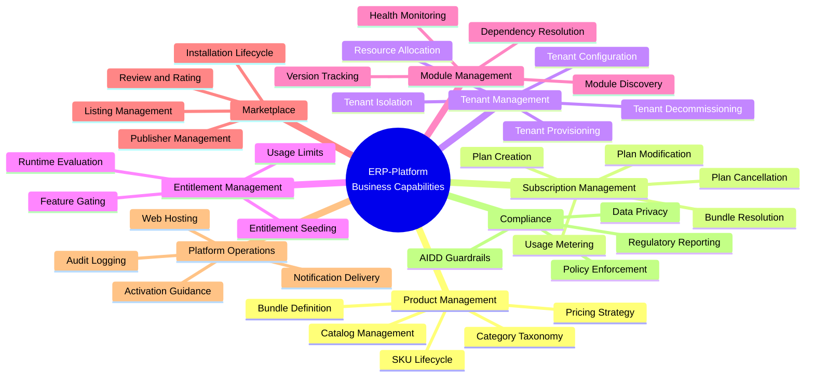
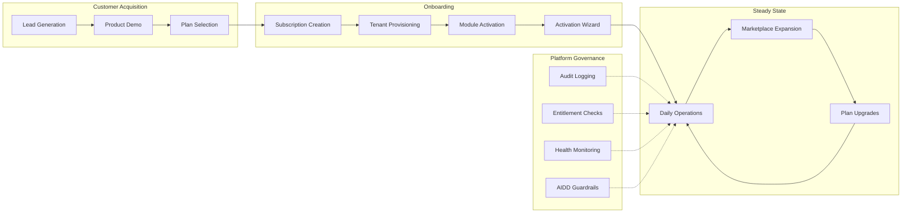
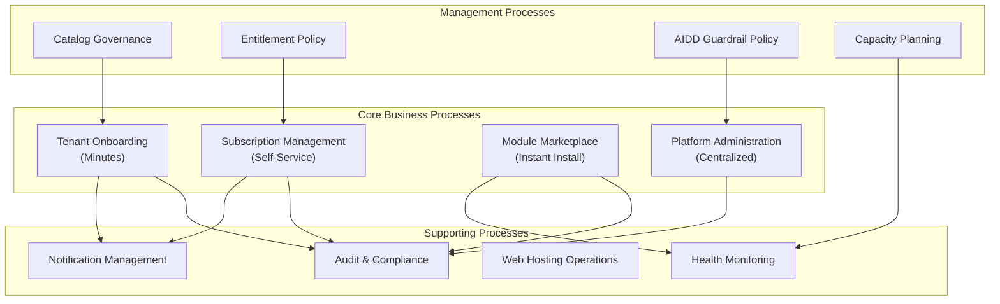
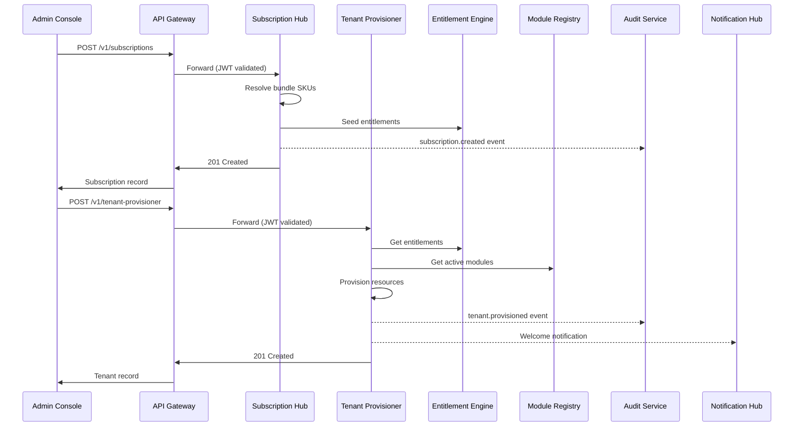
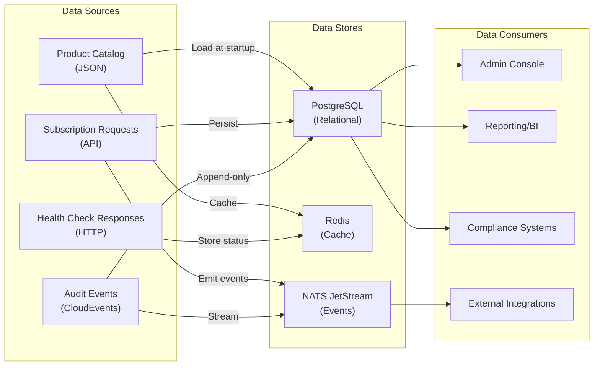
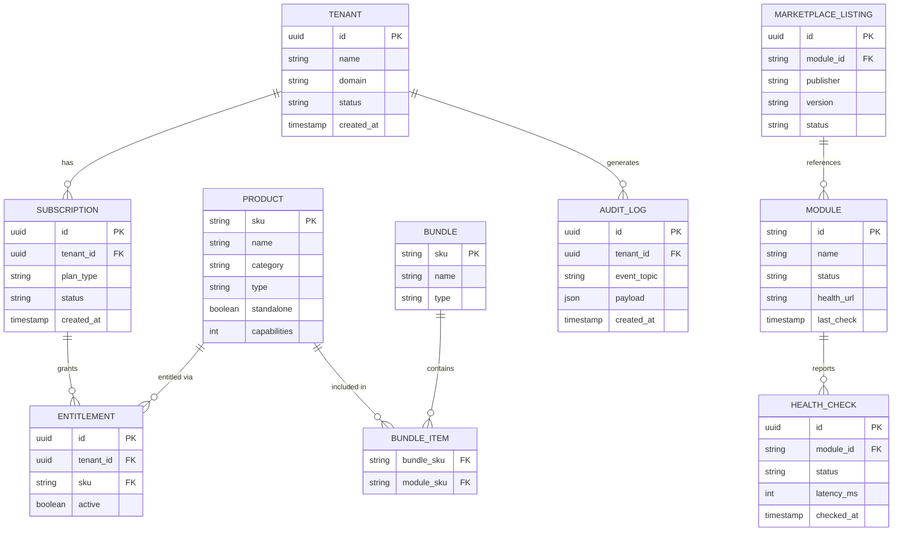
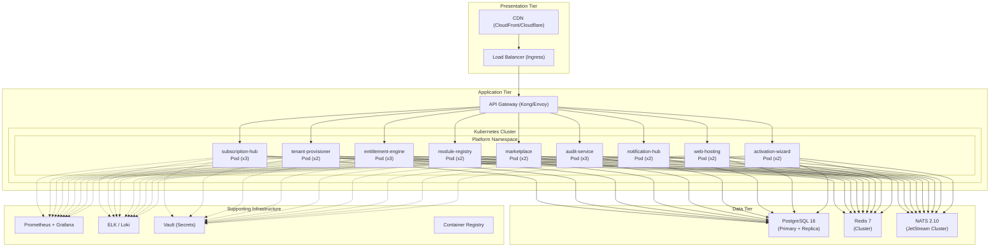
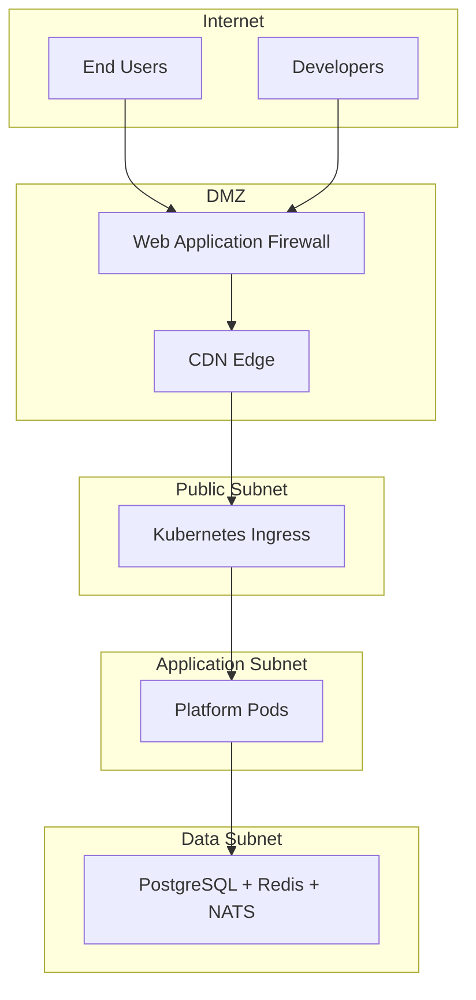

# ERP-Platform Enterprise Architecture

> **Document ID:** ERP-PLAT-EA-001
> **Version:** 1.0.0
> **Last Updated:** 2026-02-23
> **Framework:** TOGAF 10
> **Status:** Approved
> **Related Documents:** [04-Software-Architecture.md](./04-Software-Architecture.md), [06-Business-Requirements-Document.md](./06-Business-Requirements-Document.md)

---

## 1. Architecture Vision

ERP-Platform serves as the unified control plane for a 20-module ERP suite, enabling enterprises to manage their entire business technology stack from a single administrative surface. The architecture vision is to deliver "Business at the Speed of Prompt" -- reducing tenant provisioning from weeks to a single API call while maintaining enterprise-grade security, compliance, and multi-tenant isolation.

---

## 2. Business Architecture

### 2.1 Business Capability Map

### 2.2 Value Stream Map

### 2.3 Business Process Architecture

### 2.4 Organizational Impact

| Stakeholder | Impact | Benefit |
|-------------|--------|---------|
| IT Operations | Reduced provisioning effort (weeks to minutes) | 95% reduction in manual setup tasks |
| Sales | Faster customer onboarding | Reduced time-to-revenue |
| Finance | Unified billing through subscriptions | Simplified revenue recognition |
| Compliance | Centralized audit trail | Automated regulatory reporting |
| Customer Success | Self-service tenant management | Reduced support ticket volume |
| Development | Module registry auto-discovery | Faster integration testing |

---

## 3. Application Architecture

### 3.1 Application Portfolio

```mermaid
graph TB
    subgraph "ERP-Platform Applications"
        direction TB
        APP1["Admin Console<br/>(Next.js 14)"]
        APP2["Activation Console<br/>(React + Vite)"]
    end
    subgraph "Platform Services"
        SVC1["Subscription Hub"]
        SVC2["Tenant Provisioner"]
        SVC3["Entitlement Engine"]
        SVC4["Module Registry"]
        SVC5["Marketplace"]
        SVC6["Audit Service"]
        SVC7["Notification Hub"]
        SVC8["Web Hosting"]
        SVC9["Activation Wizard"]
    end
    subgraph "ERP Module Suite"
        direction LR
        M1["ERP-CRM"]
        M2["ERP-HCM"]
        M3["ERP-Finance"]
        M4["ERP-Marketing"]
        M5["ERP-Commerce"]
        M6["ERP-eCommerce"]
        M7["ERP-SCM"]
        M8["ERP-Projects"]
        M9["ERP-Workspace"]
        M10["ERP-BI"]
        M11["ERP-AI"]
        M12["ERP-IAM"]
        M13["ERP-iPaaS"]
        M14["ERP-Healthcare"]
        M15["ERP-School-Mgmt"]
        M16["ERP-Church-Mgmt"]
        M17["ERP-BSS-OSS"]
        M18["ERP-Assistant"]
        M19["ERP-Autonomous-Coding"]
    end
    APP1 --> SVC1 & SVC2 & SVC3 & SVC4 & SVC5 & SVC6 & SVC7 & SVC8 & SVC9
    APP2 --> SVC9
    SVC4 -.->|health checks| M1 & M2 & M3 & M4 & M5 & M6 & M7 & M8 & M9 & M10 & M11 & M12 & M13 & M14 & M15 & M16 & M17 & M18 & M19
    SVC3 -->|entitlement gates| M1 & M2 & M3 & M4 & M5 & M6 & M7 & M8 & M9 & M10 & M11 & M12 & M13 & M14 & M15 & M16 & M17 & M18 & M19
```

### 3.2 Module Interaction Matrix

| Source Service | Target Service | Interaction Type | Protocol |
|---------------|---------------|-----------------|----------|
| Subscription Hub | Entitlement Engine | Sync (HTTP) | REST |
| Subscription Hub | Tenant Provisioner | Async (Event) | NATS |
| Tenant Provisioner | Module Registry | Sync (HTTP) | REST |
| Tenant Provisioner | Web Hosting | Async (Event) | NATS |
| Module Registry | All ERP Modules | Sync (HTTP) | Health Check |
| Marketplace | Module Registry | Sync (HTTP) | REST |
| Marketplace | Entitlement Engine | Sync (HTTP) | REST |
| Activation Wizard | Subscription Hub | Sync (HTTP) | REST |
| Activation Wizard | Tenant Provisioner | Sync (HTTP) | REST |
| All Services | Audit Service | Async (Event) | NATS |
| All Services | Notification Hub | Async (Event) | NATS |

### 3.3 Application Communication Patterns

---

## 4. Data Architecture

### 4.1 Data Flow Architecture

### 4.2 Data Domain Model

### 4.3 Data Classification

| Data Domain | Classification | Retention | Encryption |
|------------|---------------|-----------|------------|
| Tenant configuration | Confidential | Lifetime of tenant | At rest + in transit |
| Subscription records | Internal | 7 years post-cancellation | At rest + in transit |
| Entitlement data | Internal | Lifetime of subscription | At rest + in transit |
| Audit logs | Restricted | 7 years minimum | At rest + in transit + integrity hash |
| Product catalog | Public | Indefinite | In transit |
| Health check data | Internal | 90 days rolling | In transit |
| Marketplace listings | Public | Lifetime of listing | In transit |
| Notification payloads | Confidential | 30 days | At rest + in transit |

---

## 5. Technology Architecture

### 5.1 Infrastructure Stack

### 5.2 Technology Standards

| Layer | Standard | Rationale |
|-------|----------|-----------|
| Language | Go 1.22+ | Performance, concurrency, small binaries |
| Container | Docker (Alpine 3.20) | Minimal attack surface, small images |
| Orchestration | Kubernetes 1.29+ | Industry standard, HPA, self-healing |
| Database | PostgreSQL 16 | ACID, RLS, JSON support, mature ecosystem |
| Cache | Redis 7 | Sub-millisecond reads, pub/sub, streams |
| Event Streaming | NATS 2.10 JetStream | Low latency, at-least-once delivery |
| API Gateway | Kong/Envoy | JWT validation, rate limiting, routing |
| Frontend | Next.js 14 / React 18 | SSR, TypeScript, large ecosystem |
| CI/CD | GitHub Actions | Native Git integration, marketplace actions |
| Monitoring | Prometheus + Grafana | Open-source, Kubernetes-native |
| Logging | Structured JSON | Machine-parseable, ELK/Loki compatible |

### 5.3 Network Architecture

---

## 6. Architecture Principles

| # | Principle | Rationale |
|---|-----------|-----------|
| AP-1 | Catalog-Driven Configuration | The product catalog is the single source of truth; adding modules requires no code changes |
| AP-2 | Event-First Integration | Services communicate via events for loose coupling; sync calls only when necessary |
| AP-3 | Tenant Isolation by Default | Every data access path enforces tenant boundaries via RLS and header validation |
| AP-4 | AIDD Guardrails on All AI Operations | No AI action executes without policy evaluation and audit logging |
| AP-5 | Zero-Dependency Services | Platform services minimize external library dependencies for security and stability |
| AP-6 | Health-Check Driven Discovery | Module availability determined by live health checks, not static configuration |
| AP-7 | Immutable Audit Trail | All state-changing operations produce append-only audit records |
| AP-8 | Infrastructure as Code | All infrastructure defined declaratively (Docker Compose, Helm, Terraform) |

---

## 7. Architecture Governance

### 7.1 Decision Authority

| Decision Type | Authority | Approval Required |
|--------------|-----------|------------------|
| New module addition | Architecture Council | Catalog review + health check certification |
| Bundle definition changes | Product Management + Architecture | Catalog versioning + migration plan |
| Technology stack changes | CTO + Architecture Council | ADR required (see [18-Architecture-Decision-Records.md](./18-Architecture-Decision-Records.md)) |
| Security policy changes | CISO + Architecture Council | Threat model review |
| AIDD guardrail threshold changes | AI Ethics Board + Architecture | Impact assessment required |

### 7.2 Compliance Framework

The architecture aligns with:

- **SOC 2 Type II**: Audit logging, access controls, encryption standards
- **GDPR**: Data classification, retention policies, right to erasure
- **HIPAA**: Tenant isolation, audit trails (for healthcare vertical)
- **FERPA**: Student data protection (for education vertical)

---

*For detailed software architecture with C4 diagrams, see [04-Software-Architecture.md](./04-Software-Architecture.md). For business requirements, see [06-Business-Requirements-Document.md](./06-Business-Requirements-Document.md).*
