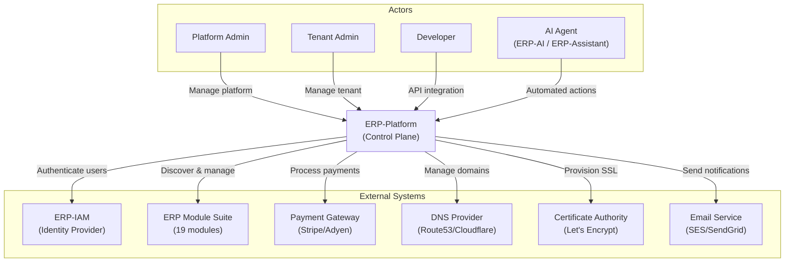
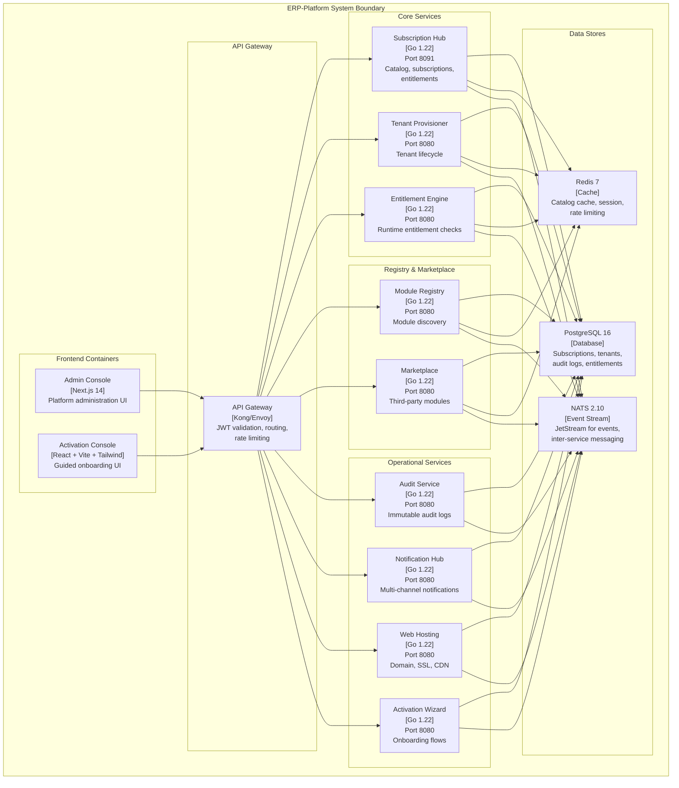
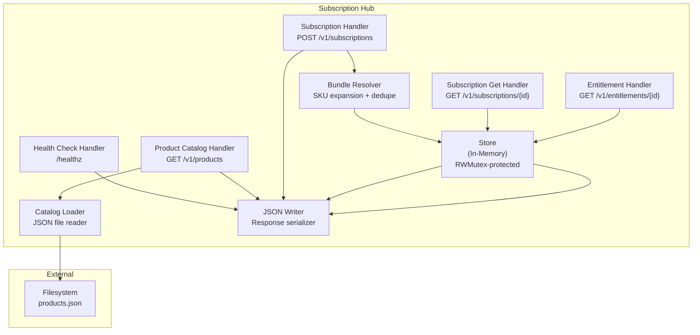
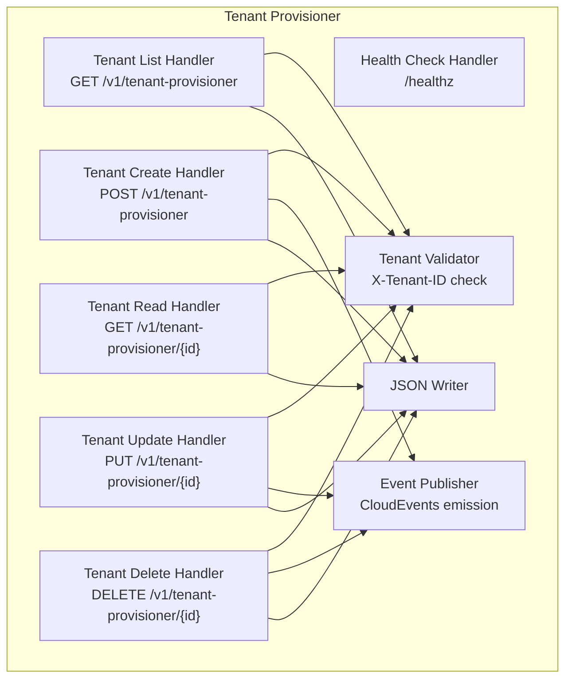
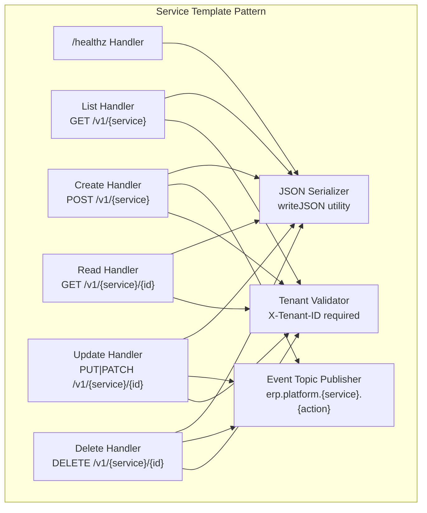
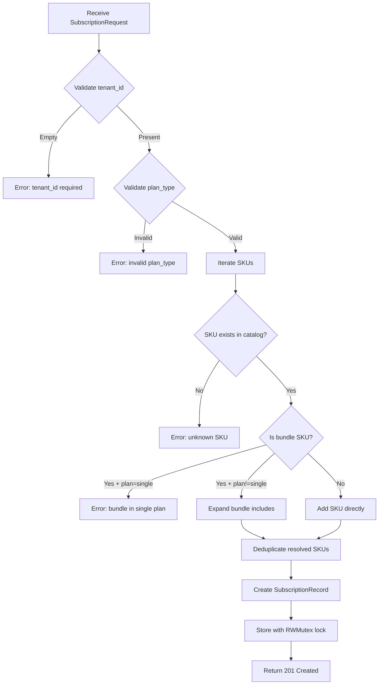
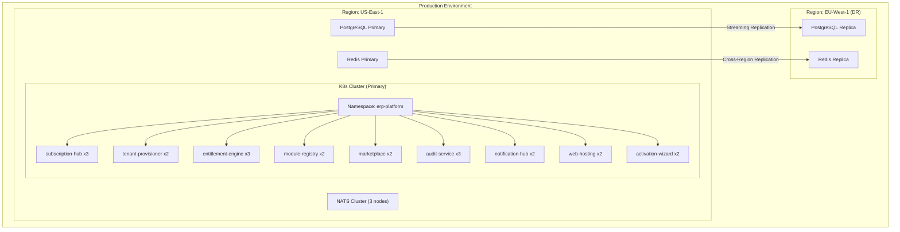

# ERP-Platform Software Architecture

> **Document ID:** ERP-PLAT-SA-001
> **Version:** 1.0.0
> **Last Updated:** 2026-02-23
> **Model:** C4 Architecture
> **Status:** Approved
> **Related Documents:** [03-Enterprise-Architecture.md](./03-Enterprise-Architecture.md), [12-High-Level-Design.md](./12-High-Level-Design.md), [13-Low-Level-Design.md](./13-Low-Level-Design.md)

---

## 1. Architectural Principles

| ID | Principle | Description |
|----|-----------|-------------|
| P1 | Microservices Independence | Each service is independently deployable, scalable, and replaceable |
| P2 | Zero External Dependencies | Services use Go standard library where possible to minimize supply chain risk |
| P3 | Catalog-Driven Behavior | Product catalog JSON drives subscription resolution, entitlement seeding, and module topology |
| P4 | Event Sourcing for Audit | All state mutations emit CloudEvents to NATS for audit trail reconstruction |
| P5 | Tenant-First Design | Every endpoint validates X-Tenant-ID; data stores enforce row-level security |
| P6 | Health-Check Discovery | Module registry discovers services via periodic `/healthz` polling, not static config |
| P7 | AIDD by Default | AI-driven operations pass through guardrail policy engine before execution |

---

## 2. C4 Level 1: System Context



### Context Boundaries

| Boundary | Owned By | Integration Type |
|----------|----------|-----------------|
| Authentication/Authorization | ERP-IAM | OIDC/JWT tokens |
| Module Health Status | Each ERP Module | HTTP GET /healthz |
| Payment Processing | External Payment Gateway | REST API + Webhooks |
| Domain Management | External DNS Provider | REST API |
| Certificate Provisioning | External CA | ACME Protocol |
| Email/SMS Delivery | External Messaging Service | SMTP/REST API |

---

## 3. C4 Level 2: Container Diagram



### Container Inventory

| Container | Technology | Port | Responsibilities |
|-----------|-----------|------|-----------------|
| Admin Console | Next.js 14, React 18, TypeScript | 3000 | Platform administration, tenant management, subscription management |
| Activation Console | React, Vite, Tailwind CSS | 5173 | Guided onboarding, product selection |
| API Gateway | Kong/Envoy | 8080/443 | JWT validation, rate limiting, request routing |
| Subscription Hub | Go 1.22, stdlib net/http | 8091 | Product catalog, subscription CRUD, entitlement query |
| Tenant Provisioner | Go 1.22, stdlib net/http | 8080 | Tenant creation, configuration, decommissioning |
| Entitlement Engine | Go 1.22, stdlib net/http | 8080 | Runtime entitlement evaluation, feature gating |
| Module Registry | Go 1.22, stdlib net/http | 8080 | Module discovery, health monitoring |
| Marketplace | Go 1.22, stdlib net/http | 8080 | Third-party module listing, installation |
| Audit Service | Go 1.22, stdlib net/http | 8080 | Append-only audit log, event streaming |
| Notification Hub | Go 1.22, stdlib net/http | 8080 | Email, SMS, push, in-app notifications |
| Web Hosting | Go 1.22, stdlib net/http | 8080 | Domain, SSL, CDN management |
| Activation Wizard | Go 1.22, stdlib net/http | 8080 | Guided onboarding flow state |
| PostgreSQL | PostgreSQL 16 | 5432 | Primary relational data store |
| Redis | Redis 7 | 6379 | Cache, session, rate limiting |
| NATS | NATS 2.10 JetStream | 4222 | Event streaming, pub/sub |

---

## 4. C4 Level 3: Component Diagrams

### 4.1 Subscription Hub Components



### 4.2 Tenant Provisioner Components



### 4.3 Generic Service Component Pattern

All non-subscription services follow an identical component structure:



---

## 5. C4 Level 4: Code Patterns

### 5.1 Store Pattern (Subscription Hub)

```go
// Core data structures
type Product struct {
    SKU        string   `json:"sku"`
    Name       string   `json:"name"`
    Repo       string   `json:"repo"`
    Type       string   `json:"type"`       // "module" or "bundle"
    Standalone bool     `json:"standalone"`
    Includes   []string `json:"includes,omitempty"`
}

type Catalog struct {
    Version  string    `json:"version"`
    Products []Product `json:"products"`
}

type SubscriptionRecord struct {
    TenantID string   `json:"tenant_id"`
    PlanType string   `json:"plan_type"`  // "single", "bundle", "suite"
    SKUs     []string `json:"skus"`       // Resolved module SKUs
}

type Store struct {
    mu    sync.RWMutex
    recs  map[string]SubscriptionRecord  // tenant_id -> record
    skus  map[string]Product             // sku -> product
    bunds map[string]Product             // sku -> bundle product
}
```

### 5.2 Service Handler Pattern

```go
// All services follow this pattern
func main() {
    mux := http.NewServeMux()

    // Health check (unauthenticated)
    mux.HandleFunc("/healthz", healthHandler)

    // Collection endpoint (list + create)
    mux.HandleFunc(base, func(w http.ResponseWriter, r *http.Request) {
        // 1. Validate X-Tenant-ID header
        // 2. Switch on HTTP method
        // 3. Emit CloudEvents topic
        // 4. Return JSON response
    })

    // Resource endpoint (read + update + delete)
    mux.HandleFunc(base+"/", func(w http.ResponseWriter, r *http.Request) {
        // 1. Validate X-Tenant-ID header
        // 2. Extract resource ID from path
        // 3. Switch on HTTP method
        // 4. Emit CloudEvents topic
        // 5. Return JSON response
    })

    http.ListenAndServe(":"+port, mux)
}
```

### 5.3 Bundle Resolution Algorithm



---

## 6. Quality Attributes

### 6.1 Performance

| Attribute | Target | Measurement |
|-----------|--------|-------------|
| Catalog read latency (P99) | < 20ms | Prometheus histogram |
| Entitlement query latency (P99) | < 10ms | Prometheus histogram |
| Subscription creation latency (P99) | < 50ms | Prometheus histogram |
| Tenant provisioning (P99) | < 2s | End-to-end trace |
| Throughput per instance | 10K req/s | Load test (k6) |

### 6.2 Scalability

| Dimension | Approach |
|-----------|----------|
| Horizontal | Kubernetes HPA per service (CPU/memory targets) |
| Vertical | Pod resource limits adjustable per environment |
| Data | PostgreSQL read replicas, Redis cluster sharding |
| Events | NATS JetStream partitioning by tenant |
| Catalog | Immutable versioned JSON; cached in Redis |

### 6.3 Security

| Control | Implementation |
|---------|---------------|
| Authentication | JWT from ERP-IAM (OIDC) |
| Authorization | RBAC roles + entitlement-based access |
| Tenant Isolation | X-Tenant-ID header + PostgreSQL RLS |
| Data Encryption | TLS 1.3 in transit, AES-256 at rest |
| Audit Trail | Immutable append-only logs via audit-service |
| AIDD Guardrails | Policy engine with confidence thresholds |
| Supply Chain | Zero external Go dependencies in core services |

### 6.4 Availability

| Target | Strategy |
|--------|----------|
| 99.95% uptime | Multi-replica deployment (min 2 pods per service) |
| Zero-downtime deploys | Kubernetes rolling updates with readiness probes |
| Self-healing | Liveness probes restart unhealthy pods |
| Circuit breaking | API gateway circuit breaker per upstream service |
| Graceful degradation | Cached entitlements serve during engine downtime |

### 6.5 Observability

| Pillar | Tool | Integration |
|--------|------|-------------|
| Metrics | Prometheus | Go metrics endpoint per service |
| Logging | Structured JSON | ELK/Loki aggregation |
| Tracing | OpenTelemetry | Correlation ID in CloudEvents |
| Alerting | Grafana | SLA-based alert rules |
| Health | /healthz | Kubernetes probes + module registry |

---

## 7. Technology Decisions

| Decision | Choice | Alternatives Considered | Rationale |
|----------|--------|------------------------|-----------|
| Primary Language | Go 1.22 | Java, Rust, Node.js | Fast compilation, small binaries, stdlib HTTP, goroutines |
| HTTP Framework | stdlib net/http | Gin, Echo, Chi | Zero dependencies, production-grade, long-term stability |
| Database | PostgreSQL 16 | MySQL, CockroachDB | RLS, JSON columns, mature tooling, ACID compliance |
| Cache | Redis 7 | Memcached, Hazelcast | Pub/sub, streams, cluster mode, broad ecosystem |
| Events | NATS JetStream | Kafka, Pulsar, RabbitMQ | Low latency, simple operations, JetStream persistence |
| Container | Docker Alpine | Distroless, Debian | Wide compatibility, apk for debugging, small size |
| Orchestration | Kubernetes | Docker Swarm, Nomad | Industry standard, HPA, service mesh ready |
| Frontend | Next.js 14 | Remix, SvelteKit, Angular | SSR, React ecosystem, TypeScript-first |
| CI/CD | GitHub Actions | GitLab CI, Jenkins, CircleCI | Native GitHub integration, marketplace actions |

---

## 8. Deployment Architecture



---

*For high-level design details, see [12-High-Level-Design.md](./12-High-Level-Design.md). For low-level implementation details, see [13-Low-Level-Design.md](./13-Low-Level-Design.md). For ADRs, see [18-Architecture-Decision-Records.md](./18-Architecture-Decision-Records.md).*
