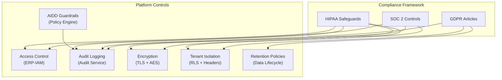
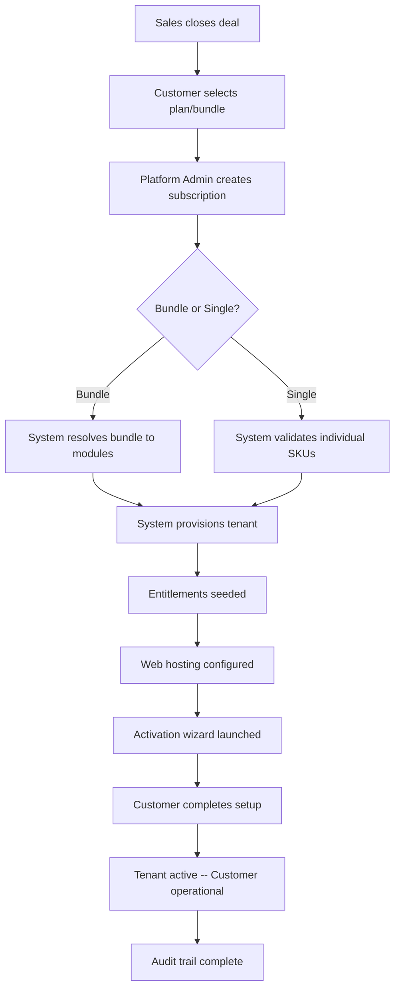
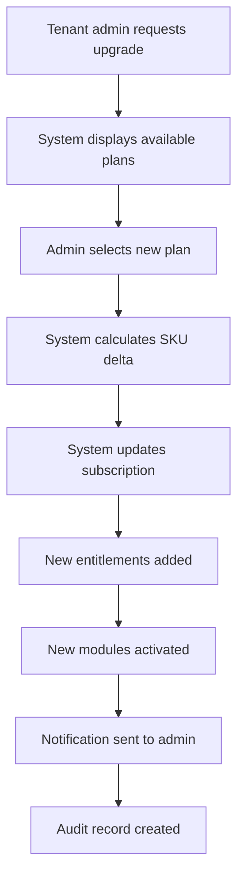
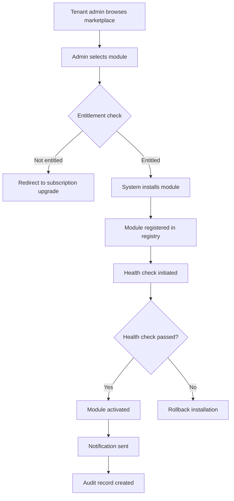
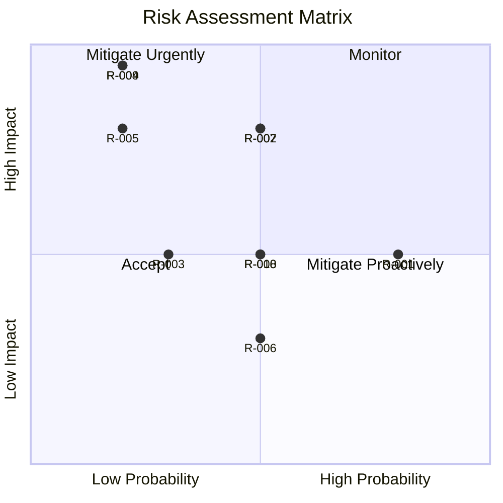

# ERP-Platform Business Requirements Document (BRD)

> **Document ID:** ERP-PLAT-BRD-001
> **Version:** 1.0.0
> **Last Updated:** 2026-02-23
> **Status:** Approved
> **Related Documents:** [05-Product-Requirements-Document.md](./05-Product-Requirements-Document.md), [03-Enterprise-Architecture.md](./03-Enterprise-Architecture.md)

---

## 1. Business Objectives

### 1.1 Primary Objectives

| ID | Objective | Success Metric | Target |
|----|-----------|---------------|--------|
| BO-1 | Reduce tenant provisioning time | Time from subscription to active tenant | < 5 minutes |
| BO-2 | Unify ERP suite administration | Number of admin consoles required | 1 (from 20+) |
| BO-3 | Enable self-service subscription management | % of subscription changes via self-service | > 80% |
| BO-4 | Enforce AI governance across platform | % of AI actions passing guardrail checks | 100% |
| BO-5 | Achieve regulatory compliance readiness | Time to compliance audit completion | < 2 weeks |
| BO-6 | Enable marketplace ecosystem | Third-party modules available | 50+ in first year |
| BO-7 | Reduce operational overhead | FTE hours on platform administration | 60% reduction |

### 1.2 Strategic Alignment

ERP-Platform supports the enterprise strategy of "Business at the Speed of Prompt" by enabling:

- **Instant Deployment**: Single API call tenant provisioning eliminates the traditional multi-week onboarding cycle.
- **Modular Adoption**: Customers start with Starter bundle (3 modules) and expand to Enterprise (20 modules) without migration.
- **Vertical Specialization**: Industry-specific bundles (Healthcare, Education, Faith, Telecom) address niche markets.
- **AI-First Operations**: AIDD guardrails enable safe AI-driven automation for enterprise customers.

---

## 2. Stakeholders

| Stakeholder | Role | Interest | Influence |
|------------|------|----------|-----------|
| CTO | Technology Strategy Owner | Architecture integrity, technology choices | High |
| VP Product | Product Strategy Owner | Feature prioritization, market positioning | High |
| VP Sales | Revenue Owner | Time-to-value, bundle pricing flexibility | High |
| VP Engineering | Development Owner | Developer productivity, code quality | High |
| CISO | Security Owner | Data protection, threat mitigation | High |
| Compliance Officer | Regulatory Owner | Audit trails, data privacy | Medium |
| Platform Engineers | Implementation Team | Development velocity, operational simplicity | Medium |
| Customer Success | Customer Relationship | Onboarding experience, issue resolution | Medium |
| Enterprise Customers | End Users | Ease of use, reliability, feature richness | High |
| ISV Partners | Marketplace Participants | API clarity, marketplace discoverability | Medium |

---

## 3. Business Rules

### 3.1 Subscription Rules

| BR-ID | Rule | Enforcement |
|-------|------|-------------|
| BR-001 | A subscription must have a valid tenant_id | API validation |
| BR-002 | Plan types are limited to: single, bundle, suite | API validation |
| BR-003 | Single plans cannot include bundle SKUs | Subscription hub business logic |
| BR-004 | Bundle SKUs are resolved to constituent module SKUs at creation time | Bundle resolver |
| BR-005 | Duplicate SKUs in resolved list are deduplicated | Dedupe function |
| BR-006 | At least one SKU is required per subscription | API validation |
| BR-007 | Only catalog-defined SKUs are accepted | SKU lookup validation |

### 3.2 Tenant Rules

| BR-ID | Rule | Enforcement |
|-------|------|-------------|
| BR-008 | All business API calls must include X-Tenant-ID header | Middleware validation |
| BR-009 | Tenant data is isolated; cross-tenant access is prohibited | RLS + header validation |
| BR-010 | Tenant decommissioning requires 30-day grace period | Tenant provisioner logic |
| BR-011 | Tenant provisioning triggers entitlement seeding | Event-driven workflow |

### 3.3 AIDD Rules

| BR-ID | Rule | Enforcement |
|-------|------|-------------|
| BR-012 | AI actions below 0.70 confidence are blocked | AIDD policy engine |
| BR-013 | Actions affecting > 5,000 records require human approval | Blast-radius control |
| BR-014 | Financial actions > $100,000 USD require human approval | High-value gate |
| BR-015 | All AI decisions are logged to immutable audit trail | Audit service |
| BR-016 | High-risk auto-execute is disabled by default | AIDD configuration |

### 3.4 Audit Rules

| BR-ID | Rule | Enforcement |
|-------|------|-------------|
| BR-017 | All CRUD operations emit CloudEvents | Service event publishers |
| BR-018 | Audit logs are append-only (no modification/deletion) | Audit service design |
| BR-019 | Audit log retention minimum: 7 years | Data retention policy |
| BR-020 | Audit logs include tenant_id, user_id, action, timestamp | Event schema |

---

## 4. Regulatory Requirements

### 4.1 Applicable Regulations

| Regulation | Applicability | Key Requirements |
|-----------|--------------|-----------------|
| SOC 2 Type II | All customers | Access controls, audit logging, availability monitoring |
| GDPR | EU customers | Data subject rights, data portability, right to erasure |
| HIPAA | Healthcare vertical | PHI protection, access audit, encryption |
| FERPA | Education vertical | Student record protection, parental consent |
| PCI DSS | Payment processing | Card data protection, network security |
| CCPA | California customers | Privacy rights, data disclosure |

### 4.2 Compliance Implementation

---

## 5. Business Process Flows

### 5.1 New Customer Onboarding

### 5.2 Subscription Upgrade

### 5.3 Module Marketplace Installation

---

## 6. ROI Analysis

### 6.1 Cost Reduction

| Area | Current Annual Cost | Projected Annual Cost | Savings |
|------|-------------------|--------------------|---------|
| Tenant provisioning (manual) | $450,000 (3 FTEs) | $75,000 (0.5 FTE + platform) | $375,000 |
| Multi-console administration | $300,000 (2 FTEs) | $100,000 (0.7 FTE) | $200,000 |
| Compliance audit preparation | $200,000 (external consultants) | $50,000 (automated reports) | $150,000 |
| Module activation support tickets | $150,000 (1 FTE) | $25,000 (self-service) | $125,000 |
| **Total Annual Savings** | | | **$850,000** |

### 6.2 Revenue Enhancement

| Area | Impact | Annual Revenue Impact |
|------|--------|---------------------|
| Faster time-to-value (weeks to minutes) | 30% faster deal closure | +$2M |
| Self-service upgrades (bundle to enterprise) | 15% higher upgrade rate | +$1.5M |
| Marketplace ecosystem (third-party revenue share) | 10% commission on ISV sales | +$500K |
| Industry vertical bundles (new market segments) | 4 new verticals addressed | +$3M |
| **Total Annual Revenue Impact** | | **+$7M** |

### 6.3 Investment Summary

| Item | Cost |
|------|------|
| Platform development (v1.0.0) | $1.2M |
| Infrastructure (first year) | $180K |
| Ongoing maintenance (per year) | $400K |
| **Total First Year Investment** | **$1.78M** |
| **Payback Period** | **< 3 months** |
| **3-Year ROI** | **1,200%+** |

---

## 7. Risk Assessment

| Risk ID | Risk Description | Probability | Impact | Mitigation |
|---------|-----------------|------------|--------|------------|
| R-001 | In-memory store data loss on restart | High | Medium | Migrate to PostgreSQL persistence (v1.1.0) |
| R-002 | Single point of failure in subscription hub | Medium | High | Kubernetes multi-replica deployment |
| R-003 | Catalog version conflicts during updates | Low | Medium | Versioned catalog with migration scripts |
| R-004 | Cross-tenant data leakage | Low | Critical | RLS enforcement, penetration testing |
| R-005 | AIDD guardrail bypass | Low | High | Policy-as-code in CI/CD, audit monitoring |
| R-006 | Module health check false positives | Medium | Low | Health check retry logic (5 retries) |
| R-007 | Marketplace module security vulnerabilities | Medium | High | Security scanning, sandboxed execution |
| R-008 | Event stream backpressure under load | Medium | Medium | NATS JetStream backpressure handling |
| R-009 | Regulatory non-compliance | Low | Critical | Quarterly compliance audits, automated reporting |
| R-010 | Key person dependency | Medium | Medium | Documentation, cross-training, code reviews |

### Risk Heat Map

---

## 8. Assumptions and Constraints

### 8.1 Assumptions

1. ERP-IAM is available and functional for JWT-based authentication.
2. All 19 ERP modules expose a `/healthz` endpoint for health monitoring.
3. Customers have Kubernetes infrastructure or use the managed cloud offering.
4. PostgreSQL 16 is available in all deployment environments.
5. NATS JetStream is available for event streaming.

### 8.2 Constraints

1. Go 1.22 is the minimum required version for all platform services.
2. The product catalog schema (`products.json`) must maintain backward compatibility.
3. Event topic naming must follow the `erp.<module>.<entity>.<action>` convention.
4. All services must respond to `/healthz` within 5 seconds.
5. AIDD guardrails cannot be disabled in production environments.

---

*For product requirements, see [05-Product-Requirements-Document.md](./05-Product-Requirements-Document.md). For enterprise architecture, see [03-Enterprise-Architecture.md](./03-Enterprise-Architecture.md).*
