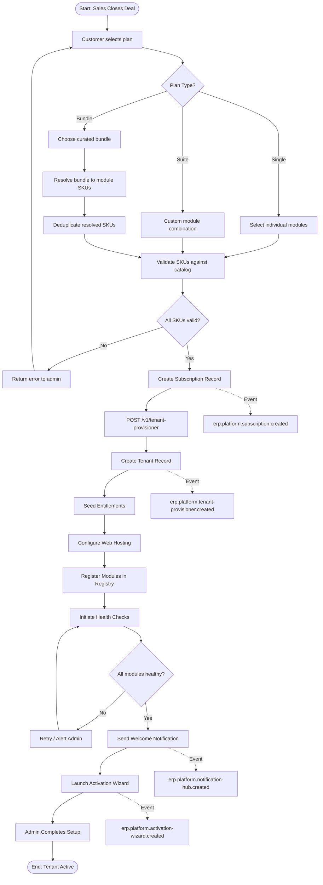
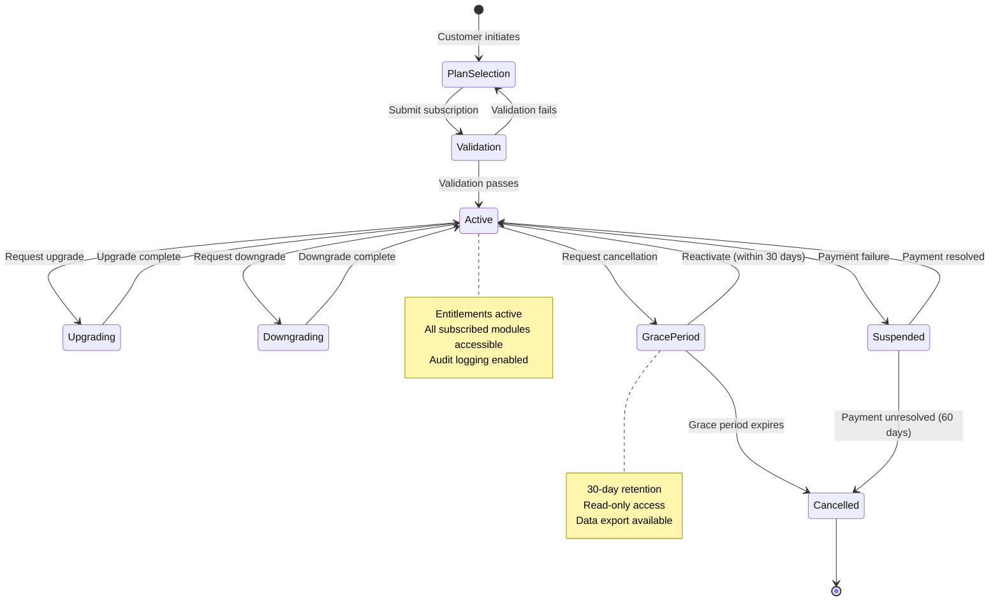
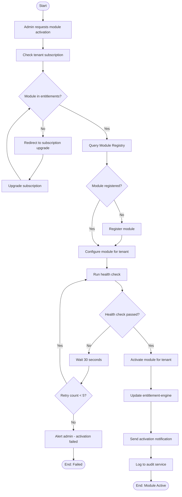
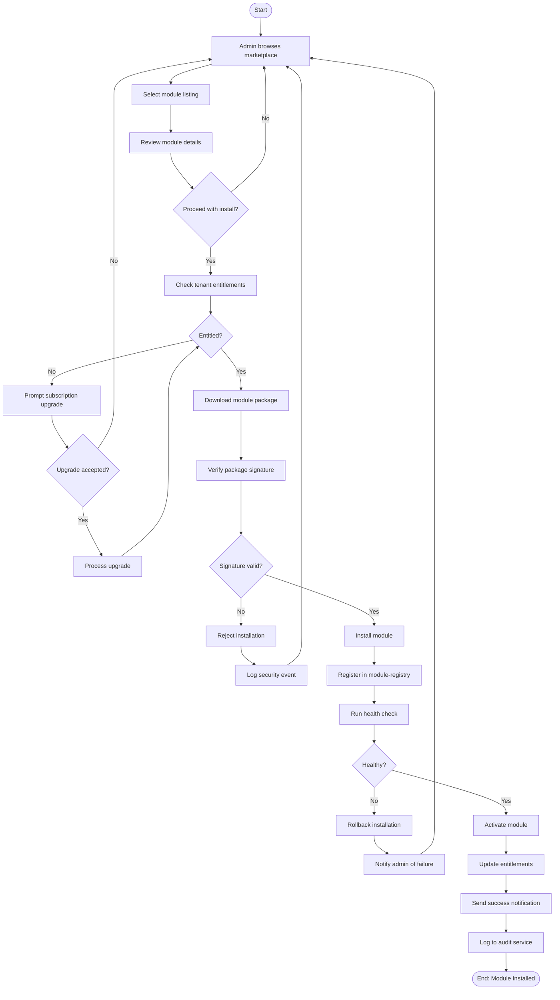
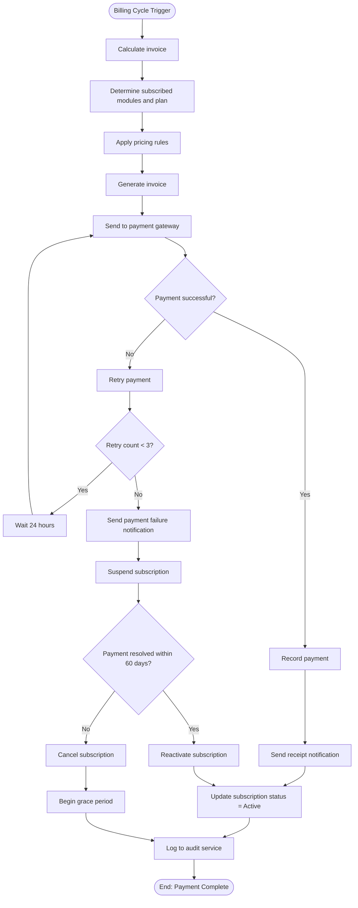
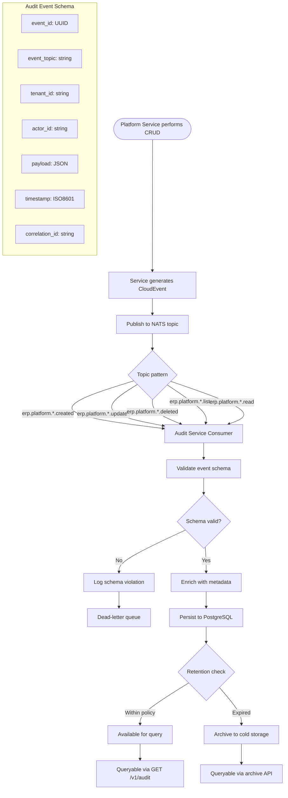
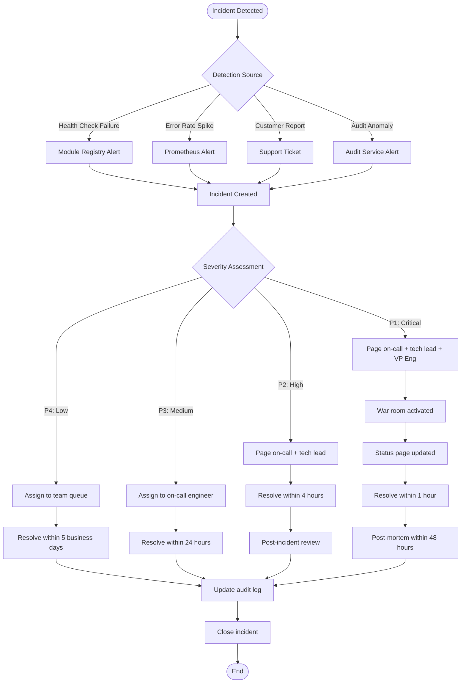
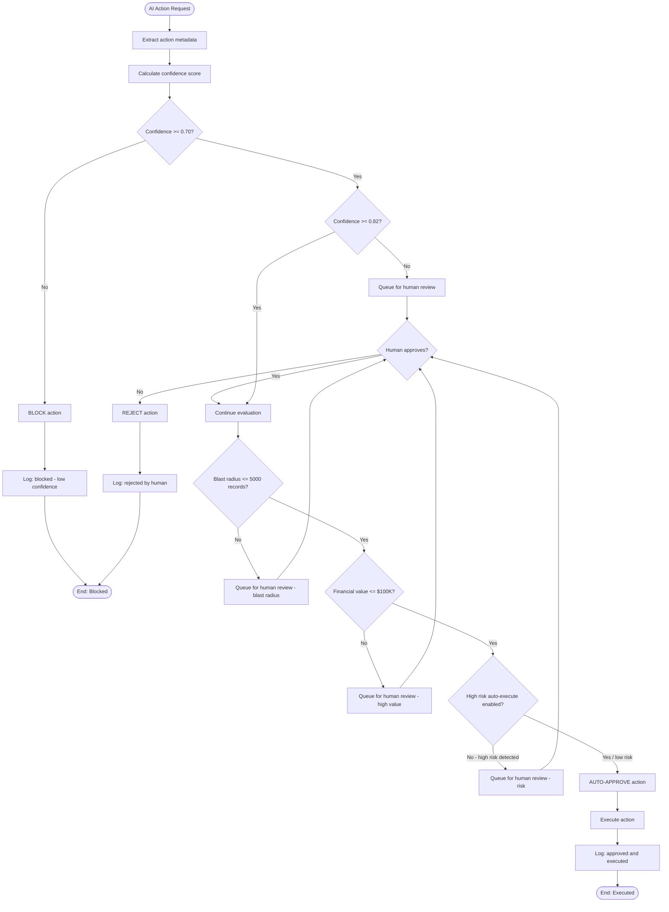
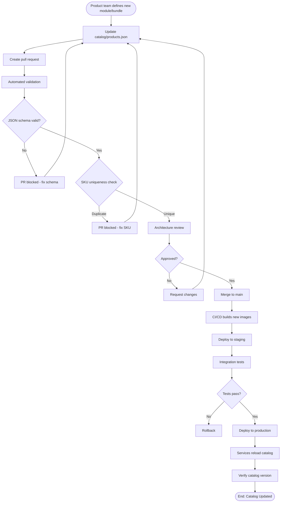

# ERP-Platform Workflow Diagrams

> **Document ID:** ERP-PLAT-WF-001
> **Version:** 1.0.0
> **Last Updated:** 2026-02-23
> **Status:** Approved
> **Related Documents:** [10-Use-Cases.md](./10-Use-Cases.md), [04-Software-Architecture.md](./04-Software-Architecture.md)

---

## 1. Tenant Onboarding Workflow

---

## 2. Subscription Lifecycle Workflow

---

## 3. Module Activation Workflow

---

## 4. Marketplace Installation Workflow

---

## 5. Payment Processing Workflow

---

## 6. Audit Trail Workflow

---

## 7. Incident Escalation Workflow

---

## 8. AIDD Guardrail Evaluation Workflow

---

## 9. Catalog Update Workflow

---

*For detailed use cases, see [10-Use-Cases.md](./10-Use-Cases.md). For architecture diagrams, see [04-Software-Architecture.md](./04-Software-Architecture.md).*
