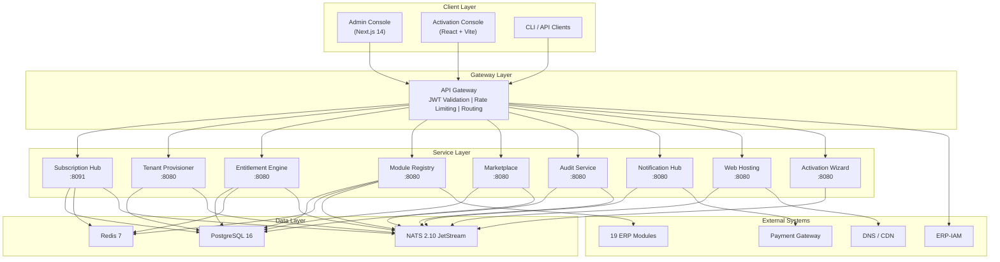
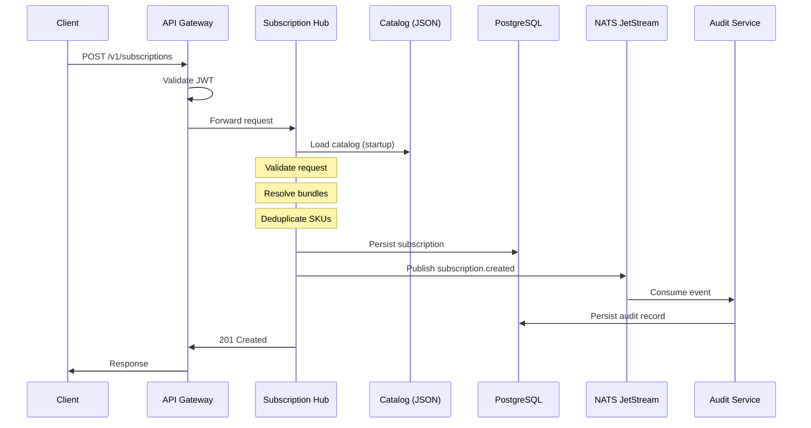
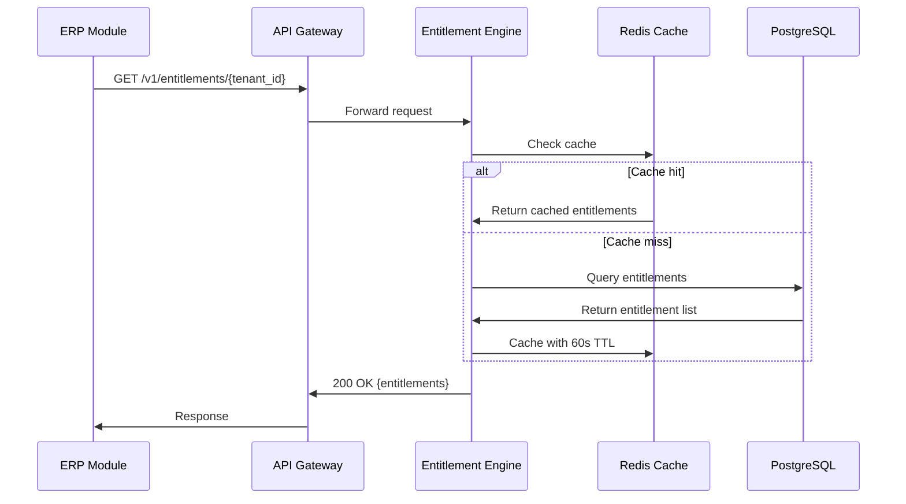
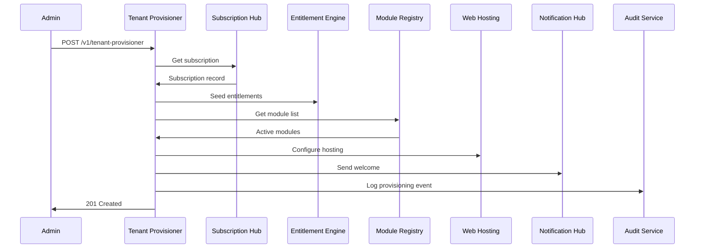

# ERP-Platform High-Level Design (HLD)

> **Document ID:** ERP-PLAT-HLD-001
> **Version:** 1.0.0
> **Last Updated:** 2026-02-23
> **Status:** Approved
> **Related Documents:** [04-Software-Architecture.md](./04-Software-Architecture.md), [13-Low-Level-Design.md](./13-Low-Level-Design.md)

---

## 1. System Overview

ERP-Platform is a distributed microservices system serving as the unified control plane for a 20-module ERP suite. The system provides centralized management of product catalog, subscriptions, tenants, entitlements, modules, marketplace, auditing, notifications, web hosting, and onboarding.

### Design Goals

| Goal | Description |
|------|-------------|
| Unified Administration | Single control plane for all 20 ERP modules |
| Instant Provisioning | Tenant provisioning in under 5 minutes via single API call |
| Elastic Scalability | Horizontal scaling of each service independently |
| Zero-Downtime Deployments | Rolling updates with readiness/liveness probes |
| Regulatory Compliance | Immutable audit trail, AIDD guardrails, tenant isolation |
| Catalog-Driven Extensibility | New modules added via catalog JSON update only |

---

## 2. Component Diagram



---

## 3. Data Flow Diagram

### 3.1 Subscription Creation Flow



### 3.2 Entitlement Check Flow



### 3.3 Tenant Provisioning Flow



---

## 4. Integration Points

### 4.1 Internal Service Integration

| Source | Target | Method | Trigger |
|--------|--------|--------|---------|
| Subscription Hub | Entitlement Engine | HTTP REST | Subscription created/updated |
| Subscription Hub | Audit Service | NATS Event | Any CRUD operation |
| Tenant Provisioner | Subscription Hub | HTTP REST | Get subscription for tenant |
| Tenant Provisioner | Entitlement Engine | HTTP REST | Seed/update entitlements |
| Tenant Provisioner | Module Registry | HTTP REST | Get available modules |
| Tenant Provisioner | Web Hosting | HTTP REST | Configure tenant hosting |
| Tenant Provisioner | Notification Hub | NATS Event | Send welcome notification |
| Module Registry | All ERP Modules | HTTP GET /healthz | 30-second polling |
| Marketplace | Module Registry | HTTP REST | Register installed module |
| Marketplace | Entitlement Engine | HTTP REST | Check/update entitlements |
| All Services | Audit Service | NATS Events | All state changes |

### 4.2 External System Integration

| Service | External System | Protocol | Purpose |
|---------|----------------|----------|---------|
| API Gateway | ERP-IAM | OIDC/JWT | User authentication |
| Web Hosting | DNS Provider | REST API | Domain management |
| Web Hosting | Let's Encrypt | ACME | SSL certificates |
| Web Hosting | CDN Provider | REST API | CDN configuration |
| Notification Hub | Email Service | SMTP/REST | Email delivery |
| Notification Hub | SMS Gateway | REST API | SMS delivery |
| Subscription Hub | Payment Gateway | REST API | Payment processing |

---

## 5. Deployment Topology

```mermaid
graph TB
    subgraph "Production Kubernetes Cluster"
        subgraph "Ingress"
            ING["NGINX Ingress Controller<br/>TLS Termination"]
        end

        subgraph "Platform Namespace (erp-platform)"
            subgraph "Deployments"
                D1["subscription-hub<br/>Replicas: 3<br/>CPU: 250m-500m<br/>Mem: 128Mi-256Mi"]
                D2["tenant-provisioner<br/>Replicas: 2<br/>CPU: 250m-500m<br/>Mem: 128Mi-256Mi"]
                D3["entitlement-engine<br/>Replicas: 3<br/>CPU: 250m-500m<br/>Mem: 128Mi-256Mi"]
                D4["module-registry<br/>Replicas: 2<br/>CPU: 100m-250m<br/>Mem: 64Mi-128Mi"]
                D5["marketplace<br/>Replicas: 2<br/>CPU: 100m-250m<br/>Mem: 64Mi-128Mi"]
                D6["audit-service<br/>Replicas: 3<br/>CPU: 250m-1000m<br/>Mem: 256Mi-512Mi"]
                D7["notification-hub<br/>Replicas: 2<br/>CPU: 100m-250m<br/>Mem: 64Mi-128Mi"]
                D8["web-hosting<br/>Replicas: 2<br/>CPU: 100m-250m<br/>Mem: 64Mi-128Mi"]
                D9["activation-wizard<br/>Replicas: 2<br/>CPU: 100m-250m<br/>Mem: 64Mi-128Mi"]
            end

            subgraph "Services (ClusterIP)"
                SVC["One ClusterIP Service per Deployment"]
            end

            subgraph "HPA"
                HPA["HorizontalPodAutoscaler<br/>Target CPU: 60%<br/>Min: 2, Max: 10"]
            end
        end

        subgraph "Data Namespace (erp-data)"
            PG["PostgreSQL 16<br/>StatefulSet<br/>Primary + Replica"]
            RD["Redis 7<br/>StatefulSet<br/>Cluster Mode"]
            NT["NATS 2.10<br/>StatefulSet<br/>3-node JetStream"]
        end
    end

    ING --> D1 & D2 & D3 & D4 & D5 & D6 & D7 & D8 & D9
    D1 & D2 & D3 & D4 & D5 & D6 & D7 & D8 & D9 --> PG & RD & NT
```

---

## 6. Technology Stack Rationale

| Technology | Why Chosen | Alternatives Rejected |
|-----------|-----------|----------------------|
| **Go 1.22** | Fast compilation, small binaries (8-15MB), excellent concurrency via goroutines, stdlib HTTP server is production-grade, zero external dependencies possible | Java (JVM overhead), Node.js (single-threaded), Rust (learning curve) |
| **PostgreSQL 16** | ACID compliance, Row-Level Security for multi-tenancy, JSON/JSONB columns, mature ecosystem, strong consistency | MySQL (weaker RLS), CockroachDB (operational complexity), DynamoDB (vendor lock-in) |
| **Redis 7** | Sub-millisecond cache reads, pub/sub capabilities, streams for event processing, cluster mode for horizontal scaling | Memcached (no persistence), Hazelcast (JVM dependency) |
| **NATS 2.10 JetStream** | Low latency (< 1ms), simple operations, built-in persistence via JetStream, lightweight footprint | Kafka (operational overhead), RabbitMQ (less scalable), Pulsar (complexity) |
| **Docker + Alpine 3.20** | Minimal attack surface, small image size (< 25MB), wide compatibility, debugging tools available via apk | Distroless (no shell for debugging), Debian (larger images) |
| **Kubernetes** | Industry standard orchestration, HPA for auto-scaling, rolling updates, self-healing, service mesh ready | Docker Swarm (limited features), Nomad (smaller ecosystem) |
| **Next.js 14** | Server-side rendering, React ecosystem, TypeScript-first, excellent developer experience | Angular (heavier), SvelteKit (smaller ecosystem), Remix (newer) |

---

## 7. Capacity Planning

### 7.1 Sizing Estimates

| Scale Tier | Tenants | Modules | RPM (peak) | Database Size | Redis Memory |
|-----------|---------|---------|-----------|---------------|-------------|
| Small | 100 | 500 | 10,000 | 10 GB | 512 MB |
| Medium | 1,000 | 5,000 | 100,000 | 100 GB | 2 GB |
| Large | 10,000 | 50,000 | 1,000,000 | 1 TB | 8 GB |
| Enterprise | 100,000 | 500,000 | 10,000,000 | 10 TB | 32 GB |

### 7.2 Service Scaling Matrix

| Service | Scale Factor | Metric | Min Replicas | Max Replicas |
|---------|-------------|--------|-------------|-------------|
| subscription-hub | Per RPM | CPU utilization | 3 | 20 |
| tenant-provisioner | Per provisioning jobs | Queue depth | 2 | 10 |
| entitlement-engine | Per RPM | CPU utilization | 3 | 20 |
| module-registry | Per module count | Memory | 2 | 5 |
| marketplace | Per concurrent installs | CPU utilization | 2 | 10 |
| audit-service | Per event throughput | Queue depth | 3 | 30 |
| notification-hub | Per notification volume | Queue depth | 2 | 10 |
| web-hosting | Per domain count | Memory | 2 | 10 |
| activation-wizard | Per concurrent wizards | CPU utilization | 2 | 5 |

---

*For software architecture details, see [04-Software-Architecture.md](./04-Software-Architecture.md). For low-level design, see [13-Low-Level-Design.md](./13-Low-Level-Design.md).*
