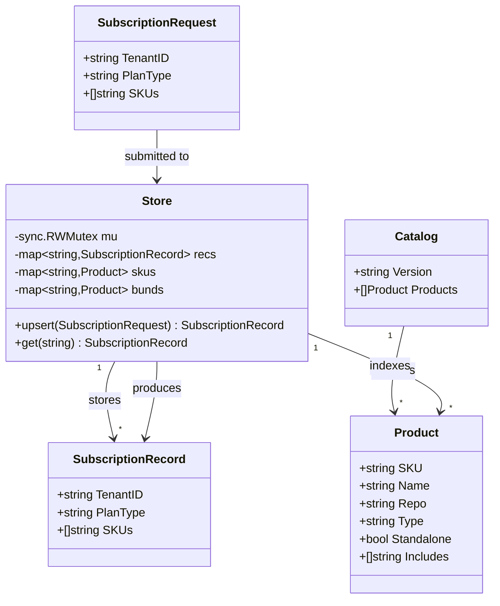
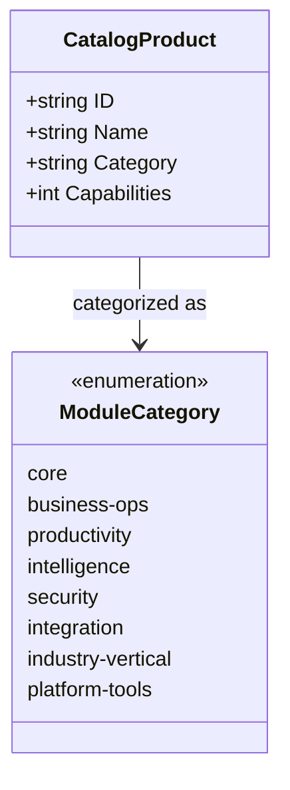
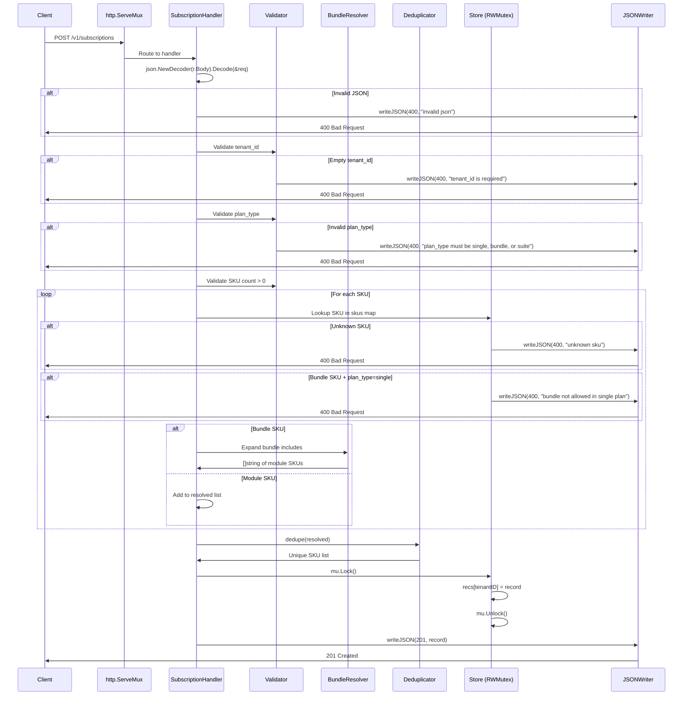
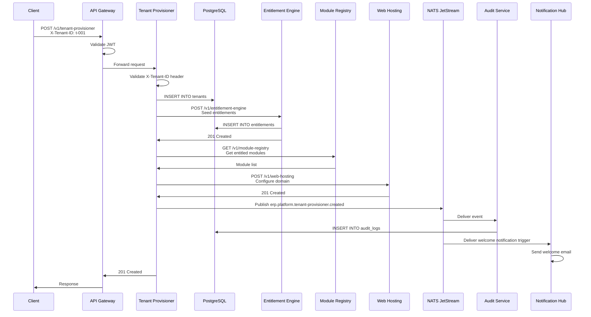
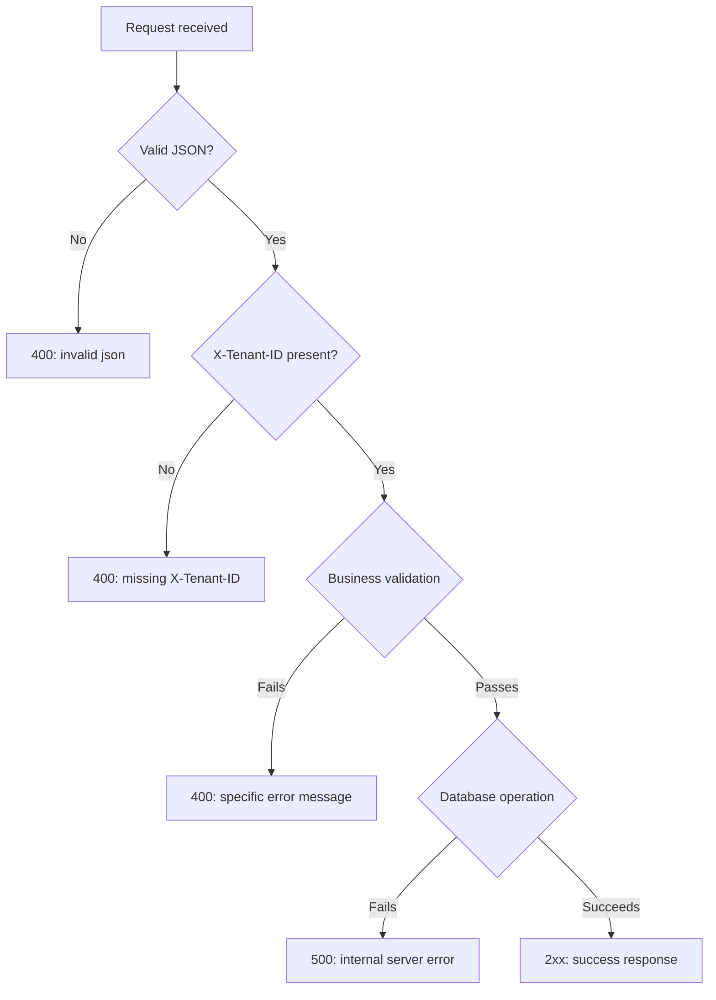
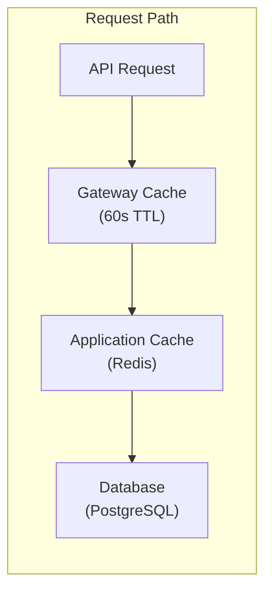

# ERP-Platform Low-Level Design (LLD)

> **Document ID:** ERP-PLAT-LLD-001
> **Version:** 1.0.0
> **Last Updated:** 2026-02-23
> **Status:** Approved
> **Related Documents:** [12-High-Level-Design.md](./12-High-Level-Design.md), [14-Technical-Specifications.md](./14-Technical-Specifications.md), [27-Entity-Relationship-Diagram.md](./27-Entity-Relationship-Diagram.md)

---

## 1. Class/Struct Diagrams

### 1.1 Subscription Hub Data Structures



### 1.2 Service Handler Structure

```mermaid
classDiagram
    class ServiceHandler {
        -string port
        -string moduleName
        -string basePath
        -http.ServeMux mux
        +handleHealthz(w, r)
        +handleCollection(w, r)
        +handleResource(w, r)
        -writeJSON(w, code, v)
        -validateTenantID(r) error
    }

    class payload {
        +map~string,any~ data
    }

    ServiceHandler --> payload : returns
    ServiceHandler ..> "erp.platform.*" : emits events

    note for ServiceHandler "All 8 non-hub services\nfollow this pattern:\ntenant-provisioner\nentitlement-engine\nmodule-registry\nmarketplace\naudit-service\nnotification-hub\nweb-hosting\nactivation-wizard"
```

### 1.3 Catalog Product Extended Model



---

## 2. Sequence Diagrams

### 2.1 Subscription Creation (Detailed)



### 2.2 Tenant Provisioning (Detailed)



---

## 3. Database Schema Details

### 3.1 Core Tables

```sql
-- Tenants table
CREATE TABLE tenants (
    id              UUID PRIMARY KEY DEFAULT gen_random_uuid(),
    tenant_id       VARCHAR(255) UNIQUE NOT NULL,
    name            VARCHAR(500) NOT NULL,
    domain          VARCHAR(255),
    status          VARCHAR(50) NOT NULL DEFAULT 'active',
    metadata        JSONB DEFAULT '{}',
    created_at      TIMESTAMPTZ NOT NULL DEFAULT NOW(),
    updated_at      TIMESTAMPTZ NOT NULL DEFAULT NOW()
);
CREATE INDEX idx_tenants_status ON tenants(status);

-- Subscriptions table
CREATE TABLE subscriptions (
    id              UUID PRIMARY KEY DEFAULT gen_random_uuid(),
    tenant_id       VARCHAR(255) NOT NULL REFERENCES tenants(tenant_id),
    plan_type       VARCHAR(50) NOT NULL CHECK (plan_type IN ('single', 'bundle', 'suite')),
    status          VARCHAR(50) NOT NULL DEFAULT 'active',
    resolved_skus   TEXT[] NOT NULL,
    created_at      TIMESTAMPTZ NOT NULL DEFAULT NOW(),
    updated_at      TIMESTAMPTZ NOT NULL DEFAULT NOW()
);
CREATE INDEX idx_subscriptions_tenant ON subscriptions(tenant_id);

-- Entitlements table
CREATE TABLE entitlements (
    id              UUID PRIMARY KEY DEFAULT gen_random_uuid(),
    tenant_id       VARCHAR(255) NOT NULL,
    sku             VARCHAR(255) NOT NULL,
    active          BOOLEAN NOT NULL DEFAULT true,
    granted_at      TIMESTAMPTZ NOT NULL DEFAULT NOW(),
    expires_at      TIMESTAMPTZ,
    UNIQUE(tenant_id, sku)
);
CREATE INDEX idx_entitlements_tenant ON entitlements(tenant_id);
CREATE INDEX idx_entitlements_tenant_active ON entitlements(tenant_id) WHERE active = true;

-- Audit logs table
CREATE TABLE audit_logs (
    id              UUID PRIMARY KEY DEFAULT gen_random_uuid(),
    tenant_id       VARCHAR(255) NOT NULL,
    event_topic     VARCHAR(500) NOT NULL,
    actor_id        VARCHAR(255),
    payload         JSONB NOT NULL,
    correlation_id  UUID,
    created_at      TIMESTAMPTZ NOT NULL DEFAULT NOW()
);
CREATE INDEX idx_audit_tenant ON audit_logs(tenant_id);
CREATE INDEX idx_audit_topic ON audit_logs(event_topic);
CREATE INDEX idx_audit_created ON audit_logs(created_at);

-- Row-Level Security
ALTER TABLE tenants ENABLE ROW LEVEL SECURITY;
ALTER TABLE subscriptions ENABLE ROW LEVEL SECURITY;
ALTER TABLE entitlements ENABLE ROW LEVEL SECURITY;
ALTER TABLE audit_logs ENABLE ROW LEVEL SECURITY;

CREATE POLICY tenant_isolation ON tenants
    USING (tenant_id = current_setting('app.current_tenant'));
CREATE POLICY subscription_isolation ON subscriptions
    USING (tenant_id = current_setting('app.current_tenant'));
CREATE POLICY entitlement_isolation ON entitlements
    USING (tenant_id = current_setting('app.current_tenant'));
CREATE POLICY audit_isolation ON audit_logs
    USING (tenant_id = current_setting('app.current_tenant'));
```

---

## 4. API Endpoint Specifications

### 4.1 Subscription Hub Endpoints

| Method | Path | Handler | Request Body | Response |
|--------|------|---------|-------------|----------|
| GET | /healthz | healthHandler | None | `{"status":"ok","catalog_version":"..."}` |
| GET | /v1/products | productsHandler | None | `{"version":"...","products":[...]}` |
| POST | /v1/subscriptions | subscriptionCreateHandler | `SubscriptionRequest` | `SubscriptionRecord` (201) |
| GET | /v1/subscriptions/{tenant_id} | subscriptionGetHandler | None | `SubscriptionRecord` (200) |
| GET | /v1/entitlements/{tenant_id} | entitlementHandler | None | `{"tenant_id":"...","entitlements":[...]}` |

### 4.2 Generic Service Endpoints (per service)

| Method | Path | Response Code | Event Topic |
|--------|------|-------------|-------------|
| GET | /healthz | 200 | (none) |
| GET | /v1/{service} | 200 | erp.platform.{service}.listed |
| POST | /v1/{service} | 201 | erp.platform.{service}.created |
| GET | /v1/{service}/{id} | 200 | erp.platform.{service}.read |
| PUT/PATCH | /v1/{service}/{id} | 200 | erp.platform.{service}.updated |
| DELETE | /v1/{service}/{id} | 200 | erp.platform.{service}.deleted |

---

## 5. Error Handling Strategy

### 5.1 Error Response Format

```json
{
    "error": "descriptive error message"
}
```

### 5.2 Error Categories

| HTTP Code | Category | Examples |
|-----------|----------|----------|
| 400 | Client Error | Missing X-Tenant-ID, invalid JSON, unknown SKU, empty tenant_id |
| 401 | Authentication | Missing/invalid JWT token |
| 403 | Authorization | Insufficient permissions, entitlement check failure |
| 404 | Not Found | Tenant subscription not found, resource not found |
| 405 | Method Not Allowed | Wrong HTTP method for endpoint |
| 500 | Server Error | Database failure, event stream unavailable |

### 5.3 Error Handling Flow



---

## 6. Caching Strategy

### 6.1 Cache Layers



### 6.2 Cache Configuration

| Data | Cache Key Pattern | TTL | Invalidation Trigger |
|------|------------------|-----|---------------------|
| Product Catalog | `catalog:v:{version}` | 300s (5 min) | Catalog deployment |
| Tenant Entitlements | `entitlements:{tenant_id}` | 60s | Subscription CRUD |
| Module Health Status | `health:{module_id}` | 30s | Health check poll |
| Subscription Record | `subscription:{tenant_id}` | 60s | Subscription CRUD |
| Marketplace Listings | `marketplace:listings` | 300s | Listing CRUD |

### 6.3 Cache-Aside Pattern

```go
func getEntitlements(tenantID string) ([]string, error) {
    // 1. Check Redis cache
    cached, err := redis.Get(ctx, "entitlements:"+tenantID)
    if err == nil {
        return deserialize(cached), nil
    }
    // 2. Cache miss: query database
    entitlements, err := db.QueryEntitlements(tenantID)
    if err != nil {
        return nil, err
    }
    // 3. Populate cache with TTL
    redis.Set(ctx, "entitlements:"+tenantID, serialize(entitlements), 60*time.Second)
    return entitlements, nil
}
```

---

## 7. Message Queue Design

### 7.1 NATS JetStream Streams

| Stream | Subjects | Retention | Max Age |
|--------|----------|-----------|---------|
| PLATFORM_EVENTS | `erp.platform.>` | WorkQueue | 7 days |
| AUDIT_EVENTS | `erp.platform.audit.>` | Limits | 30 days |
| NOTIFICATIONS | `erp.platform.notification-hub.>` | WorkQueue | 24 hours |

### 7.2 Consumer Groups

| Consumer Group | Stream | Filter | Delivery | Purpose |
|---------------|--------|--------|----------|---------|
| audit-writer | PLATFORM_EVENTS | `erp.platform.*.created\|updated\|deleted` | At-least-once | Persist to audit table |
| notification-router | PLATFORM_EVENTS | `erp.platform.tenant-provisioner.created` | At-least-once | Send welcome notifications |
| entitlement-seeder | PLATFORM_EVENTS | `erp.platform.subscription.*` | Exactly-once | Seed entitlements |

### 7.3 Event Envelope

```json
{
    "specversion": "1.0",
    "id": "evt-uuid-here",
    "source": "erp-platform/subscription-hub",
    "type": "erp.platform.subscription.created",
    "datacontenttype": "application/json",
    "time": "2026-02-23T10:30:00Z",
    "tenantid": "t-001",
    "correlationid": "corr-uuid",
    "data": {
        "tenant_id": "t-001",
        "plan_type": "bundle",
        "skus": ["erp-crm", "erp-workspace", "erp-bi"]
    }
}
```

---

*For high-level design, see [12-High-Level-Design.md](./12-High-Level-Design.md). For technical specifications, see [14-Technical-Specifications.md](./14-Technical-Specifications.md).*
