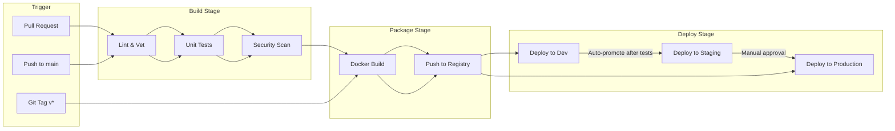
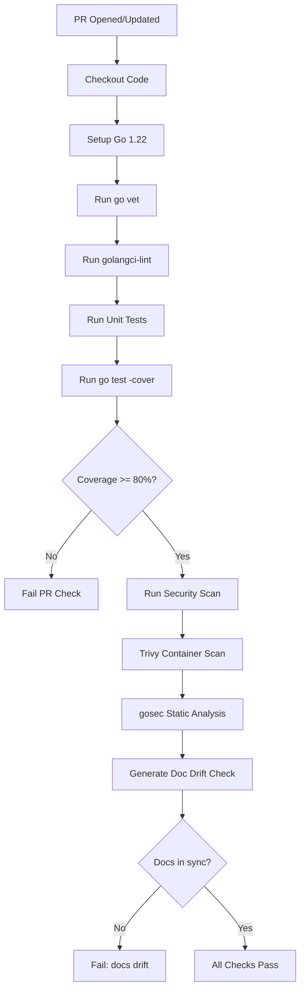
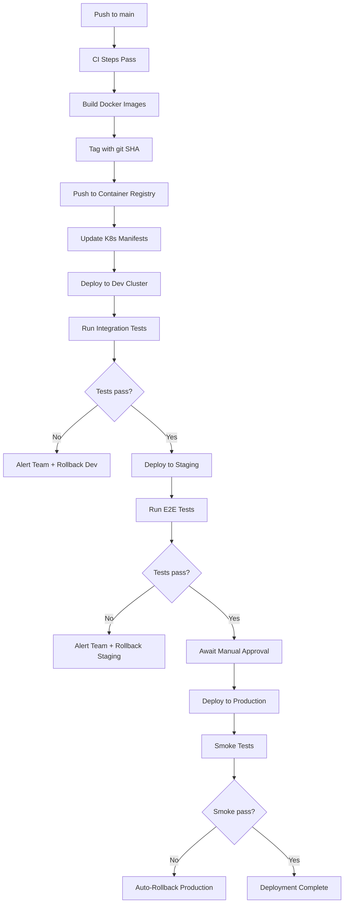
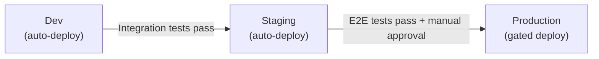

# ERP-Platform Deployment Pipeline

> **Document ID:** ERP-PLAT-DP-001
> **Version:** 1.0.0
> **Last Updated:** 2026-02-23
> **CI/CD:** GitHub Actions
> **Related Documents:** [24-Runbooks.md](./24-Runbooks.md), [26-Disaster-Recovery-Plan.md](./26-Disaster-Recovery-Plan.md)

---

## 1. Pipeline Overview



---

## 2. GitHub Actions Workflows

### 2.1 CI Workflow (Pull Requests)



### 2.2 CD Workflow (Main Branch)



### 2.3 Documentation Generation Workflow

From `.github/workflows/doc-gen.yml`:

```yaml
name: doc-gen
on:
  push:
    branches: [main]
  pull_request:
jobs:
  docs:
    runs-on: ubuntu-latest
    steps:
      - uses: actions/checkout@v4
      - uses: actions/setup-python@v5
        with:
          python-version: '3.11'
      - name: Generate docs for modules
        run: |
          set -euo pipefail
          MODULES=(
            ERP-Platform ERP-HCM ERP-CRM ERP-Marketing
            ERP-Finance ERP-Commerce ERP-eCommerce ERP-BSS-OSS
            ERP-SCM ERP-Workspace ERP-IAM ERP-iPaaS
            ERP-BI ERP-AI ERP-Projects ERP-Healthcare
            ERP-School-Management ERP-Church-Management
            ERP-Assistant ERP-Autonomous-Coding
          )
          for m in "${MODULES[@]}"; do
            python3 ERP-Platform/tools/doc-gen/doc_gen.py all "$m"
          done
      - name: Fail on docs drift
        run: git diff --exit-code
```

---

## 3. Build Stages

### 3.1 Lint and Static Analysis

```bash
# Go vet (built-in)
go vet ./...

# golangci-lint
golangci-lint run ./...

# gosec (security static analysis)
gosec ./...
```

### 3.2 Unit Tests

```bash
# Run all tests with coverage
go test -v -race -coverprofile=coverage.out ./...

# Check coverage threshold
go tool cover -func=coverage.out | grep total | awk '{print $3}'
# Must be >= 80%
```

### 3.3 Security Scanning

```bash
# Trivy for container vulnerabilities
trivy image erp-platform/subscription-hub:latest

# Trivy for filesystem scan
trivy fs --security-checks vuln,secret .

# govulncheck for Go vulnerability database
govulncheck ./...
```

---

## 4. Docker Image Build

### 4.1 Build Process

Each service uses a multi-stage Dockerfile:

```dockerfile
# Build stage
FROM golang:1.22-alpine AS build
WORKDIR /src
COPY go.mod ./
COPY *.go ./
RUN go build -o /bin/service ./

# Runtime stage
FROM alpine:3.20
WORKDIR /app
COPY --from=build /bin/service /app/service
EXPOSE 8080
CMD ["/app/service"]
```

### 4.2 Image Tagging Strategy

| Tag | When | Example |
|-----|------|---------|
| `:{git-sha}` | Every build | `subscription-hub:a1b2c3d` |
| `:latest` | Merged to main | `subscription-hub:latest` |
| `:v{version}` | Git tag | `subscription-hub:v1.0.0` |
| `:{branch}` | Feature branches | `subscription-hub:feat-persistence` |

### 4.3 Build All Services

```bash
for service in subscription-hub tenant-provisioner entitlement-engine \
    module-registry marketplace audit-service notification-hub \
    web-hosting activation-wizard; do
  docker build -t erp-platform/$service:$(git rev-parse --short HEAD) \
    services/$service/
done
```

---

## 5. Kubernetes Deployment

### 5.1 Environment Promotion



### 5.2 Deployment Manifest (Example)

```yaml
apiVersion: apps/v1
kind: Deployment
metadata:
  name: subscription-hub
  namespace: erp-platform
spec:
  replicas: 3
  strategy:
    type: RollingUpdate
    rollingUpdate:
      maxSurge: 1
      maxUnavailable: 0
  selector:
    matchLabels:
      app: subscription-hub
  template:
    metadata:
      labels:
        app: subscription-hub
        tier: service
    spec:
      containers:
        - name: subscription-hub
          image: registry.example.com/erp-platform/subscription-hub:v1.0.0
          ports:
            - containerPort: 8091
          env:
            - name: ERP_CATALOG_PATH
              value: /app/catalog/products.json
          resources:
            requests:
              cpu: 250m
              memory: 128Mi
            limits:
              cpu: 500m
              memory: 256Mi
          livenessProbe:
            httpGet:
              path: /healthz
              port: 8091
            initialDelaySeconds: 5
            periodSeconds: 10
          readinessProbe:
            httpGet:
              path: /healthz
              port: 8091
            initialDelaySeconds: 3
            periodSeconds: 5
          volumeMounts:
            - name: catalog
              mountPath: /app/catalog
              readOnly: true
      volumes:
        - name: catalog
          configMap:
            name: erp-catalog
```

---

## 6. Rollback Procedure

### Kubernetes Rollback

```bash
# View rollout history
kubectl rollout history deployment/subscription-hub -n erp-platform

# Rollback to previous revision
kubectl rollout undo deployment/subscription-hub -n erp-platform

# Rollback to specific revision
kubectl rollout undo deployment/subscription-hub -n erp-platform --to-revision=3

# Verify rollback
kubectl rollout status deployment/subscription-hub -n erp-platform
kubectl get pods -n erp-platform -l app=subscription-hub
curl -s http://localhost:8091/healthz | jq
```

### Docker Compose Rollback

```bash
# Pull previous image version
docker compose -f infra/docker-compose.platform.yml down subscription-hub
# Edit docker-compose to use previous image tag
docker compose -f infra/docker-compose.platform.yml up -d subscription-hub
```

---

## 7. Feature Flags

Feature flags control gradual rollout of new functionality:

| Flag | Description | Default | Scope |
|------|-------------|---------|-------|
| `FF_POSTGRES_PERSISTENCE` | Enable PostgreSQL backend for subscription hub | false | Service |
| `FF_REDIS_CACHE` | Enable Redis caching for entitlement queries | false | Service |
| `FF_WEBHOOK_DELIVERY` | Enable webhook event delivery | false | Tenant |
| `FF_MARKETPLACE_V2` | Enable marketplace v2 with reviews/ratings | false | Global |
| `FF_AIDD_DASHBOARD` | Enable AIDD guardrail dashboard UI | false | Tenant |

```yaml
# Feature flag configuration via ConfigMap
apiVersion: v1
kind: ConfigMap
metadata:
  name: erp-feature-flags
  namespace: erp-platform
data:
  FF_POSTGRES_PERSISTENCE: "false"
  FF_REDIS_CACHE: "false"
  FF_WEBHOOK_DELIVERY: "false"
```

---

*For operational runbooks, see [24-Runbooks.md](./24-Runbooks.md). For disaster recovery, see [26-Disaster-Recovery-Plan.md](./26-Disaster-Recovery-Plan.md).*
