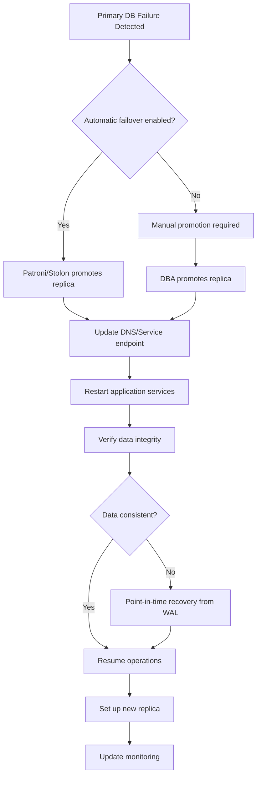
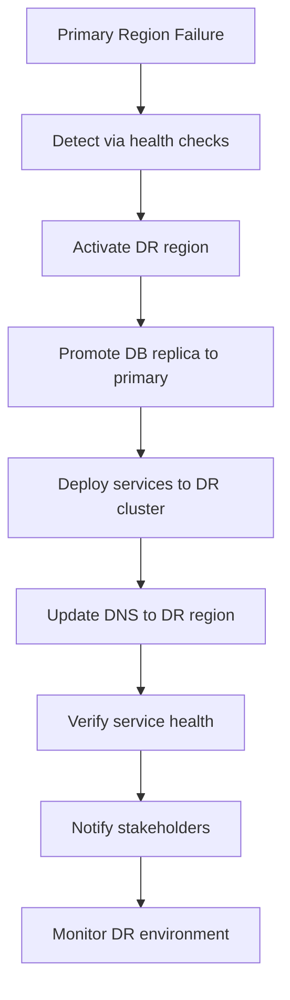
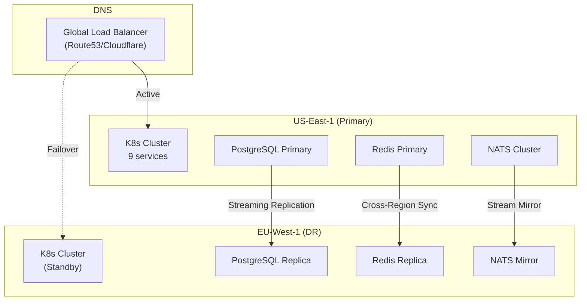

# ERP-Platform Disaster Recovery Plan

> **Document ID:** ERP-PLAT-DRP-001
> **Version:** 1.0.0
> **Last Updated:** 2026-02-23
> **Classification:** Confidential
> **Related Documents:** [24-Runbooks.md](./24-Runbooks.md), [25-Deployment-Pipeline.md](./25-Deployment-Pipeline.md)

---

## 1. RPO/RTO Targets

| Tier | Service | RPO (Data Loss) | RTO (Recovery Time) |
|------|---------|-----------------|---------------------|
| Tier 1 (Critical) | Subscription Hub, Entitlement Engine | 1 hour | 15 minutes |
| Tier 1 (Critical) | Tenant Provisioner | 1 hour | 15 minutes |
| Tier 2 (Important) | Audit Service, Module Registry | 4 hours | 30 minutes |
| Tier 2 (Important) | Marketplace, Notification Hub | 4 hours | 30 minutes |
| Tier 3 (Standard) | Web Hosting, Activation Wizard | 24 hours | 2 hours |

### Recovery Priority Order

1. PostgreSQL database (all services depend on it)
2. Redis cache (entitlement queries, catalog cache)
3. NATS JetStream (event stream continuity)
4. Subscription Hub (catalog and subscription queries)
5. Entitlement Engine (module access control)
6. Tenant Provisioner (tenant operations)
7. Audit Service (compliance logging)
8. All remaining services

---

## 2. Backup Strategy

### 2.1 PostgreSQL Backups

| Backup Type | Frequency | Retention | Storage |
|------------|-----------|-----------|---------|
| Continuous WAL Archiving | Continuous | 7 days | S3/GCS |
| Full pg_dump | Daily (02:00 UTC) | 30 days | S3/GCS |
| Weekly Full Backup | Weekly (Sunday 03:00 UTC) | 90 days | S3/GCS + Glacier |
| Monthly Backup | Monthly (1st, 04:00 UTC) | 1 year | S3 Glacier |

### 2.2 Redis Backups

| Backup Type | Frequency | Retention |
|------------|-----------|-----------|
| RDB Snapshot | Every 6 hours | 7 days |
| AOF Persistence | Continuous | 24 hours |

### 2.3 NATS JetStream Backups

| Backup Type | Frequency | Retention |
|------------|-----------|-----------|
| Stream Snapshot | Daily | 7 days |
| Cluster Replication | Real-time (3 nodes) | Continuous |

### 2.4 Configuration Backups

| Item | Method | Frequency |
|------|--------|-----------|
| Kubernetes manifests | Git repository | Every change |
| Product catalog JSON | Git repository | Every change |
| Feature flags | ConfigMap versioning | Every change |
| Secrets | Vault snapshots | Daily |

---

## 3. Failover Procedures

### 3.1 Database Failover



### 3.2 Service Failover

Kubernetes handles service failover automatically:

1. **Liveness probe failure** triggers pod restart.
2. **Readiness probe failure** removes pod from service endpoints.
3. **Node failure** triggers pod rescheduling to healthy node.
4. **Zone failure** distributes pods across availability zones via topology spread constraints.

### 3.3 Complete Cluster Failover



---

## 4. Data Replication

### 4.1 PostgreSQL Streaming Replication

```
Primary (US-East-1) --> Synchronous Replica (US-East-1, same AZ)
Primary (US-East-1) --> Asynchronous Replica (EU-West-1, DR site)
```

| Parameter | Value |
|-----------|-------|
| `synchronous_commit` | `on` (local AZ replica) |
| `max_wal_senders` | 10 |
| `wal_keep_size` | 1GB |
| `archive_mode` | `on` |
| `archive_command` | `aws s3 cp %p s3://erp-wal-archive/%f` |

### 4.2 Redis Replication

- Primary-replica replication within the same region.
- Cross-region replication via Redis Enterprise Active-Active or application-level dual-write.

### 4.3 NATS JetStream Replication

- 3-node JetStream cluster within the primary region.
- Stream mirroring to DR region NATS cluster.

---

## 5. Multi-Region Deployment



---

## 6. DR Testing Schedule

| Test Type | Frequency | Scope | Duration |
|-----------|-----------|-------|----------|
| Backup Restore Verification | Monthly | Restore latest backup to test environment | 2 hours |
| Database Failover Drill | Quarterly | Promote replica, verify services | 4 hours |
| Service Recovery Drill | Quarterly | Kill random services, verify self-healing | 2 hours |
| Full DR Failover Test | Semi-annually | Complete failover to DR region | 8 hours |
| Chaos Engineering | Monthly | Inject failures using Chaos Monkey/Litmus | Ongoing |

---

## 7. Communication Plan

### 7.1 Notification Matrix

| Severity | Internal Notification | Customer Notification | Status Page Update |
|----------|---------------------|----------------------|-------------------|
| P1 Critical | Slack + PagerDuty + Email to all-eng | Email to affected customers | Immediate update |
| P2 High | Slack + PagerDuty to on-call | Email if > 30 min impact | Within 15 min |
| P3 Medium | Slack channel notification | No notification | Within 1 hour |
| P4 Low | Ticket in backlog | No notification | No update |

### 7.2 Communication Templates

**Status Page -- Initial:**
> We are currently investigating an issue affecting ERP-Platform services. Some customers may experience degraded performance. Our engineering team is actively working on resolution. We will provide updates every 15 minutes.

**Status Page -- Resolved:**
> The issue affecting ERP-Platform has been resolved. All services are operating normally. Root cause: [brief description]. A full post-mortem will be published within 48 hours.

---

## 8. Escalation Matrix

| Time Since Detection | Escalation Level | Contacts |
|---------------------|-----------------|----------|
| 0-5 minutes | On-Call Engineer | PagerDuty primary |
| 5-15 minutes | + Tech Lead | PagerDuty secondary |
| 15-30 minutes | + Engineering Manager | Direct call |
| 30-60 minutes | + VP Engineering | Direct call |
| 60+ minutes | + CTO | Direct call |
| Customer impact confirmed | + VP Customer Success | Email + call |

---

*For operational runbooks, see [24-Runbooks.md](./24-Runbooks.md). For deployment pipeline, see [25-Deployment-Pipeline.md](./25-Deployment-Pipeline.md).*
