# ERP-Platform Entity-Relationship Diagram

> **Document ID:** ERP-PLAT-ERD-001
> **Version:** 1.0.0
> **Last Updated:** 2026-02-23
> **Related Documents:** [13-Low-Level-Design.md](./13-Low-Level-Design.md), [28-Data-Dictionary.md](./28-Data-Dictionary.md)

---

## 1. Complete Entity-Relationship Diagram

```mermaid
erDiagram
    tenants {
        uuid id PK
        varchar tenant_id UK "Unique tenant identifier"
        varchar name "Organization name"
        varchar domain "Custom domain"
        varchar status "active|suspended|decommissioned"
        jsonb metadata "Flexible metadata"
        timestamptz created_at
        timestamptz updated_at
    }

    subscriptions {
        uuid id PK
        varchar tenant_id FK "References tenants.tenant_id"
        varchar plan_type "single|bundle|suite"
        varchar status "active|suspended|cancelled|grace_period"
        text_array resolved_skus "Module SKUs after bundle resolution"
        text_array original_skus "SKUs as submitted"
        timestamptz created_at
        timestamptz updated_at
    }

    products {
        varchar sku PK "Unique product identifier"
        varchar name "Display name"
        varchar repo "Repository reference"
        varchar type "module|bundle"
        boolean standalone "Available as standalone"
        varchar category "Product category"
        integer capabilities "Number of capabilities"
        text_array includes "Bundle constituent SKUs"
        varchar catalog_version "Catalog version"
    }

    entitlements {
        uuid id PK
        varchar tenant_id FK "References tenants.tenant_id"
        varchar sku FK "References products.sku"
        boolean active "Currently entitled"
        timestamptz granted_at
        timestamptz expires_at "Null for permanent"
    }

    audit_logs {
        uuid id PK
        varchar tenant_id FK "References tenants.tenant_id"
        varchar event_topic "CloudEvents type"
        varchar actor_id "User or system identifier"
        jsonb payload "Event data"
        uuid correlation_id "Request correlation"
        timestamptz created_at
    }

    modules {
        varchar id PK "Module identifier"
        varchar name "Display name"
        varchar category "Module category"
        varchar health_url "Health check endpoint URL"
        varchar status "healthy|degraded|unhealthy|unknown"
        timestamptz last_check_at
        timestamptz registered_at
    }

    health_checks {
        uuid id PK
        varchar module_id FK "References modules.id"
        varchar status "healthy|degraded|unhealthy"
        integer latency_ms "Response time in milliseconds"
        jsonb response_body "Raw health response"
        timestamptz checked_at
    }

    marketplace_listings {
        uuid id PK
        varchar module_id FK "References modules.id"
        varchar publisher "Publisher name"
        varchar version "Semantic version"
        text description "Module description"
        varchar status "draft|published|deprecated"
        integer install_count "Installation count"
        decimal rating "Average rating"
        timestamptz created_at
        timestamptz updated_at
    }

    marketplace_installations {
        uuid id PK
        uuid listing_id FK "References marketplace_listings.id"
        varchar tenant_id FK "References tenants.tenant_id"
        varchar version "Installed version"
        varchar status "installed|updating|uninstalling"
        timestamptz installed_at
        timestamptz updated_at
    }

    notifications {
        uuid id PK
        varchar tenant_id FK "References tenants.tenant_id"
        varchar channel "email|sms|push|in_app"
        varchar recipient "Target address"
        varchar subject "Notification subject"
        text body "Notification content"
        varchar status "pending|sent|failed"
        timestamptz sent_at
        timestamptz created_at
    }

    web_hosting_configs {
        uuid id PK
        varchar tenant_id FK "References tenants.tenant_id"
        varchar domain "Custom domain"
        varchar ssl_status "valid|expiring|expired|pending"
        boolean cdn_enabled "CDN active"
        varchar dns_verification "verified|pending|failed"
        jsonb ssl_metadata "Certificate details"
        timestamptz created_at
        timestamptz updated_at
    }

    activation_wizard_states {
        uuid id PK
        varchar tenant_id FK "References tenants.tenant_id"
        integer current_step "Current wizard step"
        integer total_steps "Total steps"
        jsonb step_data "Data for each completed step"
        varchar status "in_progress|completed|skipped"
        timestamptz started_at
        timestamptz completed_at
    }

    webhook_endpoints {
        uuid id PK
        varchar tenant_id FK "References tenants.tenant_id"
        varchar url "Webhook URL"
        text_array events "Subscribed event types"
        varchar secret_hash "HMAC secret (hashed)"
        boolean active "Endpoint active"
        timestamptz last_delivery_at
        timestamptz created_at
    }

    webhook_deliveries {
        uuid id PK
        uuid endpoint_id FK "References webhook_endpoints.id"
        varchar event_type "Event type"
        uuid event_id "CloudEvent ID"
        integer attempt "Delivery attempt number"
        integer response_code "HTTP response code"
        varchar status "success|failed|pending"
        timestamptz delivered_at
    }

    tenants ||--o{ subscriptions : "has"
    tenants ||--o{ entitlements : "granted"
    tenants ||--o{ audit_logs : "generates"
    tenants ||--o{ notifications : "receives"
    tenants ||--o{ web_hosting_configs : "configures"
    tenants ||--o{ activation_wizard_states : "completes"
    tenants ||--o{ webhook_endpoints : "registers"
    tenants ||--o{ marketplace_installations : "installs"

    subscriptions ||--o{ entitlements : "seeds"
    products ||--o{ entitlements : "entitled via"

    modules ||--o{ health_checks : "reports"
    modules ||--o{ marketplace_listings : "listed as"

    marketplace_listings ||--o{ marketplace_installations : "installed by"
    webhook_endpoints ||--o{ webhook_deliveries : "delivers"
```



---

## 2. Indexes

### 2.1 Primary Indexes (Automatic)

| Table | Index | Columns |
|-------|-------|---------|
| tenants | pk_tenants | id |
| subscriptions | pk_subscriptions | id |
| products | pk_products | sku |
| entitlements | pk_entitlements | id |
| audit_logs | pk_audit_logs | id |
| modules | pk_modules | id |

### 2.2 Secondary Indexes

| Table | Index Name | Columns | Type | Purpose |
|-------|-----------|---------|------|---------|
| tenants | idx_tenants_tenant_id | tenant_id | UNIQUE | Tenant lookup |
| tenants | idx_tenants_status | status | BTREE | Status filtering |
| tenants | idx_tenants_domain | domain | BTREE | Domain lookup |
| subscriptions | idx_subscriptions_tenant | tenant_id | BTREE | Tenant subscription lookup |
| subscriptions | idx_subscriptions_status | status | BTREE | Active subscription filtering |
| entitlements | idx_entitlements_tenant | tenant_id | BTREE | Tenant entitlement lookup |
| entitlements | idx_entitlements_tenant_active | tenant_id WHERE active=true | PARTIAL | Active entitlement queries |
| entitlements | idx_entitlements_sku | sku | BTREE | SKU-based queries |
| entitlements | uq_entitlements_tenant_sku | tenant_id, sku | UNIQUE | Prevent duplicate grants |
| audit_logs | idx_audit_tenant | tenant_id | BTREE | Tenant audit query |
| audit_logs | idx_audit_topic | event_topic | BTREE | Event type filtering |
| audit_logs | idx_audit_created | created_at | BTREE | Time-range queries |
| audit_logs | idx_audit_correlation | correlation_id | BTREE | Trace correlation |
| modules | idx_modules_status | status | BTREE | Health status filtering |
| health_checks | idx_health_module | module_id | BTREE | Module health history |
| health_checks | idx_health_checked | checked_at | BTREE | Time-series queries |
| marketplace_listings | idx_mpl_module | module_id | BTREE | Module listing lookup |
| marketplace_listings | idx_mpl_status | status | BTREE | Published listings |
| marketplace_installations | idx_mpi_tenant | tenant_id | BTREE | Tenant installations |
| notifications | idx_notif_tenant | tenant_id | BTREE | Tenant notifications |
| notifications | idx_notif_status | status | BTREE | Pending notification processing |
| web_hosting_configs | idx_whc_tenant | tenant_id | BTREE | Tenant hosting lookup |
| web_hosting_configs | idx_whc_domain | domain | UNIQUE | Domain uniqueness |
| webhook_endpoints | idx_whe_tenant | tenant_id | BTREE | Tenant webhooks |
| webhook_deliveries | idx_whd_endpoint | endpoint_id | BTREE | Endpoint delivery history |

---

## 3. Constraints

### 3.1 Check Constraints

| Table | Constraint | Expression |
|-------|-----------|------------|
| tenants | chk_tenant_status | `status IN ('active','suspended','decommissioned')` |
| subscriptions | chk_subscription_plan | `plan_type IN ('single','bundle','suite')` |
| subscriptions | chk_subscription_status | `status IN ('active','suspended','cancelled','grace_period')` |
| products | chk_product_type | `type IN ('module','bundle')` |
| modules | chk_module_status | `status IN ('healthy','degraded','unhealthy','unknown')` |
| marketplace_listings | chk_listing_status | `status IN ('draft','published','deprecated')` |
| notifications | chk_notification_channel | `channel IN ('email','sms','push','in_app')` |
| notifications | chk_notification_status | `status IN ('pending','sent','failed')` |

### 3.2 Foreign Key Constraints

| Table | Column | References | On Delete |
|-------|--------|------------|-----------|
| subscriptions | tenant_id | tenants(tenant_id) | RESTRICT |
| entitlements | tenant_id | tenants(tenant_id) | CASCADE |
| entitlements | sku | products(sku) | RESTRICT |
| audit_logs | tenant_id | tenants(tenant_id) | RESTRICT |
| health_checks | module_id | modules(id) | CASCADE |
| marketplace_listings | module_id | modules(id) | RESTRICT |
| marketplace_installations | listing_id | marketplace_listings(id) | RESTRICT |
| marketplace_installations | tenant_id | tenants(tenant_id) | CASCADE |
| notifications | tenant_id | tenants(tenant_id) | CASCADE |
| web_hosting_configs | tenant_id | tenants(tenant_id) | CASCADE |
| activation_wizard_states | tenant_id | tenants(tenant_id) | CASCADE |
| webhook_endpoints | tenant_id | tenants(tenant_id) | CASCADE |
| webhook_deliveries | endpoint_id | webhook_endpoints(id) | CASCADE |

---

## 4. Row-Level Security Policies

All tenant-scoped tables have RLS enabled:

```sql
ALTER TABLE tenants ENABLE ROW LEVEL SECURITY;
ALTER TABLE subscriptions ENABLE ROW LEVEL SECURITY;
ALTER TABLE entitlements ENABLE ROW LEVEL SECURITY;
ALTER TABLE audit_logs ENABLE ROW LEVEL SECURITY;
ALTER TABLE notifications ENABLE ROW LEVEL SECURITY;
ALTER TABLE web_hosting_configs ENABLE ROW LEVEL SECURITY;
ALTER TABLE activation_wizard_states ENABLE ROW LEVEL SECURITY;
ALTER TABLE webhook_endpoints ENABLE ROW LEVEL SECURITY;
ALTER TABLE marketplace_installations ENABLE ROW LEVEL SECURITY;

-- Policy template (applied to each table)
CREATE POLICY tenant_isolation ON {table}
    USING (tenant_id = current_setting('app.current_tenant'));
```

---

*For the data dictionary, see [28-Data-Dictionary.md](./28-Data-Dictionary.md). For low-level design, see [13-Low-Level-Design.md](./13-Low-Level-Design.md).*
