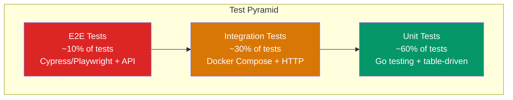
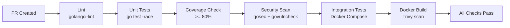

# ERP-Platform Test Strategy

> **Document ID:** ERP-PLAT-TS-001
> **Version:** 1.0.0
> **Last Updated:** 2026-02-23
> **Related Documents:** [19-CONTRIBUTING.md](./19-CONTRIBUTING.md), [25-Deployment-Pipeline.md](./25-Deployment-Pipeline.md)

---

## 1. Test Pyramid



| Layer | Percentage | Focus | Speed | Infrastructure |
|-------|-----------|-------|-------|---------------|
| Unit | 60% | Business logic, validation, bundle resolution | Fast (< 1s per test) | None |
| Integration | 30% | Service-to-service, database, event streaming | Medium (< 30s per test) | Docker Compose |
| E2E | 10% | Full user journeys, API workflows | Slow (< 5m per scenario) | Full stack |

---

## 2. Testing Tools

| Category | Tool | Purpose |
|----------|------|---------|
| Unit Testing | `go test` (stdlib) | Go unit test runner |
| Test Assertions | `testing` package | Standard assertions |
| Coverage | `go test -coverprofile` | Code coverage measurement |
| HTTP Testing | `net/http/httptest` | HTTP handler testing without server |
| Integration | Docker Compose | Spin up PostgreSQL, Redis, NATS |
| API Testing | `curl` / `httpie` / Postman | HTTP API verification |
| E2E Testing | Custom Go test suite | Full workflow testing |
| Frontend Testing | Jest + React Testing Library | Component and page tests |
| Performance | k6 / vegeta | Load testing and benchmarking |
| Security | gosec, Trivy, govulncheck | Static analysis and vulnerability scanning |
| Accessibility | axe-core / Lighthouse | WCAG 2.1 compliance |
| Linting | golangci-lint | Code quality and style |

---

## 3. Coverage Targets

| Service | Target | Critical Paths |
|---------|--------|---------------|
| subscription-hub | > 85% | Bundle resolution, validation, entitlement query |
| tenant-provisioner | > 80% | Tenant CRUD, X-Tenant-ID validation |
| entitlement-engine | > 85% | Entitlement evaluation, cache logic |
| module-registry | > 80% | Health check logic, module lifecycle |
| marketplace | > 80% | Installation lifecycle, entitlement check |
| audit-service | > 80% | Event ingestion, query filtering |
| notification-hub | > 75% | Channel routing, delivery logic |
| web-hosting | > 75% | Domain validation, SSL provisioning |
| activation-wizard | > 75% | Wizard state management |
| **Overall Platform** | **> 80%** | -- |

---

## 4. Unit Test Specifications

### 4.1 Subscription Hub Unit Tests

```go
// Test table for subscription creation validation
func TestStore_Upsert(t *testing.T) {
    tests := []struct {
        name    string
        req     SubscriptionRequest
        wantErr string
    }{
        {
            name:    "valid single subscription",
            req:     SubscriptionRequest{TenantID: "t-1", PlanType: "single", SKUs: []string{"erp-crm"}},
            wantErr: "",
        },
        {
            name:    "empty tenant_id",
            req:     SubscriptionRequest{TenantID: "", PlanType: "single", SKUs: []string{"erp-crm"}},
            wantErr: "tenant_id is required",
        },
        {
            name:    "invalid plan_type",
            req:     SubscriptionRequest{TenantID: "t-1", PlanType: "invalid", SKUs: []string{"erp-crm"}},
            wantErr: "plan_type must be single, bundle, or suite",
        },
        {
            name:    "empty skus",
            req:     SubscriptionRequest{TenantID: "t-1", PlanType: "single", SKUs: []string{}},
            wantErr: "at least one sku is required",
        },
        {
            name:    "unknown sku",
            req:     SubscriptionRequest{TenantID: "t-1", PlanType: "single", SKUs: []string{"nonexistent"}},
            wantErr: "unknown sku: nonexistent",
        },
        {
            name:    "bundle in single plan",
            req:     SubscriptionRequest{TenantID: "t-1", PlanType: "single", SKUs: []string{"enterprise"}},
            wantErr: "bundle sku is not allowed in single plan: enterprise",
        },
        {
            name:    "valid bundle subscription",
            req:     SubscriptionRequest{TenantID: "t-2", PlanType: "bundle", SKUs: []string{"starter"}},
            wantErr: "",
        },
    }
    // Run test cases...
}
```

### 4.2 Bundle Resolution Tests

| Test Case | Input | Expected Output |
|-----------|-------|----------------|
| Starter bundle resolves | `["starter"]` | `["erp-crm","erp-workspace","erp-bi"]` |
| Enterprise bundle resolves | `["enterprise"]` | All 20 module SKUs |
| Duplicate deduplication | `["erp-crm","erp-crm"]` | `["erp-crm"]` |
| Multiple bundles overlap | `["starter","professional"]` | Union of both, deduplicated |
| Healthcare suite | `["healthcare-suite"]` | `["erp-healthcare","erp-finance","erp-hcm","erp-workspace","erp-iam"]` |

### 4.3 HTTP Handler Tests

```go
func TestHealthHandler(t *testing.T) {
    req := httptest.NewRequest("GET", "/healthz", nil)
    w := httptest.NewRecorder()
    handler(w, req)

    assert(t, w.Code, http.StatusOK)
    var resp map[string]any
    json.Unmarshal(w.Body.Bytes(), &resp)
    assert(t, resp["status"], "ok")
}
```

---

## 5. Integration Test Specifications

### 5.1 Service-to-Service Tests

| Test | Services Involved | Verification |
|------|------------------|-------------|
| Subscription creates entitlements | subscription-hub, entitlement-engine | POST subscription, GET entitlements returns correct SKUs |
| Tenant provisioning triggers events | tenant-provisioner, audit-service | POST tenant, verify audit event in NATS |
| Module registry discovers modules | module-registry, all ERP modules | Register module, verify health check succeeds |
| Marketplace checks entitlements | marketplace, entitlement-engine | Attempt install, verify entitlement check |

### 5.2 Database Integration Tests

| Test | Verification |
|------|-------------|
| Tenant CRUD | Create, read, update, delete tenant in PostgreSQL |
| Subscription persistence | Create subscription, restart service, verify data persists |
| RLS enforcement | Set tenant context, verify cross-tenant query returns empty |
| Audit log append-only | Write audit entry, attempt update, verify rejection |

---

## 6. Performance Testing

### 6.1 Load Test Scenarios

| Scenario | Tool | Target | Duration |
|----------|------|--------|----------|
| Catalog read under load | k6 | 10K RPS, < 20ms P99 | 5 minutes |
| Subscription creation | k6 | 1K RPS, < 50ms P99 | 5 minutes |
| Entitlement query | k6 | 10K RPS, < 10ms P99 | 5 minutes |
| Mixed workload | k6 | 5K RPS mixed, < 50ms P99 | 15 minutes |
| Tenant provisioning | k6 | 100 concurrent, < 5s each | 5 minutes |
| Soak test | k6 | 2K RPS sustained | 1 hour |

### 6.2 k6 Script Example

```javascript
import http from 'k6/http';
import { check, sleep } from 'k6';

export const options = {
    stages: [
        { duration: '1m', target: 100 },
        { duration: '3m', target: 1000 },
        { duration: '1m', target: 0 },
    ],
    thresholds: {
        http_req_duration: ['p(99)<50'],
        http_req_failed: ['rate<0.01'],
    },
};

export default function () {
    const res = http.get('http://localhost:8091/v1/products');
    check(res, {
        'status is 200': (r) => r.status === 200,
        'has products': (r) => JSON.parse(r.body).products.length > 0,
    });
    sleep(0.1);
}
```

---

## 7. Security Testing

| Test Type | Tool | Frequency | Target |
|-----------|------|-----------|--------|
| Static Analysis | gosec | Every PR | Zero high/critical findings |
| Dependency Vulnerability | govulncheck | Every PR | Zero known vulnerabilities |
| Container Scanning | Trivy | Every build | Zero high/critical CVEs |
| Secret Detection | Trivy fs --secret | Every PR | Zero detected secrets |
| OWASP Top 10 | Manual + automated | Quarterly | Full coverage |
| Penetration Testing | External vendor | Annually | Clean report |
| Tenant Isolation Testing | Custom scripts | Monthly | Zero cross-tenant leaks |

---

## 8. Accessibility Testing

| Standard | Target | Tools |
|----------|--------|-------|
| WCAG 2.1 Level AA | Full compliance | axe-core, Lighthouse |
| Keyboard Navigation | All interactive elements | Manual testing |
| Screen Reader | Full content accessible | NVDA, VoiceOver |
| Color Contrast | 4.5:1 minimum | Lighthouse audit |

---

## 9. Test Environments

| Environment | Purpose | Data | Refresh Cycle |
|------------|---------|------|---------------|
| Local | Developer testing | Seed data | On demand |
| CI | Automated PR checks | Fresh per run | Every PR |
| Dev | Integration testing | Synthetic data | Daily |
| Staging | Pre-production validation | Production-like | Weekly |
| Production | Live monitoring | Real data | N/A |

---

## 10. CI Integration



---

*For contribution guidelines, see [19-CONTRIBUTING.md](./19-CONTRIBUTING.md). For deployment pipeline, see [25-Deployment-Pipeline.md](./25-Deployment-Pipeline.md).*
