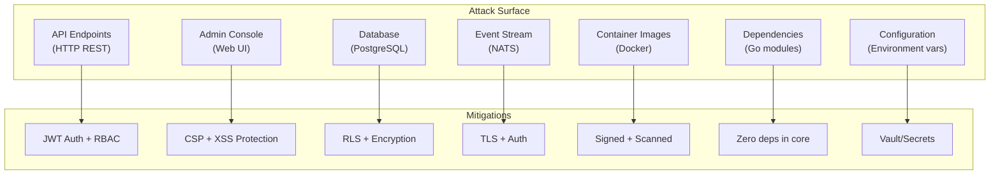
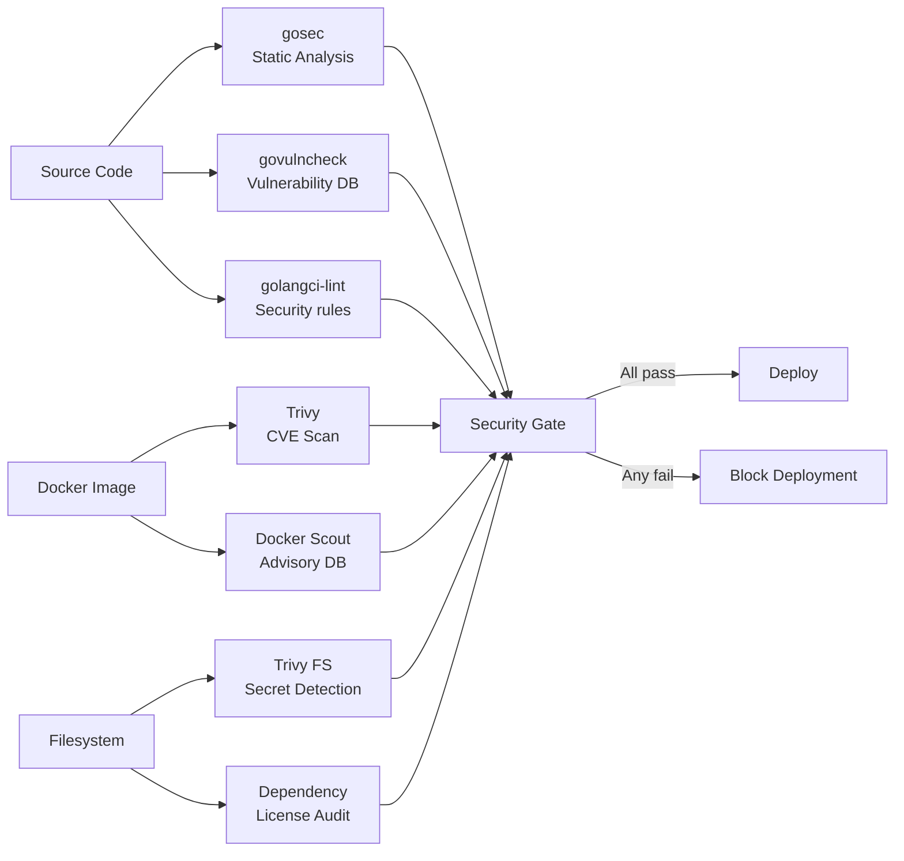

# ERP-Platform Security Policy

> **Document ID:** ERP-PLAT-SEC-001
> **Version:** 1.0.0
> **Last Updated:** 2026-02-23
> **Classification:** Internal
> **Related Documents:** [29-Data-Privacy-Compliance.md](./29-Data-Privacy-Compliance.md), [18-Architecture-Decision-Records.md](./18-Architecture-Decision-Records.md)

---

## 1. Vulnerability Reporting

### Reporting Process

If you discover a security vulnerability in ERP-Platform, please report it responsibly:

1. **DO NOT** open a public GitHub issue.
2. Send a detailed report to: `security@erp-platform.example.com`
3. Include:
   - Description of the vulnerability
   - Steps to reproduce
   - Potential impact assessment
   - Suggested fix (if any)
4. You will receive acknowledgment within 24 hours.
5. We will provide a status update within 72 hours.
6. Critical vulnerabilities will be patched within 7 days.

### Security Contacts

| Role | Contact | Response Time |
|------|---------|-------------- |
| Security Lead | security@erp-platform.example.com | 24 hours |
| CISO | ciso@erp-platform.example.com | 48 hours |
| On-Call Security | PagerDuty security rotation | 1 hour (P1) |

---

## 2. Supported Versions

| Version | Status | Security Updates |
|---------|--------|-----------------|
| 1.0.x | Active | Full support |
| < 1.0.0 | Pre-release | Not supported |

---

## 3. Threat Model

### 3.1 Threat Actors

| Actor | Motivation | Capability | Likelihood |
|-------|-----------|-----------|------------|
| External Attacker | Data theft, ransom | High (APT tools) | Medium |
| Malicious Insider | Data exfiltration, sabotage | High (internal access) | Low |
| Compromised Tenant | Cross-tenant access | Medium (authenticated) | Medium |
| Automated Bot | Resource abuse, credential stuffing | Medium | High |
| Supply Chain | Dependency compromise | High | Low |

### 3.2 Attack Surface



### 3.3 STRIDE Analysis

| Threat | Category | Affected Component | Mitigation |
|--------|----------|-------------------|------------|
| JWT token theft | Spoofing | API Gateway | Short-lived tokens (15 min), refresh token rotation |
| Cross-tenant data access | Tampering | All services | X-Tenant-ID validation + PostgreSQL RLS |
| Audit log modification | Repudiation | Audit Service | Append-only table, no DELETE/UPDATE permissions |
| Sensitive data exposure | Information Disclosure | Database | AES-256 encryption at rest, TLS 1.3 in transit |
| API abuse | Denial of Service | API Gateway | Rate limiting, circuit breakers |
| Privilege escalation | Elevation of Privilege | RBAC system | Role hierarchy, least privilege, AIDD guardrails |

---

## 4. Security Controls

### 4.1 Authentication

| Control | Implementation | Details |
|---------|---------------|---------|
| User Authentication | ERP-IAM (OIDC/JWT) | OpenID Connect flow with JWT access tokens |
| Service-to-Service Auth | mTLS | Mutual TLS for inter-service communication |
| API Key Authentication | HMAC-signed keys | For external integrations and webhooks |
| Token Lifetime | 15 minutes (access), 24 hours (refresh) | Short-lived tokens reduce theft window |
| MFA | Supported via ERP-IAM | TOTP, WebAuthn, SMS |

### 4.2 Authorization

| Control | Implementation |
|---------|---------------|
| RBAC | Four roles: platform-admin, tenant-admin, module-admin, viewer |
| Entitlement-Based | API calls checked against active subscription SKUs |
| Tenant Isolation | X-Tenant-ID header + PostgreSQL Row-Level Security |
| AIDD Guardrails | Confidence thresholds, blast-radius limits, human approval gates |
| Least Privilege | Services run with minimal required permissions |

### 4.3 Role Permissions Matrix

| Permission | Platform Admin | Tenant Admin | Module Admin | Viewer |
|-----------|---------------|-------------|-------------|--------|
| Manage all tenants | Yes | No | No | No |
| Manage own tenant | Yes | Yes | No | No |
| Create subscriptions | Yes | No | No | No |
| View subscriptions | Yes | Yes | No | Yes |
| Query entitlements | Yes | Yes | Yes | Yes |
| Install marketplace modules | Yes | Yes | No | No |
| View audit logs | Yes | Yes | No | No |
| Export audit logs | Yes | No | No | No |
| Configure AIDD guardrails | Yes | No | No | No |
| Manage web hosting | Yes | Yes | No | No |
| View health status | Yes | Yes | Yes | Yes |

---

## 5. Encryption Standards

| Layer | Standard | Algorithm | Key Size |
|-------|----------|-----------|----------|
| In Transit | TLS 1.3 | AES-256-GCM, ChaCha20 | 256-bit |
| At Rest (Database) | Transparent Data Encryption | AES-256 | 256-bit |
| At Rest (Backups) | Server-Side Encryption | AES-256 | 256-bit |
| Webhook Signatures | HMAC | SHA-256 | 256-bit |
| Password Hashing | bcrypt | -- | Cost factor 12 |
| API Key Hashing | SHA-256 | -- | 256-bit |

---

## 6. Dependency Management

### 6.1 Core Services: Zero External Dependencies

The subscription hub and all core platform services use only Go standard library packages. This eliminates supply chain risk from third-party Go dependencies.

**go.mod (subscription-hub):**
```
module erp-platform/subscription-hub
go 1.22
```

### 6.2 Infrastructure Dependencies

| Dependency | Version | CVE Monitoring | Update Policy |
|-----------|---------|---------------|---------------|
| Go | 1.22.x | go.dev/vuln | Patch within 48h of security release |
| Alpine Linux | 3.20 | Docker Scout | Rebuild weekly |
| PostgreSQL | 16.x | postgresql.org/security | Patch within 1 week |
| Redis | 7.x | redis.io/security | Patch within 1 week |
| NATS | 2.10.x | nats.io/advisories | Patch within 1 week |
| Docker | 25.x | docker.com/security | Patch within 48h |

### 6.3 Frontend Dependencies

Frontend activation console dependencies are tracked via `package-lock.json` and scanned with `npm audit`.

---

## 7. Security Scanning Pipeline



---

## 8. Incident Response

### 8.1 Security Incident Classification

| Level | Description | Response Time | Notification |
|-------|-------------|--------------|-------------|
| SEV-1 Critical | Active breach, data exfiltration | 15 minutes | CISO + CTO + Legal |
| SEV-2 High | Vulnerability with known exploit | 4 hours | Security Lead + VP Eng |
| SEV-3 Medium | Vulnerability without known exploit | 24 hours | Security Lead |
| SEV-4 Low | Informational finding | 5 business days | Security Team |

### 8.2 Incident Response Steps

1. **Detect**: Monitoring alerts, security scanning, or external report.
2. **Contain**: Isolate affected systems, revoke compromised credentials.
3. **Assess**: Determine scope, affected data, affected tenants.
4. **Notify**: Inform stakeholders per classification matrix.
5. **Remediate**: Apply fix, rotate secrets, patch vulnerabilities.
6. **Recover**: Restore from clean backups if needed.
7. **Report**: Post-incident report within 48 hours.
8. **Improve**: Update controls to prevent recurrence.

### 8.3 Breach Notification

| Audience | Timeline | Method |
|----------|----------|--------|
| Internal stakeholders | Immediately | Slack + PagerDuty |
| Affected customers | Within 72 hours | Email + status page |
| Regulatory authorities | Within 72 hours (GDPR) | Formal notification |
| Public | If required by law | Press release + blog post |

---

## 9. Security Hardening Checklist

- [ ] All services run as non-root user in containers
- [ ] Container images use read-only filesystem where possible
- [ ] Network policies restrict inter-pod communication to necessary paths
- [ ] Secrets stored in Kubernetes Secrets or Vault (never in environment variables in plain text)
- [ ] Database connections use TLS
- [ ] All external-facing endpoints behind WAF
- [ ] Rate limiting configured on API gateway
- [ ] CORS configured to allow only known origins
- [ ] CSP headers set on admin console
- [ ] Audit logging enabled for all state-changing operations
- [ ] AIDD guardrails active and cannot be disabled in production
- [ ] Backup encryption keys rotated quarterly
- [ ] Service accounts have minimal required permissions
- [ ] Container images scanned before deployment

---

*For data privacy compliance, see [29-Data-Privacy-Compliance.md](./29-Data-Privacy-Compliance.md). For ADRs, see [18-Architecture-Decision-Records.md](./18-Architecture-Decision-Records.md).*
