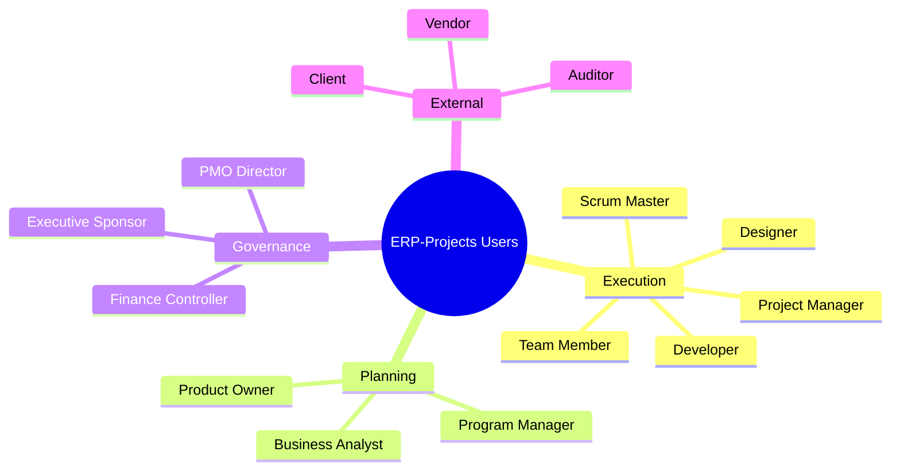
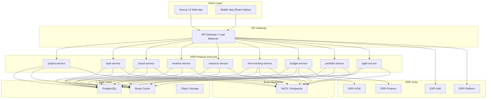

# ERP-Projects -- Product Requirements Document (PRD)

## Document Control

| Field         | Value                                          |
|---------------|------------------------------------------------|
| Module        | ERP-Projects (Project Management Platform)     |
| Version       | 1.0                                            |
| Date          | 2026-02-23                                     |
| Status        | Active Development                             |
| Repository    | `ERP-Projects`                                 |
| SKU           | `erp.projects`                                 |
| Integration   | standalone_plus_suite via ERP-Platform          |

---

## 1. Executive Summary

### 1.1 Product Vision

ERP-Projects is a **comprehensive enterprise project management platform** that unifies waterfall, agile, and hybrid methodologies into a single coherent system. The module consolidates project lifecycle management, task orchestration, resource planning, time tracking, budget control, portfolio governance, and agile ceremonies into nine purpose-built microservices. It is designed to serve as the operational backbone for organizations managing complex programs of work -- from single-team sprint-driven software delivery to multi-year, multi-million-dollar construction and consulting programs.

The platform supports a five-level work hierarchy (Program > Project > Milestone > Task > Subtask) with full dependency modeling, critical path analysis, earned value management, and AI-powered risk prediction. It operates both as a standalone SaaS product and as a suite-integrated module within the broader ERP ecosystem, connecting seamlessly with ERP-HCM for payroll integration, ERP-Finance for budget reconciliation, and ERP-CRM for client-facing project delivery.

### 1.2 Target Markets

| Priority   | Markets                                          |
|------------|--------------------------------------------------|
| Primary    | Nigeria, Kenya, South Africa, Ghana              |
| Secondary  | Other African nations, Southeast Asia, Middle East|
| Tertiary   | Global emerging markets, LATAM, Europe           |

### 1.3 Key Value Propositions

1. **Unified Methodology Support** -- single platform for waterfall (Gantt, critical path, WBS), agile (sprints, backlogs, velocity), and hybrid approaches
2. **Five-Level Work Hierarchy** -- Program > Project > Milestone > Task > Subtask with unlimited nesting
3. **Intelligent Resource Management** -- capacity planning, skill-based assignment, workload balancing, and utilization analytics
4. **Earned Value Management (EVM)** -- CPI, SPI, EAC, ETC calculations with automated variance alerts
5. **Portfolio Governance** -- strategic alignment scoring, weighted prioritization, what-if scenario modeling
6. **AI-Powered Insights** -- risk prediction, schedule optimization, health scoring, and recommendation engine
7. **Integrated Time & Budget Tracking** -- billable/non-billable time, timesheet approval workflows, project cost tracking with ERP-HCM payroll sync
8. **Interactive Gantt & Timeline** -- drag-and-drop scheduling, baseline tracking, resource leveling, auto-scheduling
9. **Multi-View Boards** -- Kanban, sprint/Scrum, calendar, timeline, list with custom swimlanes and WIP limits

---

## 2. Competitive Landscape Analysis

### 2.1 Comparison Matrix

| Capability                          | ERP-Projects | Microsoft Project | Asana        | Monday.com   | Jira          | Zoho Projects |
|-------------------------------------|:------------:|:-----------------:|:------------:|:------------:|:-------------:|:-------------:|
| Waterfall / Gantt charts            | Yes          | Yes               | Basic        | Basic        | Plugin        | Yes           |
| Agile / Scrum boards                | Yes          | Basic             | Yes          | Yes          | Yes           | Yes           |
| Hybrid methodology                  | Yes          | Partial           | Yes          | Yes          | Partial       | Partial       |
| Critical path method (CPM)          | Yes          | Yes               | No           | No           | No            | No            |
| Earned Value Management (EVM)       | Yes          | Yes               | No           | No           | No            | No            |
| Resource leveling                   | Yes          | Yes               | No           | No           | No            | Partial       |
| Capacity planning                   | Yes          | Yes               | Basic        | Basic        | No            | Basic         |
| Portfolio management                | Yes          | Separate (PPM)    | Business+    | Yes          | Jira Align    | Yes           |
| What-if scenario modeling           | Yes          | No                | No           | No           | No            | No            |
| Time tracking (native)              | Yes          | No                | Yes          | Yes          | Plugin        | Yes           |
| Budget / cost management            | Yes          | Yes               | No           | Basic        | No            | Yes           |
| Billable vs non-billable tracking   | Yes          | No                | No           | No           | Plugin        | Yes           |
| Timesheet approval workflow         | Yes          | No                | No           | No           | Plugin        | Yes           |
| AI-powered risk prediction          | Yes          | No                | AI features  | AI features  | No            | AI (Zia)      |
| Dependency types (FS/FF/SS/SF)      | All 4        | All 4             | FS only      | FS only      | Block only    | FS/SS         |
| Baseline tracking                   | Yes          | Yes               | No           | No           | No            | No            |
| Recurring tasks                     | Yes          | No                | Yes          | Yes          | Yes           | Yes           |
| @mentions and comments              | Yes          | No                | Yes          | Yes          | Yes           | Yes           |
| Bulk operations                     | Yes          | Yes               | Yes          | Yes          | Yes           | Yes           |
| Sprint velocity / burndown          | Yes          | No                | No           | No           | Yes           | Partial       |
| Release planning                    | Yes          | No                | No           | No           | Yes           | No            |
| Retrospective boards                | Yes          | No                | No           | No           | No            | No            |
| Multi-tenant / SaaS-native          | Yes          | Azure-hosted      | Yes          | Yes          | Yes           | Yes           |
| ERP suite integration               | Yes          | No                | No           | No           | No            | Zoho suite    |
| Offline capability                  | Planned      | Desktop app       | No           | No           | No            | No            |
| Custom fields                       | Yes          | Yes               | Yes          | Yes          | Yes           | Yes           |
| Swimlanes                           | Yes          | No                | No           | Yes          | Yes           | No            |
| WIP limits                          | Yes          | No                | No           | No           | Yes           | No            |

### 2.2 Competitive Differentiation

**vs. Microsoft Project**: Microsoft Project excels at traditional waterfall planning with best-in-class CPM and resource leveling but lacks native agile support, time tracking, and modern collaboration features. ERP-Projects provides the same CPM/EVM rigor with full agile/hybrid support, integrated time tracking, and a modern web-based UX. Microsoft Project requires a separate server for portfolio management (Project Online/Server); ERP-Projects includes portfolio governance natively.

**vs. Asana**: Asana provides excellent task management and collaboration but is weak on traditional project management capabilities. It lacks critical path analysis, earned value management, resource leveling, baseline tracking, and all four dependency types. ERP-Projects matches Asana's collaboration while adding enterprise PM capabilities.

**vs. Monday.com**: Monday.com offers flexible work management with strong visual appeal but is a generalist tool lacking CPM, EVM, resource leveling, and formal dependency modeling. ERP-Projects delivers the same visual flexibility with deep project management discipline.

**vs. Jira**: Jira dominates software development workflow with excellent sprint and backlog management but is narrowly focused on software teams. It lacks Gantt charts, CPM, EVM, budget management, time tracking, and resource planning without extensive plugin ecosystems. ERP-Projects provides first-class agile with complete project management breadth.

**vs. Zoho Projects**: Zoho Projects offers a balanced feature set with good ERP integration (Zoho suite) but lacks CPM, EVM, what-if scenarios, and advanced portfolio governance. ERP-Projects provides deeper analytics and methodology support while offering broader ERP integration through the ERP-Platform.

---

## 3. Target Users and Stakeholder Roles

### 3.1 Primary Users

| Role                 | Description                                    | Key Needs                                               |
|----------------------|------------------------------------------------|---------------------------------------------------------|
| Project Manager      | Leads project execution                        | Gantt charts, CPM, resource allocation, status reporting|
| Program Manager      | Oversees multiple related projects             | Portfolio dashboard, cross-project dependencies, EVM    |
| Team Member          | Executes tasks                                 | Task boards, time logging, comments, notifications      |
| Scrum Master         | Facilitates agile ceremonies                   | Sprint boards, velocity charts, burndown, retrospectives|
| Product Owner        | Manages product backlog                        | Backlog grooming, story points, release planning        |
| Resource Manager     | Optimizes team allocation                      | Capacity planning, utilization reports, workload views  |
| Finance Controller   | Monitors project budgets                       | Budget vs actual, EVM metrics, billing reports          |
| Executive / PMO      | Strategic oversight                            | Portfolio health, strategic alignment, what-if analysis |
| Client / Stakeholder | External visibility                            | Status reports, milestone tracking, approval gates      |
| Timesheet Approver   | Validates team time entries                    | Timesheet review, billable tracking, payroll export     |

### 3.2 User Personas

---

## 4. Feature Requirements

### 4.1 Project Management (project-service)

#### 4.1.1 Project CRUD and Lifecycle

| ID       | Requirement                                      | Priority | Status    |
|----------|--------------------------------------------------|----------|-----------|
| PM-001   | Create project with name, description, dates     | P0       | Implemented|
| PM-002   | Project types: Consulting, Construction, Dev, Design, Other | P0 | Implemented|
| PM-003   | Status workflow: Planning > Active > On Hold > Completed > Cancelled | P0 | Implemented|
| PM-004   | Priority levels: Low, Medium, High, Critical     | P0       | Implemented|
| PM-005   | Project owner assignment                         | P0       | Implemented|
| PM-006   | Client name and contact tracking                 | P0       | Implemented|
| PM-007   | Budget and currency assignment                   | P0       | Implemented|
| PM-008   | Health score calculation (0-100)                 | P0       | Implemented|
| PM-009   | Completion percentage tracking                   | P0       | Implemented|
| PM-010   | Tag-based categorization                         | P1       | Implemented|

#### 4.1.2 Project Hierarchy

| ID       | Requirement                                      | Priority | Status    |
|----------|--------------------------------------------------|----------|-----------|
| PM-020   | Program > Project grouping                       | P0       | Planned   |
| PM-021   | Project > Milestone > Task > Subtask hierarchy   | P0       | Implemented|
| PM-022   | Unlimited subtask nesting depth                  | P1       | Implemented|
| PM-023   | Cross-project dependencies                       | P1       | Planned   |
| PM-024   | Project templates with pre-defined structures    | P1       | Planned   |
| PM-025   | Archive and restore functionality                | P2       | Planned   |

#### 4.1.3 Status Reporting

| ID       | Requirement                                      | Priority | Status    |
|----------|--------------------------------------------------|----------|-----------|
| PM-030   | Automated health status: Excellent/Good/Warning/Critical | P0 | Implemented|
| PM-031   | Weekly status report generation                  | P1       | Planned   |
| PM-032   | Stakeholder email notifications                  | P1       | Planned   |
| PM-033   | Custom report builder                            | P2       | Planned   |

### 4.2 Task Management (task-service)

| ID       | Requirement                                      | Priority | Status    |
|----------|--------------------------------------------------|----------|-----------|
| TM-001   | Task CRUD with title, description, dates         | P0       | Implemented|
| TM-002   | Status workflow: TODO > In Progress > In Review > Blocked > Done | P0 | Implemented|
| TM-003   | Priority: Low, Medium, High, Critical            | P0       | Implemented|
| TM-004   | Multi-user assignment with roles (Assignee, Reviewer) | P0 | Implemented|
| TM-005   | Due date tracking with overdue alerts            | P0       | Implemented|
| TM-006   | Estimated vs actual hours                        | P0       | Implemented|
| TM-007   | Dependency types: FS, FF, SS, SF                 | P0       | Implemented|
| TM-008   | Subtask hierarchy (parent-child)                 | P0       | Implemented|
| TM-009   | Comments with @mentions                          | P0       | Implemented|
| TM-010   | File attachments                                 | P1       | Planned   |
| TM-011   | Checklists within tasks                          | P1       | Planned   |
| TM-012   | Recurring task scheduling                        | P1       | Planned   |
| TM-013   | Bulk operations (move, assign, status change)    | P1       | Planned   |
| TM-014   | Task ordering / drag-and-drop                    | P0       | Implemented|
| TM-015   | Tag-based filtering                              | P1       | Implemented|

### 4.3 Board Views (board-service)

| ID       | Requirement                                      | Priority | Status    |
|----------|--------------------------------------------------|----------|-----------|
| BV-001   | Kanban board with configurable columns           | P0       | Implemented|
| BV-002   | Sprint/Scrum board                               | P0       | Planned   |
| BV-003   | Custom views (list, board, calendar, timeline)   | P1       | Planned   |
| BV-004   | Swimlanes (by assignee, priority, epic, type)    | P1       | Planned   |
| BV-005   | WIP limits per column                            | P1       | Planned   |
| BV-006   | Drag-and-drop card movement                      | P0       | Planned   |
| BV-007   | Card color coding by priority/status             | P1       | Planned   |
| BV-008   | Board filtering and search                       | P1       | Planned   |
| BV-009   | Board templates (Kanban, Scrum, Custom)          | P2       | Planned   |

### 4.4 Timeline & Gantt (timeline-service)

| ID       | Requirement                                      | Priority | Status    |
|----------|--------------------------------------------------|----------|-----------|
| TL-001   | Interactive Gantt chart rendering                | P0       | Planned   |
| TL-002   | Critical path calculation and highlighting       | P0       | Planned   |
| TL-003   | Baseline tracking (save and compare)             | P1       | Planned   |
| TL-004   | Resource leveling algorithm                      | P1       | Planned   |
| TL-005   | Auto-scheduling with dependency propagation      | P0       | Planned   |
| TL-006   | Milestone diamonds on timeline                   | P0       | Planned   |
| TL-007   | Dependency visualization (arrows)                | P0       | Planned   |
| TL-008   | Zoom levels (day/week/month/quarter/year)        | P1       | Planned   |
| TL-009   | Drag-and-drop task bar adjustment                | P1       | Planned   |
| TL-010   | Progress overlay on task bars                    | P1       | Planned   |

### 4.5 Resource Management (resource-service)

| ID       | Requirement                                      | Priority | Status    |
|----------|--------------------------------------------------|----------|-----------|
| RM-001   | Resource allocation percentage per project       | P0       | Implemented|
| RM-002   | Availability calendar                            | P1       | Planned   |
| RM-003   | Workload balancing dashboard                     | P1       | Planned   |
| RM-004   | Capacity planning (demand vs supply)             | P1       | Planned   |
| RM-005   | Utilization reports                              | P1       | Planned   |
| RM-006   | Skill-based assignment recommendations           | P2       | Planned   |
| RM-007   | Cost rate tracking (hourly rate per resource)     | P0       | Implemented|
| RM-008   | Role-based allocation (PM, Dev, Designer, etc.)  | P0       | Implemented|
| RM-009   | Multi-project resource conflict detection        | P1       | Planned   |

### 4.6 Time Tracking (time-tracking-service)

| ID       | Requirement                                      | Priority | Status    |
|----------|--------------------------------------------------|----------|-----------|
| TT-001   | Timer start/stop functionality                   | P0       | Planned   |
| TT-002   | Manual time entry                                | P0       | Implemented|
| TT-003   | Timesheet approval workflow                      | P0       | Planned   |
| TT-004   | Billable vs non-billable classification          | P0       | Implemented|
| TT-005   | Project cost tracking from time entries          | P0       | Implemented|
| TT-006   | Integration with ERP-HCM payroll                 | P1       | Planned   |
| TT-007   | Weekly timesheet view                            | P1       | Planned   |
| TT-008   | Time entry linked to tasks                       | P0       | Implemented|
| TT-009   | Billed status tracking                           | P0       | Implemented|
| TT-010   | Invoice linkage for billed time                  | P0       | Implemented|

### 4.7 Project Budget (budget-service)

| ID       | Requirement                                      | Priority | Status    |
|----------|--------------------------------------------------|----------|-----------|
| BG-001   | Planned budget vs actual spend tracking          | P0       | Implemented|
| BG-002   | Cost categories                                 | P1       | Planned   |
| BG-003   | Expense tracking                                | P1       | Planned   |
| BG-004   | Budget alerts (threshold notifications)          | P0       | Planned   |
| BG-005   | CPI (Cost Performance Index) calculation         | P1       | Planned   |
| BG-006   | SPI (Schedule Performance Index) calculation     | P1       | Planned   |
| BG-007   | EAC (Estimate at Completion) calculation         | P1       | Planned   |
| BG-008   | ETC (Estimate to Complete) calculation           | P1       | Planned   |
| BG-009   | Earned value S-curve charts                      | P2       | Planned   |
| BG-010   | Multi-currency budget support                    | P0       | Implemented|

### 4.8 Portfolio Management (portfolio-service)

| ID       | Requirement                                      | Priority | Status    |
|----------|--------------------------------------------------|----------|-----------|
| PF-001   | Portfolio dashboard with health overview         | P0       | Planned   |
| PF-002   | Strategic alignment scoring                      | P1       | Planned   |
| PF-003   | Resource demand vs capacity analysis             | P1       | Planned   |
| PF-004   | Project health aggregation                       | P0       | Planned   |
| PF-005   | Weighted scoring for prioritization              | P1       | Planned   |
| PF-006   | What-if scenario modeling                        | P2       | Planned   |
| PF-007   | Portfolio-level budget rollup                    | P1       | Planned   |
| PF-008   | Cross-project dependency mapping                 | P1       | Planned   |

### 4.9 Agile Management (agile-service)

| ID       | Requirement                                      | Priority | Status    |
|----------|--------------------------------------------------|----------|-----------|
| AG-001   | Sprint creation and management                   | P0       | Planned   |
| AG-002   | Product backlog with prioritization              | P0       | Planned   |
| AG-003   | Story point estimation                           | P0       | Planned   |
| AG-004   | Velocity tracking                                | P0       | Planned   |
| AG-005   | Burndown chart                                   | P0       | Planned   |
| AG-006   | Burnup chart                                     | P1       | Planned   |
| AG-007   | Sprint retrospective board                       | P1       | Planned   |
| AG-008   | Epic management                                  | P0       | Planned   |
| AG-009   | Release planning                                 | P1       | Planned   |
| AG-010   | Sprint velocity forecasting                      | P2       | Planned   |

---

## 5. Non-Functional Requirements

| Category          | Requirement                                                  |
|-------------------|--------------------------------------------------------------|
| Performance       | API response < 200ms at P95 for CRUD operations              |
| Performance       | Gantt chart rendering < 500ms for 1000 tasks                 |
| Performance       | Board view rendering < 300ms for 500 cards                   |
| Scalability       | Support 10,000 concurrent users per tenant                   |
| Scalability       | Support 1M+ tasks per tenant                                 |
| Availability      | 99.95% uptime SLA                                            |
| Security          | OIDC/JWT authentication via ERP-IAM                          |
| Security          | Row-level security for multi-tenant isolation                |
| Security          | Audit trail for all CRUD operations                          |
| Compliance        | SOC 2 Type II compliance                                     |
| Compliance        | GDPR data residency controls                                 |
| Data Integrity    | Eventual consistency < 500ms across services                 |
| Observability     | Distributed tracing across all 9 services                    |
| Observability     | Custom metrics for project health and SLA compliance         |

---

## 6. System Architecture Overview

---

## 7. Release Roadmap

### 7.1 Phase 1 -- Foundation (Q1 2026)

- Core project CRUD and lifecycle management
- Task management with dependencies
- Basic Kanban board
- Time entry and tracking
- Resource allocation
- Activity logging and comments

### 7.2 Phase 2 -- Advanced PM (Q2 2026)

- Interactive Gantt chart with CPM
- Baseline tracking
- Sprint management and velocity
- Burndown/burnup charts
- Budget management with EVM
- Timesheet approval workflows

### 7.3 Phase 3 -- Enterprise (Q3 2026)

- Portfolio management dashboard
- What-if scenario modeling
- Resource leveling and auto-scheduling
- AI-powered risk prediction
- Advanced reporting and analytics
- ERP-HCM payroll integration

### 7.4 Phase 4 -- Intelligence (Q4 2026)

- AI schedule optimization
- Predictive resource demand
- Natural language project creation
- Intelligent task assignment
- Automated status reporting
- Mobile app launch

---

## 8. Success Metrics

| Metric                          | Target              |
|---------------------------------|---------------------|
| User adoption rate              | 80% within 90 days  |
| Project on-time delivery rate   | Improve by 25%      |
| Resource utilization            | Achieve 75-85% avg  |
| Budget variance                 | Reduce by 30%       |
| Time entry compliance           | 95% weekly          |
| API latency P95                 | < 200ms             |
| System uptime                   | 99.95%              |
| NPS score                       | > 50                |

---

## 9. Dependencies and Risks

### 9.1 External Dependencies

| Dependency           | Module        | Description                              |
|----------------------|---------------|------------------------------------------|
| Authentication       | ERP-IAM       | OIDC/JWT token validation                |
| Entitlements         | ERP-Platform  | Feature gating and subscription control  |
| Payroll Integration  | ERP-HCM       | Time entry export for payroll processing |
| Budget Reconciliation| ERP-Finance   | Project cost sync to GL                  |
| Event Backbone       | NATS/Redpanda | Cross-service event propagation          |

### 9.2 Risks

| Risk                                  | Impact | Mitigation                              |
|---------------------------------------|--------|-----------------------------------------|
| Gantt rendering performance at scale  | High   | Virtual scrolling, WebGL rendering      |
| EVM calculation complexity            | Medium | Incremental calculation, caching        |
| Multi-service data consistency        | High   | Saga pattern, event sourcing            |
| Resource leveling algorithm accuracy  | Medium | Heuristic + constraint-based solver     |

---

## 10. Glossary

| Term | Definition |
|------|------------|
| CPM  | Critical Path Method -- identifies longest sequence of dependent tasks |
| EVM  | Earned Value Management -- technique for measuring project performance |
| CPI  | Cost Performance Index -- EV / AC; measures cost efficiency |
| SPI  | Schedule Performance Index -- EV / PV; measures schedule efficiency |
| EAC  | Estimate at Completion -- projected total cost at completion |
| ETC  | Estimate to Complete -- projected cost to finish remaining work |
| WBS  | Work Breakdown Structure -- hierarchical decomposition of deliverables |
| WIP  | Work in Progress -- items currently being worked on |
| FS   | Finish-to-Start dependency |
| FF   | Finish-to-Finish dependency |
| SS   | Start-to-Start dependency |
| SF   | Start-to-Finish dependency |
