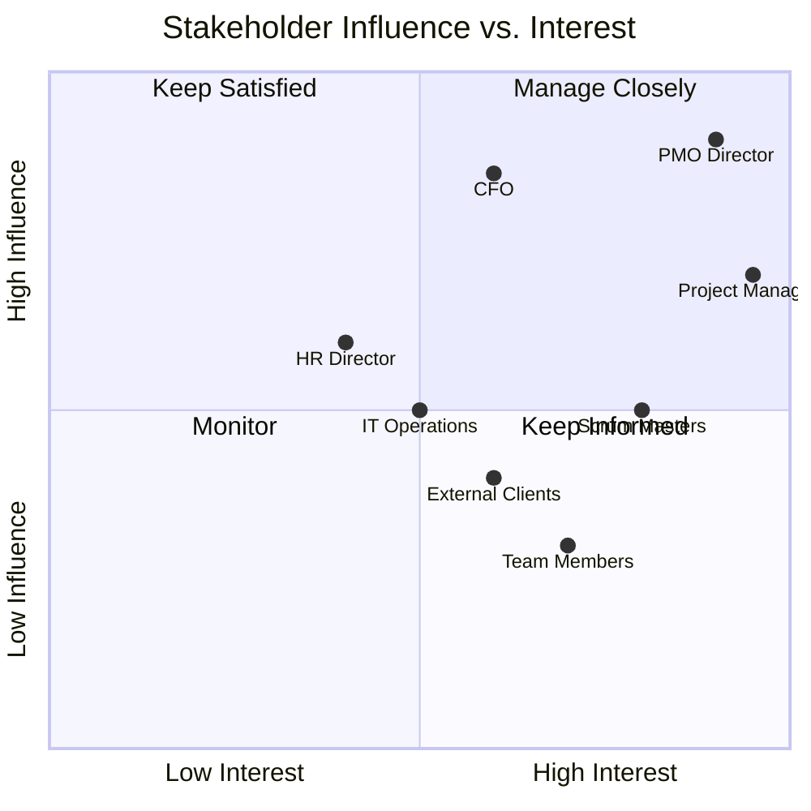
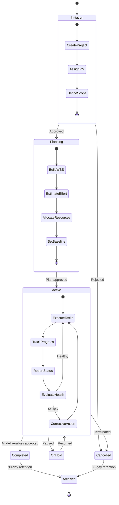
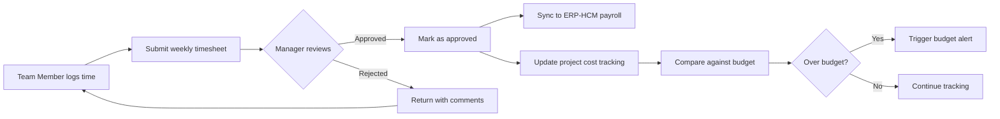
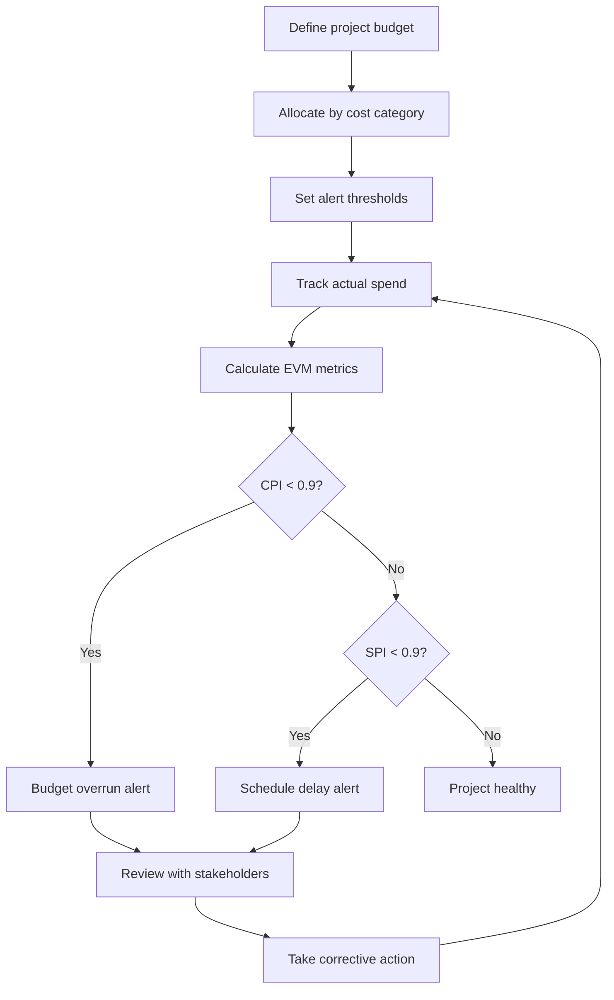
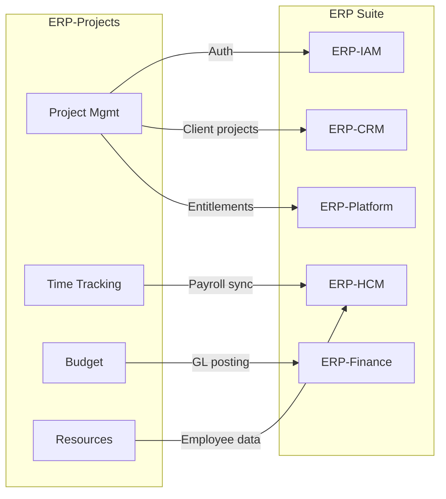

# ERP-Projects -- Business Requirements Document (BRD)

## Document Control

| Field         | Value                                          |
|---------------|------------------------------------------------|
| Module        | ERP-Projects (Project Management Platform)     |
| Version       | 1.0                                            |
| Date          | 2026-02-23                                     |
| Status        | Approved                                       |

---

## 1. Business Objectives

### 1.1 Strategic Goals

ERP-Projects addresses the critical enterprise need for a unified project management platform that eliminates tool fragmentation, reduces project failure rates, and provides executive-level portfolio visibility. The business case is built on five strategic pillars:

1. **Consolidation of PM Tools** -- Replace 3-5 disparate tools (spreadsheets, standalone PM apps, agile boards) with a single integrated platform
2. **Improved Project Success Rates** -- Enable data-driven decision making through EVM, AI insights, and real-time health scoring
3. **Resource Optimization** -- Reduce bench time and over-allocation through capacity planning and skill-based assignment
4. **Financial Control** -- Link project execution to financial outcomes via integrated time tracking, budget management, and billing
5. **Suite Synergy** -- Drive adoption of the broader ERP ecosystem by integrating PM with HCM, Finance, and CRM

### 1.2 Business Problem Statement

Organizations managing complex projects face these interconnected challenges:

```mermaid
fishbone
    title("Project Management Challenges")
    category("Tool Fragmentation")
        cause("Multiple disconnected tools")
        cause("Data silos between PM and finance")
        cause("No single source of truth")
    category("Visibility Gaps")
        cause("Delayed status reporting")
        cause("No portfolio-level view")
        cause("Manual health assessments")
    category("Resource Waste")
        cause("Over-allocation undetected")
        cause("No skill matching")
        cause("Bench time invisible")
    category("Budget Overruns")
        cause("No real-time spend tracking")
        cause("Manual time entry")
        cause("Late variance detection")
```

### 1.3 Expected Business Outcomes

| Outcome                              | Metric                    | Target        |
|---------------------------------------|---------------------------|---------------|
| Reduced project failure rate          | % projects on-time        | +25%          |
| Tool consolidation savings            | Annual license cost       | -40%          |
| Resource utilization improvement      | Avg utilization %         | 75-85%        |
| Budget variance reduction             | Avg cost variance         | -30%          |
| Status reporting time savings         | Hours/week per PM         | -60%          |
| Decision-making speed                 | Time to corrective action | -50%          |

---

## 2. Stakeholder Analysis

### 2.1 Stakeholder Map



### 2.2 Stakeholder Requirements

| Stakeholder       | Business Need                                  | Success Criteria                           |
|--------------------|------------------------------------------------|--------------------------------------------|
| PMO Director       | Portfolio visibility across all projects       | Single dashboard with health/budget/schedule |
| CFO                | Financial control over project spending        | Real-time budget vs actual, EVM metrics    |
| Project Manager    | Efficient project planning and execution       | Gantt, CPM, resource allocation in one tool |
| Scrum Master       | Agile ceremony support                         | Sprint board, velocity, burndown           |
| Team Member        | Easy task management and time logging          | < 5 minutes daily for time entry + tasks   |
| HR Director        | Accurate timesheet data for payroll            | Approved timesheets synced to ERP-HCM      |
| IT Operations      | Reliable, scalable, maintainable system        | 99.95% uptime, < 200ms P95 API latency    |
| External Client    | Project progress visibility                    | Status reports, milestone tracking         |

---

## 3. Business Process Flows

### 3.1 Project Lifecycle Process



### 3.2 Timesheet Approval Process



### 3.3 Budget Management Process



---

## 4. Business Rules

### 4.1 Project Rules

| ID    | Rule                                                              |
|-------|-------------------------------------------------------------------|
| BR-01 | A project must have an assigned owner before moving to Active     |
| BR-02 | Project status transitions follow the defined state machine       |
| BR-03 | Projects with budget utilization > 90% trigger an alert           |
| BR-04 | Health score recalculates on any task/budget/schedule change      |
| BR-05 | Completed projects auto-archive after 90 days                     |

### 4.2 Task Rules

| ID    | Rule                                                              |
|-------|-------------------------------------------------------------------|
| BR-10 | A task cannot be marked Done if it has open blockers              |
| BR-11 | Dependent tasks cannot start before their predecessor constraints |
| BR-12 | Tasks with 0 estimated hours generate a planning warning         |
| BR-13 | Overdue tasks auto-escalate priority after 3 days                |

### 4.3 Resource Rules

| ID    | Rule                                                              |
|-------|-------------------------------------------------------------------|
| BR-20 | Total allocation per person cannot exceed 100% without override  |
| BR-21 | Resource allocation requires date range within project dates     |
| BR-22 | Hourly rate changes do not retroactively affect past entries     |

### 4.4 Time Tracking Rules

| ID    | Rule                                                              |
|-------|-------------------------------------------------------------------|
| BR-30 | Time entries must be linked to a project                         |
| BR-31 | Billed time entries cannot be modified without finance approval  |
| BR-32 | Maximum 24 hours per person per day across all projects          |
| BR-33 | Timesheets must be submitted by end of each work week            |

---

## 5. Revenue Model

### 5.1 Pricing Tiers

| Tier         | Target                | Price/user/month | Key Features                          |
|--------------|------------------------|------------------|---------------------------------------|
| Starter      | Small teams (< 10)     | $8               | Tasks, Kanban, basic time tracking    |
| Professional | Mid-size (10-100)      | $16              | + Gantt, dependencies, budgets        |
| Business     | Large orgs (100-500)   | $24              | + Portfolio, EVM, resource planning   |
| Enterprise   | Enterprise (500+)      | Custom           | + AI insights, SSO, dedicated support |

### 5.2 Revenue Projections

| Metric                  | Year 1    | Year 2    | Year 3    |
|-------------------------|-----------|-----------|-----------|
| Active paying users     | 5,000     | 25,000    | 100,000   |
| ARPU (monthly)          | $14       | $16       | $18       |
| Monthly recurring revenue| $70K     | $400K     | $1.8M     |
| Annual recurring revenue | $840K    | $4.8M     | $21.6M    |

---

## 6. Compliance and Regulatory Requirements

| Requirement                 | Description                                              |
|-----------------------------|----------------------------------------------------------|
| Data Residency              | Project data stored in region of tenant's choosing       |
| GDPR                        | Right to erasure for project member data                 |
| SOC 2 Type II               | Annual audit for security controls                       |
| Audit Trail                 | All CRUD operations logged with timestamp and user       |
| Data Retention              | Configurable retention policies per tenant               |
| Access Control              | Role-based access with field-level permissions           |

---

## 7. Integration Requirements



| Integration       | Direction  | Data Exchanged                          | Frequency  |
|--------------------|-----------|----------------------------------------|------------|
| ERP-IAM            | Inbound   | JWT tokens, user identity, RBAC       | Real-time  |
| ERP-Platform       | Inbound   | Entitlements, feature flags            | Real-time  |
| ERP-HCM            | Bidirectional | Employee data, approved timesheets  | Daily      |
| ERP-Finance        | Outbound  | Project costs, budget actuals          | Real-time  |
| ERP-CRM            | Bidirectional | Client info, project linkage        | On-demand  |

---

## 8. Acceptance Criteria

### 8.1 Go-Live Criteria

- [ ] All P0 requirements implemented and tested
- [ ] 99.95% uptime demonstrated over 30-day staging period
- [ ] P95 API latency < 200ms under load (10K concurrent users)
- [ ] Security audit passed with no critical findings
- [ ] ERP-IAM SSO integration verified
- [ ] Data migration tooling validated with 3 pilot tenants
- [ ] User documentation and training materials complete
- [ ] Disaster recovery procedure tested (RPO < 1 hour, RTO < 4 hours)
