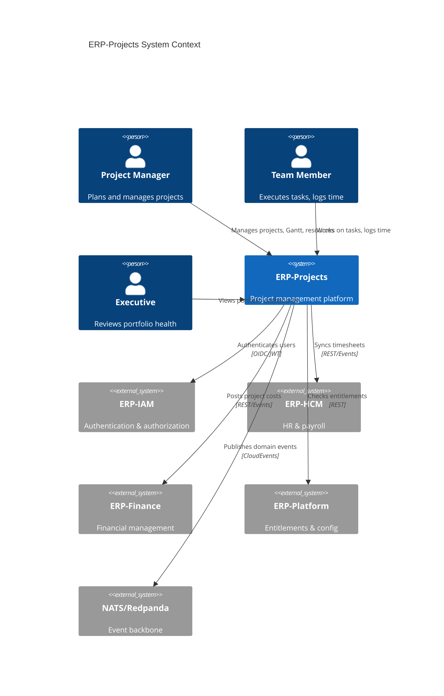
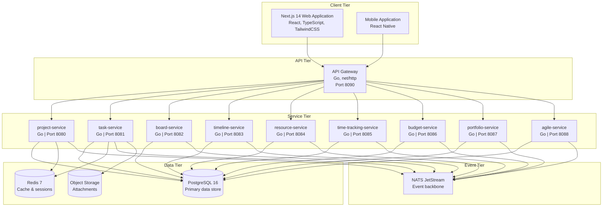
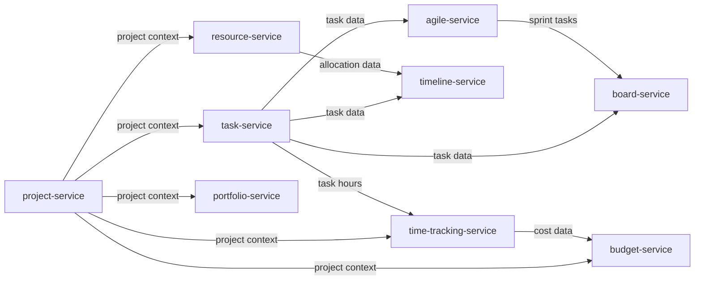
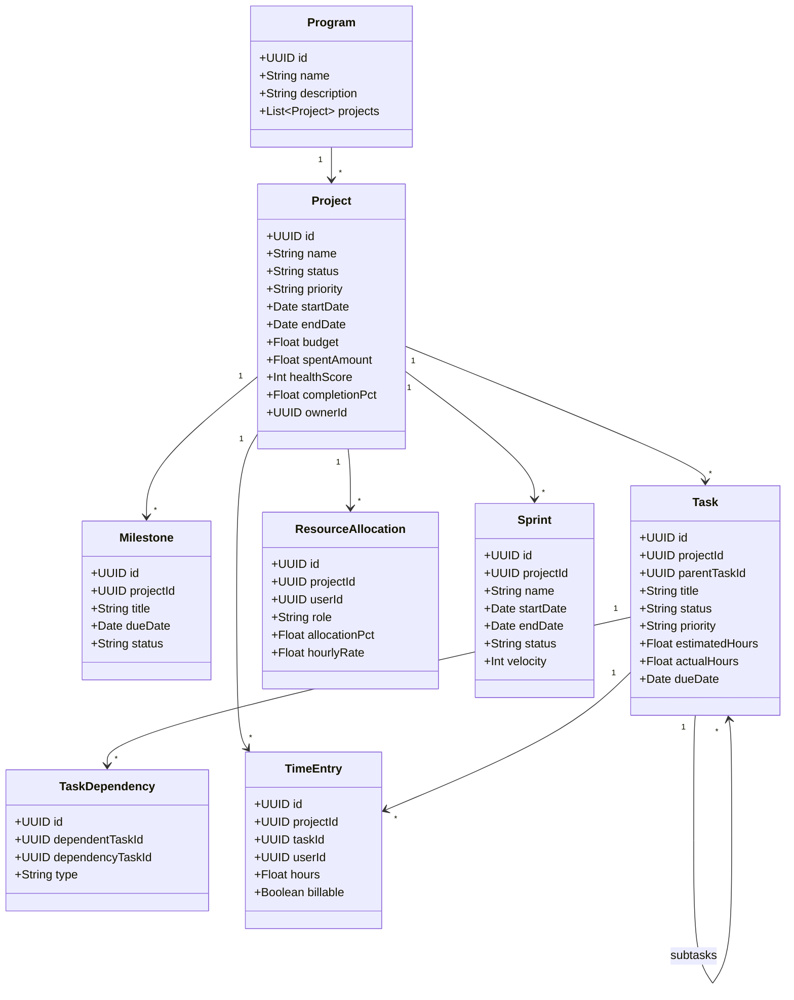
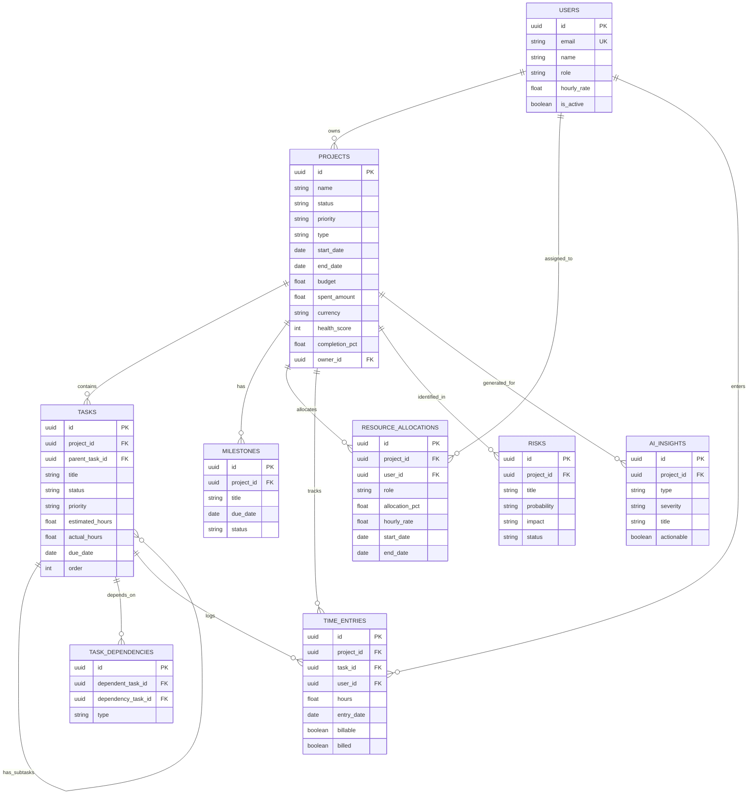
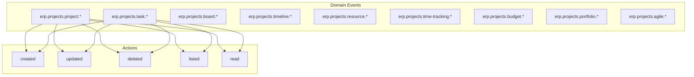
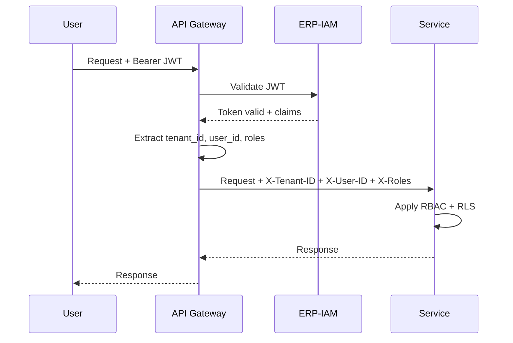
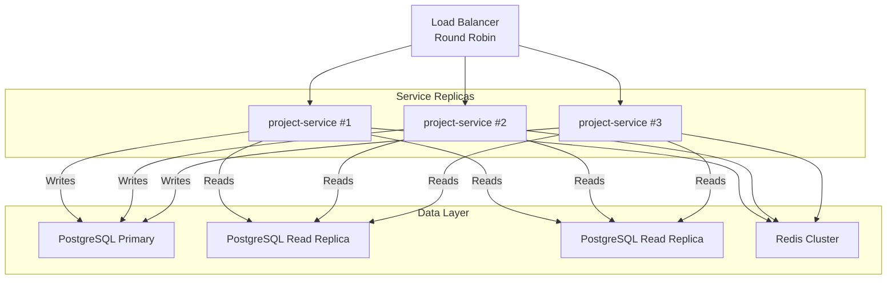

# ERP-Projects -- Architecture Design Document

## Document Control

| Field         | Value                                          |
|---------------|------------------------------------------------|
| Module        | ERP-Projects                                   |
| Version       | 1.0                                            |
| Date          | 2026-02-23                                     |
| Status        | Active                                         |

---

## 1. Architecture Overview

ERP-Projects follows a **domain-driven microservices architecture** with nine bounded contexts, each implemented as an independent Go service. The services communicate via a REST API gateway for synchronous operations and NATS/Redpanda for asynchronous event propagation. PostgreSQL serves as the primary data store with Redis providing caching and session management.

### 1.1 C4 Context Diagram



### 1.2 Container Diagram



---

## 2. Service Architecture

### 2.1 Service Inventory

| Service               | Domain                        | Base Path         | Port  | Database Schema     |
|------------------------|-------------------------------|-------------------|-------|---------------------|
| project-service        | Project lifecycle management  | `/v1/project`     | 8080  | `projects`          |
| task-service           | Task CRUD and dependencies    | `/v1/task`        | 8081  | `tasks`             |
| board-service          | Board views and layouts       | `/v1/board`       | 8082  | `boards`            |
| timeline-service       | Gantt and timeline data       | `/v1/timeline`    | 8083  | `timelines`         |
| resource-service       | Resource allocation           | `/v1/resource`    | 8084  | `resources`         |
| time-tracking-service  | Time entries and timesheets   | `/v1/time-tracking`| 8085 | `time_tracking`     |
| budget-service         | Budget and EVM                | `/v1/budget`      | 8086  | `budgets`           |
| portfolio-service      | Portfolio governance          | `/v1/portfolio`   | 8087  | `portfolios`        |
| agile-service          | Sprints and agile artifacts   | `/v1/agile`       | 8088  | `agile`             |

### 2.2 Service Interaction Matrix



### 2.3 Domain Model



---

## 3. Data Architecture

### 3.1 Database Design



### 3.2 Partitioning Strategy

| Table               | Partition Key    | Strategy           | Reason                          |
|---------------------|------------------|--------------------|---------------------------------|
| projects            | tenant_id        | Hash               | Multi-tenant isolation          |
| tasks               | project_id       | Hash               | Co-locate with project          |
| time_entries        | entry_date       | Range (monthly)    | Time-series query patterns      |
| activity_logs       | created_at       | Range (monthly)    | Append-only, time-based queries |

### 3.3 Indexing Strategy

| Table               | Index                              | Type      | Purpose                        |
|---------------------|------------------------------------|-----------|---------------------------------|
| projects            | idx_projects_owner_status          | B-tree    | Owner's project dashboard      |
| tasks               | idx_tasks_project_status           | B-tree    | Task listing by project        |
| tasks               | idx_tasks_assignee                 | B-tree    | My tasks query                 |
| tasks               | idx_tasks_due_date                 | B-tree    | Overdue detection              |
| time_entries        | idx_time_user_date                 | B-tree    | Timesheet queries              |
| resource_allocations| idx_res_user_dates                 | B-tree    | Availability calendar          |
| task_dependencies   | idx_deps_dependent                 | B-tree    | Dependency chain traversal     |

---

## 4. API Architecture

### 4.1 API Design Principles

- RESTful with JSON payloads
- Versioned via URL path (`/v1/`)
- Tenant-scoped via `X-Tenant-ID` header
- JWT authentication via `Authorization: Bearer <token>` header
- Pagination via `?page=1&per_page=50`
- Filtering via query parameters
- Sorting via `?sort=field&order=asc|desc`
- Standard error envelope: `{ "error": { "code": "ERR_CODE", "message": "..." } }`

### 4.2 Core API Routes

```
# Project Management
GET    /v1/project                      # List projects (paginated, filtered)
POST   /v1/project                      # Create project
GET    /v1/project/:id                   # Get project details
PUT    /v1/project/:id                   # Update project
DELETE /v1/project/:id                   # Delete project
GET    /v1/project/:id/health            # Get project health score
POST   /v1/project/:id/archive           # Archive project

# Task Management
GET    /v1/task                          # List tasks (filtered)
POST   /v1/task                          # Create task
GET    /v1/task/:id                      # Get task details
PUT    /v1/task/:id                      # Update task
DELETE /v1/task/:id                      # Delete task
POST   /v1/task/:id/assign               # Assign user to task
POST   /v1/task/:id/dependencies         # Add dependency
POST   /v1/task/bulk                     # Bulk operations

# Board Views
GET    /v1/board/:projectId              # Get board layout
PUT    /v1/board/:projectId/layout        # Update board layout
POST   /v1/board/:projectId/columns       # Add column
PUT    /v1/board/:projectId/card/:taskId  # Move card

# Timeline / Gantt
GET    /v1/timeline/:projectId           # Get timeline data
POST   /v1/timeline/:projectId/baseline   # Save baseline
GET    /v1/timeline/:projectId/critical-path  # Get critical path
POST   /v1/timeline/:projectId/auto-schedule  # Auto-schedule

# Resource Management
GET    /v1/resource/allocations           # List allocations
POST   /v1/resource/allocations           # Create allocation
GET    /v1/resource/availability/:userId  # Get user availability
GET    /v1/resource/workload              # Get workload summary
GET    /v1/resource/capacity              # Capacity planning view

# Time Tracking
GET    /v1/time-tracking/entries          # List time entries
POST   /v1/time-tracking/entries          # Create time entry
POST   /v1/time-tracking/timer/start      # Start timer
POST   /v1/time-tracking/timer/stop       # Stop timer
GET    /v1/time-tracking/timesheet/:userId # Get user timesheet
POST   /v1/time-tracking/timesheet/submit  # Submit timesheet
POST   /v1/time-tracking/timesheet/approve # Approve timesheet

# Budget Management
GET    /v1/budget/:projectId             # Get project budget
PUT    /v1/budget/:projectId             # Update budget
GET    /v1/budget/:projectId/evm          # Get EVM metrics
GET    /v1/budget/:projectId/forecast     # Get budget forecast

# Portfolio Management
GET    /v1/portfolio                      # List portfolios
POST   /v1/portfolio                      # Create portfolio
GET    /v1/portfolio/:id/dashboard        # Portfolio dashboard
GET    /v1/portfolio/:id/scoring          # Strategic alignment scores
POST   /v1/portfolio/:id/what-if          # What-if scenario

# Agile Management
POST   /v1/agile/sprint                   # Create sprint
GET    /v1/agile/sprint/:id               # Get sprint details
POST   /v1/agile/sprint/:id/start         # Start sprint
POST   /v1/agile/sprint/:id/complete      # Complete sprint
GET    /v1/agile/backlog/:projectId       # Get product backlog
GET    /v1/agile/velocity/:projectId      # Get velocity chart data
GET    /v1/agile/burndown/:sprintId       # Get burndown data
POST   /v1/agile/retrospective            # Create retrospective
```

---

## 5. Event Architecture

### 5.1 Event Catalog



### 5.2 CloudEvents Envelope

```json
{
  "specversion": "1.0",
  "type": "erp.projects.task.created",
  "source": "/erp-projects/task-service",
  "id": "a1b2c3d4-e5f6-7890-abcd-ef1234567890",
  "time": "2026-02-23T10:00:00Z",
  "datacontenttype": "application/json",
  "tenantid": "tenant-uuid",
  "data": {
    "id": "task-uuid",
    "projectId": "project-uuid",
    "title": "Design database schema",
    "status": "TODO",
    "priority": "HIGH"
  }
}
```

---

## 6. Security Architecture

### 6.1 Authentication Flow



### 6.2 Role-Based Access Control

| Role          | Projects | Tasks | Resources | Budget | Portfolio | Time Tracking |
|---------------|----------|-------|-----------|--------|-----------|---------------|
| ADMIN         | CRUD     | CRUD  | CRUD      | CRUD   | CRUD      | CRUD          |
| MANAGER       | CRUD     | CRUD  | Read/Assign| Read  | Read      | CRUD + Approve|
| MEMBER        | Read     | CRU   | Read      | Read   | Read      | CRU (own)     |
| VIEWER        | Read     | Read  | Read      | Read   | Read      | Read          |

---

## 7. Scalability Design

### 7.1 Horizontal Scaling Strategy



### 7.2 Caching Strategy

| Data              | Cache Layer | TTL     | Invalidation              |
|-------------------|-------------|---------|---------------------------|
| Project metadata  | Redis       | 5 min   | On update event           |
| Task lists        | Redis       | 1 min   | On task CRUD event        |
| Board layouts     | Redis       | 10 min  | On layout update          |
| Timeline data     | Redis       | 2 min   | On task/dependency change |
| Resource calendar | Redis       | 5 min   | On allocation change      |
| EVM metrics       | Redis       | 15 min  | On budget/time entry      |
| Portfolio dashboard| Redis      | 5 min   | On project health change  |

---

## 8. Observability

### 8.1 Monitoring Stack

| Component          | Tool                  | Purpose                          |
|--------------------|-----------------------|----------------------------------|
| Metrics            | Prometheus            | Service metrics, SLIs            |
| Tracing            | OpenTelemetry + Jaeger| Distributed request tracing      |
| Logging            | Structured JSON logs  | Application event logging        |
| Dashboards         | Grafana               | Visualization and alerting       |
| Health Checks      | `/healthz` endpoints  | Service liveness probes          |

### 8.2 Key SLIs

| SLI                        | Target    | Alert Threshold |
|----------------------------|-----------|-----------------|
| Request latency P95        | < 200ms   | > 500ms         |
| Request latency P99        | < 500ms   | > 1s            |
| Error rate                 | < 0.1%    | > 1%            |
| Availability               | 99.95%    | < 99.9%         |
| Gantt render time          | < 500ms   | > 1s            |
| Event processing latency  | < 100ms   | > 500ms         |
