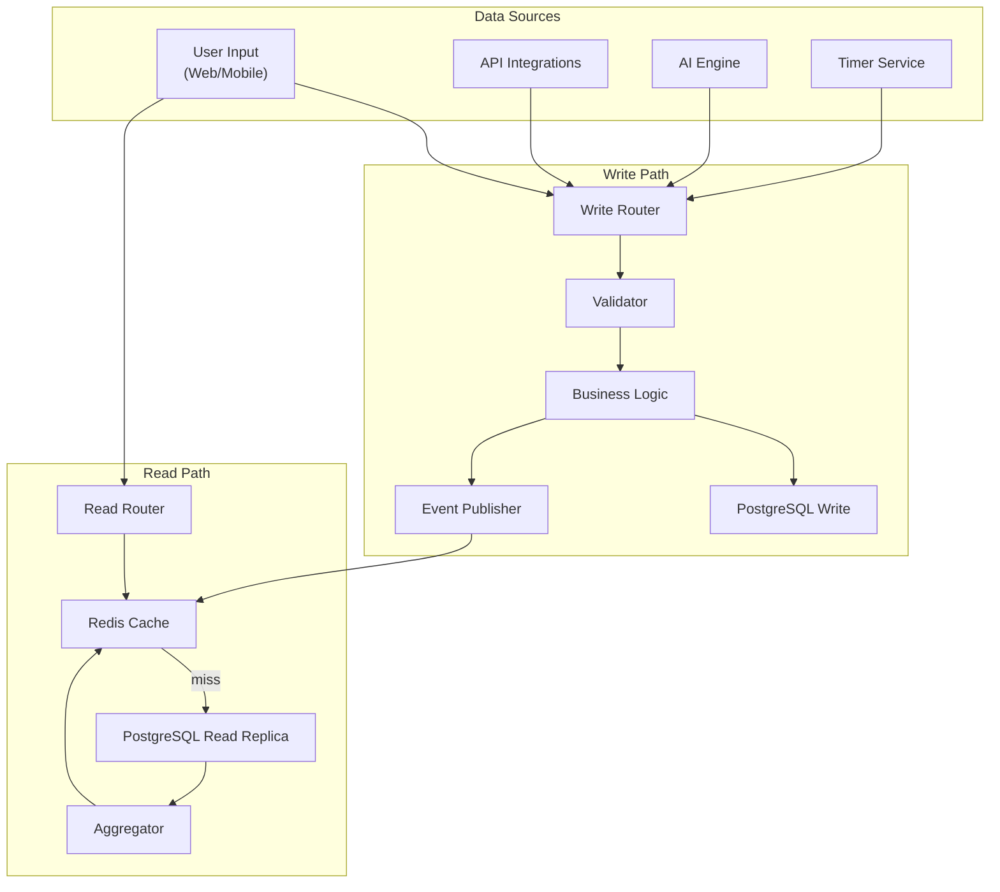

# ERP-Projects -- Data Model Document

## Document Control

| Field         | Value                                          |
|---------------|------------------------------------------------|
| Module        | ERP-Projects                                   |
| Version       | 1.0                                            |
| Date          | 2026-02-23                                     |
| Status        | Active                                         |

---

## 1. Overview

The ERP-Projects data model is designed around a **five-level work hierarchy** (Program > Project > Milestone > Task > Subtask) with supporting entities for resource management, time tracking, budgeting, agile ceremonies, and AI-driven insights. The model supports multi-tenant isolation through a `tenant_id` column on all business tables, with PostgreSQL Row-Level Security (RLS) policies enforcing data boundaries.

---

## 2. Entity-Relationship Diagram

```mermaid
erDiagram
    TENANTS ||--o{ PROGRAMS : contains
    TENANTS ||--o{ USERS : has
    PROGRAMS ||--o{ PROJECTS : groups
    USERS ||--o{ PROJECTS : owns
    PROJECTS ||--o{ MILESTONES : has
    PROJECTS ||--o{ TASKS : contains
    PROJECTS ||--o{ RESOURCE_ALLOCATIONS : allocates
    PROJECTS ||--o{ TIME_ENTRIES : tracks
    PROJECTS ||--o{ INVOICES : bills
    PROJECTS ||--o{ RISKS : identifies
    PROJECTS ||--o{ AI_INSIGHTS : generates
    PROJECTS ||--o{ SPRINTS : manages
    PROJECTS ||--o{ COMMENTS : has
    PROJECTS ||--o{ ACTIVITY_LOGS : records
    TASKS ||--o{ TASKS : has_subtasks
    TASKS ||--o{ TASK_ASSIGNMENTS : assigned_to
    TASKS ||--o{ TASK_DEPENDENCIES : depends_on
    TASKS ||--o{ TIME_ENTRIES : logs
    TASKS ||--o{ COMMENTS : discusses
    TASKS ||--o{ TASK_CHECKLISTS : includes
    TASKS ||--o{ TASK_ATTACHMENTS : attaches
    USERS ||--o{ TASK_ASSIGNMENTS : receives
    USERS ||--o{ RESOURCE_ALLOCATIONS : allocated
    USERS ||--o{ TIME_ENTRIES : enters
    USERS ||--o{ COMMENTS : writes
    USERS ||--o{ NOTIFICATIONS : receives
    INVOICES ||--o{ INVOICE_LINE_ITEMS : contains
    INVOICES ||--o{ TIME_ENTRIES : covers
    SPRINTS ||--o{ SPRINT_TASKS : includes
    SPRINTS ||--o{ RETROSPECTIVES : reviews

    TENANTS {
        uuid id PK
        string name
        string plan_tier
        jsonb settings
        timestamp created_at
    }

    PROGRAMS {
        uuid id PK
        uuid tenant_id FK
        string name
        string description
        string status
        uuid owner_id FK
        timestamp created_at
    }

    USERS {
        uuid id PK
        uuid tenant_id FK
        string email UK
        string password_hash
        string name
        string role
        string avatar_url
        string department
        float hourly_rate
        boolean is_active
        jsonb skills
        timestamp created_at
        timestamp updated_at
    }

    PROJECTS {
        uuid id PK
        uuid tenant_id FK
        uuid program_id FK
        string name
        text description
        string client_name
        string client_email
        string status
        string priority
        string type
        date start_date
        date end_date
        date actual_end_date
        decimal budget
        decimal spent_amount
        string currency
        int health_score
        string health_status
        float completion_pct
        uuid owner_id FK
        string tags
        jsonb custom_fields
        timestamp created_at
        timestamp updated_at
    }

    MILESTONES {
        uuid id PK
        uuid tenant_id FK
        uuid project_id FK
        string title
        text description
        date due_date
        date completed_at
        string status
        int sort_order
        timestamp created_at
        timestamp updated_at
    }

    TASKS {
        uuid id PK
        uuid tenant_id FK
        uuid project_id FK
        uuid parent_task_id FK
        uuid sprint_id FK
        uuid epic_id FK
        string title
        text description
        string status
        string priority
        float estimated_hours
        float actual_hours
        int story_points
        date start_date
        date due_date
        date completed_at
        int sort_order
        string tags
        jsonb custom_fields
        boolean is_recurring
        string recurrence_rule
        timestamp created_at
        timestamp updated_at
    }

    TASK_ASSIGNMENTS {
        uuid id PK
        uuid task_id FK
        uuid user_id FK
        string role
        timestamp created_at
    }

    TASK_DEPENDENCIES {
        uuid id PK
        uuid dependent_task_id FK
        uuid dependency_task_id FK
        string type
        int lag_days
    }

    TASK_CHECKLISTS {
        uuid id PK
        uuid task_id FK
        string title
        boolean is_completed
        int sort_order
        timestamp created_at
    }

    TASK_ATTACHMENTS {
        uuid id PK
        uuid task_id FK
        uuid uploaded_by FK
        string file_name
        string file_url
        string mime_type
        bigint file_size
        timestamp created_at
    }

    RESOURCE_ALLOCATIONS {
        uuid id PK
        uuid tenant_id FK
        uuid project_id FK
        uuid user_id FK
        string role
        float allocation_pct
        date start_date
        date end_date
        decimal hourly_rate
        timestamp created_at
        timestamp updated_at
    }

    TIME_ENTRIES {
        uuid id PK
        uuid tenant_id FK
        uuid project_id FK
        uuid task_id FK
        uuid user_id FK
        text description
        float hours
        date entry_date
        boolean billable
        boolean billed
        uuid invoice_id FK
        string approval_status
        uuid approved_by FK
        timestamp created_at
        timestamp updated_at
    }

    INVOICES {
        uuid id PK
        uuid tenant_id FK
        uuid project_id FK
        string invoice_number UK
        string status
        date issue_date
        date due_date
        decimal subtotal
        float tax_rate
        decimal tax_amount
        decimal total_amount
        decimal paid_amount
        date paid_at
        text notes
        timestamp created_at
        timestamp updated_at
    }

    INVOICE_LINE_ITEMS {
        uuid id PK
        uuid invoice_id FK
        text description
        float quantity
        decimal unit_price
        decimal amount
    }

    RISKS {
        uuid id PK
        uuid tenant_id FK
        uuid project_id FK
        string title
        text description
        string probability
        string impact
        string status
        text mitigation
        boolean ai_generated
        timestamp created_at
        timestamp updated_at
    }

    AI_INSIGHTS {
        uuid id PK
        uuid tenant_id FK
        uuid project_id FK
        string type
        string severity
        string title
        text description
        boolean actionable
        boolean dismissed
        jsonb metadata
        timestamp created_at
    }

    SPRINTS {
        uuid id PK
        uuid tenant_id FK
        uuid project_id FK
        string name
        string goal
        date start_date
        date end_date
        string status
        int planned_points
        int completed_points
        int velocity
        timestamp created_at
        timestamp updated_at
    }

    SPRINT_TASKS {
        uuid id PK
        uuid sprint_id FK
        uuid task_id FK
        int story_points
        string status
    }

    RETROSPECTIVES {
        uuid id PK
        uuid tenant_id FK
        uuid sprint_id FK
        jsonb went_well
        jsonb to_improve
        jsonb action_items
        timestamp created_at
    }

    EPICS {
        uuid id PK
        uuid tenant_id FK
        uuid project_id FK
        string title
        text description
        string status
        string priority
        int sort_order
        timestamp created_at
        timestamp updated_at
    }

    COMMENTS {
        uuid id PK
        uuid tenant_id FK
        uuid project_id FK
        uuid task_id FK
        uuid user_id FK
        text content
        jsonb mentions
        timestamp created_at
        timestamp updated_at
    }

    ACTIVITY_LOGS {
        uuid id PK
        uuid tenant_id FK
        uuid project_id FK
        uuid user_id FK
        string action
        string entity_type
        uuid entity_id
        jsonb details
        timestamp created_at
    }

    NOTIFICATIONS {
        uuid id PK
        uuid tenant_id FK
        uuid user_id FK
        string type
        string title
        text message
        boolean read
        string link
        timestamp created_at
    }

    BOARDS {
        uuid id PK
        uuid tenant_id FK
        uuid project_id FK
        string name
        string type
        jsonb columns
        jsonb swimlane_config
        jsonb wip_limits
        timestamp created_at
        timestamp updated_at
    }

    BASELINES {
        uuid id PK
        uuid tenant_id FK
        uuid project_id FK
        string name
        jsonb snapshot
        timestamp created_at
    }

    BUDGET_CATEGORIES {
        uuid id PK
        uuid tenant_id FK
        uuid project_id FK
        string name
        decimal planned_amount
        decimal actual_amount
        timestamp created_at
    }

    PORTFOLIOS {
        uuid id PK
        uuid tenant_id FK
        string name
        text description
        uuid owner_id FK
        jsonb scoring_criteria
        timestamp created_at
        timestamp updated_at
    }

    PORTFOLIO_PROJECTS {
        uuid id PK
        uuid portfolio_id FK
        uuid project_id FK
        float strategic_score
        int priority_rank
    }
```



---

## 3. Table Details

### 3.1 Projects Table

| Column          | Type         | Constraints          | Description                         |
|-----------------|--------------|----------------------|-------------------------------------|
| id              | UUID         | PK, DEFAULT uuid_v4 | Unique project identifier           |
| tenant_id       | UUID         | FK, NOT NULL, INDEX  | Multi-tenant isolation              |
| program_id      | UUID         | FK, NULLABLE         | Parent program reference            |
| name            | VARCHAR(255) | NOT NULL             | Project name                        |
| description     | TEXT         | NULLABLE             | Project description                 |
| client_name     | VARCHAR(255) | NOT NULL             | Client or customer name             |
| client_email    | VARCHAR(255) | NULLABLE             | Client contact email                |
| status          | VARCHAR(20)  | NOT NULL, DEFAULT 'PLANNING' | Project status              |
| priority        | VARCHAR(10)  | NOT NULL, DEFAULT 'MEDIUM'   | Priority level              |
| type            | VARCHAR(20)  | NOT NULL, DEFAULT 'CONSULTING'| Project type               |
| start_date      | DATE         | NOT NULL             | Planned start date                  |
| end_date        | DATE         | NOT NULL             | Planned end date                    |
| actual_end_date | DATE         | NULLABLE             | Actual completion date              |
| budget          | DECIMAL(15,2)| NOT NULL             | Total budget amount                 |
| spent_amount    | DECIMAL(15,2)| DEFAULT 0            | Cumulative spend                    |
| currency        | VARCHAR(3)   | DEFAULT 'USD'        | ISO 4217 currency code              |
| health_score    | INTEGER      | DEFAULT 100, CHECK(0-100) | Computed health score          |
| health_status   | VARCHAR(10)  | DEFAULT 'EXCELLENT'  | Health category                     |
| completion_pct  | FLOAT        | DEFAULT 0            | Completion percentage               |
| owner_id        | UUID         | FK, NOT NULL         | Project owner                       |
| tags            | TEXT         | DEFAULT ''           | Comma-separated tags                |
| custom_fields   | JSONB        | DEFAULT '{}'         | Extensible custom fields            |

### 3.2 Tasks Table

| Column          | Type         | Constraints          | Description                         |
|-----------------|--------------|----------------------|-------------------------------------|
| id              | UUID         | PK, DEFAULT uuid_v4 | Unique task identifier              |
| tenant_id       | UUID         | FK, NOT NULL, INDEX  | Multi-tenant isolation              |
| project_id      | UUID         | FK, NOT NULL         | Parent project                      |
| parent_task_id  | UUID         | FK, NULLABLE         | Parent task (for subtasks)          |
| sprint_id       | UUID         | FK, NULLABLE         | Associated sprint                   |
| epic_id         | UUID         | FK, NULLABLE         | Associated epic                     |
| title           | VARCHAR(500) | NOT NULL             | Task title                          |
| description     | TEXT         | NULLABLE             | Task description (markdown)         |
| status          | VARCHAR(20)  | NOT NULL, DEFAULT 'TODO' | Task status                    |
| priority        | VARCHAR(10)  | NOT NULL, DEFAULT 'MEDIUM' | Priority level              |
| estimated_hours | FLOAT        | DEFAULT 0            | Estimated effort                    |
| actual_hours    | FLOAT        | DEFAULT 0            | Actual effort (from time entries)   |
| story_points    | INTEGER      | NULLABLE             | Agile story points                  |
| start_date      | DATE         | NULLABLE             | Task start date                     |
| due_date        | DATE         | NULLABLE             | Task due date                       |
| completed_at    | TIMESTAMP    | NULLABLE             | Completion timestamp                |
| sort_order      | INTEGER      | DEFAULT 0            | Display ordering                    |
| tags            | TEXT         | DEFAULT ''           | Comma-separated tags                |
| is_recurring    | BOOLEAN      | DEFAULT false        | Whether task recurs                 |
| recurrence_rule | VARCHAR(100) | NULLABLE             | RRULE expression                    |

### 3.3 Dependency Types

| Type             | Code | Description                                         |
|------------------|------|-----------------------------------------------------|
| Finish-to-Start  | FS   | Successor starts after predecessor finishes         |
| Start-to-Start   | SS   | Successor starts when predecessor starts            |
| Finish-to-Finish | FF   | Successor finishes when predecessor finishes        |
| Start-to-Finish  | SF   | Successor finishes when predecessor starts          |

---

## 4. Data Flow Diagram



---

## 5. Migration Strategy

### 5.1 Migration Naming Convention

```
YYYYMMDDHHMMSS_description.up.sql
YYYYMMDDHHMMSS_description.down.sql
```

### 5.2 Migration Sequence

| Order | Migration                          | Description                           |
|-------|------------------------------------|---------------------------------------|
| 001   | create_tenants                     | Tenant isolation base table           |
| 002   | create_users                       | User accounts with roles              |
| 003   | create_programs                    | Program hierarchy root                |
| 004   | create_projects                    | Core project table                    |
| 005   | create_milestones                  | Project milestones                    |
| 006   | create_tasks                       | Task management with hierarchy        |
| 007   | create_task_assignments            | Task-user assignments                 |
| 008   | create_task_dependencies           | FS/FF/SS/SF dependencies              |
| 009   | create_task_checklists             | Checklist items within tasks          |
| 010   | create_task_attachments            | File attachments                      |
| 011   | create_resource_allocations        | Resource allocation tracking          |
| 012   | create_time_entries                | Time tracking entries                 |
| 013   | create_invoices                    | Billing and invoicing                 |
| 014   | create_risks                       | Risk register                         |
| 015   | create_ai_insights                 | AI-generated insights                 |
| 016   | create_sprints                     | Sprint management                     |
| 017   | create_epics                       | Epic tracking                         |
| 018   | create_retrospectives              | Sprint retrospectives                 |
| 019   | create_boards                      | Board configurations                  |
| 020   | create_baselines                   | Timeline baselines                    |
| 021   | create_budget_categories           | Budget cost categories                |
| 022   | create_portfolios                  | Portfolio management                  |
| 023   | create_comments                    | Comments and @mentions                |
| 024   | create_activity_logs               | Audit trail                           |
| 025   | create_notifications               | User notifications                    |
| 026   | create_rls_policies                | Row-level security policies           |
| 027   | create_indexes                     | Performance indexes                   |

---

## 6. Data Retention Policies

| Data Category       | Retention Period | Archive Strategy       | Purge Policy           |
|---------------------|------------------|------------------------|------------------------|
| Active projects     | Indefinite       | N/A                    | Manual archive only    |
| Archived projects   | 7 years          | Cold storage after 1yr | Purge after 7 years    |
| Time entries        | 7 years          | Partition by month     | Purge after 7 years    |
| Activity logs       | 3 years          | Partition by month     | Purge after 3 years    |
| Notifications       | 90 days          | N/A                    | Auto-purge             |
| AI insights         | 1 year           | N/A                    | Auto-purge dismissed   |
| Attachments         | Project lifetime | Object storage         | Purge with project     |
