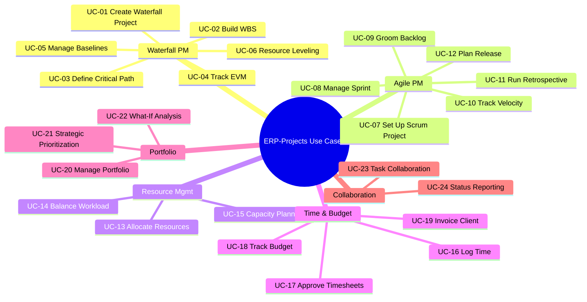
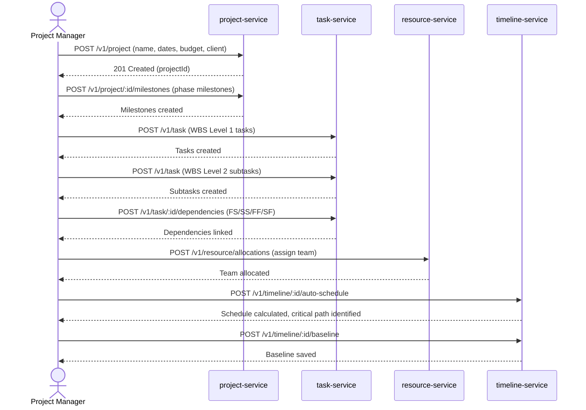
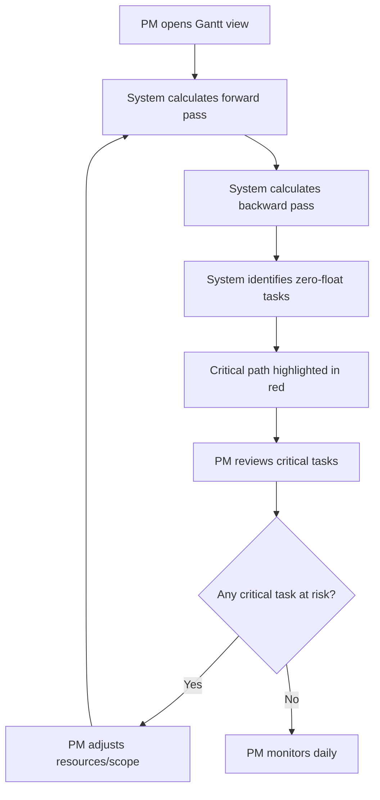
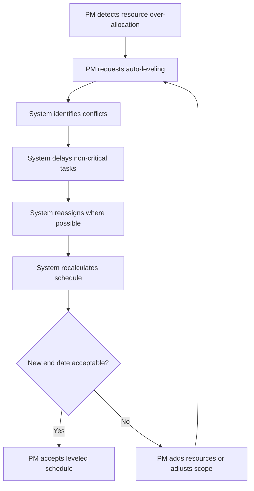
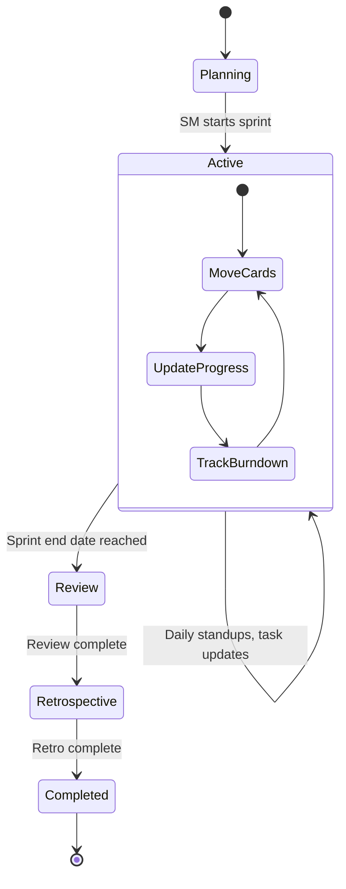
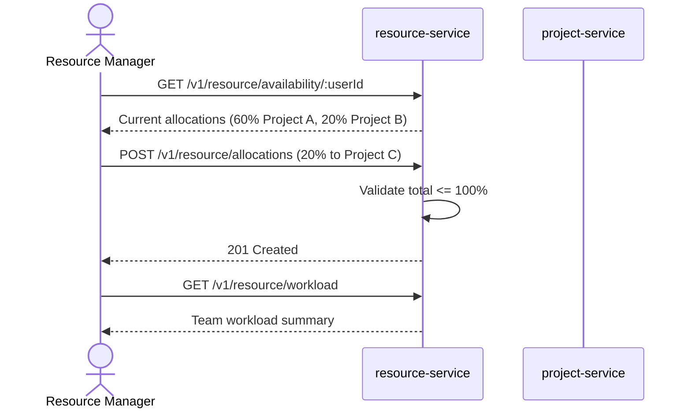
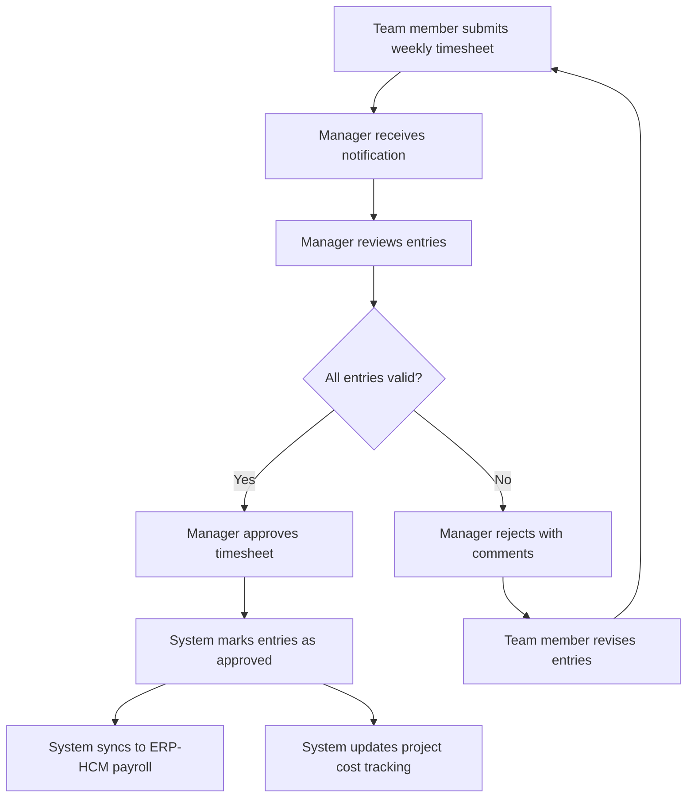

# ERP-Projects -- Use Cases Document

## Document Control

| Field         | Value                                          |
|---------------|------------------------------------------------|
| Module        | ERP-Projects                                   |
| Version       | 1.0                                            |
| Date          | 2026-02-23                                     |
| Use Cases     | 24                                             |

---

## 1. Use Case Map



---

## UC-01: Create a Waterfall Project with WBS

**Actor:** Project Manager
**Preconditions:** User has MANAGER or ADMIN role; project creation entitlement active
**Trigger:** PM initiates new project for a client engagement

### Main Flow



### Postconditions
- Project created with full WBS hierarchy
- Dependencies established across tasks
- Resources allocated to project
- Critical path calculated and baseline saved

---

## UC-02: Build Work Breakdown Structure (WBS)

**Actor:** Project Manager
**Preconditions:** Project exists in PLANNING status

### Main Flow
1. PM navigates to project detail view
2. PM creates top-level deliverable tasks (WBS Level 1)
3. For each deliverable, PM creates work package subtasks (WBS Level 2)
4. For each work package, PM creates activity subtasks (WBS Level 3)
5. PM estimates hours for leaf-level tasks
6. PM assigns dependencies between tasks
7. System calculates roll-up estimates to parent tasks

### Business Rules
- Leaf tasks must have estimated hours > 0
- Parent tasks auto-calculate estimated hours from children sum
- Maximum nesting depth recommendation: 5 levels

---

## UC-03: Define and Monitor Critical Path

**Actor:** Project Manager
**Preconditions:** Project has tasks with dependencies and duration estimates

### Main Flow



### Algorithm
- Forward pass: Calculate Early Start (ES) and Early Finish (EF) for each task
- Backward pass: Calculate Late Start (LS) and Late Finish (LF) for each task
- Float = LS - ES (or LF - EF)
- Critical path = all tasks with float = 0

---

## UC-04: Track Earned Value Management (EVM) Metrics

**Actor:** Finance Controller, Project Manager
**Preconditions:** Project has budget, schedule baseline, and active time entries

### Main Flow
1. PM/Controller navigates to project budget view
2. System calculates PV (Planned Value) from baseline schedule
3. System calculates EV (Earned Value) from task completion percentages
4. System calculates AC (Actual Cost) from time entries x hourly rates
5. System derives: CPI = EV/AC, SPI = EV/PV
6. System calculates EAC = BAC/CPI, ETC = EAC - AC
7. System generates S-curve visualization
8. If CPI < 0.9 or SPI < 0.9, system triggers alert

### EVM Formulas

| Metric | Formula | Interpretation |
|--------|---------|----------------|
| CPI    | EV / AC | > 1.0 = under budget, < 1.0 = over budget |
| SPI    | EV / PV | > 1.0 = ahead of schedule, < 1.0 = behind |
| CV     | EV - AC | Positive = favorable, Negative = unfavorable |
| SV     | EV - PV | Positive = ahead, Negative = behind |
| EAC    | BAC / CPI | Estimated total cost at completion |
| ETC    | EAC - AC | Cost to complete remaining work |
| VAC    | BAC - EAC | Variance at completion |
| TCPI   | (BAC - EV) / (BAC - AC) | Required future CPI to finish on budget |

---

## UC-05: Manage Schedule Baselines

**Actor:** Project Manager
**Preconditions:** Project has tasks with dates

### Main Flow
1. PM finalizes project schedule
2. PM saves baseline (snapshot of all task dates, estimates)
3. System stores baseline with timestamp and name
4. As project progresses, PM views current vs baseline on Gantt
5. Baseline bars appear as gray shadows behind current bars
6. PM identifies schedule slippage visually
7. PM can save new baseline after approved scope changes

---

## UC-06: Resource Leveling

**Actor:** Project Manager
**Preconditions:** Project has resource assignments and tasks with dates

### Main Flow



---

## UC-07: Set Up a Scrum Project

**Actor:** Scrum Master
**Preconditions:** User has project creation permissions

### Main Flow
1. SM creates project with type "DEVELOPMENT"
2. SM configures board as Scrum type with columns: Backlog, To Do, In Progress, In Review, Done
3. SM creates epics for major feature areas
4. SM or PO populates product backlog with user stories
5. PO assigns story points to each item
6. SM creates first sprint with 2-week duration
7. Team pulls items from backlog into sprint during planning
8. SM starts sprint

---

## UC-08: Manage a Sprint Lifecycle

**Actor:** Scrum Master
**Preconditions:** Sprint created with assigned stories

### Main Flow



1. SM starts sprint (status: Active)
2. Team moves cards across board columns daily
3. System updates burndown chart in real-time
4. At sprint end, SM reviews completed vs incomplete stories
5. Incomplete stories return to backlog
6. SM records sprint velocity (completed story points)
7. Team conducts retrospective

---

## UC-09: Groom Product Backlog

**Actor:** Product Owner
**Preconditions:** Project has a product backlog

### Main Flow
1. PO navigates to backlog view (ordered list)
2. PO creates new user stories with acceptance criteria
3. PO assigns story points during refinement session
4. PO drags stories to reorder by priority
5. PO groups stories under epics
6. PO marks stories as "Ready" for sprint planning
7. Stories at top of backlog are pulled into next sprint

---

## UC-10: Track Team Velocity

**Actor:** Scrum Master, Product Owner
**Preconditions:** At least 3 completed sprints

### Main Flow
1. User navigates to velocity chart
2. System displays bar chart: completed story points per sprint
3. System calculates rolling average velocity
4. System uses average velocity for future sprint capacity
5. PO uses velocity to estimate release dates

### Velocity Chart Data
```
Sprint 1: 28 points | Sprint 2: 32 points | Sprint 3: 30 points
Average velocity: 30 points/sprint
Remaining backlog: 180 points
Estimated sprints to complete: 6
Estimated completion: ~12 weeks
```

---

## UC-11: Run Sprint Retrospective

**Actor:** Scrum Master
**Preconditions:** Sprint completed or in review

### Main Flow
1. SM creates retrospective for the completed sprint
2. Team members add items to three categories:
   - What went well (keep doing)
   - What to improve (stop/change)
   - Action items (specific improvements)
3. Team votes on most impactful items
4. SM assigns action items to team members with due dates
5. Action items tracked as tasks in next sprint
6. SM reviews previous retro action items for follow-up

---

## UC-12: Plan a Release

**Actor:** Product Owner, Scrum Master
**Preconditions:** Product backlog populated with story points; velocity established

### Main Flow
1. PO groups epics and stories into a release scope
2. System calculates total story points in release
3. System divides by average velocity to estimate sprint count
4. PO reviews timeline against business deadlines
5. PO adjusts scope (add/remove stories) to fit target date
6. SM creates sprints to cover release timeline
7. System generates release burnup chart tracking progress toward release scope

---

## UC-13: Allocate Resources Across Projects

**Actor:** Resource Manager
**Preconditions:** Users and projects exist in the system

### Main Flow



---

## UC-14: Balance Team Workload

**Actor:** Resource Manager
**Preconditions:** Resources allocated across projects

### Main Flow
1. RM opens workload balancing view
2. System displays team members with allocation heatmap
3. Over-allocated members highlighted in red (>100%)
4. Under-utilized members highlighted in blue (<50%)
5. RM adjusts allocations using drag-and-drop
6. System validates no over-allocation
7. System suggests re-allocations based on skills match

---

## UC-15: Capacity Planning for Future Projects

**Actor:** Resource Manager, PMO Director
**Preconditions:** Current allocations and pipeline projects exist

### Main Flow
1. RM selects future date range for capacity analysis
2. System calculates available capacity per role/skill
3. System compares against demand from pipeline projects
4. System identifies gaps (roles with insufficient capacity)
5. RM plans hiring or contractor engagement
6. RM runs what-if scenarios for different project timelines

---

## UC-16: Log Time with Timer

**Actor:** Team Member
**Preconditions:** User is assigned to at least one project task

### Main Flow
1. Member selects task from their task list
2. Member clicks "Start Timer"
3. Timer runs in the background (visible in UI header)
4. Member works on the task
5. Member clicks "Stop Timer"
6. System creates time entry with calculated duration
7. Member adds description and marks billable/non-billable
8. Entry appears in weekly timesheet

---

## UC-17: Approve Weekly Timesheets

**Actor:** Manager / Timesheet Approver
**Preconditions:** Team members have submitted timesheets

### Main Flow



---

## UC-18: Track and Manage Project Budget

**Actor:** Finance Controller
**Preconditions:** Project has defined budget and cost categories

### Main Flow
1. Controller opens project budget dashboard
2. System displays planned budget by category
3. System displays actual spend (from time entries, expenses)
4. System calculates variance per category
5. Controller reviews EVM metrics (CPI, SPI, EAC)
6. If any category exceeds threshold, system shows alert
7. Controller recommends corrective action to PM

---

## UC-19: Invoice Client for Billable Time

**Actor:** Finance Controller
**Preconditions:** Approved billable time entries exist

### Main Flow
1. Controller navigates to project billing view
2. System shows unbilled approved time entries
3. Controller selects entries to include in invoice
4. System calculates line items (hours x rate per resource)
5. Controller reviews and adjusts if needed
6. Controller generates invoice with auto-assigned number
7. System marks time entries as billed
8. Invoice sent to client via email
9. Controller records payment when received

---

## UC-20: Manage Project Portfolio

**Actor:** PMO Director
**Preconditions:** Multiple projects exist across the organization

### Main Flow
1. PMO creates portfolio grouping related projects
2. System aggregates health, budget, schedule data
3. PMO views portfolio dashboard with:
   - Project health heatmap
   - Budget utilization summary
   - Resource demand vs capacity
   - Schedule risk indicators
4. PMO drills into at-risk projects
5. PMO uses weighted scoring to prioritize new proposals

---

## UC-21: Strategic Prioritization with Weighted Scoring

**Actor:** PMO Director, Executive Sponsor
**Preconditions:** Portfolio exists with candidate projects

### Main Flow
1. PMO defines scoring criteria (e.g., Strategic Alignment, ROI, Risk, Resource Availability)
2. PMO assigns weights to each criterion (must sum to 100%)
3. Stakeholders score each project against each criterion (1-10)
4. System calculates weighted scores and ranks projects
5. Executive reviews ranked list
6. Executive approves top N projects for execution
7. Remaining projects enter "Pipeline" status

---

## UC-22: What-If Scenario Modeling

**Actor:** PMO Director
**Preconditions:** Portfolio with active and pipeline projects

### Main Flow
1. PMO selects "What-If Analysis" mode
2. PMO creates scenario: "Delay Project X by 4 weeks"
3. System recalculates resource availability impact
4. System shows ripple effect on other projects
5. PMO creates alternative scenario: "Cancel Project Y"
6. System shows freed resources and budget
7. PMO compares scenarios side by side
8. PMO selects optimal scenario for recommendation

---

## UC-23: Collaborative Task Management

**Actor:** Team Member
**Preconditions:** User assigned to tasks within a project

### Main Flow
1. Member opens task detail view
2. Member reads task description and acceptance criteria
3. Member @mentions a colleague in comment for clarification
4. System sends notification to mentioned user
5. Colleague replies with context
6. Member updates task checklist items as completed
7. Member uploads deliverable as attachment
8. Member moves task to "In Review"
9. Reviewer provides feedback in comments
10. Member addresses feedback and moves to "Done"

---

## UC-24: Generate and Share Status Report

**Actor:** Project Manager
**Preconditions:** Project is in Active status

### Main Flow
1. PM navigates to status reporting
2. System auto-generates report with:
   - Overall health score and status
   - Tasks completed this period
   - Tasks planned for next period
   - Risks and issues summary
   - Budget utilization snapshot
   - Milestone status
3. PM adds executive summary commentary
4. PM selects distribution list (stakeholders)
5. System emails formatted report
6. Report archived in project history

---

## 3. Use Case Traceability Matrix

| Use Case | Services Involved | API Endpoints | Events Published |
|----------|-------------------|---------------|------------------|
| UC-01 | project, task, resource, timeline | POST project, POST task, POST resource/allocations, POST timeline/auto-schedule | project.created, task.created, resource.created |
| UC-02 | task | POST task (nested) | task.created |
| UC-03 | timeline | GET timeline/critical-path | timeline.read |
| UC-04 | budget, time-tracking | GET budget/evm | budget.read |
| UC-05 | timeline | POST timeline/baseline | timeline.created |
| UC-06 | timeline, resource | POST timeline/auto-schedule | timeline.updated |
| UC-07 | project, board, agile | POST project, PUT board, POST agile/sprint | project.created, board.updated |
| UC-08 | agile, board, task | POST agile/sprint/start, PUT board/card | agile.updated, task.updated |
| UC-09 | task, agile | POST task, PUT task | task.created, task.updated |
| UC-10 | agile | GET agile/velocity | agile.read |
| UC-11 | agile | POST agile/retrospective | agile.created |
| UC-12 | agile | GET agile/velocity, GET agile/backlog | agile.read |
| UC-13 | resource | POST resource/allocations | resource.created |
| UC-14 | resource | GET resource/workload, PUT resource/allocations | resource.updated |
| UC-15 | resource, portfolio | GET resource/capacity | resource.read |
| UC-16 | time-tracking | POST time-tracking/timer/start, POST timer/stop | time-tracking.created |
| UC-17 | time-tracking | POST time-tracking/timesheet/approve | time-tracking.updated |
| UC-18 | budget, time-tracking | GET budget/:id/evm | budget.read |
| UC-19 | time-tracking, project | POST time-tracking (invoice linkage) | time-tracking.updated |
| UC-20 | portfolio, project | GET portfolio/dashboard | portfolio.read |
| UC-21 | portfolio | GET portfolio/scoring | portfolio.read |
| UC-22 | portfolio | POST portfolio/what-if | portfolio.read |
| UC-23 | task | PUT task, POST task comments | task.updated |
| UC-24 | project | GET project/health | project.read |
